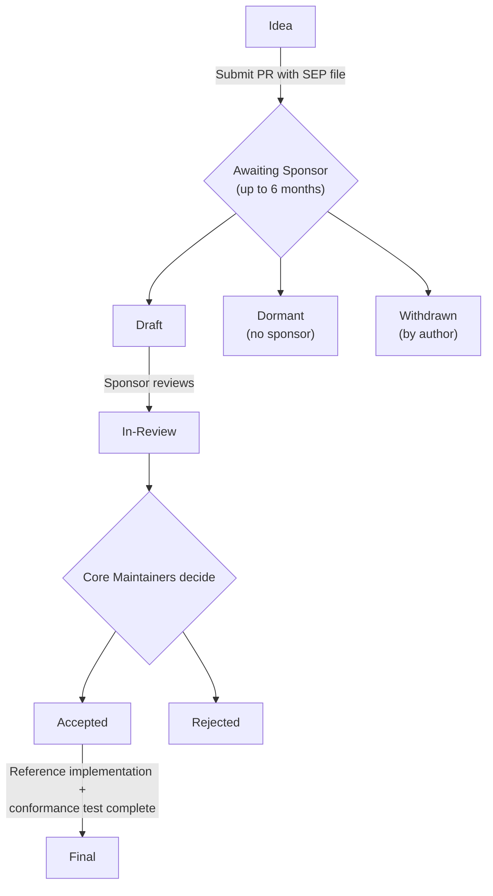

## 什么是 SEP？

SEP 是 Specification Enhancement Proposal（规范增强提案）的缩写。SEP 是一份设计文档，向 MCP 社区提供信息，或描述模型上下文协议及其流程的一项新特性。SEP 应对该特性提供简明的技术规范和理由。

SEP 是提出重大新特性、就某议题收集社区意见，以及记录 MCP 设计决策的主要机制。SEP 作者负责在社区内构建共识，并记录不同意见。

在起草 SEP 时，作者应查阅 [MCP 设计原则](/community/design-principles)，其中概述了指导协议演进的核心价值和取舍。

SEP 以 markdown 文件的形式维护在规范仓库的 [`seps/` 目录](https://github.com/modelcontextprotocol/modelcontextprotocol/tree/main/seps)中。其修订历史充当该特性提案的历史记录。

## 何时撰写 SEP

SEP 流程保留给那些足够重大、需要广泛社区讨论、正式设计文档和历史记录的变更。对于较小的变更，常规的 GitHub pull request 往往更合适。

**如果你的变更涉及以下情形，请撰写 SEP：**

- **一项新特性或协议变更** —— 在协议中添加、修改或移除特性（新的 API 方法、消息格式变更、互操作性标准）
- **一项破坏性变更** —— 任何不向后兼容的变更
- **一项治理或流程变更** —— 更改决策或贡献指南
- **一个复杂或有争议的议题** —— 可能有多种有效解决方案或引发重大辩论的变更

**以下情形跳过 SEP 流程：**

- Bug 修复和拼写更正
- 文档澄清
- 为既有特性添加示例
- 不改变行为的次要 schema 修复

不确定？在开始重大工作之前先在 [Discord](/community/communication#discord) 中询问。

## SEP 类型

有四种 SEP：

1. **Standards Track（标准轨道）** —— 描述模型上下文协议的一项新特性或实现，或核心规范之外所支持的一项互操作性标准。
2. **Informational（信息性）** —— 描述一个设计议题，或向社区提供指南/信息，而不提议新特性。
3. **Process（流程）** —— 描述围绕 MCP 的某个流程，或提议对某个流程的变更（如本文档）。
4. **Extensions Track（扩展轨道）** —— 描述一项协议扩展。遵循与 Standards Track SEP 相同的评审和接受流程，但表明该提案针对的是扩展而非协议增补。扩展生命周期见[创建扩展](/extensions/overview#creating-extensions)。

## SEP 工作流

### 分步流程

<Note>
  为提高你的 SEP 被接受的机会：

- **先与 [Discord](/community/communication#discord) 中相关的[工作组或兴趣组](/community/working-interest-groups)讨论你的想法。** 这是完善你的提案并建立早期支持的最佳单一途径。
- **如果不存在相关群组，请在 [GitHub Discussions](https://github.com/modelcontextprotocol/modelcontextprotocol/discussions) 或 [Discord](/community/communication#discord) 的 `#general` 频道发起对话。** 如果兴趣足够，或许值得[创建一个新的 IG 或 WG](/community/working-interest-groups#creating-an-interest-group) —— 寻找担保人和主持人所需的努力本身就是该想法是否有足够牵引力的良好信号，而且仍优于冷启动式的提交。
- **检查与[核心维护者](/community/governance#roles)优先级和[设计原则](/community/design-principles)的契合度。** 优先级通常反映在[项目路线图](/development/roadmap)中。超出当前优先级或与设计原则冲突的提案，更有可能在评审过程中面临延迟或额外的摩擦。

</Note>

1. **起草你的 SEP**，作为一个名为 `0000-your-feature-title.md` 的 markdown 文件，用 `0000` 作占位符。遵循下方的 [SEP 格式](#sep-格式)。

2. **创建一个 pull request**，将你的 SEP 文件添加到[规范仓库](https://github.com/modelcontextprotocol/modelcontextprotocol)的 `seps/` 目录中。

3. **更新 SEP 编号**：一旦你的 PR 创建，使用 PR 编号重命名该文件（例如 PR #1850 变为 `1850-your-feature-title.md`），并更新 SEP 头部。

4. **寻找担保人**：从[维护者列表](https://github.com/modelcontextprotocol/modelcontextprotocol/blob/main/MAINTAINERS.md)中标记（tag）一位核心维护者或维护者。选择其领域与你提案相关的人。技巧：
   - 标记 1-2 位相关维护者，而非所有人
   - 在相关的 Discord 频道分享你的 PR
   - 如果 2 周后无回应，在 `#general` 中询问

5. **担保人自我指派**：当某位担保人同意时，他们将自己指派到该 PR，并将 SEP 状态更新为 `draft`。

6. **非正式评审**：担保人评审提案，可能会请求修改。讨论在 PR 评论中进行。

7. **正式评审**：准备就绪时，担保人将状态更新为 `in-review`。SEP 进入核心维护者的正式评审（每两周开会）。

8. **裁决**：SEP 可能被 `accepted`、`rejected` 或退回修订。担保人更新状态。

9. **定稿**：一旦被接受，必须完成参考实现。对于具有可观测协议行为的 Standards Track SEP，还必须合并一个[合规测试](#合规测试要求)。作者将规范变更（schema 变更、规范文本和一条变更日志条目）添加到该 SEP 的 pull request 中。SEP 成为 `final` 不要求 SDK 实现。当这项工作完成时，担保人将状态更新为 `final`，该 SEP 的 PR 便可合并。

### SEP 状态

| 状态         | 含义                                             |
| ------------ | ------------------------------------------------ |
| `draft`      | 已有担保人，正在进行非正式评审                    |
| `in-review`  | 准备好进行正式的核心维护者评审                    |
| `accepted`   | 已批准，等待实现 + 合规                           |
| `rejected`   | 被核心维护者拒绝                                 |
| `withdrawn`  | 作者撤回了提案                                   |
| `final`      | 已完成，含实现和合规                             |
| `superseded` | 被更新的 SEP 取代                                |
| `dormant`    | 6 个月内未找到担保人；可复活                     |

**重要区别**：`dormant` 与 `rejected` 不同。休眠的 SEP 只是没有找到担保人——想法可能仍然有效。如果情况发生变化（新的社区兴趣、新的用例），休眠的 SEP 可以通过找到担保人并重新打开 PR 来复活。

## SEP 格式

每个 SEP 应包含以下部分：

### 1. 前言（Preamble）

一个简短的描述性标题、作者姓名/联系信息、当前状态、SEP 类型和 PR 编号。

### 2. 摘要（Abstract）

对所要解决技术问题的简短（约 200 词）描述。

### 3. 动机（Motivation）

为何现有的协议规范不足。这至关重要——动机不充分的 SEP 可能被直接拒绝。

### 4. 规范（Specification）

描述新特性语法和语义的技术规范。必须足够详细，以支持相互竞争、可互操作的实现。

### 5. 理由（Rationale）

为何作出特定的设计决策、所考虑过的替代设计，以及相关工作。应提供社区共识的证据，并处理讨论期间提出的异议。

### 6. 向后兼容性（Backward Compatibility）

所有引入向后不兼容的 SEP 都必须描述这些不兼容之处、其严重性，以及如何应对它们。

### 7. 参考实现（Reference Implementation）

必须在 SEP 达到 "Final" 状态之前完成，但在接受之前无需完成。

### 8. 安全影响（Security Implications）

任何与该 SEP 相关的安全关切都应明确记录。

完整的文件结构参见 [SEP 模板](https://github.com/modelcontextprotocol/modelcontextprotocol/blob/main/seps/README.md#sep-file-structure)。

## 原型要求

在 SEP 能够被接受之前，你需要"一个演示该提案的原型实现"。以下是合格的标准：

**可接受的原型：**

- 在某个官方 SDK 中的可运行实现（作为分支/fork）
- 一个演示关键机制的独立概念验证
- 展示所提议行为的集成测试
- 实现该特性的参考服务器或客户端

**原型应当：**

- 演示核心功能如描述般工作
- 表明 API 设计实用且符合工效学
- 揭示任何边界情况或实现挑战
- 可由评审者运行（包含设置说明）

**不足够的：**

- 仅有伪代码
- 没有代码的设计文档
- "相信我，它能用"——评审者需要亲眼看到

原型无需达到生产就绪。它的存在是为了证明可行性并尽早暴露问题。

## 担保人角色

担保人是拥护某 SEP 走完评审流程的核心维护者或维护者。担保人的职责包括：

- 评审提案并提供建设性反馈
- 基于社区意见请求修改
- **随提案进展更新 SEP 状态**
- 在 SEP 就绪时发起正式评审
- 在核心维护者会议上呈现和讨论提案
- 确保提案达到质量标准

作者应通过其担保人请求状态变更，而非自行修改状态字段。

## 状态管理

**担保人负责更新 SEP 状态。** 这确保状态转换由有权限和背景恰当处理它的人来进行。

担保人：

1. 直接在 SEP markdown 文件中更新 `Status` 字段（或者，如果他们没有源仓库的访问权限，则与作者协作设置正确的状态）
2. 为 pull request 应用匹配的标签（例如 `draft`、`in-review`、`accepted`）

markdown 状态字段和 PR 标签都应保持同步。markdown 文件是权威记录（随提案一起版本化），而 PR 标签便于筛选和搜索。

## SEP 评审与裁决

SEP 由 MCP 核心维护者团队每两周评审一次。

要使一个 SEP 被接受，它必须满足以下标准：

- 一个演示该提案的原型实现
- 对 MCP 生态的明确益处
- 社区支持和共识

一旦某 SEP 被接受，作者将规范变更（schema 变更、规范文本和一条变更日志条目）添加到该 SEP 的 pull request 中。必须完成参考实现，以及任何所需的[合规测试](#合规测试要求)。不要求 SDK 实现。当这项工作完成时，状态变为 "Final"，PR 便可合并。

## 合规测试要求

对于引入或修改可观测协议行为的 **Standards Track SEP**，在该 SEP 能够达到 `Final` 状态之前，必须将一个合规场景合并到[合规仓库](https://github.com/modelcontextprotocol/conformance)中。

**所需内容：**

- 一个以 SEP 编号标记的合规场景，面向合规仓库的 draft 规范版本标签
- 一个结构化的可追溯性文件（`sep-NNNN.yaml`），将 SEP 规范章节中的每一条 MUST/MUST NOT 和 SHOULD/SHOULD NOT 映射到一个检查 ID，或一处成文的排除（如属框架缺口则附一个跟踪 issue）
- 该场景针对该 SEP 的参考实现通过

**豁免内容：**

- Process 和 Informational SEP
- 无可观测协议行为的 Standards Track SEP（文档澄清、非验证性的 schema 标注、实现加固建议）

**谁做什么：**

- **担保人**确保编写了合规场景，并核实可追溯性文件涵盖了 SEP 中的每一条 MUST/MUST NOT 和 SHOULD/SHOULD NOT
- **合规仓库维护者**评审场景 PR 的技术正确性
- 测试**作者**可以是任何人：SEP 作者、SDK 维护者、社区贡献者

鼓励（但不要求）在 SEP 起草期间（核心维护者评审之前）编写合规场景，因为这往往会暴露规范性语言中的歧义，而及早修复这些歧义成本更低。

完整规范（包括可追溯性文件格式和争议流程）参见 [SEP-2484](/seps/2484-conformance-tests-required-for-final-seps)。

## 被拒之后

拒绝并非永久。你可以：

1. **处理反馈** —— 如果提出了具体关切，处理它们并重新提交
2. **讨论拒绝** —— 在 Discord 中询问，以理解其中的推理
3. **提交一个相互竞争的 SEP** —— 有时一种不同的方法更有效
4. **等待合适的时机** —— 社区需求会演变；今天被拒的东西日后可能受到欢迎

## 报告 SEP 缺陷或更新

对于尚未达到 `final` 状态的 SEP，直接在该 SEP 的 pull request 上评论。

Final SEP 作为被接受时设计的历史记录保存。它们在定稿后不再更新。如果规范在某 SEP 达到 Final 状态之后发生变化，以当前规范为准。每个 Final SEP 页面都会显示一条此意的通知。

## 转移 SEP 所有权

偶尔有必要将 SEP 的所有权转移给新作者。一般而言，我们希望保留原作者作为共同作者，但这取决于原作者。

转移所有权的正当理由：

- 原作者不再有时间或兴趣
- 原作者无法联系

不正当的理由：

- 你不同意其方向（应改为提交一个相互竞争的 SEP）

## 版权

本文档置于公共领域或 CC0-1.0-Universal 许可证之下，以更宽松者为准。
