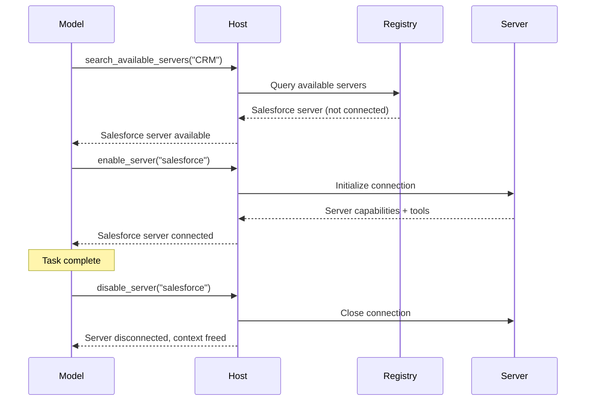
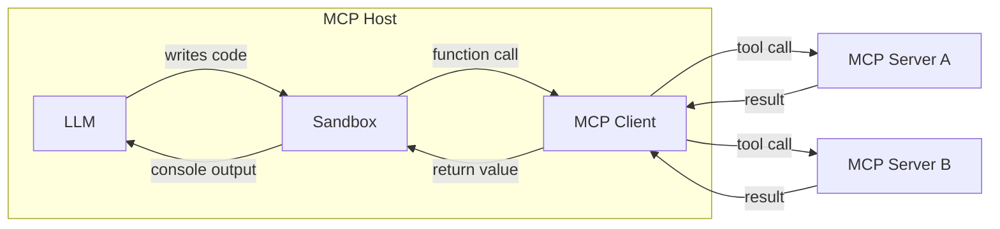

随着 MCP 宿主应用（例如智能体）连接到更多的 MCP 服务器并积累对成百上千个工具的访问权限，朴素的工具管理方法会崩溃。在开始时就把每个工具定义都加载到模型的上下文窗口中会浪费 token、增加延迟并降低模型性能。在顺序工具调用之间通过模型传递庞大的中间结果会使问题雪上加霜。

两种模式应对这些挑战：**渐进式发现（progressive discovery）**，它控制工具定义_何时_进入上下文；以及**编程式工具调用（programmatic tool calling）**，它控制工具_如何_被调用。

## 渐进式工具发现

朴素的 MCP 宿主实现在每次对话开始时直接把每个已连接服务器的工具定义传给模型。对于少量工具，这完全合理。但当宿主能访问几十个暴露数百个工具的服务器时，仅这些定义本身就能在模型甚至还没读到用户消息之前，就消耗掉上下文窗口的大部分。


渐进式发现避免了这一点：

- 宿主照常通过 `tools/list` 获取工具定义，但推迟将它们注入模型的上下文。
- 宿主向模型提供一个轻量的 `search_tools` 元工具（meta-tool）。
- 宿主仅在需要时才将完整定义加载到上下文中。

### 何时使用渐进式发现

渐进式发现最适合在工具定义占据上下文窗口很大一部分时使用。对于一小组工具、其工具定义只占上下文窗口一小部分的情况，加载所有工具是可以的。一旦工具定义占据可用上下文窗口的相当一部分，客户端就应切换到渐进式发现。我们建议客户端实现阈值来确定何时切换：

- 将阈值实现为上下文窗口的百分比。例如 1%–5%。
- 加载工具定义。一旦达到阈值，就切换到渐进式发现。

### 选择一种发现策略

一旦模型调用 `search_tools` 工具，我们需要选择一种搜索策略：

- **基于关键词**：关键词匹配（BM25、正则）。简单而有效，特别是对于描述性的工具名和描述。
- **基于嵌入**：在工具描述上进行向量相似度检索。更好地处理同义词和语义匹配。
- **基于子智能体**：一个次级模型（通常是一个小而快的模型，如 Claude Haiku 或 Gemini Flash）为任务选择工具。这通常效果很好，但可能比基于嵌入或基于关键词的方案更昂贵。
- **混合**：组合多种方法。例如，通过在关键词和嵌入排名之间打分，或根据用例或查询选择不同的策略。

一些模型提供方已经提供内置的工具搜索。例如，[OpenAI](https://developers.openai.com/api/docs/guides/tools-tool-search) 和 [Anthropic](https://platform.claude.com/docs/en/agents-and-tools/tool-use/tool-search-tool) 原生支持这一点；查看你的提供方文档以获得等价物。在可用时，你可能更愿意使用平台的工具搜索而非自定义实现。当提供方不提供、或当你需要专门的检索逻辑（例如领域特定的排名或访问控制过滤）时，构建你自己的。

下面的三层模式详细演示了一种基于自定义搜索的方法，但分层原则（catalog、inspect、execute）无论检索机制如何都适用。

### 使用渐进式发现

渐进式发现的一种常见实现使用基于搜索的三层方法：

**第 1 层：Catalog（目录）。** 宿主暴露一小组用于搜索可用能力的元工具。一个 `search_tools` 工具接受一个自然语言查询，并返回匹配的工具名及简短描述。

```typescript
// 模型调用一个轻量的搜索工具
search_tools({ query: "update salesforce record" })

// 返回简洁的匹配：仅名称和一行描述
→ [
    { name: "salesforce_updateRecord", description: "Update fields on a Salesforce object" },
    { name: "salesforce_upsertRecord", description: "Insert or update based on external ID" }
  ]
```

**第 2 层：Inspect（检查）。** 一旦模型确定了一个候选，它仅为该工具获取完整定义（输入 schema、输出 schema、文档）。

```typescript
// 模型只检查它需要的工具
get_tool_details({ name: "salesforce_updateRecord" });
```

这为单个工具返回完整的 schema：

```json
{
  "name": "salesforce_updateRecord",
  "description": "Updates a record in Salesforce",
  "inputSchema": {
    "type": "object",
    "properties": {
      "objectType": {
        "type": "string",
        "description": "Salesforce object type"
      },
      "recordId": { "type": "string", "description": "Record ID to update" },
      "data": { "type": "object", "description": "Fields to update" }
    },
    "required": ["objectType", "recordId", "data"]
  }
}
```

**第 3 层：Execute（执行）。** 模型在完全了解其接口的情况下调用工具，而它只加载了它所需要的定义。

这种模式极大地减少了 token 使用，并能提高工具选择准确性：模型专注于少数几个相关工具，而不是扫描数百个不相关的工具。其他发现策略（嵌入、子智能体等）遵循相同的分层原则，但在目录层替换为不同的检索机制。

### 动态服务器管理

渐进式发现不仅限于单个工具，还延伸到整个服务器。宿主可以不在启动时连接每个已配置的服务器，而是：

1. 维护一个可用服务器及其高层描述的注册表。
2. 仅在模型确定它需要某个服务器的能力时才连接该服务器。
3. 断开与当前任务不再相关的服务器，释放上下文。



这对于通用智能体尤其有效，因为用户的意图并非预先已知。智能体从一组最小的常开服务器开始，并按需连接其他服务器。与[agent skills](/docs/2025-11-25/develop/build-with-agent-skills)结合，一个 skill 文件可以声明它需要哪些 MCP 服务器，宿主则仅在该 skill 被调用时才连接它们。

### 实现指南

在实现渐进式发现时：

| 指南                        | 理由                                                                                                                                                                                          |
| -------------------------------- | -------------------------------------------------------------------------------------------------------------------------------------------------------------------------------------------------- |
| **提供多个详细级别** | 让模型在仅名称、名称加描述，或完整 schema 的响应之间选择。                                                                                            |
| **缓存工具定义**       | 一旦从服务器获取，就在宿主侧记忆化（memoize）该定义，这样稍后重新注入它就不需要再一次 `tools/list` 往返。这与当前在模型上下文中的内容是分开的。 |
| **在 `list_changed` 时刷新**    | 当服务器发送 `notifications/tools/list_changed` 时重新索引搜索目录。                                                                                                                |
| **按服务器分组工具**        | 将工具按其来源服务器组织后呈现，这样模型可以推理相关的能力。                                                                                 |

### 与提示缓存的交互

大多数提供方缓存提示前缀，包括 `tools` 数组。在对话中途添加或移除工具定义会使该缓存失效，而由此产生的未命中所耗费的 token 可能比你移除的定义还多。为保留缓存：

- 在缓存断点之后追加新发现的定义，而不是重新排序 `tools` 数组；或者将每个调用通过单个稳定的 `call_tool({name, args})` 元工具路由，使该数组永不改变。
- 将服务器断开视为一个对话边界操作，而不是一个按轮次的操作。
- 结合上面的工具搜索链接查阅你提供方的缓存文档。

## 编程式工具调用 / 代码模式

在直接工具调用中，每次工具调用都是一次往返：模型生成一次工具调用，客户端执行它，完整结果流回模型的上下文。当一个任务需要串联多个工具（读取一个文档、转换它、把它写到别处）时，每个中间结果都会经过模型，消耗 token 并增加延迟，即使它与这些结果毫无关系。

编程式工具调用（有时称为“代码模式”）为客户端提供了一种有效**编排工具调用**的方式。模型不直接调用工具，而是编写调用工具的代码。代码在一个沙箱化的环境中执行，只有最终结果返回给模型。

编程式工具调用很强大，允许更高效地使用 MCP 工具和资源，但需要客户端实现一个沙箱环境。


### 它如何运作

宿主将 MCP 工具 schema 转换为沙箱内可用的类型化 API。当模型需要工具时，它编写一个脚本并执行它。

**第 1 步：从 MCP schema 生成一个编程式 API。** 宿主读取每个服务器的工具定义，并基于每个工具的参数和 `outputSchema` 产生类型化的函数：

```typescript
// 自动从 Logging MCP 服务器的工具 schema 生成
interface LogEntry {
  timestamp: string;
  message: string;
  level: string;
}

function logging_getLogs(input: {
  level: "error" | "warn" | "info";
  since: number;
}): Promise<{ entries: LogEntry[] }> {
  return mcp.callTool<{ entries: LogEntry[] }>("logging_getLogs", input);
}

// 自动从 Ticketing MCP 服务器的工具 schema 生成
function ticketing_createIssue(input: {
  title: string;
  body?: string;
  priority: "low" | "medium" | "high";
}): Promise<{ issueId: string }> {
  return mcp.callTool<{ issueId: string }>("ticketing_createIssue", input);
}
```

MCP 服务器可以为每个工具提供一个可选的 [`outputSchema`](/specification/2025-11-25/server/tools#output-schema)。当存在输出 schema 时，宿主可以产生精确的返回类型（如上面的 `LogEntry`）。

当输出 schema 缺失时，优先选择简单路径：

- **使用一个通用类型并继续。** 接受 `any` 或 `string`，并在下游处理这个无结构的输出。真正的修复是让服务器作者提供 `outputSchema`。
- **使用一个快速模型提取一个类型化的结果**，用于循环之外的单次调用。通过与 MCP 工具调用相同的 stub 拦截路径暴露一个由宿主中介的 `extract(value, ExpectedType)` 辅助函数，这样沙箱本身永远不会打开网络连接。该辅助函数路由到一个小模型（例如 Claude Haiku 或 Gemini Flash）来将值强制转换为 `ExpectedType`。这会增加每次调用的延迟，并可能产生幻觉或丢弃字段，因此在使用前对照 `ExpectedType` 校验结果。

**第 2 步：模型针对这些 API 编写代码。** 模型不再进行分离的工具调用（其完整结果在它们之间流经上下文），而是编写单个脚本。设想一个任务，如“找出过去一小时的所有错误日志，并为每个唯一的错误提交一个工单”。使用直接工具调用，数千条日志条目会流经模型的上下文。使用代码，模型在沙箱中过滤：

```typescript
// 模型生成的代码，在沙箱中执行
const logs = await logging_getLogs({
  level: "error",
  since: Date.now() - 3600000,
});

// 在沙箱内过滤和去重，而不是在模型的上下文中
const uniqueErrors = new Map<string, LogEntry>();
for (const log of logs.entries) {
  if (!uniqueErrors.has(log.message)) {
    uniqueErrors.set(log.message, log);
  }
}

for (const [message, log] of uniqueErrors) {
  await ticketing_createIssue({
    title: `Error: ${message}`,
    body: `First seen: ${log.timestamp}\nOccurrences: ${
      logs.entries.filter((l) => l.message === message).length
    }`,
    priority: "high",
  });
}

console.log(
  `Filed ${uniqueErrors.size} tickets from ${logs.entries.length} error logs`,
);
```

**第 3 步：沙箱执行代码。** 沙箱内的函数调用被拦截，并通过宿主中介路由回相应的 MCP 服务器。日志数据和工单创建直接在服务器之间流动，从不进入模型的上下文。只有 `console.log` 输出（单个摘要行）返回给模型。

### 选择一个沙箱

正确的沙箱取决于你想让模型编写的语言、你宿主应用的语言，以及你需要多少隔离。下表列出的是示例运行时而非背书；请针对你的用例评估其成熟度：

| 沙箱语言 | 运行时 / 库                                             | 宿主语言     | 方法                                                                                        |
| ------------------ | ------------------------------------------------------------- | ----------------- | ----------------------------------------------------------------------------------------------- |
| **JavaScript**     | [Deno](https://github.com/denoland/deno)、`isolated-vm`       | Rust / Node / CLI | 基于 V8 的运行时，具有细粒度权限。可禁用所有权限以完全锁定。 |
| **Python**         | [Monty](https://github.com/pydantic/monty) _(实验性)_   | Rust              | 为 AI 用例构建的最小 Python 解释器。默认无 I/O。                           |
| **TypeScript**     | [pctx](https://github.com/portofcontext/pctx) _(早期阶段)_ | Python / Rust     | 将代码模式概念作为库并入，带有底层 Rust 支持。                      |
| **任意（经由 Wasm）** | [Wasmtime](https://github.com/bytecodealliance/wasmtime)      | Rust / C / Go     | 将任何语言编译为 Wasm，并以基于能力（capability-based）的安全性运行它。                         |

无论采用何种沙箱，集成模式都相同：宿主注入函数 stub，通过一个进程内或 stdio 信道拦截调用（这样网络权限可以保持完全拒绝），并将它们作为 `tools/call` 请求分派给 MCP 服务器。

### 执行架构

该实现有三个组件：



**沙箱**在一个无直接网络访问的隔离环境中运行模型生成的代码。它与外部世界的唯一接口是通过生成的函数 stub，后者将调用路由回宿主。

**宿主**充当中介。它接收来自沙箱的函数调用，将它们映射到正确的 MCP 服务器，执行工具调用，并将结果返回给沙箱。授权令牌和凭据由宿主持有，永不暴露给生成的代码。

**模型**只看到沙箱返回的内容，通常是 `console.log` 语句的输出或一个最终返回值。这给予模型（以及客户端开发者）对何物进入上下文窗口的精确控制。

### 安全考量

编程式工具调用引入了一个需要仔细沙箱化的代码执行面：

- **按调用授权**：就规范目的而言，中介仍然是 MCP 宿主。对源自沙箱的调用应用与你对直接调用相同的人在回路确认策略（参见 [Tools：安全](/specification/2025-11-25/server/tools#security-considerations)）。批准脚本并不意味着为它在运行时进行的每个工具调用授予笼统的批准；宿主可以授予分类批准（例如，“为本次脚本运行允许 `ticketing_createIssue`”）而不是逐次迭代提示，但中介仍必须对照该授予评估每个调用。
- **跨服务器数据流**：来自一个服务器的工具结果是对另一个服务器的不受信任输入。中介应对被中介的调用应用与直接调用相同的输入审查策略；仅靠输出截断并不能防止数据外泄。
- **网络隔离**：沙箱不应有直接的网络访问。所有外部通信都流经宿主中介，由它强制执行授权和访问控制。
- **不暴露凭据**：API 密钥和令牌由宿主持有。生成的代码调用类型化的函数；宿主在转发到服务器时添加身份认证。
- **资源限制**：为沙箱执行设置超时和内存限制，以防止失控的脚本。
- **输出过滤**：在将沙箱控制台输出反馈给模型之前对其进行校验和截断。

### 错误处理

MCP 工具错误作为一个带有 [`isError: true`](/specification/2025-11-25/server/tools#error-handling) 的成功响应到达，而不是一次传输失败。生成的包装器应将其转换为一个抛出的异常，以便模型编写的代码可以使用 `try`/`catch`。如果一个未捕获的错误终止了脚本，将它作为脚本的结果呈现，以便模型可以自我纠正；模型负责报告任何已经提交的部分副作用。

## 结合两种模式

渐进式发现和编程式工具调用配合得很好。模型使用发现工具来确定它需要哪些工具，加载它们的 schema，然后编写一个在一次执行过程中调用多个工具的脚本。这种组合同时最小化了工具定义的 token 成本_和_工具结果的 token 成本，使模型的上下文专注于推理而非在其中传递数据。
