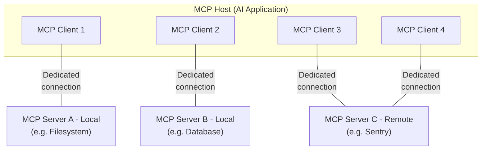

本概览介绍模型上下文协议（Model Context Protocol，MCP）的[范围](#范围)和[核心概念](#mcp-的核心概念)，并提供一个[示例](#示例)来演示每个核心概念。

由于 MCP SDK 抽象掉了许多关注点，大多数开发者可能会发现[数据层协议](#数据层协议)一节最为有用。它讨论 MCP 服务器如何向 AI 应用提供上下文。

有关具体的实现细节，请参阅你所用的[特定语言 SDK](/docs/2025-11-25/sdk) 的文档。

## 范围

模型上下文协议包括以下项目：

* [MCP 规范](/specification/2025-11-25/index)：MCP 的规范，概述了客户端和服务器的实现要求。
* [MCP SDK](/docs/2025-11-25/sdk)：实现 MCP 的、面向不同编程语言的 SDK。
* **MCP 开发工具**：用于开发 MCP 服务器和客户端的工具，包括 [MCP Inspector](https://github.com/modelcontextprotocol/inspector)
* [MCP 参考服务器实现](https://github.com/modelcontextprotocol/servers)：MCP 服务器的参考实现。

<Note>
  MCP 只专注于上下文交换的协议——它并不规定 AI 应用如何使用 LLM 或如何管理所提供的上下文。
</Note>

## MCP 的核心概念

### 参与方

MCP 遵循客户端-服务器架构，其中 MCP 宿主——一个 AI 应用，如 [Claude Code](https://www.anthropic.com/claude-code) 或 [Claude Desktop](https://www.claude.ai/download)——与一个或多个 MCP 服务器建立连接。MCP 宿主通过为每个 MCP 服务器创建一个 MCP 客户端来实现这一点。每个 MCP 客户端与其对应的 MCP 服务器维持一个专用连接。

使用 STDIO 传输的本地 MCP 服务器通常服务于单个 MCP 客户端，而使用 Streamable HTTP 传输的远程 MCP 服务器通常服务于许多 MCP 客户端。

MCP 架构中的关键参与方是：

* **MCP 宿主（MCP Host）**：协调和管理一个或多个 MCP 客户端的 AI 应用
* **MCP 客户端（MCP Client）**：维持与一个 MCP 服务器的连接，并从该 MCP 服务器获取上下文供 MCP 宿主使用的组件
* **MCP 服务器（MCP Server）**：向 MCP 客户端提供上下文的程序

**例如**：Visual Studio Code 充当 MCP 宿主。当 Visual Studio Code 与某个 MCP 服务器（例如 [Sentry MCP 服务器](https://docs.sentry.io/product/sentry-mcp/)）建立连接时，Visual Studio Code 运行时会实例化一个 MCP 客户端对象来维持与 Sentry MCP 服务器的连接。
当 Visual Studio Code 随后连接到另一个 MCP 服务器（例如[本地文件系统服务器](https://github.com/modelcontextprotocol/servers/tree/main/src/filesystem)）时，Visual Studio Code 运行时会再实例化一个 MCP 客户端对象来维持这个连接。



请注意，**MCP 服务器**指的是提供上下文数据的程序，无论它在何处运行。MCP 服务器可以在本地或远程执行。例如，当 Claude Desktop 启动[文件系统服务器](https://github.com/modelcontextprotocol/servers/tree/main/src/filesystem)时，由于它使用 STDIO 传输，该服务器在同一台机器上本地运行。这通常被称为“本地”MCP 服务器。官方的 [Sentry MCP 服务器](https://docs.sentry.io/product/sentry-mcp/)运行在 Sentry 平台上，并使用 Streamable HTTP 传输。这通常被称为“远程”MCP 服务器。

### 分层

MCP 由两层构成：

* **数据层（Data layer）**：定义基于 JSON-RPC 的客户端-服务器通信协议，包括生命周期管理，以及诸如工具、资源、提示和通知等核心原语。
* **传输层（Transport layer）**：定义使客户端与服务器之间能够进行数据交换的通信机制和信道，包括特定于传输的连接建立、消息分帧（message framing）和授权。

从概念上讲，数据层是内层，而传输层是外层。

#### 数据层

数据层实现了一个基于 [JSON-RPC 2.0](https://www.jsonrpc.org/) 的交换协议，用于定义消息结构和语义。
该层包括：

* **生命周期管理（Lifecycle management）**：处理客户端与服务器之间的连接初始化、能力协商和连接终止
* **服务器特性（Server features）**：使服务器能够向客户端提供、并从客户端接收核心功能，包括用于 AI 操作的工具、用于上下文数据的资源，以及用于交互模板的提示
* **客户端特性（Client features）**：使服务器能够请求客户端从宿主 LLM 采样、向用户征询输入，以及向客户端记录消息
* **实用特性（Utility features）**：支持额外的能力，如用于实时更新的通知和用于长时运行操作的进度跟踪

#### 传输层

传输层管理客户端与服务器之间的通信信道和身份认证。它处理连接建立、消息分帧，以及 MCP 参与方之间的安全通信。

MCP 支持两种传输机制：

* **Stdio 传输**：使用标准输入/输出流，在同一台机器上的本地进程之间进行直接的进程通信，提供最佳性能且没有网络开销。
* **Streamable HTTP 传输**：使用 HTTP POST 发送客户端到服务器的消息，并可选地使用 Server-Sent Events 实现流式能力。这种传输支持远程服务器通信，并支持标准的 HTTP 身份认证方法，包括 bearer token、API 密钥和自定义 header。MCP 推荐使用 OAuth 来获取认证令牌。

传输层将通信细节从协议层中抽象出来，使得同一种 JSON-RPC 2.0 消息格式能够跨所有传输机制使用。

### 数据层协议

MCP 的一个核心部分是定义 MCP 客户端与 MCP 服务器之间的 schema 和语义。开发者可能会发现数据层——特别是[原语](#原语)集合——是 MCP 中最有意思的部分。它是 MCP 中定义开发者可以如何将上下文从 MCP 服务器共享到 MCP 客户端的部分。

MCP 使用 [JSON-RPC 2.0](https://www.jsonrpc.org/) 作为其底层的 RPC 协议。客户端和服务器彼此发送请求并相应地进行响应。当不需要响应时，可以使用通知。

#### 生命周期管理

MCP 是一个需要生命周期管理的<Tooltip tip="使用 Streamable HTTP 传输可以让 MCP 的一个子集变为无状态">有状态协议</Tooltip>。生命周期管理的目的是协商客户端和服务器双方都支持的<Tooltip tip="客户端或服务器所支持的特性和操作，例如工具、资源或提示">能力</Tooltip>。详细信息可在[规范](/specification/2025-11-25/basic/lifecycle)中找到，[示例](#示例)展示了初始化序列。

#### 原语

MCP 原语是 MCP 中最重要的概念。它们定义了客户端和服务器能够彼此提供什么。这些原语规定了可以与 AI 应用共享的上下文信息类型，以及可以执行的操作范围。

MCP 定义了三种*服务器*可以暴露的核心原语：

* **工具（Tools）**：AI 应用可以调用以执行操作的可执行函数（例如文件操作、API 调用、数据库查询）
* **资源（Resources）**：向 AI 应用提供上下文信息的数据源（例如文件内容、数据库记录、API 响应）
* **提示（Prompts）**：帮助构建与语言模型交互的可复用模板（例如系统提示、少样本示例）

每种原语类型都有用于发现（`*/list`）、检索（`*/get`），以及在某些情况下用于执行（`tools/call`）的关联方法。
MCP 客户端将使用 `*/list` 方法来发现可用的原语。例如，客户端可以首先列出所有可用的工具（`tools/list`），然后执行它们。这种设计使得列表可以是动态的。

作为一个具体例子，设想一个提供数据库相关上下文的 MCP 服务器。它可以暴露用于查询数据库的工具、一个包含数据库 schema 的资源，以及一个包含与这些工具交互的少样本示例的提示。

有关服务器原语的更多细节，参见[服务器概念](./server-concepts)。

MCP 还定义了*客户端*可以暴露的原语。这些原语让 MCP 服务器作者能够构建更丰富的交互。

* **采样（Sampling）**：允许服务器从客户端的 AI 应用请求语言模型补全。当服务器作者想要访问语言模型、但又希望保持模型无关、不在其 MCP 服务器中包含语言模型 SDK 时，这很有用。他们可以使用 `sampling/createMessage` 方法从客户端的 AI 应用请求语言模型补全。
* **征询（Elicitation）**：允许服务器向用户请求额外信息。当服务器作者想要从用户处获取更多信息，或请求对某个操作进行确认时，这很有用。他们可以使用 `elicitation/create` 方法向用户请求额外信息。
* **日志（Logging）**：使服务器能够向客户端发送日志消息，用于调试和监控目的。

有关客户端原语的更多细节，参见[客户端概念](./client-concepts)。

除了服务器和客户端原语之外，协议还提供了横切的实用原语，用于增强请求的执行方式：

* **任务（Tasks，实验性）**：持久的执行包装器，为 MCP 请求启用延后的结果检索和状态跟踪（例如昂贵的计算、工作流自动化、批处理、多步操作）

#### 通知

协议支持实时通知，以实现服务器与客户端之间的动态更新。例如，当服务器的可用工具发生变化时——例如新功能可用或现有工具被修改——服务器可以发送工具更新通知，将这些变化告知已连接的客户端。通知作为 JSON-RPC 2.0 通知消息发送（不期望响应），使 MCP 服务器能够向已连接的客户端提供实时更新。

## 示例

### 数据层

本节逐步演示一次 MCP 客户端-服务器交互，重点关注数据层协议。我们将使用 JSON-RPC 2.0 消息来演示生命周期序列、工具操作和通知。

<Steps>
  <Step title="初始化（生命周期管理）">
    MCP 以通过能力协商握手进行的生命周期管理开始。如[生命周期管理](#生命周期管理)一节所述，客户端发送一个 `initialize` 请求来建立连接并协商所支持的特性。

    <CodeGroup>
      ```json Initialize Request
      {
        "jsonrpc": "2.0",
        "id": 1,
        "method": "initialize",
        "params": {
          "protocolVersion": "2025-11-25",
          "capabilities": {
            "elicitation": {}
          },
          "clientInfo": {
            "name": "example-client",
            "version": "1.0.0"
          }
        }
      }
      ```

      ```json Initialize Response
      {
        "jsonrpc": "2.0",
        "id": 1,
        "result": {
          "protocolVersion": "2025-11-25",
          "capabilities": {
            "tools": {
              "listChanged": true
            },
            "resources": {}
          },
          "serverInfo": {
            "name": "example-server",
            "version": "1.0.0"
          }
        }
      }
      ```
    </CodeGroup>

    #### 理解初始化交换

    初始化过程是 MCP 生命周期管理的关键部分，服务于若干重要目的：

    1. **协议版本协商**：`protocolVersion` 字段（例如 "2025-11-25"）确保客户端和服务器使用兼容的协议版本。这可防止不同版本尝试交互时可能出现的通信错误。如果协商不出双方兼容的版本，应终止连接。

    2. **能力发现**：`capabilities` 对象允许各方声明它们支持哪些特性，包括它们能处理哪些[原语](#原语)（工具、资源、提示）以及是否支持诸如[通知](#通知)之类的特性。这通过避免不支持的操作实现了高效通信。

    3. **身份交换**：`clientInfo` 和 `serverInfo` 对象提供用于调试和兼容性目的的标识与版本信息。

    在此示例中，能力协商演示了 MCP 原语是如何声明的：

    **客户端能力**：

    * `"elicitation": {}` —— 客户端声明它可以处理用户交互请求（可以接收 `elicitation/create` 方法调用）

    **服务器能力**：

    * `"tools": {"listChanged": true}` —— 服务器支持工具原语，*并且*可以在其工具列表变化时发送 `tools/list_changed` 通知
    * `"resources": {}` —— 服务器也支持资源原语（可以处理 `resources/list` 和 `resources/read` 方法）

    初始化成功后，客户端发送一个通知以表明它已就绪：

    ```json Notification
    {
      "jsonrpc": "2.0",
      "method": "notifications/initialized"
    }
    ```

    #### 这在 AI 应用中如何工作

    在初始化期间，AI 应用的 MCP 客户端管理器与所配置的服务器建立连接，并存储它们的能力以备后用。应用使用这些信息来确定哪些服务器可以提供特定类型的功能（工具、资源、提示）以及它们是否支持实时更新。

    ```python Pseudo-code for AI application initialization
    # Pseudo Code
    async with stdio_client(server_config) as (read, write):
        async with ClientSession(read, write) as session:
            init_response = await session.initialize()
            if init_response.capabilities.tools:
                app.register_mcp_server(session, supports_tools=True)
            app.set_server_ready(session)
    ```
  </Step>

  <Step title="工具发现（原语）">
    现在连接已建立，客户端可以通过发送一个 `tools/list` 请求来发现可用的工具。这个请求是 MCP 工具发现机制的基础——它允许客户端在尝试使用之前了解服务器上有哪些工具可用。

    <CodeGroup>
      ```json Tools List Request
      {
        "jsonrpc": "2.0",
        "id": 2,
        "method": "tools/list"
      }
      ```

      ```json Tools List Response
      {
        "jsonrpc": "2.0",
        "id": 2,
        "result": {
          "tools": [
            {
              "name": "calculator_arithmetic",
              "title": "Calculator",
              "description": "Perform mathematical calculations including basic arithmetic, trigonometric functions, and algebraic operations",
              "inputSchema": {
                "type": "object",
                "properties": {
                  "expression": {
                    "type": "string",
                    "description": "Mathematical expression to evaluate (e.g., '2 + 3 * 4', 'sin(30)', 'sqrt(16)')"
                  }
                },
                "required": ["expression"]
              }
            },
            {
              "name": "weather_current",
              "title": "Weather Information",
              "description": "Get current weather information for any location worldwide",
              "inputSchema": {
                "type": "object",
                "properties": {
                  "location": {
                    "type": "string",
                    "description": "City name, address, or coordinates (latitude,longitude)"
                  },
                  "units": {
                    "type": "string",
                    "enum": ["metric", "imperial", "kelvin"],
                    "description": "Temperature units to use in response",
                    "default": "metric"
                  }
                },
                "required": ["location"]
              }
            }
          ]
        }
      }
      ```
    </CodeGroup>

    #### 理解工具发现请求

    `tools/list` 请求很简单，不包含任何参数。

    #### 理解工具发现响应

    响应包含一个 `tools` 数组，提供关于每个可用工具的全面元数据。这种基于数组的结构允许服务器同时暴露多个工具，同时在不同功能之间保持清晰的边界。

    响应中的每个工具对象包括若干关键字段：

    * **`name`**：工具在服务器命名空间内的唯一标识符。它作为工具执行的主键，应遵循清晰的命名模式（例如 `calculator_arithmetic` 而非仅仅 `calculate`）
    * **`title`**：工具的人类可读显示名称，客户端可以将其展示给用户
    * **`description`**：关于该工具做什么以及何时使用它的详细说明
    * **`inputSchema`**：一个定义预期输入参数的 JSON Schema，实现类型校验并就必需和可选参数提供清晰的文档

    #### 这在 AI 应用中如何工作

    AI 应用从所有已连接的 MCP 服务器获取可用工具，并将它们合并成一个统一的工具注册表，供语言模型访问。这让 LLM 能够理解它可以执行哪些操作，并在对话过程中自动生成合适的工具调用。

    ```python Pseudo-code for AI application tool discovery
    # Pseudo-code using MCP Python SDK patterns
    available_tools = []
    for session in app.mcp_server_sessions():
        tools_response = await session.list_tools()
        available_tools.extend(tools_response.tools)
    conversation.register_available_tools(available_tools)
    ```
  </Step>

  <Step title="工具执行（原语）">
    现在客户端可以使用 `tools/call` 方法执行一个工具。这演示了 MCP 原语在实践中如何使用：在发现可用工具之后，客户端可以带着合适的参数调用它们。

    #### 理解工具执行请求

    `tools/call` 请求遵循一种结构化格式，确保类型安全以及客户端与服务器之间清晰的通信。请注意，我们使用的是发现响应中正确的工具名（`weather_current`），而不是一个简化的名称：

    <CodeGroup>
      ```json Tool Call Request
      {
        "jsonrpc": "2.0",
        "id": 3,
        "method": "tools/call",
        "params": {
          "name": "weather_current",
          "arguments": {
            "location": "San Francisco",
            "units": "imperial"
          }
        }
      }
      ```

      ```json Tool Call Response
      {
        "jsonrpc": "2.0",
        "id": 3,
        "result": {
          "content": [
            {
              "type": "text",
              "text": "Current weather in San Francisco: 68°F, partly cloudy with light winds from the west at 8 mph. Humidity: 65%"
            }
          ]
        }
      }
      ```
    </CodeGroup>

    #### 工具执行的关键要素

    请求结构包括若干重要组成部分：

    1. **`name`**：必须与发现响应中的工具名（`weather_current`）完全匹配。这确保服务器能够正确识别要执行哪个工具。

    2. **`arguments`**：包含由工具的 `inputSchema` 定义的输入参数。在此示例中：
       * `location`："San Francisco"（必需参数）
       * `units`："imperial"（可选参数，若未指定则默认为 "metric"）

    3. **JSON-RPC 结构**：使用标准的 JSON-RPC 2.0 格式，带有唯一的 `id` 用于请求-响应关联。

    #### 理解工具执行响应

    响应演示了 MCP 灵活的内容系统：

    1. **`content` 数组**：工具响应返回一个内容对象数组，允许丰富的、多格式的响应（文本、图像、资源等）

    2. **内容类型**：每个内容对象都有一个 `type` 字段。在此示例中，`"type": "text"` 表示纯文本内容，但 MCP 支持面向不同用例的各种内容类型。

    3. **结构化输出**：响应提供可操作的信息，AI 应用可以将其用作与语言模型交互的上下文。

    这种执行模式允许 AI 应用动态地调用服务器功能，并接收可以整合进与语言模型对话中的结构化响应。

    #### 这在 AI 应用中如何工作

    当语言模型在对话过程中决定使用某个工具时，AI 应用拦截该工具调用，将其路由到合适的 MCP 服务器，执行它，并将结果作为对话流的一部分返回给 LLM。这使得 LLM 能够访问实时数据并在外部世界中执行操作。

    ```python
    # Pseudo-code for AI application tool execution
    async def handle_tool_call(conversation, tool_name, arguments):
        session = app.find_mcp_session_for_tool(tool_name)
        result = await session.call_tool(tool_name, arguments)
        conversation.add_tool_result(result.content)
    ```
  </Step>

  <Step title="实时更新（通知）">
    MCP 支持实时通知，使服务器能够在未被显式请求的情况下将变化告知客户端。这演示了通知系统，一个使 MCP 连接保持同步和响应性的关键特性。

    #### 理解工具列表变更通知

    当服务器的可用工具发生变化时——例如新功能可用、现有工具被修改，或工具暂时不可用——服务器可以主动通知已连接的客户端：

    ```json Request
    {
      "jsonrpc": "2.0",
      "method": "notifications/tools/list_changed"
    }
    ```

    #### MCP 通知的关键特性

    1. **无需响应**：注意通知中没有 `id` 字段。这遵循 JSON-RPC 2.0 的通知语义，即不期望也不发送响应。

    2. **基于能力**：此通知仅由在初始化期间（如步骤 1 所示）在其工具能力中声明了 `"listChanged": true` 的服务器发送。

    3. **事件驱动**：服务器根据内部状态变化决定何时发送通知，使 MCP 连接具有动态性和响应性。

    #### 客户端对通知的响应

    收到此通知后，客户端通常通过请求更新后的工具列表来做出反应。这创建了一个刷新循环，使客户端对可用工具的理解保持最新：

    ```json Request
    {
      "jsonrpc": "2.0",
      "id": 4,
      "method": "tools/list"
    }
    ```

    #### 为什么通知很重要

    这个通知系统之所以至关重要，有若干原因：

    1. **动态环境**：工具可能会根据服务器状态、外部依赖或用户权限而出现或消失
    2. **效率**：客户端无需轮询变化；它们在更新发生时得到通知
    3. **一致性**：确保客户端始终拥有关于可用服务器能力的准确信息
    4. **实时协作**：使响应式 AI 应用能够适应不断变化的上下文

    这种通知模式不仅限于工具，还扩展到其他 MCP 原语，实现客户端与服务器之间全面的实时同步。

    #### 这在 AI 应用中如何工作

    当 AI 应用收到关于工具变化的通知时，它会立即刷新其工具注册表并更新 LLM 的可用能力。这确保正在进行的对话始终能够访问最新的工具集，并且 LLM 能够在新功能可用时动态适应它。

    ```python
    # Pseudo-code for AI application notification handling
    async def handle_tools_changed_notification(session):
        tools_response = await session.list_tools()
        app.update_available_tools(session, tools_response.tools)
        if app.conversation.is_active():
            app.conversation.notify_llm_of_new_capabilities()
    ```
  </Step>
</Steps>
