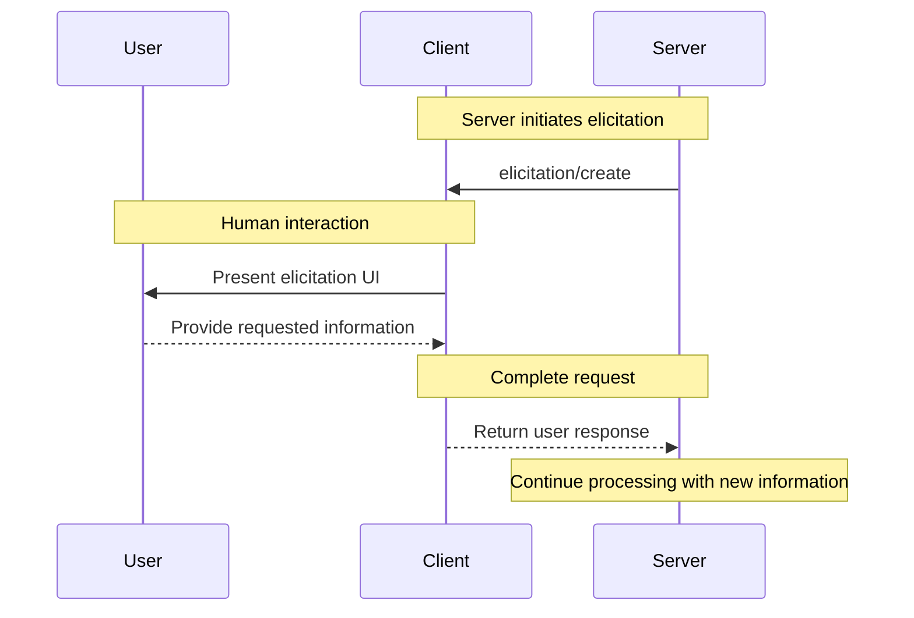
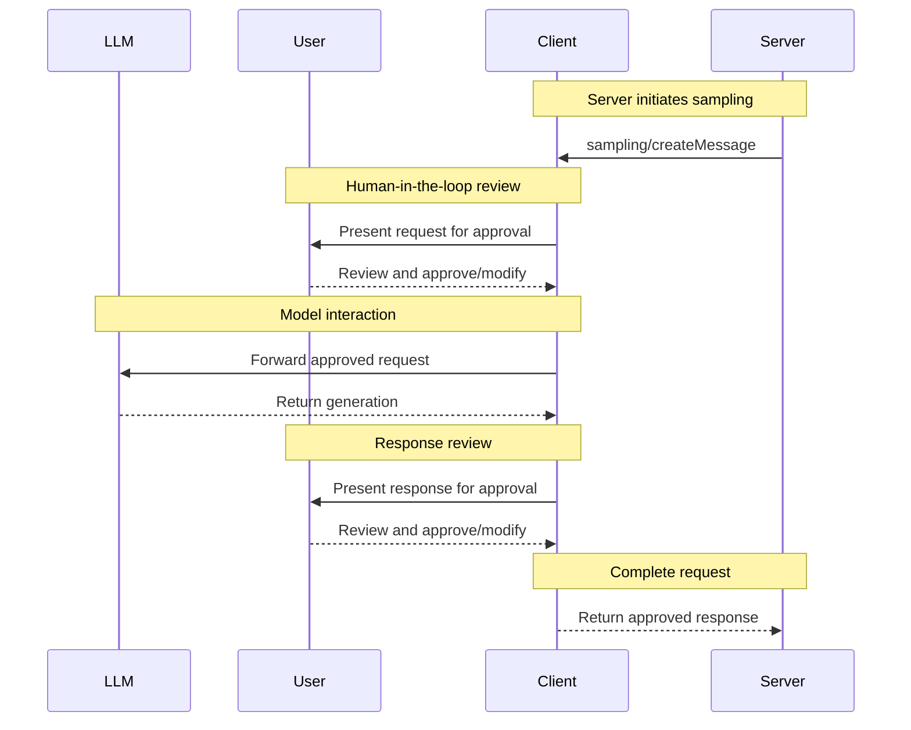

MCP 客户端由宿主应用实例化，用于与特定的 MCP 服务器通信。宿主应用（如 Claude.ai 或某个 IDE）管理整体的用户体验并协调多个客户端。每个客户端负责与一个服务器进行一次直接通信。

理解这一区分很重要：*宿主*是用户与之交互的应用，而*客户端*是使服务器连接成为可能的协议层组件。

## 核心客户端特性

除了利用服务器提供的上下文之外，客户端还可以向服务器提供若干特性。这些客户端特性让服务器作者能够构建更丰富的交互。

| 特性         | 说明                                                                                                                                                                                                                                                   | 示例                                                                                                                                |
| --------------- | ------------------------------------------------------------------------------------------------------------------------------------------------------------------------------------------------------------------------------------------------------------- | -------------------------------------------------------------------------------------------------------------------------------------- |
| **征询（Elicitation）** | 征询使服务器能够在交互过程中向用户请求特定信息，为服务器按需收集信息提供一种结构化的方式。                                                                                           | 一个预订旅行的服务器可能会询问用户对飞机座位、房型的偏好，或其联系电话，以完成预订。 |
| **根（Roots）**       | 根允许客户端指定服务器应关注哪些目录，通过一种协调机制传达预期范围。                    | 一个预订旅行的服务器可能被授予对某个特定目录的访问权限，并从中读取用户的日历。                     |
| **采样（Sampling）**    | 采样允许服务器通过客户端请求 LLM 补全，从而支持一种智能体（agentic）工作流。这种方式让客户端完全掌控用户权限和安全措施。 | 一个预订旅行的服务器可能会将一份航班列表发送给 LLM，并请求 LLM 为用户挑选最佳航班。           |

### 征询（Elicitation）

征询使服务器能够在交互过程中向用户请求特定信息，从而创建更具动态性和响应性的工作流。

#### 概述

征询为服务器提供了一种按需收集必要信息的结构化方式。服务器无需预先要求提供所有信息，也不必在数据缺失时直接失败，而是可以暂停其操作，向用户请求特定的输入。这创造了更灵活的交互：服务器适应用户需求，而不是遵循僵化的模式。

**征询流程：**



该流程支持动态的信息收集。服务器可以在需要时请求特定数据，用户通过合适的 UI 提供信息，服务器则带着新获取的上下文继续处理。

**征询组成部分示例：**

```typescript
{
  method: "elicitation/create",
  params: {
    message: "Please confirm your Barcelona vacation booking details:",
    requestedSchema: {
      type: "object",
      properties: {
        confirmBooking: {
          type: "boolean",
          description: "Confirm the booking (Flights + Hotel = $3,000)"
        },
        seatPreference: {
          type: "string",
          enum: ["window", "aisle", "no preference"],
          description: "Preferred seat type for flights"
        },
        roomType: {
          type: "string",
          enum: ["sea view", "city view", "garden view"],
          description: "Preferred room type at hotel"
        },
        travelInsurance: {
          type: "boolean",
          default: false,
          description: "Add travel insurance ($150)"
        }
      },
      required: ["confirmBooking"]
    }
  }
}
```

#### 示例：假期预订审批

一个旅行预订服务器通过最终的预订确认过程展示了征询的威力。当用户已选定其理想的巴塞罗那度假套餐时，服务器需要在继续之前收集最终审批以及任何缺失的细节。

服务器以一个结构化请求来征询预订确认，其中包含行程摘要（巴塞罗那航班 6 月 15–22 日、海滨酒店、总计 $3,000）以及用于填写任何附加偏好的字段——例如座位选择、房型或旅行保险选项。

随着预订推进，服务器会征询完成预订所需的联系信息。它可能会询问用于机票预订的旅客详情、对酒店的特殊要求，或紧急联系人信息。

#### 用户交互模型

征询交互被设计得清晰、贴合上下文，并尊重用户自主权：

**请求呈现**：客户端在展示征询请求时会清楚地说明是哪个服务器在询问、为何需要该信息，以及它将如何被使用。请求消息解释目的，而 schema 提供结构与校验。

**响应选项**：用户可以通过合适的 UI 控件（文本框、下拉菜单、复选框）提供所请求的信息，也可以在附上可选说明的情况下拒绝提供信息，或取消整个操作。客户端在把响应返回给服务器之前，会依据所提供的 schema 校验它们。

**隐私考量**：征询绝不请求密码或 API 密钥。客户端会对可疑请求发出警告，并让用户在发送前审阅数据。

### 根（Roots）

根为服务器操作定义文件系统边界，允许客户端指定服务器应关注哪些目录。

#### 概述

根是一种让客户端向服务器传达文件系统访问边界的机制。它们由文件 URI 组成，指示服务器可以操作的目录，帮助服务器理解可用文件和文件夹的范围。虽然根传达了预期的边界，但它们并不强制执行安全限制。实际的安全性必须在操作系统层面通过文件权限和/或沙箱来强制执行。

**根结构：**

```json
{
  "uri": "file:///Users/agent/travel-planning",
  "name": "Travel Planning Workspace"
}
```

根仅为文件系统路径，并始终使用 `file://` URI 方案。它们帮助服务器理解项目边界、工作区组织以及可访问的目录。根列表可以随着用户处理不同的项目或文件夹而动态更新，当边界变化时，服务器会通过 `roots/list_changed` 收到通知。

#### 示例：旅行规划工作区

一位同时处理多个客户行程的旅行代理，可以借助根来组织文件系统访问。设想一个工作区，其中有用于旅行规划各个方面的不同目录。

客户端向旅行规划服务器提供文件系统根：

- `file:///Users/agent/travel-planning` - 包含所有旅行文件的主工作区
- `file:///Users/agent/travel-templates` - 可复用的行程模板和资源
- `file:///Users/agent/client-documents` - 客户护照和旅行文件

当该代理创建巴塞罗那行程时，行为良好的服务器会尊重这些边界——在指定的根内访问模板、保存新行程，并引用客户文件。服务器通常通过从根目录起的相对路径，或通过尊重根边界的文件搜索工具，来访问根内的文件。

如果该代理打开一个归档文件夹，例如 `file:///Users/agent/archive/2023-trips`，客户端会通过 `roots/list_changed` 更新根列表。

关于一个尊重根的服务器的完整实现，请参阅官方服务器仓库中的[文件系统服务器](https://github.com/modelcontextprotocol/servers/tree/main/src/filesystem)。

#### 设计理念

根充当客户端与服务器之间的协调机制，而非安全边界。规范要求服务器"应当（SHOULD）尊重根边界"，而非"必须（MUST）强制执行"它们，因为服务器运行的是客户端无法控制的代码。

当服务器是受信任或经过审查的、用户理解其建议性质，且目标是防止意外而非阻止恶意行为时，根的效果最好。它们擅长上下文范围界定（告诉服务器应聚焦何处）、意外防范（帮助行为良好的服务器留在边界内）以及工作流组织（例如自动管理项目边界）。

#### 用户交互模型

根通常由宿主应用根据用户操作自动管理，尽管某些应用可能会暴露手动的根管理：

**自动根检测**：当用户打开文件夹时，客户端会自动将它们暴露为根。打开一个旅行工作区会让客户端把该目录暴露为一个根，帮助服务器理解哪些行程和文件属于当前工作的范围。

**手动根配置**：高级用户可以通过配置指定根。例如，为可复用资源添加 `/travel-templates`，同时排除含有财务记录的目录。

### 采样（Sampling）

采样允许服务器通过客户端请求语言模型补全，从而在保持安全性和用户控制的同时启用智能体行为。

#### 概述

采样使服务器无需直接集成或为 AI 模型付费即可执行依赖 AI 的任务。相反，服务器可以请求已具备 AI 模型访问权限的客户端代其处理这些任务。这种方式让客户端完全掌控用户权限和安全措施。由于采样请求发生在其他操作的上下文中——例如一个分析数据的工具——并作为独立的模型调用被处理，它们在不同上下文之间保持清晰的边界，从而更高效地利用上下文窗口。

**采样流程：**



该流程通过多个人在环（human-in-the-loop）检查点确保安全。用户可以在初始请求和生成的响应返回给服务器之前审阅并修改二者。

**请求参数示例：**

```typescript
{
  messages: [
    {
      role: "user",
      content: "Analyze these flight options and recommend the best choice:\n" +
               "[47 flights with prices, times, airlines, and layovers]\n" +
               "User preferences: morning departure, max 1 layover"
    }
  ],
  modelPreferences: {
    hints: [{
      name: "claude-sonnet-4-20250514"  // Suggested model
    }],
    costPriority: 0.3,      // Less concerned about API cost
    speedPriority: 0.2,     // Can wait for thorough analysis
    intelligencePriority: 0.9  // Need complex trade-off evaluation
  },
  systemPrompt: "You are a travel expert helping users find the best flights based on their preferences",
  maxTokens: 1500
}
```

#### 示例：航班分析工具

设想一个旅行预订服务器带有一个名为 `findBestFlight` 的工具，它使用采样来分析可用航班并推荐最优选择。当用户询问"帮我预订下个月去巴塞罗那的最佳航班"时，该工具需要 AI 协助来评估复杂的权衡。

该工具查询航空公司 API 并收集到 47 个航班选项。然后它请求 AI 协助来分析这些选项："分析这些航班选项并推荐最佳选择：[47 个航班，含价格、时间、航空公司和中转] 用户偏好：上午出发，最多 1 次中转。"

客户端发起采样请求，让 AI 评估权衡——比如更便宜的红眼航班对比便利的上午出发。该工具利用这一分析来呈现前三个推荐。

#### 用户交互模型

尽管并非强制要求，采样被设计为允许人在环控制。用户可以通过若干机制保持监督：

**审批控制**：采样请求可能需要显式的用户同意。客户端可以展示服务器想要分析什么以及为什么。用户可以批准、拒绝或修改请求。

**透明度特性**：客户端可以显示确切的提示词、模型选择和令牌限制，让用户在 AI 响应返回给服务器之前对其进行审阅。

**配置选项**：用户可以设置模型偏好、为受信任的操作配置自动审批，或对所有内容都要求审批。客户端可以提供选项来编辑（redact）敏感信息。

**安全考量**：客户端和服务器在采样过程中都必须妥善处理敏感数据。客户端应实施限流并校验所有消息内容。人在环设计确保服务器发起的 AI 交互在没有显式用户同意的情况下无法危害安全或访问敏感数据。
