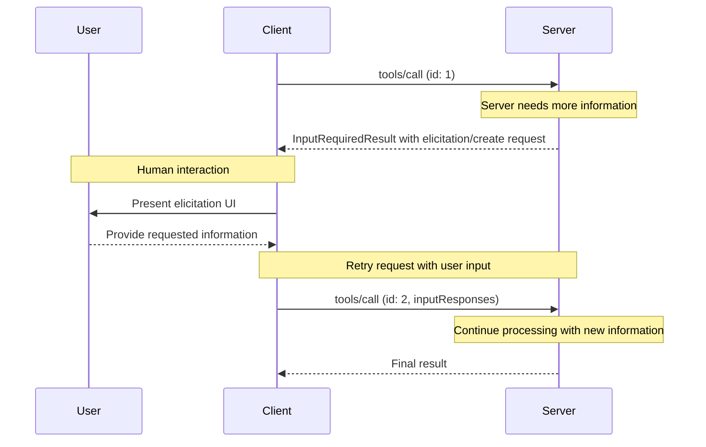
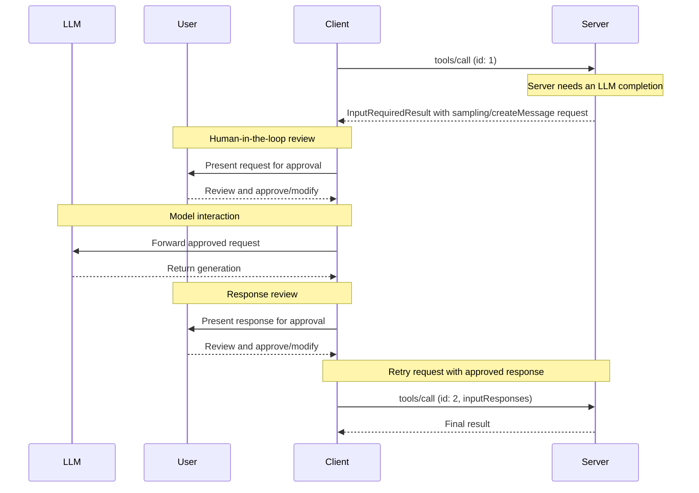

MCP 客户端由宿主应用实例化，用于与特定的 MCP 服务器通信。宿主应用（如 Claude.ai 或某个 IDE）管理整体的用户体验并协调多个客户端。每个客户端负责与一个服务器进行一次直接通信。

理解这一区分很重要：*宿主*是用户与之交互的应用，而*客户端*是使服务器连接成为可能的协议层组件。

## 核心客户端特性

除了利用服务器提供的上下文之外，客户端还可以向服务器提供若干特性。这些客户端特性让服务器作者能够构建更丰富的交互。

| 特性         | 说明                                                                                                                                                                                                                                                   | 示例                                                                                                                                |
| --------------- | ------------------------------------------------------------------------------------------------------------------------------------------------------------------------------------------------------------------------------------------------------------- | -------------------------------------------------------------------------------------------------------------------------------------- |
| **征询（Elicitation）** | 征询使服务器能够在交互过程中向用户请求特定信息，为服务器按需收集信息提供一种结构化的方式。                                                                                           | 一个预订旅行的服务器可能会询问用户对飞机座位、房型的偏好，或其联系电话，以完成预订。 |
| **根（Roots）**       | 根允许客户端指定服务器应关注哪些目录，通过一种协调机制传达预期范围。自协议版本 `2026-07-28` 起，根已[弃用](/specification/2026-07-28/deprecated)。                    | 一个预订旅行的服务器可能被授予对某个特定目录的访问权限，并从中读取用户的日历。                     |
| **采样（Sampling）**    | 采样允许服务器通过客户端请求 LLM 补全，从而支持一种智能体（agentic）工作流。这种方式让客户端完全掌控用户权限和安全措施。自协议版本 `2026-07-28` 起，采样已弃用。 | 一个预订旅行的服务器可能会将一份航班列表发送给 LLM，并请求 LLM 为用户挑选最佳航班。           |

### 征询（Elicitation）

征询使服务器能够在交互过程中向用户请求特定信息，从而创建更具动态性和响应性的工作流。

#### 概述

征询为服务器提供了一种按需收集必要信息的结构化方式。服务器无需预先要求提供所有信息，也不必在数据缺失时直接失败，而是可以暂停其操作，向用户请求特定的输入。这创造了更灵活的交互：服务器适应用户需求，而不是遵循僵化的模式。

征询支持两种模式：

* **表单模式（Form mode）**：服务器请求客户端从用户处收集结构化数据。请求中包含一个 schema，客户端用它来构建输入表单并校验响应。
* **URL 模式（URL mode）**：服务器提供一个供用户打开的 URL。交互在带外（out of band）发生，其数据绝不经过客户端，这使得该模式适用于敏感流程，例如凭据录入或第三方 OAuth 授权。

征询遵循[多轮往返请求（Multi Round-Trip Requests）](/specification/2026-07-28/basic/patterns/mrtr)（MRTR）模式。当服务器在处理诸如 `tools/call` 之类的请求时需要用户输入，它会以一个 `InputRequiredResult` 响应，其 `inputRequests` 字段携带一个或多个 `elicitation/create` 请求。客户端收集输入并重试原始请求，附上收集到的 `inputResponses`，并回传服务器所包含的任何 `requestState`。

**征询流程：**



该流程支持动态的信息收集。服务器可以在需要时请求特定数据，用户通过合适的 UI 提供信息，服务器则在获得新上下文后完成被重试的请求。

**征询请求示例（在 `InputRequiredResult.inputRequests` 内投递）：**

```typescript theme={null}
{
  method: "elicitation/create",
  params: {
    mode: "form",
    message: "Please confirm your Barcelona vacation booking details:",
    requestedSchema: {
      type: "object",
      properties: {
        confirmBooking: {
          type: "boolean",
          description: "Confirm the booking (Flights + Hotel = $3,000)"
        },
        seatPreference: {
          type: "string",
          enum: ["window", "aisle", "no preference"],
          description: "Preferred seat type for flights"
        },
        roomType: {
          type: "string",
          enum: ["sea view", "city view", "garden view"],
          description: "Preferred room type at hotel"
        },
        travelInsurance: {
          type: "boolean",
          default: false,
          description: "Add travel insurance ($150)"
        }
      },
      required: ["confirmBooking"]
    }
  }
}
```

#### 示例：假期预订审批

一个旅行预订服务器通过最终预订确认流程展示了征询的威力。当用户选定了心仪的巴塞罗那度假套餐后，服务器需要在继续之前收集最终批准以及任何缺失的细节。

服务器通过一个结构化请求来征询预订确认，其中包含行程摘要（巴塞罗那航班 6 月 15 日至 22 日、海滨酒店、总计 \$3,000）以及用于填写任何额外偏好的字段——例如座位选择、房型或旅行保险选项。

随着预订推进，服务器征询完成预订所需的联系信息。它可能会询问用于航班预订的旅客详情、对酒店的特殊要求，或紧急联系人信息。

#### 用户交互模型

征询交互被设计为清晰、贴合上下文并尊重用户自主权：

**请求呈现**：客户端在显示征询请求时，会清晰地说明是哪个服务器在请求、为何需要该信息以及它将如何被使用。请求消息解释目的，而 schema 提供结构和校验。

**响应选项**：用户可以通过合适的 UI 控件（文本框、下拉菜单、复选框）提供所请求的信息，可以带可选说明地拒绝提供信息，或者取消整个操作。客户端在将响应返回给服务器之前，会依据所提供的 schema 对其进行校验。

**URL 处理**：对于 URL 模式，客户端会显示完整的 URL 并在打开之前获取显式同意，且绝不自动获取该 URL。客户端只会得知用户是否同意。交互本身保持在用户与目标站点之间。

**隐私考量**：服务器不得使用表单模式请求敏感信息，例如密码、API 密钥、访问令牌或支付凭据。这类交互应属于 URL 模式，它使数据保持带外，因而绝不经过客户端或 LLM 上下文。客户端会对可疑请求发出警告，并让用户在发送前审阅表单数据。

### 根（Roots）

<Warning>
  自协议版本 `2026-07-28` 起，根已[弃用](/specification/2026-07-28/deprecated)并计划移除。新的实现应改为通过工具参数、资源 URI 或服务器配置来传递目录或文件。
</Warning>

根为服务器操作定义文件系统边界，允许客户端指定服务器应关注哪些目录。

#### 概述

根是一种机制，供客户端向服务器传达文件系统的访问边界。它们由指示服务器可操作目录的 file URI 组成，帮助服务器理解可用文件和文件夹的范围。虽然根传达了预期的边界，但它们并不强制执行安全限制。实际的安全必须在操作系统层面，通过文件权限和/或沙箱来强制执行。

**根结构：**

```json theme={null}
{
  "uri": "file:///Users/agent/travel-planning",
  "name": "Travel Planning Workspace"
}
```

根专指文件系统路径，并且始终使用 `file://` URI scheme。它们帮助服务器理解项目边界、工作区组织和可访问的目录。随着用户处理不同的项目或文件夹，根列表可能发生变化。服务器会在下一次请求根列表时获取更新后的边界。

#### 示例：旅行规划工作区

一位同时处理多位客户行程的旅行代理，可从根中受益以组织文件系统访问。设想一个工作区，其中有针对旅行规划各个方面的不同目录。

客户端向旅行规划服务器提供文件系统根：

* `file:///Users/agent/travel-planning` —— 包含所有旅行文件的主工作区
* `file:///Users/agent/travel-templates` —— 可复用的行程模板和资源
* `file:///Users/agent/client-documents` —— 客户护照和旅行文档

当代理创建巴塞罗那行程时，行为良好的服务器会尊重这些边界——在指定的根范围内访问模板、保存新行程并引用客户文档。服务器通常通过使用相对于根目录的相对路径，或利用尊重根边界的文件搜索工具，来访问根内的文件。

如果代理打开一个归档文件夹，例如 `file:///Users/agent/archive/2023-trips`，客户端会将其加入根列表，服务器则会在其下一次 `roots/list` 请求时看到这个新边界。

有关一个尊重根的服务器的完整实现，请参阅官方服务器仓库中的[文件系统服务器](https://github.com/modelcontextprotocol/servers/tree/main/src/filesystem)。

#### 设计理念

根充当客户端与服务器之间的协调机制，而非安全边界。规范要求服务器 “SHOULD respect root boundaries（应当尊重根边界）”，而不是要求它们 “MUST enforce（必须强制执行）”，因为服务器运行的是客户端无法控制的代码。

当服务器受信任或经过审查、用户理解其建议性质、且目标是防止意外而非阻止恶意行为时，根的效果最佳。它们擅长于上下文范围界定（告诉服务器应关注何处）、意外预防（帮助行为良好的服务器保持在边界内），以及工作流组织（例如自动管理项目边界）。

#### 用户交互模型

根通常由宿主应用根据用户操作自动管理，尽管某些应用可能会暴露手动的根管理：

**自动根检测**：当用户打开文件夹时，客户端会自动将它们暴露为根。打开一个旅行工作区，可让客户端将该目录暴露为根，帮助服务器理解哪些行程和文档属于当前工作的范围。

**手动根配置**：高级用户可以通过配置指定根。例如，为可复用资源添加 `/travel-templates`，同时排除含有财务记录的目录。

### 采样（Sampling）

<Warning>
  自协议版本 `2026-07-28` 起，采样已[弃用](/specification/2026-07-28/deprecated)并计划移除。新的实现应改为直接与 LLM 提供方的 API 集成。
</Warning>

采样允许服务器通过客户端请求语言模型补全，从而在保持安全和用户控制的同时支持智能体（agentic）行为。

#### 概述

采样使服务器无需直接集成或付费使用 AI 模型即可执行依赖 AI 的任务。相反，服务器可以请求客户端——它已经拥有 AI 模型访问权限——代表它们处理这些任务。这种方式让客户端完全掌控用户权限和安全措施。由于采样请求发生在其他操作的上下文中——比如某个工具在分析数据——并作为独立的模型调用来处理，它们在不同上下文之间保持了清晰的边界，从而能够更高效地利用上下文窗口。

采样遵循[征询](#征询（elicitation）)一节中所述的相同[多轮往返请求（Multi Round-Trip Requests）](/specification/2026-07-28/basic/patterns/mrtr)流程，其 `InputRequiredResult` 携带一个 `sampling/createMessage` 请求。

服务器还可以在采样期间请求使用工具，方法是在请求中包含一个 `tools` 数组和一个可选的 `toolChoice` 字段。这些工具定义仅限于该次采样请求，无需与服务器所暴露的工具相对应。客户端通过 `sampling.tools` 能力声明支持，而服务器不得向未声明该能力的客户端发送启用了工具的采样请求。详情参见规范中的[采样](/specification/2026-07-28/client/sampling#tools-in-sampling)。

**采样流程：**



该流程通过多个人在回路（human-in-the-loop）检查点确保安全。用户会审阅初始请求和生成的响应，并可对二者进行修改，之后客户端才会用它来重试原始请求。

**请求参数示例：**

```typescript theme={null}
{
  messages: [
    {
      role: "user",
      content: {
        type: "text",
        text: "Analyze these flight options and recommend the best choice:\n" +
              "[47 flights with prices, times, airlines, and layovers]\n" +
              "User preferences: morning departure, max 1 layover"
      }
    }
  ],
  modelPreferences: {
    hints: [{
      name: "claude-sonnet-4-20250514"  // Suggested model
    }],
    costPriority: 0.3,      // Less concerned about API cost
    speedPriority: 0.2,     // Can wait for thorough analysis
    intelligencePriority: 0.9  // Need complex trade-off evaluation
  },
  systemPrompt: "You are a travel expert helping users find the best flights based on their preferences",
  maxTokens: 1500
}
```

#### 示例：航班分析工具

设想一个旅行预订服务器，它有一个名为 `findBestFlight` 的工具，使用采样来分析可用航班并推荐最优选择。当用户询问“帮我预订下个月去巴塞罗那的最佳航班”时，该工具需要 AI 协助来评估复杂的权衡。

该工具查询航空公司 API 并收集了 47 个航班选项。随后它请求 AI 协助来分析这些选项：“Analyze these flight options and recommend the best choice: \[47 flights with prices, times, airlines, and layovers] User preferences: morning departure, max 1 layover.”

客户端发起采样请求，让 AI 评估各种权衡——比如更便宜的红眼航班与更方便的上午出发之间的取舍。该工具利用这一分析来呈现前三名推荐。

#### 用户交互模型

尽管并非强制要求，采样被设计为允许人在回路的控制。用户可以通过若干机制保持监督：

**批准控制**：采样请求可能需要显式的用户同意。客户端可以展示服务器想要分析什么以及为什么。用户可以批准、拒绝或修改请求。

**透明性特性**：客户端可以显示确切的提示、模型选择和 token 上限，允许用户在 AI 响应返回给服务器之前进行审阅。

**配置选项**：用户可以设置模型偏好、为受信任的操作配置自动批准，或要求对所有事项进行批准。客户端可以提供选项来编辑（redact）敏感信息。

**安全考量**：客户端和服务器在采样期间都必须妥善处理敏感数据。客户端应当实现速率限制并校验所有消息内容。人在回路的设计确保了由服务器请求的 AI 交互不会在未经显式用户同意的情况下危及安全或访问敏感数据。
