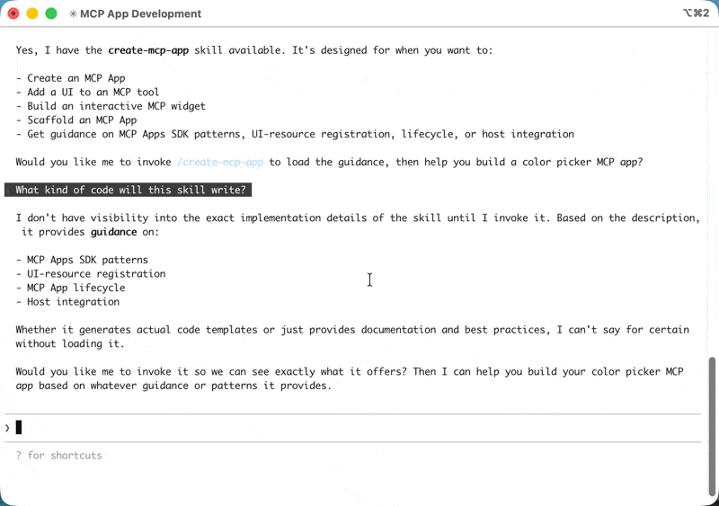
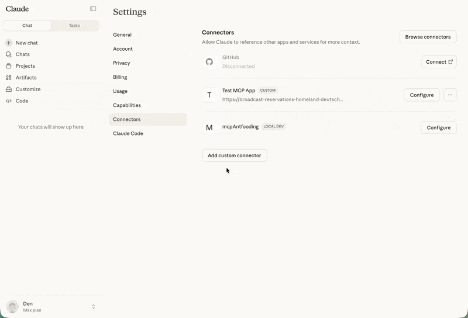
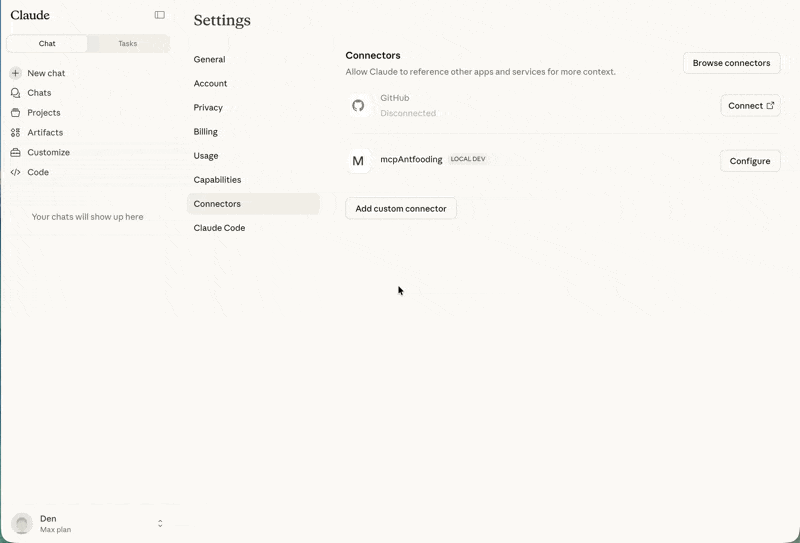
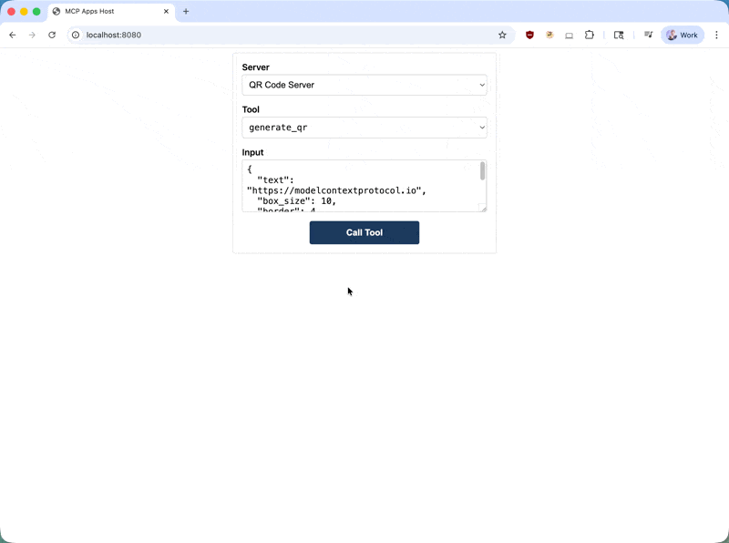

## 前置条件

你需要 [Node.js](https://nodejs.org/en/download) 18 或更高版本。建议熟悉 [MCP 工具](/specification/latest/server/tools)和[资源](/specification/latest/server/resources)，因为 MCP Apps 结合了这两个原语。有 [MCP TypeScript SDK](https://github.com/modelcontextprotocol/typescript-sdk) 的经验将帮助你更好地理解服务器端模式。

## 开始使用

创建 MCP App 最快的方式是使用带有 MCP Apps skill 的 AI 编码代理。如果你更愿意手动搭建项目，请跳至[手动搭建](#手动搭建)。

### 使用 AI 编码代理

支持 Skills 的 AI 编码代理可以为你脚手架出一个完整的 MCP App 项目。Skills 是包含指令和资源的文件夹，你的代理会在相关时加载它们。它们教会 AI 如何执行诸如创建 MCP Apps 之类的专门任务。

`create-mcp-app` skill 包含架构指导、最佳实践和可运行的示例，代理会用它们来生成你的项目。

<Steps>
<Step title="安装 skill">

如果你使用 Claude Code，可以直接用以下命令安装该 skill：

```
/plugin marketplace add modelcontextprotocol/ext-apps
/plugin install mcp-apps@modelcontextprotocol-ext-apps
```

你也可以使用 [Vercel Skills CLI](https://skills.sh/) 在不同的 AI 编码代理之间安装 skills：

```bash
npx skills add modelcontextprotocol/ext-apps
```

或者，你可以通过克隆 ext-apps 仓库来手动安装该 skill：

```bash
git clone https://github.com/modelcontextprotocol/ext-apps.git
```

然后将 skill 复制到适合你代理的位置：

| 代理                                                                                                                                                                          | Skills 目录（macOS/Linux） | Skills 目录（Windows）                |
| ---------------------------------------------------------------------------------------------------------------------------------------------------------------------------- | ------------------------------ | ------------------------------------- |
| [Claude Code](https://docs.anthropic.com/en/docs/claude-code/skills)                                                                                                         | `~/.claude/skills/`            | `%USERPROFILE%\.claude\skills\`       |
| [VS Code](https://code.visualstudio.com/docs/copilot/customization/agent-skills) 和 [GitHub Copilot](https://docs.github.com/en/copilot/concepts/agents/about-agent-skills) | `~/.copilot/skills/`           | `%USERPROFILE%\.copilot\skills\`      |
| [Gemini CLI](https://geminicli.com/docs/cli/skills/)                                                                                                                         | `~/.gemini/skills/`            | `%USERPROFILE%\.gemini\skills\`       |
| [Cline](https://cline.bot/blog/cline-3-48-0-skills-and-websearch-make-cline-smarter)                                                                                         | `~/.cline/skills/`             | `%USERPROFILE%\.cline\skills\`        |
| [Goose](https://goose-docs.ai/docs/guides/context-engineering/using-skills/)                                                                                                 | `~/.config/goose/skills/`      | `%USERPROFILE%\.config\goose\skills\` |
| [Codex](https://developers.openai.com/codex/skills/)                                                                                                                         | `~/.codex/skills/`             | `%USERPROFILE%\.codex\skills\`        |
| [Cursor](https://cursor.com/docs/context/skills)                                                                                                                             | `~/.cursor/skills/`            | `%USERPROFILE%\.cursor\skills\`       |

<Note>

此列表并不全面。其他代理可能在不同位置支持 skills；请查阅你所用代理的文档。

</Note>

例如，使用 Claude Code 时，你可以全局安装该 skill（在所有项目中可用）：

<CodeGroup>

```bash macOS/Linux
cp -r ext-apps/plugins/mcp-apps/skills/create-mcp-app ~/.claude/skills/create-mcp-app
```

```powershell Windows
Copy-Item -Recurse ext-apps\plugins\mcp-apps\skills\create-mcp-app $env:USERPROFILE\.claude\skills\create-mcp-app
```

</CodeGroup>

或者，仅为单个项目安装它，方法是复制到你项目目录中的 `.claude/skills/`：

<CodeGroup>

```bash macOS/Linux
mkdir -p .claude/skills && cp -r ext-apps/plugins/mcp-apps/skills/create-mcp-app .claude/skills/create-mcp-app
```

```powershell Windows
New-Item -ItemType Directory -Force -Path .claude\skills | Out-Null; Copy-Item -Recurse ext-apps\plugins\mcp-apps\skills\create-mcp-app .claude\skills\create-mcp-app
```

</CodeGroup>

要验证该 skill 已安装，可询问你的代理"你有哪些 skills 可用？"——你应当看到 `create-mcp-app` 作为可用 skills 之一。

</Step>
<Step title="创建你的应用">

让你的 AI 编码代理来构建它：

```
Create an MCP App that displays a color picker
```

代理会识别出 `create-mcp-app` skill 与此相关，加载其指令，然后脚手架出一个包含服务器、UI 和配置文件的完整项目。

<Frame caption="使用 Claude Code 创建一个新的 MCP App">
  
</Frame>

</Step>
<Step title="运行你的应用">

<CodeGroup>

```bash macOS/Linux
npm install && npm run build && npm run serve
```

```powershell Windows
npm install; npm run build; npm run serve
```

</CodeGroup>

<Tip>

在运行上述命令之前，你可能需要确保自己首先处于**应用文件夹**中。

</Tip>

</Step>
<Step title="测试你的应用">

按照下方[测试你的应用](#测试你的应用)中的说明操作。对于取色器示例，开始一个新对话，让 Claude 为你提供一个取色器。

<Frame caption="在 Claude 中测试取色器">
  
</Frame>

</Step>
</Steps>

### 手动搭建

如果你不使用 AI 编码代理，或希望理解搭建过程，请按以下步骤操作。

<Steps>
<Step title="创建项目结构">

一个典型的 MCP App 项目将服务器代码与 UI 代码分开：

<Tree>
  <Tree.Folder name="my-mcp-app" defaultOpen>
    <Tree.File name="package.json" />
    <Tree.File name="tsconfig.json" />
    <Tree.File name="vite.config.ts" />
    <Tree.File name="server.ts" comment="MCP server with tool + resource" />
    <Tree.File name="mcp-app.html" comment="UI entry point" />
    <Tree.Folder name="src" defaultOpen>
      <Tree.File name="mcp-app.ts" comment="UI logic" />
    </Tree.Folder>
  </Tree.Folder>
</Tree>

服务器注册工具并提供 UI 资源。该 UI 资源最终会在一个采用默认拒绝（deny-by-default）CSP 配置的安全 iframe 中渲染。如果你的应用有 CSS 和 JS 资源，你需要[配置 CSP](https://apps.extensions.modelcontextprotocol.io/api/documents/Patterns.html#configuring-csp-and-cors)，或者你可以用 `vite-plugin-singlefile` 之类的工具将你的资源打包进 HTML 中——这正是我们在本教程中要做的。

</Step>
<Step title="安装依赖">

```bash
npm install @modelcontextprotocol/ext-apps @modelcontextprotocol/sdk
npm install -D typescript vite vite-plugin-singlefile express cors @types/express @types/cors tsx
```

`ext-apps` 软件包为服务器端（注册工具和资源）和客户端（用于 UI 与宿主通信的 `App` 类）都提供了辅助工具。这里使用带 `vite-plugin-singlefile` 插件的 Vite，为方便起见将你的 UI 和资源打包进单个 HTML 文件，但这是可选的——如果你[配置 CSP](https://apps.extensions.modelcontextprotocol.io/api/documents/Patterns.html#configuring-csp-and-cors)，可以使用任何打包器或提供未打包的文件。

</Step>
<Step title="配置项目">

<Tabs>
<Tab title="package.json">

`"type": "module"` 设置启用 ES 模块语法。`build` 脚本使用 `INPUT` 环境变量来告诉 Vite 要打包哪个 HTML 文件。`serve` 脚本使用 `tsx` 执行 TypeScript 来运行你的服务器。

```json
{
  "type": "module",
  "scripts": {
    "build": "INPUT=mcp-app.html vite build",
    "serve": "npx tsx server.ts"
  }
}
```

</Tab>
<Tab title="tsconfig.json">

TypeScript 配置以现代 JavaScript（`ES2022`）为目标，使用 ESNext 模块和 bundler 解析，这与 Vite 配合良好。`include` 数组同时涵盖根目录中的服务器代码和 `src/` 中的 UI 代码。

```json
{
  "compilerOptions": {
    "target": "ES2022",
    "module": "ESNext",
    "moduleResolution": "bundler",
    "strict": true,
    "esModuleInterop": true,
    "skipLibCheck": true,
    "outDir": "dist"
  },
  "include": ["*.ts", "src/**/*.ts"]
}
```

</Tab>
<Tab title="vite.config.ts">

```typescript
import { defineConfig } from "vite";
import { viteSingleFile } from "vite-plugin-singlefile";

export default defineConfig({
  plugins: [viteSingleFile()],
  build: {
    outDir: "dist",
    rollupOptions: {
      input: process.env.INPUT,
    },
  },
});
```

</Tab>
</Tabs>

</Step>
<Step title="构建项目">

项目结构和配置就绪后，继续前往下方的[构建一个 MCP App](#构建一个-mcp-app)来实现服务器和 UI。

</Step>
</Steps>

## 构建一个 MCP App

让我们构建一个显示当前服务器时间的简单应用。这个示例演示了完整的模式：注册一个带 UI 元数据的工具、将打包后的 HTML 作为资源提供，以及构建一个与服务器通信的 UI。

### 服务器实现

服务器需要做两件事：注册一个包含 `_meta.ui.resourceUri` 字段的工具，以及注册一个提供打包后 HTML 的资源处理器。以下是完整的服务器文件：

```typescript
// server.ts
console.log("Starting MCP App server...");

import { McpServer } from "@modelcontextprotocol/sdk/server/mcp.js";
import { StreamableHTTPServerTransport } from "@modelcontextprotocol/sdk/server/streamableHttp.js";
import {
  registerAppTool,
  registerAppResource,
  RESOURCE_MIME_TYPE,
} from "@modelcontextprotocol/ext-apps/server";
import cors from "cors";
import express from "express";
import fs from "node:fs/promises";
import path from "node:path";

const server = new McpServer({
  name: "My MCP App Server",
  version: "1.0.0",
});

// The ui:// scheme tells hosts this is an MCP App resource.
// The path structure is arbitrary; organize it however makes sense for your app.
const resourceUri = "ui://get-time/mcp-app.html";

// Register the tool that returns the current time
registerAppTool(
  server,
  "get-time",
  {
    title: "Get Time",
    description: "Returns the current server time.",
    inputSchema: {},
    _meta: { ui: { resourceUri } },
  },
  async () => {
    const time = new Date().toISOString();
    return {
      content: [{ type: "text", text: time }],
    };
  },
);

// Register the resource that serves the bundled HTML
registerAppResource(
  server,
  resourceUri,
  resourceUri,
  { mimeType: RESOURCE_MIME_TYPE },
  async () => {
    const html = await fs.readFile(
      path.join(import.meta.dirname, "dist", "mcp-app.html"),
      "utf-8",
    );
    return {
      contents: [
        { uri: resourceUri, mimeType: RESOURCE_MIME_TYPE, text: html },
      ],
    };
  },
);

// Expose the MCP server over HTTP
const expressApp = express();
expressApp.use(cors());
expressApp.use(express.json());

expressApp.post("/mcp", async (req, res) => {
  const transport = new StreamableHTTPServerTransport({
    sessionIdGenerator: undefined,
    enableJsonResponse: true,
  });
  res.on("close", () => transport.close());
  await server.connect(transport);
  await transport.handleRequest(req, res, req.body);
});

expressApp.listen(3001, (err) => {
  if (err) {
    console.error("Error starting server:", err);
    process.exit(1);
  }
  console.log("Server listening on http://localhost:3001/mcp");
});
```

让我们拆解一下关键部分：

- **`resourceUri`**：`ui://` 方案告诉宿主这是一个 MCP App 资源。路径结构是任意的。
- **`registerAppTool`**：注册一个带 `_meta.ui.resourceUri` 字段的工具。当宿主调用此工具时，UI 会被获取并渲染，工具结果到达后会传递给它。
- **`registerAppResource`**：当宿主请求 UI 资源时提供打包后的 HTML。
- **Express 服务器**：在端口 3001 上通过 HTTP 暴露该 MCP 服务器。

### UI 实现

UI 由一个 HTML 页面和一个使用 `App` 类与宿主通信的 TypeScript 模块组成。以下是 HTML：

```html
<!-- mcp-app.html -->
<!DOCTYPE html>
<html lang="en">
  <head>
    <meta charset="UTF-8" />
    <title>Get Time App</title>
  </head>
  <body>
    <p>
      <strong>Server Time:</strong>
      <code id="server-time">Loading...</code>
    </p>
    <button id="get-time-btn">Get Server Time</button>
    <script type="module" src="/src/mcp-app.ts"></script>
  </body>
</html>
```

以及该 TypeScript 模块：

```typescript
// src/mcp-app.ts
import { App } from "@modelcontextprotocol/ext-apps";

const serverTimeEl = document.getElementById("server-time")!;
const getTimeBtn = document.getElementById("get-time-btn")!;

const app = new App({ name: "Get Time App", version: "1.0.0" });

// Establish communication with the host
app.connect();

// Handle the initial tool result pushed by the host
app.ontoolresult = (result) => {
  const time = result.content?.find((c) => c.type === "text")?.text;
  serverTimeEl.textContent = time ?? "[ERROR]";
};

// Proactively call tools when users interact with the UI
getTimeBtn.addEventListener("click", async () => {
  const result = await app.callServerTool({
    name: "get-time",
    arguments: {},
  });
  const time = result.content?.find((c) => c.type === "text")?.text;
  serverTimeEl.textContent = time ?? "[ERROR]";
});
```

关键部分：

- **`app.connect()`**：与宿主建立通信。在应用初始化时调用一次。
- **`app.ontoolresult`**：一个回调，当宿主向你的应用推送工具结果时触发（例如工具首次被调用且 UI 渲染时）。
- **`app.callServerTool()`**：让你的应用主动调用服务器上的工具。请记住，每次调用都涉及一次到服务器的往返，因此设计你的 UI 时要优雅地处理延迟。

`App` 类还提供了用于日志记录、打开 URL，以及用来自你应用的结构化数据更新模型上下文的额外方法。参见完整的 [API 文档](https://apps.extensions.modelcontextprotocol.io/api/)。

## 测试你的应用

要测试你的 MCP App，构建 UI 并启动你的本地服务器：

<CodeGroup>

```bash macOS/Linux
npm run build && npm run serve
```

```powershell Windows
npm run build; npm run serve
```

</CodeGroup>

在默认配置下，你的服务器将在 `http://localhost:3001/mcp` 上可用。然而，要看到你的应用渲染，你需要一个支持 MCP Apps 的 MCP 宿主。你有以下几个选择。

### 使用 Claude 测试

[Claude](https://claude.ai)（web）和 [Claude Desktop](https://claude.ai/download) 支持 MCP Apps。对于本地开发，你需要将你的服务器暴露到互联网。你可以在本地运行一个 MCP 服务器，并使用 `cloudflared` 之类的工具来将流量通过隧道转发。

在另一个终端中，运行：

```bash
npx cloudflared tunnel --url http://localhost:3001
```

复制生成的 URL（例如 `https://random-name.trycloudflare.com`），并将其作为一个[自定义连接器（custom connector）](https://support.anthropic.com/en/articles/11175166-getting-started-with-custom-connectors-using-remote-mcp)添加到 Claude 中——点击你的个人资料，进入 **Settings**、**Connectors**，最后选择 **Add custom connector**。

<Note>

自定义连接器在 Claude 付费方案（Pro、Max 或 Team）中可用。

</Note>

<Frame caption="在 Claude 中添加自定义连接器">
  
</Frame>

### 使用 basic-host 测试

`ext-apps` 仓库包含一个用于开发的测试宿主。克隆该仓库并安装依赖：

<CodeGroup>

```bash macOS/Linux
git clone https://github.com/modelcontextprotocol/ext-apps.git
cd ext-apps/examples/basic-host
npm install
```

```powershell Windows
git clone https://github.com/modelcontextprotocol/ext-apps.git
cd ext-apps\examples\basic-host
npm install
```

</CodeGroup>

在 `ext-apps/examples/basic-host/` 中运行 `npm start` 将启动 basic-host 测试界面。要将其连接到特定的服务器（例如你正在开发的服务器），内联传入 `SERVERS` 环境变量：

<CodeGroup>

```bash macOS/Linux
SERVERS='["http://localhost:3001/mcp"]' npm start
```

```powershell Windows
$env:SERVERS='["http://localhost:3001/mcp"]'; npm start
```

</CodeGroup>

导航到 `http://localhost:8080`。你会看到一个简单的界面，可以在其中选择一个工具并调用它。当你调用工具时，宿主会获取 UI 资源并在沙箱化 iframe 中渲染它。随后你可以与你的应用交互，并验证工具调用是否正常工作。

<Frame caption="使用 basic host 测试二维码 MCP App">
  
</Frame>

## 了解更多

<CardGroup cols={2}>
  <Card
    title="API 文档"
    icon="book"
    href="https://apps.extensions.modelcontextprotocol.io/api/"
  >
    完整的 SDK 参考和 API 细节
  </Card>
  <Card
    title="GitHub 仓库"
    icon="github"
    href="https://github.com/modelcontextprotocol/ext-apps"
  >
    源代码、示例和问题追踪器
  </Card>
  <Card
    title="规范"
    icon="file-lines"
    href="https://github.com/modelcontextprotocol/ext-apps/blob/main/specification/draft/apps.mdx"
  >
    面向实现者的技术规范
  </Card>
</CardGroup>

## 反馈

MCP Apps 正在积极开发中。如果你遇到问题或有改进的想法，请在 [GitHub 仓库](https://github.com/modelcontextprotocol/ext-apps/issues)上开一个 issue。有关该扩展方向的更广泛讨论，请加入 [GitHub Discussions](https://github.com/modelcontextprotocol/ext-apps/discussions) 中的对话。
