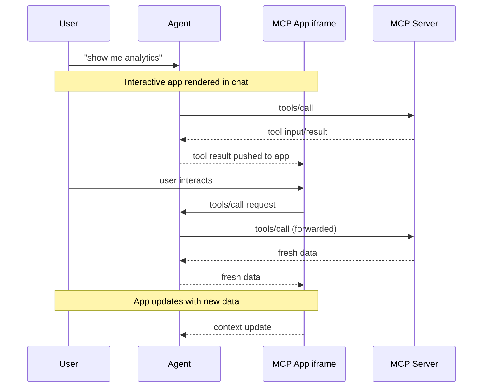

<Tip>

有关全面的 API 文档、进阶模式和完整规范，请访问[官方 MCP Apps 文档](https://apps.extensions.modelcontextprotocol.io)。

</Tip>

纯文本响应能做的事情终归有限。有时用户需要与数据交互，而不只是阅读关于它的描述。MCP Apps 让服务器能够返回交互式 HTML 界面（数据可视化、表单、仪表盘），直接在聊天中渲染。

## 为什么不直接构建一个 Web 应用？

你当然可以构建一个独立的 Web 应用，然后给用户发一个链接。然而，MCP Apps 提供了独立页面无法比拟的以下关键优势：

- **上下文保留。** 应用存在于对话之中。用户无需切换标签页、迷失位置，或苦苦回想是哪个聊天线程里有那个仪表盘。UI 就在那里，与引出它的讨论并列在一起。
- **双向数据流。** 你的应用可以调用 MCP 服务器上的任何工具，宿主也可以将最新结果推送给你的应用。独立的 Web 应用则需要自己的 API、认证和状态管理。MCP Apps 通过既有的 MCP 模式获得这一切。
- **与宿主能力的集成。** 应用可以将操作委托给宿主，宿主随后可以调用用户已经连接的能力和工具（须经用户同意）。这样一来，不必每个应用都自行实现并维护直接集成（例如邮件提供方），应用只需请求一个结果（比如"安排这次会议"），由宿主通过用户既有的已连接能力来路由处理。
- **安全保证。** MCP Apps 运行在由宿主控制的沙箱化 iframe 中。它们无法访问父页面、窃取 cookie 或逃逸出其容器。这意味着宿主可以安全地渲染第三方应用，而无需完全信任服务器作者。

如果你的用例并不受益于这些特性，那么常规的 Web 应用可能更简单。但如果你想要与基于 LLM 的对话紧密集成，MCP Apps 是好得多的工具。

## MCP Apps 的工作原理

传统的 MCP 工具返回文本、图像、资源或结构化数据，由宿主作为对话的一部分展示。MCP Apps 扩展了这一模式，允许工具在其工具描述中声明一个对交互式 UI 的引用，由宿主就地渲染。

其核心模式结合了两个 MCP 原语：一个在其描述中声明 UI 资源的工具，加上一个将数据渲染为交互式 HTML 界面的 UI 资源。

当大语言模型（LLM）决定调用一个支持 MCP Apps 的工具时，会发生以下过程：

1. **UI 预加载**：工具描述包含一个 `_meta.ui.resourceUri` 字段，指向一个 `ui://` 资源。宿主甚至可以在工具被调用之前预加载该资源，从而实现诸如向应用流式传输工具输入之类的特性。

2. **资源获取**：宿主从服务器获取该 UI 资源。该资源包含一个 HTML 页面，为简单起见通常将其 JavaScript 和 CSS 打包在一起。应用还可以从 `_meta.ui.csp` 中指定的源加载外部脚本和资源。

3. **沙箱化渲染**：Web 宿主通常将 HTML 渲染在对话内的一个沙箱化 [iframe](https://developer.mozilla.org/en-US/docs/Web/HTML/Element/iframe) 中。沙箱限制了应用对父页面的访问，从而确保安全。资源的 `_meta.ui` 对象可以包含 `permissions` 以请求额外能力（例如麦克风、摄像头），以及 `csp` 以控制应用可以从哪些外部源加载资源。

4. **双向通信**：应用与宿主通过一个 JSON-RPC 协议通信，该协议构成了 MCP 的一种方言。有些请求和通知与核心 MCP 协议共享（例如 `tools/call`），有些相似（例如 `ui/initialize`），而大多数是带有 `ui/` 方法名前缀的新方法。应用可以请求工具调用、发送消息、更新模型的上下文，并从宿主接收数据。

应用与宿主保持隔离，但仍可通过安全的 postMessage 通道调用 MCP 工具。

## 何时使用 MCP Apps

当你的用例涉及以下情形时，MCP Apps 是很合适的选择：

**探索复杂数据。** 用户问"按地区展示销售情况"。文本响应或许能列出一堆数字，但 MCP App 可以渲染一张交互式地图，用户点击各地区即可下钻、悬停查看详情、在不同指标间切换，而这一切都无需额外的提示。

**在众多选项中进行配置。** 设置一次部署涉及数十个相互依赖的选择。与其一来一回地对话（"哪个地区？""什么实例规格？""启用自动扩缩容吗？"），MCP App 呈现一个表单，用户可以一次性看到所有选项，并带有校验和默认值。

**查看富媒体。** 当用户要求评审 PDF、查看 3D 模型或预览生成的图像时，文字描述力有不逮。MCP App 将实际的查看器（平移、缩放、旋转）直接嵌入对话之中。

**实时监控。** 展示实时指标、日志或系统状态的仪表盘需要持续更新。MCP App 维持一个持久连接，随着数据变化更新显示，而无需用户追问"现在状态如何？"

**多步骤工作流。** 审批费用报销单、评审代码变更或分诊问题都涉及逐项检查。MCP App 提供导航控件、操作按钮，以及在多次交互之间保持的状态。

## 安全模型

MCP Apps 运行在一个沙箱化的 [iframe](https://developer.mozilla.org/docs/Web/HTML/Element/iframe) 中，与宿主应用之间提供了强隔离。沙箱阻止你的应用访问父窗口的 [DOM](https://developer.mozilla.org/docs/Web/API/Document_Object_Model)、读取宿主的 cookie 或本地存储、导航父页面，或在父上下文中执行脚本。

你的应用与宿主之间的所有通信都经过 [postMessage API](https://developer.mozilla.org/docs/Web/API/Window/postMessage)。宿主控制你的应用可以访问哪些能力。例如，宿主可能限制应用能调用哪些工具，或禁用 `sendOpenLink` 能力。

沙箱旨在防止应用逃逸出去访问宿主或用户数据。

## 框架支持

MCP Apps 使用它们自己的 MCP 方言，与核心协议一样构建于 JSON-RPC 之上。有些消息与常规 MCP 共享（例如 `tools/call`），另一些则专属于应用（例如 `ui/initialize`）。传输方式是 [postMessage](https://developer.mozilla.org/docs/Web/API/Window/postMessage)，而非 stdio 或 HTTP。由于全部基于标准 Web 原语，你可以使用任何框架，也可以完全不用框架。

`@modelcontextprotocol/ext-apps` 中的 `App` 类是一个便利封装，而非强制要求。如果你倾向于避免依赖，或需要更紧密的控制，可以直接实现 [postMessage 协议](https://github.com/modelcontextprotocol/ext-apps/blob/main/specification/2026-01-26/apps.mdx)。

[示例目录](https://github.com/modelcontextprotocol/ext-apps/tree/main/examples)包含针对 React、Vue、Svelte、Preact、Solid 和纯 JavaScript 的初始模板。它们演示了每种框架体系的推荐模式，但只是示例而非要求。你可以选择最适合你用例的方式。

## 客户端支持

<Note>

MCP Apps 是[核心 MCP 规范](/specification/latest)的一个扩展。宿主支持情况因客户端而异。

</Note>

MCP Apps 目前受 [Claude](https://claude.ai)、[Claude Desktop](https://claude.ai/download)、[VS Code GitHub Copilot](https://code.visualstudio.com/)、[Microsoft 365 Copilot](https://www.microsoft.com/microsoft-365-copilot)、[Goose](https://block.github.io/goose/)、[Postman](https://postman.com)、[MCPJam](https://www.mcpjam.com/) 和 [Archestra.AI](https://www.archestra.ai/) 支持。各客户端扩展支持的完整列表参见[客户端矩阵](/extensions/client-matrix)。

如果你正在构建 MCP 客户端并希望支持 MCP Apps，有两个选择：

1. **使用框架**：[`@mcp-ui/client`](https://github.com/MCP-UI-Org/mcp-ui) 软件包提供了 React 组件，用于在你的宿主应用中渲染 MCP Apps 视图并与之交互。用法细节参见 [MCP-UI 文档](https://mcpui.dev/)。

2. **基于 AppBridge 构建**：SDK 包含一个 [**App Bridge**](https://apps.extensions.modelcontextprotocol.io/api/modules/app-bridge.html) 模块，负责在沙箱化 iframe 中渲染应用、消息传递、工具调用代理和安全策略强制执行。[basic-host 示例](https://github.com/modelcontextprotocol/ext-apps/tree/main/examples/basic-host)展示了如何集成它。

有关实现细节，参见 [API 文档](https://apps.extensions.modelcontextprotocol.io/api/)。

## 示例

[ext-apps 仓库](https://github.com/modelcontextprotocol/ext-apps/tree/main/examples)包含可直接运行的示例，演示不同的用例：

- **3D 与可视化**：
  [map-server](https://github.com/modelcontextprotocol/ext-apps/tree/main/examples/map-server)
  （CesiumJS 地球仪）、
  [threejs-server](https://github.com/modelcontextprotocol/ext-apps/tree/main/examples/threejs-server)
  （Three.js 场景）、
  [shadertoy-server](https://github.com/modelcontextprotocol/ext-apps/tree/main/examples/shadertoy-server)
  （着色器效果）
- **数据探索**：
  [cohort-heatmap-server](https://github.com/modelcontextprotocol/ext-apps/tree/main/examples/cohort-heatmap-server)、
  [customer-segmentation-server](https://github.com/modelcontextprotocol/ext-apps/tree/main/examples/customer-segmentation-server)、
  [wiki-explorer-server](https://github.com/modelcontextprotocol/ext-apps/tree/main/examples/wiki-explorer-server)
- **业务应用**：
  [scenario-modeler-server](https://github.com/modelcontextprotocol/ext-apps/tree/main/examples/scenario-modeler-server)、
  [budget-allocator-server](https://github.com/modelcontextprotocol/ext-apps/tree/main/examples/budget-allocator-server)
- **媒体**：
  [pdf-server](https://github.com/modelcontextprotocol/ext-apps/tree/main/examples/pdf-server)、
  [video-resource-server](https://github.com/modelcontextprotocol/ext-apps/tree/main/examples/video-resource-server)、
  [sheet-music-server](https://github.com/modelcontextprotocol/ext-apps/tree/main/examples/sheet-music-server)、
  [say-server](https://github.com/modelcontextprotocol/ext-apps/tree/main/examples/say-server)
  （文本转语音）
- **实用工具**：
  [qr-server](https://github.com/modelcontextprotocol/ext-apps/tree/main/examples/qr-server)、
  [system-monitor-server](https://github.com/modelcontextprotocol/ext-apps/tree/main/examples/system-monitor-server)、
  [transcript-server](https://github.com/modelcontextprotocol/ext-apps/tree/main/examples/transcript-server)
  （语音转文本）
- **初始模板**：
  [React](https://github.com/modelcontextprotocol/ext-apps/tree/main/examples/basic-server-react)、
  [Vue](https://github.com/modelcontextprotocol/ext-apps/tree/main/examples/basic-server-vue)、
  [Svelte](https://github.com/modelcontextprotocol/ext-apps/tree/main/examples/basic-server-svelte)、
  [Preact](https://github.com/modelcontextprotocol/ext-apps/tree/main/examples/basic-server-preact)、
  [Solid](https://github.com/modelcontextprotocol/ext-apps/tree/main/examples/basic-server-solid)、
  [纯 JavaScript](https://github.com/modelcontextprotocol/ext-apps/tree/main/examples/basic-server-vanillajs)

要开始构建你自己的 MCP App，参见[构建指南](/extensions/apps/build)。
