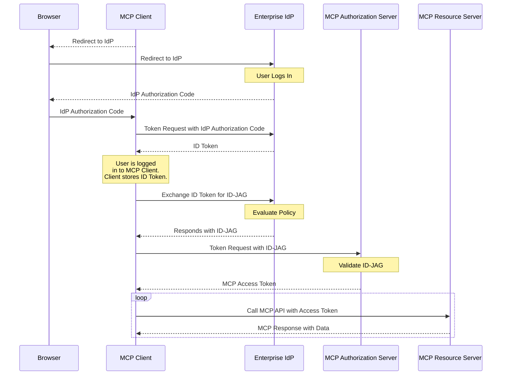

企业托管授权扩展（`io.modelcontextprotocol/enterprise-managed-authorization`）使组织能够通过其既有的身份提供方（IdP）集中控制 MCP 服务器的访问。无需每位员工逐一授权每个 MCP 服务器，组织的 IT 或安全团队可以在同一个地方管理访问策略。

<Card
  title="规范"
  icon="file-lines"
  href="https://github.com/modelcontextprotocol/ext-auth/blob/main/specification/stable/enterprise-managed-authorization.mdx"
>
  企业托管授权扩展的完整技术规范。
</Card>

## 它是什么

在标准的 MCP 部署中，每个用户独立地授权某个 MCP 客户端访问每个 MCP 服务器。对于消费级应用，这种以用户为驱动的模型是理想的——它让个人能够控制什么可以访问自己的数据。

在企业环境中，这种模型会带来摩擦和安全缺口：

- 员工不应该需要去了解组织所用每一个 MCP 服务器的授权细节
- 如果每个用户各自独立授权，安全团队便无法强制执行一致的访问策略
- 新员工入职时需要手动授权数十项服务
- 离职时则需要在每一项服务上逐一撤销访问权限

企业托管授权通过引入组织的 IdP 作为权威决策者来解决这一问题。IdP（例如 Okta、Azure AD 或企业 SSO 系统）控制员工可以访问哪些 MCP 服务器，以及在什么条件下访问。员工使用其企业身份进行认证——与他们用于邮件、Slack 及其他工作工具的凭据相同——IdP 则根据组织策略授予或拒绝 MCP 服务器访问。

## 何时使用

在以下情况使用企业托管授权：

- **在企业环境中部署 MCP**，且由 IT 管理对所有业务应用的访问
- **强制执行组织访问策略**——你需要确保只有获授权的员工才能访问特定的 MCP 服务器
- **集中式访问控制**——你希望从单一的管理控制台添加或撤销对 MCP 服务器的访问
- **满足合规要求**——你的组织需要对所有 MCP 服务器访问留有可审计的授权轨迹
- **简化员工体验**——员工应能用其既有的企业 SSO 凭据访问 MCP 工具，而无需逐项服务的授权流程

## 工作原理

该扩展建立了一种委托授权流，其中企业 IdP 充当 MCP 客户端与 MCP 服务器之间的中介。MCP 客户端向企业 IdP 请求一种特殊类型的令牌，称为身份断言 JWT 授权许可（Identity Assertion JWT Authorization Grant），即 ID-JAG。随后 MCP 客户端用该 ID-JAG 向 MCP 服务器的授权服务器换取一个访问令牌：



该流程的关键方面：

1. **集中式策略**：企业 IdP 维护一份已批准的 MCP 服务器登记表，以及各服务器的访问策略。管理员在其既有的身份管理工具中配置这些内容。

2. **单点登录**：员工用其企业凭据认证一次。IdP 签发令牌，授予对已批准 MCP 服务器的访问，而无需额外的逐服务器授权提示。

3. **策略强制执行**：IdP 在签发令牌之前评估访问策略（组成员身份、角色分配、条件访问规则）。缺乏授权的员工会收到相应的错误——MCP 客户端绝不会为未授权的服务器收到令牌。

4. **集中式撤销**：撤销某位员工对 MCP 服务器的访问是在 IdP 层面进行的，会立即在所有 MCP 客户端上生效。无需逐客户端、逐服务器地撤销。

## 实现指南

### 面向 MCP 客户端

要支持企业托管授权，你的客户端必须：

1. 在其逐请求能力中**声明支持**：

```jsonc
{
  "jsonrpc": "2.0",
  "id": 1,
  "method": "...",
  "params": {
    // Other fields...
    "_meta": {
      // Other fields...
      "io.modelcontextprotocol/clientCapabilities": {
        "extensions": {
          "io.modelcontextprotocol/enterprise-managed-authorization": {},
        },
      },
    },
  },
}
```

2. **支持 SSO**——用户应使用企业 IdP 认证到 MCP 客户端。保存登录期间签发的身份断言（OpenID ID Token 或 SAML 断言），以备后续使用。

3. **处理 ID-JAG**——当服务器表明需要企业托管授权时，使用先前获得的身份断言向企业 IdP 的授权端点请求一个 ID-JAG 令牌。用该 ID-JAG 向 MCP 授权服务器换取访问令牌。不要将用户重定向到 MCP 授权服务器的授权端点。

4. **支持组织级配置**——允许管理员配置企业 IdP 的端点，通常通过组织级设置而非逐用户设置。

5. **尊重令牌作用域**——企业 IdP 签发的令牌可能带有不同于标准 MCP 授权的作用域限制。要优雅地处理作用域错误。

### 面向 MCP 服务器

要要求使用企业托管授权：

1. 在你服务器的授权元数据中**声明该扩展**，表明客户端必须使用企业托管流程。

2. **与 IdP 管理 API 集成**（可选）——发布你服务器的资源描述符，以便企业管理员能够在其 IdP 管理控制台中配置访问策略。

### 面向 MCP 授权服务器

1. **验证** 企业 IdP 签发的 **ID-JAG**。这通常意味着依据 IdP 的 JWKS 端点验证 JWT 签名，并检查令牌的受众（audience）、签发者（issuer）和过期时间。

2. **将 IdP 声明映射为权限**——ID-JAG 令牌携带声明（作用域和资源信息），你的服务器用这些声明来判断员工是谁以及员工能访问什么。基于这些声明定义你的授权逻辑。

3. **处理账户关联**——ID-JAG 令牌始终包含一个 subject 声明，还可能额外包含一个 email 声明，可用于将企业身份关联到你系统中的既有账户。使用 subject 声明作为用户的主要稳定标识符，并在匹配那些在配置企业托管授权之前就已创建的既有账户时，回退到 email 声明。

## 客户端支持

<Note>

对此扩展的支持因客户端而异。扩展是选择启用的，绝不会默认激活。

</Note>

各 MCP 客户端当前的实现状态请查阅[客户端矩阵](/extensions/client-matrix)。企业托管授权通常除了需要 MCP 客户端应用本身之外，还需要来自组织 IT 团队的客户端层面支持。

## 相关资源

<CardGroup cols={2}>
  <Card
    title="ext-auth 仓库"
    icon="github"
    href="https://github.com/modelcontextprotocol/ext-auth"
  >
    源代码和参考实现
  </Card>
  <Card
    title="完整规范"
    icon="file-lines"
    href="https://github.com/modelcontextprotocol/ext-auth/blob/main/specification/stable/enterprise-managed-authorization.mdx"
  >
    带有规范性要求的技术规范
  </Card>
  <Card
    title="SEP-990"
    icon="file-lines"
    href="/seps/990-enable-enterprise-idp-policy-controls-during-mcp-o"
  >
    原始提案：在 MCP 授权期间启用企业 IdP 策略控制
  </Card>
  <Card
    title="MCP 授权"
    icon="lock"
    href="/specification/latest/basic/authorization"
  >
    核心 MCP 授权规范
  </Card>
</CardGroup>
