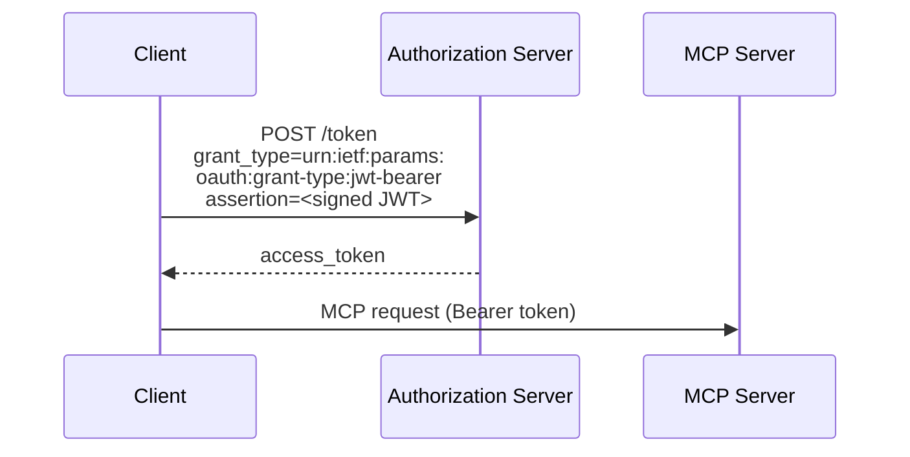
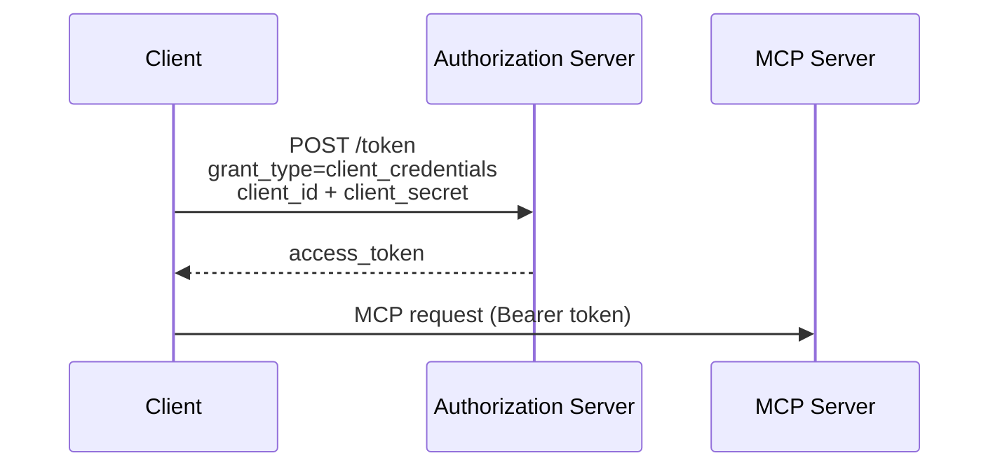

OAuth 客户端凭据扩展（`io.modelcontextprotocol/oauth-client-credentials`）为 MCP 添加了对 [OAuth 2.0 客户端凭据流](https://datatracker.ietf.org/doc/html/rfc6749#section-4.4)的支持。这使自动化系统无需交互式用户授权即可连接到 MCP 服务器。

<Card
  title="规范"
  icon="file-lines"
  href="https://github.com/modelcontextprotocol/ext-auth/blob/main/specification/draft/oauth-client-credentials.mdx"
>
  OAuth 客户端凭据扩展的完整技术规范。
</Card>

## 它是什么

标准的 MCP 授权流要求用户交互式地批准访问——浏览器打开，用户登录并授予权限。这对人类很有效，但在没有用户在场时便行不通了。

OAuth 客户端凭据扩展通过让客户端使用应用级凭据（客户端 ID 和密钥，或签名的 JWT 断言）而非委托的用户凭据来认证，解决了这一问题。客户端直接向授权服务器证明自己的身份，授权服务器随即签发访问令牌，而无需浏览器重定向或用户交互。

## 何时使用

在以下情况使用 OAuth 客户端凭据：

- **后台服务**需要按计划或响应事件调用 MCP 工具，而没有用户在场
- **CI/CD 流水线**作为自动化构建、测试或部署工作流的一部分调用 MCP 服务器
- **服务器对服务器集成**连接两个后端系统，其中不涉及最终用户
- **守护进程**或长时间运行的工作进程需要对 MCP 资源的持久访问

如果你的集成有一个应当显式授权访问的人类用户，请改用标准的 MCP 授权流。

## 工作原理

该扩展支持两种凭据格式：

### JWT Bearer 断言（推荐）

在 [RFC 7523](https://datatracker.ietf.org/doc/html/rfc7523) 中定义，JWT Bearer 断言让客户端用其私钥签名一个令牌，并将其作为身份证明呈递。授权服务器使用客户端注册的公钥验证签名。



JWT 断言通常包含：

- `iss`：客户端 ID（签发者）
- `sub`：客户端 ID（被认证的主体）
- `aud`：授权服务器令牌端点 URL
- `exp`：过期时间
- `iat`：签发时间

### 客户端密钥

对于更简单的部署，该扩展也支持使用 `client_id` 和 `client_secret` 的标准客户端凭据流。客户端将其凭据直接发送到授权服务器的令牌端点，并收到一个访问令牌作为回应。



<Warning>

客户端密钥是**长期有效的凭据**，无需用户交互即可授予访问。如果密钥泄露，攻击者便可以静默地以你的应用身份进行认证，直到密钥被轮换。为降低风险：

- 将密钥存放在密钥管理器中，绝不要放在源代码或被纳入版本控制的环境文件里。
- 定期轮换密钥，并在任何疑似泄露后立即轮换。
- 将凭据的作用域限定为所需的最小权限。
- 尽可能优先使用 JWT 断言——它们是短期有效的，且无需传输签名密钥。

</Warning>

## 实现指南

### 面向 MCP 客户端

要使用 OAuth 客户端凭据扩展，你的客户端必须：

<Steps>
<Step title="声明支持">

在其逐请求能力中包含该扩展：

```jsonc
{
  "jsonrpc": "2.0",
  "id": 1,
  "method": "...",
  "params": {
    // Other fields...
    "_meta": {
      // Other fields...
      "io.modelcontextprotocol/clientCapabilities": {
        "extensions": {
          "io.modelcontextprotocol/oauth-client-credentials": {},
        },
      },
    },
  },
}
```

</Step>
<Step title="获取访问令牌">

在连接到 MCP 服务器之前，使用客户端凭据许可从授权服务器请求一个令牌。

</Step>
<Step title="附带令牌">

在发往 MCP 服务器的 HTTP 请求的 `Authorization` 头中传递该令牌：

```
Authorization: Bearer <access_token>
```

</Step>
<Step title="处理令牌刷新">

客户端凭据令牌通常比用户委托令牌的有效期更短。实现令牌刷新逻辑，在过期前获取新令牌。

</Step>
</Steps>

### 面向 MCP 服务器

要接受客户端凭据令牌，你的服务器必须：

<Steps>
<Step title="验证令牌">

在每个请求上，依据你的授权服务器公钥（通常经由 JWKS 端点）验证 JWT 签名和声明。

</Step>
<Step title="检查作用域">

确保令牌包含所请求操作所需的作用域。

</Step>
<Step title="公告支持">

可选（但推荐，以便于发现），在 `server/discover` 响应中包含该扩展：

```jsonc
{
  "jsonrpc": "2.0",
  "id": 1,
  "result": {
    // Other fields...
    "capabilities": {
      "extensions": {
        "io.modelcontextprotocol/oauth-client-credentials": {},
      },
    },
  },
}
```

</Step>
</Steps>

## SDK 示例

官方 MCP SDK 内置了对客户端凭据认证的支持。二者都会自动处理令牌的获取和刷新。

<Steps>
<Step title="安装 SDK">

<Tabs>
<Tab title="TypeScript">

```bash
npm install @modelcontextprotocol/client
```

</Tab>
<Tab title="Python">

```bash
pip install mcp
```

</Tab>
</Tabs>

</Step>
<Step title="创建 provider 并连接">

选择与你的设置相匹配的凭据格式：

#### 使用客户端密钥

<Tabs>
<Tab title="TypeScript">

```typescript
import {
  Client,
  ClientCredentialsProvider,
  StreamableHTTPClientTransport,
} from "@modelcontextprotocol/client";

const provider = new ClientCredentialsProvider({
  clientId: "my-service",
  clientSecret: "s3cr3t",
});

const client = new Client(
  { name: "my-service", version: "1.0.0" },
  { capabilities: {} },
);

const transport = new StreamableHTTPClientTransport(
  new URL("https://mcp.example.com/mcp"),
  { authProvider: provider },
);

await client.connect(transport);

// Use the client
const tools = await client.listTools();
console.log(
  "Available tools:",
  tools.tools.map((t) => t.name),
);

await transport.close();
```

</Tab>
<Tab title="Python">

```python
import asyncio

import httpx2

from mcp import Client
from mcp.client.auth.extensions.client_credentials import (
    ClientCredentialsOAuthProvider,
)
from mcp.client.streamable_http import streamable_http_client
from mcp.shared.auth import OAuthClientInformationFull, OAuthToken


class InMemoryTokenStorage:
    def __init__(self) -> None:
        self.tokens: OAuthToken | None = None
        self.client_info: OAuthClientInformationFull | None = None

    async def get_tokens(self) -> OAuthToken | None:
        return self.tokens

    async def set_tokens(self, tokens: OAuthToken) -> None:
        self.tokens = tokens

    async def get_client_info(self) -> OAuthClientInformationFull | None:
        return self.client_info

    async def set_client_info(self, client_info: OAuthClientInformationFull) -> None:
        self.client_info = client_info


provider = ClientCredentialsOAuthProvider(
    server_url="https://mcp.example.com/mcp",
    storage=InMemoryTokenStorage(),
    client_id="my-service",
    client_secret="s3cr3t",
    scopes="read write",
)


async def main() -> None:
    async with httpx2.AsyncClient(auth=provider) as http_client:
        transport = streamable_http_client(
            "https://mcp.example.com/mcp",
            http_client=http_client,
        )
        async with Client(transport) as client:
            # Use the client
            tools = await client.list_tools()
            print("Available tools:", [t.name for t in tools.tools])


if __name__ == "__main__":
    asyncio.run(main())
```

</Tab>
</Tabs>

#### 使用 JWT 私钥

<Tabs>
<Tab title="TypeScript">

```typescript
import {
  Client,
  PrivateKeyJwtProvider,
  StreamableHTTPClientTransport,
} from "@modelcontextprotocol/client";

const provider = new PrivateKeyJwtProvider({
  clientId: "my-service",
  privateKey: process.env.CLIENT_PRIVATE_KEY_PEM,
  algorithm: "RS256",
});

const client = new Client(
  { name: "my-service", version: "1.0.0" },
  { capabilities: {} },
);

const transport = new StreamableHTTPClientTransport(
  new URL("https://mcp.example.com/mcp"),
  { authProvider: provider },
);

await client.connect(transport);

// Use the client
const tools = await client.listTools();
console.log(
  "Available tools:",
  tools.tools.map((t) => t.name),
);

await transport.close();
```

</Tab>
<Tab title="Python">

```python
import asyncio
from pathlib import Path

import httpx2

from mcp import Client
from mcp.client.auth.extensions.client_credentials import (
    PrivateKeyJWTOAuthProvider,
    SignedJWTParameters,
)
from mcp.client.streamable_http import streamable_http_client
from mcp.shared.auth import OAuthClientInformationFull, OAuthToken


class InMemoryTokenStorage:
    def __init__(self) -> None:
        self.tokens: OAuthToken | None = None
        self.client_info: OAuthClientInformationFull | None = None

    async def get_tokens(self) -> OAuthToken | None:
        return self.tokens

    async def set_tokens(self, tokens: OAuthToken) -> None:
        self.tokens = tokens

    async def get_client_info(self) -> OAuthClientInformationFull | None:
        return self.client_info

    async def set_client_info(self, client_info: OAuthClientInformationFull) -> None:
        self.client_info = client_info


# Create a signed JWT assertion provider from key parameters
jwt_params = SignedJWTParameters(
    issuer="my-service",
    subject="my-service",
    signing_key=Path("private_key.pem").read_text(),
    signing_algorithm="RS256",
    lifetime_seconds=300,
)

provider = PrivateKeyJWTOAuthProvider(
    server_url="https://mcp.example.com/mcp",
    storage=InMemoryTokenStorage(),
    client_id="my-service",
    assertion_provider=jwt_params.create_assertion_provider(),
    scopes="read write",
)


async def main() -> None:
    async with httpx2.AsyncClient(auth=provider) as http_client:
        transport = streamable_http_client(
            "https://mcp.example.com/mcp",
            http_client=http_client,
        )
        async with Client(transport) as client:
            # Use the client
            tools = await client.list_tools()
            print("Available tools:", [t.name for t in tools.tools])


if __name__ == "__main__":
    asyncio.run(main())
```

</Tab>
</Tabs>

</Step>
</Steps>

## 客户端支持

<Note>

对此扩展的支持因客户端而异。扩展是选择启用的，绝不会默认激活。

</Note>

各 MCP 客户端当前的实现状态请查阅[客户端矩阵](/extensions/client-matrix)。

## 相关资源

<CardGroup cols={2}>
  <Card
    title="ext-auth 仓库"
    icon="github"
    href="https://github.com/modelcontextprotocol/ext-auth"
  >
    源代码和参考实现
  </Card>
  <Card
    title="完整规范"
    icon="file-lines"
    href="https://github.com/modelcontextprotocol/ext-auth/blob/main/specification/draft/oauth-client-credentials.mdx"
  >
    带有规范性要求的技术规范
  </Card>
  <Card
    title="RFC 6749 — 客户端凭据许可"
    icon="link"
    href="https://datatracker.ietf.org/doc/html/rfc6749#section-4.4"
  >
    底层的 OAuth 2.0 规范
  </Card>
  <Card
    title="RFC 7523 — JWT Bearer 断言"
    icon="link"
    href="https://datatracker.ietf.org/doc/html/rfc7523"
  >
    JWT 断言格式规范
  </Card>
</CardGroup>
