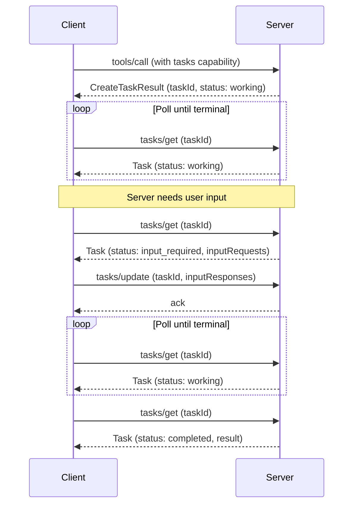

[ext-tasks 仓库](https://github.com/modelcontextprotocol/ext-tasks)包含 MCP Tasks 的完整规范和文档。

<Card
  title="modelcontextprotocol/ext-tasks"
  icon="github"
  href="https://github.com/modelcontextprotocol/ext-tasks"
>
  MCP Tasks 的完整规范和文档。
</Card>

并非每次工具调用都能瞬间返回。有些操作——CI 流水线、批处理、人工审批——会花费数秒、数分钟乃至更久。MCP Tasks 让服务器返回一个持久化句柄，而不是阻塞，这样客户端就可以轮询进度、在需要时提供输入，并在重新连接后取回最终结果。

## 为什么不直接阻塞？

你当然可以让连接一直保持打开，直到工作完成。而 Tasks 解决了阻塞无法解决的问题：

- **无需长连接。** 阻塞会在整个操作期间占用一个连接。许多客户端和传输中间件都施加超时限制，使得阻塞超过几秒钟便不切实际。
- **崩溃韧性。** 任务 ID 是一个持久化句柄。如果客户端断开或重启，它可以用同一个 ID 恢复轮询。
- **进度可见性。** 任务携带状态元数据（`working`、`input_required`、`completed`、`failed`、`cancelled`）和可选的状态消息，让客户端能够看到进度。
- **执行中途交互。** 当任务需要输入时（例如为获取用户确认而发起的征询），它会转入 `input_required` 状态并浮现出该请求。客户端通过 `tasks/update` 响应——无需第二个连接，也无需服务器主动向客户端发送未经请求的消息。
- **由服务器主导。** 服务器逐请求地决定是否创建任务。客户端通过扩展能力一次性选择加入，并处理到达的任何结果形态。无需每工具预热，也无需每请求标志。

## Tasks 的工作原理

Tasks 扩展了标准的请求流。当服务器判断某个请求将长时间运行时，它返回一个任务句柄而非最终结果。客户端轮询直至完成。

1. **能力协商。** 客户端在其逐请求能力中包含 `io.modelcontextprotocol/tasks`。服务器则在自己的 `server/discover` 能力中公告相同的扩展。

2. **任务创建。** 针对某个受支持的请求，服务器返回一个 `CreateTaskResult`（以 `resultType: "task"` 标识），其中包含 `taskId`、初始状态、TTL 以及建议的轮询间隔。任务在响应发送之前便被持久化创建。

3. **轮询。** 客户端以 `taskId` 调用 `tasks/get`。响应携带当前状态，对于终止状态则携带最终结果或错误。

4. **执行中途输入。** 如果任务转入 `input_required` 状态，`tasks/get` 响应会包含一个 `inputRequests` 映射，其中含有征询或其他服务器请求。客户端通过 `tasks/update` 满足这些请求。

5. **完成。** 当状态达到 `completed` 时，`result` 字段包含原始请求同步执行时本应返回的内容。如果状态为 `failed`，则 `error` 字段包含 JSON-RPC 错误。

6. **取消。** 客户端可以随时发送 `tasks/cancel`。取消是协作式的——服务器确认这一意图，但没有义务停止该工作。



## 何时使用 Tasks

当你的用例涉及以下情形时，Tasks 是很合适的选择：

**长时间运行的操作。** 花费数分钟或数小时的 CI 流水线、批量数据处理或模型训练作业。

**人在环路（human-in-the-loop）工作流。** 审批关卡、评审步骤，或任何为等待用户确认而暂停的操作。任务转入 `input_required` 状态，客户端呈现该请求。

**外部作业系统。** 如果你的服务器封装了一个已经使用作业 ID 的 API（云部署、异步 API、排队工作），则在创建作业时返回一个任务，并在作业完成时将其解决。

**不可靠的连接。** 移动客户端、时断时续的网络，或连接易掉线的环境。任务 ID 能在断连后依然有效。

**批处理。** 处理大量条目（批量导入、批量更新）且部分进度有意义的操作。状态消息可报告进度。

## 任务生命周期

| 状态             | 含义                                                                       |
| ---------------- | -------------------------------------------------------------------------- |
| `working`        | 操作正在进行中。                                                           |
| `input_required` | 服务器在继续之前需要客户端输入。参见 `inputRequests`。                     |
| `completed`      | 操作已完成。`result` 字段包含最终输出。                                    |
| `failed`         | 执行期间发生 JSON-RPC 错误。`error` 字段含有详情。                         |
| `cancelled`      | 操作已被取消（不一定会被响应）。                                           |

`completed`、`failed` 和 `cancelled` 是终止状态——一旦达到，任务的状态便不再改变。

## 通知

服务器可以通过 `notifications/tasks` 推送状态更新。客户端通过 `subscriptions/listen` 机制选择接收这些通知。每条通知都携带完整的任务状态，从而免去额外的 `tasks/get` 往返。

轮询是默认方式。如果服务器支持通知，客户端可以依赖通知而非轮询。

## 实现指南

### 面向 MCP 客户端

要消费经任务增强的响应，你的客户端必须：

<Steps>
<Step title="声明支持">

在其逐请求能力中包含该扩展：

```jsonc
{
  "jsonrpc": "2.0",
  "id": 1,
  "method": "...",
  "params": {
    // Other fields...
    "_meta": {
      // Other fields...
      "io.modelcontextprotocol/clientCapabilities": {
        "extensions": {
          "io.modelcontextprotocol/tasks": {},
        },
      },
    },
  },
}
```

</Step>
<Step title="处理多态结果">

在发出受支持的请求（例如 `tools/call`）时，要做好接收标准结果或带有 `resultType: "task"` 的 `CreateTaskResult` 的准备。

</Step>
<Step title="轮询直至完成">

以返回的 `taskId` 调用 `tasks/get`，并遵循 `pollIntervalMs` 值。持续轮询直至任务达到终止状态（`completed`、`failed` 或 `cancelled`）。

</Step>
<Step title="处理输入请求">

如果任务状态为 `input_required`，读取 `inputRequests` 映射，将这些请求呈现给用户或模型，并通过 `tasks/update` 提交响应。

</Step>
<Step title="持久化任务 ID">

持久地存储任务 ID，以便在客户端崩溃或重启后恢复轮询。

</Step>
</Steps>

### 面向 MCP 服务器

要从你的服务器返回任务：

<Steps>
<Step title="公告支持">

在你的 `server/discover` 能力中包含该扩展：

```jsonc
{
  "jsonrpc": "2.0",
  "id": 1,
  "result": {
    // Other fields...
    "capabilities": {
      "extensions": {
        "io.modelcontextprotocol/tasks": {},
      },
    },
  },
}
```

</Step>
<Step title="检查客户端能力">

在返回 `CreateTaskResult` 之前，核实客户端已在其逐请求能力中包含该扩展。绝不要向未声明支持的客户端返回任务。

</Step>
<Step title="返回 CreateTaskResult">

当某个请求将长时间运行时，以 `resultType: "task"` 和一个 `Task` 对象作出响应，该对象包含唯一的 `taskId`、初始状态、`ttlMs` 和 `pollIntervalMs`。任务必须在发送响应之前被持久化创建。

</Step>
<Step title="提供 tasks/get">

在每次轮询时返回当前任务状态。对于终止状态，包含 `result`（`completed` 时）或 `error`（`failed` 时）字段。

</Step>
<Step title="处理 tasks/update">

接受以未完成的 `inputRequests` 为键的 `inputResponses`。以空结果确认。忽略针对未知或已满足的键的响应。

</Step>
<Step title="处理 tasks/cancel">

以空结果确认取消请求。在可能时响应取消，但取消是协作式的——任务仍可能达到非 `cancelled` 的终止状态。

</Step>
</Steps>

## 客户端支持

<Note>

MCP Tasks 是[核心 MCP 规范](/specification/latest)的一个扩展。宿主支持情况因客户端而异。

</Note>

各客户端的扩展支持情况参见[客户端矩阵](/extensions/client-matrix)。任务支持需要客户端和服务器双方显式选择加入。

## 规范

Tasks 扩展在 [ext-tasks 仓库](https://github.com/modelcontextprotocol/ext-tasks)中规定。它使用标准的 MCP [扩展协商](/extensions/overview#negotiation)机制：客户端在每个请求的 `_meta` 中发送的 `io.modelcontextprotocol/clientCapabilities` 的 `extensions` 字段里声明支持，服务器则在 [`server/discover`](/specification/draft/server/discover) 返回的能力中公告自身的支持。
