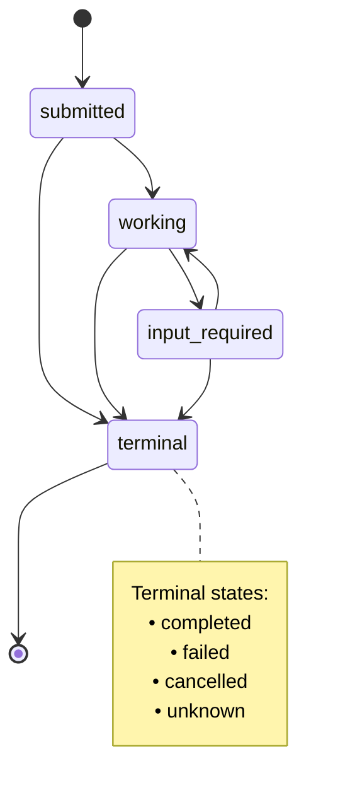
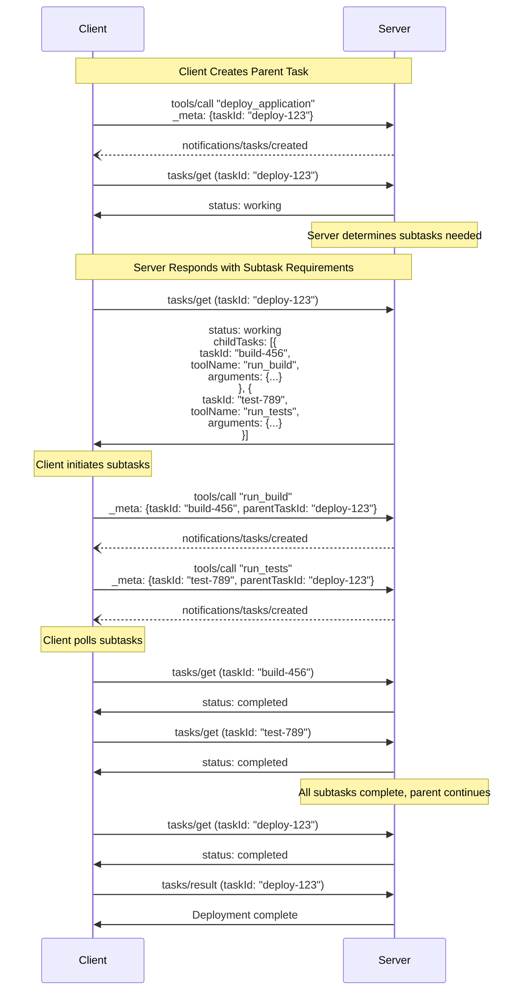

- **状态（Status）**: Final
- **类型（Type）**: Standards Track
- **创建时间（Created）**: 2025-10-20
- **作者（Author(s)）**: Surbhi Bansal, Luca Chang
- **Issue**: #1686

## 摘要（Abstract）

> 本 SEP 作为 `2025-11-25` 规范中发布的实验性任务特性的历史记录予以保留。下方的代码示例是针对 v1 SDK 编写的非规范性伪代码。draft 规范将任务移出核心协议并移入 `io.modelcontextprotocol/tasks` 扩展（[SEP-2663](./2663-tasks-extension.md)）。

本 SEP 改进了模型上下文协议（MCP）中对基于任务的工作流的支持。它引入了 **任务原语（task primitive）** 及其关联的 **任务 ID（task ID）**，后者可用于查询任务的状态与结果，直到任务完成后一段由服务器定义的时长内。该原语旨在增强其他请求（例如工具调用），为支持此原语的服务器在所有请求上启用先调用、后取回（call-now, fetch-later）的执行模式。

## 动机（Motivation）

当前的 MCP 规范支持执行一个请求并最终收到响应的工具调用，且工具调用可以被传入一个进度令牌以集成 MCP 的进度跟踪功能，使宿主应用能够经由通知接收工具调用的状态更新。然而，客户端无法显式请求工具调用的状态，导致存在这样的状态：工具调用可能已在服务器上被丢弃，而是否会有响应或通知到来尚属未知。同样，客户端也无法在工具调用完成后显式取回其结果——若结果被丢弃，客户端必须再次调用该工具，这对预期耗时数分钟或更久的工具而言是不可取的。这对于抽象既有工作流式 API 的 MCP 服务器尤为相关，例如 AWS Step Functions、Workflows for Google Cloud 或表示 CI/CD 流水线的 API 等应用。

如今，个别 MCP 服务器有可能以启用此模式的方式表示工具，但需要某些妥协。例如，某服务器可能暴露一个 `long_running_tool` 并希望支持此模式，将其拆分为三个独立工具以适应这一点：

1. `start_long_running_tool`：启动 `long_running_tool` 所表示的工作，并返回某种跟踪令牌，例如一个作业 ID。
2. `get_long_running_tool_status(token)`：接受跟踪令牌并返回工具调用的当前状态，告知调用方该操作仍在进行。
3. `get_long_running_tool_result(token)`：接受跟踪令牌并返回工具调用的结果（如果可用）。

以这种方式表示工具似乎能解决该用例，但它引入了一个新问题：工具通常被期望由一个 agent 编排，而 agent 驱动的轮询既不必要地昂贵又不一致——它依赖提示工程来引导 agent 去轮询。在原始的 `long_running_tool` 情形中，客户端无从知晓是否会收到响应；而在 `start_long_running_tool` 情形中，应用无从知晓 agent 是否会按照服务器的特定契约编排工具。

宿主应用也无法接管这种编排，因为这种工具拆分既是基于约定的，又可能在各 MCP 服务器间以不同方式实现——一个服务器可能为一个概念性操作设三个工具（如我们的示例），也可能在更复杂的多步操作情形下设更多。

另一方面，若不需要主动的任务轮询，既有 MCP 服务器可以在单个轮询结果的工具调用中完全包裹一个工作流 API，但这引入了一项不可取的实现成本：一个包裹既有工作流 API 的 MCP 服务器，是一个仅为轮询其他系统而存在的服务器。

**受影响的客户用例**
这些顾虑由 Amazon 在其内部及外部客户处见到的真实用例支撑（非公开处已隐去身份）：

**1. 医疗健康与生命科学数据分析**
**_挑战：_** Amazon 在医疗健康与生命科学行业的客户正尝试使用 MCP 包裹既有计算工具来分析分子性质并预测药物相互作用，每个作业同时通过多个推理模型处理来自化学库的数十万个数据点。这些复杂的多步工作流需要一种主动检查状态的方式，因为它们耗时长达数小时，使重试变得不可取。
**_当前变通办法：_** 尚未确定。
**_影响：_** 无法与实时研究工作流集成，妨碍交互式药物发现平台，并阻断自动化研究流水线。这些客户正在寻找工作流式工具调用的最佳实践，并指出 MCP 中缺乏一等支持是一个顾虑。若这些客户没有长时运行工具调用的解决方案，他们很可能放弃 MCP 而继续使用其既有平台。
**_理想：_** 并发且可轮询的工具调用，作为对执行时长在数分钟量级操作的答案，以及某种推送通知系统，以避免在数小时量级的长分析上阻塞其 agent。本 SEP 支持前一个用例，并提供了一个可扩展以支持后者的框架。

**2. 企业自动化平台**
**_挑战：_** Amazon 的大型企业客户希望开发内部 MCP 平台，以跨其组织自动化 SDLC 流程，延伸至销售、客户服务、法务、HR 与跨部门团队。他们指出其拥有长时运行的 agent 与 agent-工具交互，支持复杂的业务流程自动化。
**_当前变通办法：_** 尚未确定。正考虑一个由 webhook 支撑、位于 MCP 之外的应用级系统。
**_影响：_** 与宿主应用不知晓工具执行状态相关的局限性妨碍了复杂业务流程自动化，并限制了精巧的多步操作。这些客户希望并发派发流程并在稍后收集其结果，并指出缺乏显式的延后取回是一个顾虑——并正考虑将复杂的应用级通知系统作为可能的变通办法。
**_理想：_** 用于主动检查进行中工作状态的内建机制，以避免需要自行实现特定于其工具约定的通知系统。

**3. 代码迁移工作流**
**_挑战：_** Amazon 拥有自动化的代码迁移与转换工具，用于跨其自身代码库及外部客户代码库执行升级，并正尝试将这些工具包裹进 MCP 服务器。这些迁移会分析依赖、转换代码以避免已弃用的运行时特性，并跨多个仓库验证变更。这些迁移的耗时从数分钟到数小时不等，取决于迁移范围、复杂度与验证要求。
**_当前变通办法：_** 开发者通过将作业拆分为 `create` 与 `get` 工具来实现手动跟踪，迫使模型管理状态并反复轮询完成情况。
**_影响：_** 由于需要跨许多工具复制这种手写的轮询机制，开发者体验不佳。一个团队不得不调试一个问题：若模型未先列出作业名，它会臆造作业名。跨大型工具集中的许多工具验证这不会发生，既耗时又易错。
**_理想：_** 在数据层原生支持轮询工具状态，以支持将工具推到后台并避免阻塞聊天会话中的其他任务，同时仍支持确定性的轮询与结果取回。该团队需要在其 MCP 服务器的许多工具间采用同一模式，并希望有一个跨它们的通用解决方案，而本 SEP 直接支持这一点。

**4. 测试执行平台**
**_挑战：_** Amazon 的内部测试基础设施执行包含数千个用例、跨服务集成测试与性能基准的全面测试套件。他们已构建一个包裹此既有基础设施的 MCP 服务器。
**_当前变通办法：_** 对于流式传输测试日志，MCP 服务器暴露一个可读取某范围日志行的工具，因为它无法有效地在执行完成时通知客户端。对于执行测试运行，尚无任何变通办法。
**_影响：_** 无法在不使用单个耗时数小时的工具调用（会在客户端或服务器超时）的情况下，同时运行测试套件并流式传输其日志。这妨碍了 agent 在整个测试套件完成（可能数小时后）之前，查看未完成测试运行中的测试失败。
**_理想：_** 支持宿主应用驱动的工具轮询以获取中间结果，使客户端能在长时运行工具完成时得到通知。本 SEP 不完全支持此用例（它确实启用了轮询），但任务执行模型可以扩展以支持它，如 "未来工作" 一节所述。

**5. 深度研究（Deep Research）**
**_挑战：_** 深度研究工具派生多个研究 agent 来收集并总结关于主题的信息，在内部经历若干轮搜索与对话回合，为调用方应用生成最终结果。该工具执行耗时较长，且并非总能清楚工具是否仍在执行。
**_当前变通办法：_** 研究工具被拆分为一个单独的 `create` 工具来创建报告作业，以及一个 `get` 工具来稍后获取该作业的状态/结果。
**_影响：_** 在宿主应用中使用时，agent 有时会遇到反复调用 `get` 工具的问题——特别是，它会在结束对话回合前调用一次该工具，声称在再次调用该工具之前 "正在等待"。它在收到新的用户消息之前无法恢复。这还使过期时间复杂化，因为当这种情况发生时无法预测客户端何时会取回结果。可以通过为模型添加一个 `wait` 工具来变通，但这会妨碍模型并发地做任何其他事情。
**_理想：_** 以确定性方式支持轮询工具调用的状态，并在结果就绪时通知模型，使工具结果能被立即取回并从服务器删除。除通知模型（一项宿主应用顾虑）外，本 SEP 完全支持此用例。

**6. Agent 到 Agent 通信（多 Agent 系统）**
**_挑战：_** Amazon 用于客户问答的一个内部多 agent 系统面临这样的场景：agent 需要大量处理时间进行复杂推理、研究或分析。当 agent 通过 MCP 通信时，缓慢的 agent 会在整个系统中造成级联延迟，因为 agent 被迫等待其对等方完成工作。
**_当前变通办法：_** 尚未确定。
**_影响：_** 通信模式造成级联延迟，妨碍并行 agent 处理，并降低系统对其他时间敏感交互的响应性。
**_理想：_** 某种方法允许 agent 并发执行其他工作，并在长时运行任务完成后得到通知。本 SEP 通过使宿主应用能够为选定工具调用实现后台轮询而不阻塞 agent，来支持此用例。

这些用例表明，一种主动跟踪工具调用并延后结果的机制，对于生产环境中这些类型的 MCP 部署而言是一项真实需求。

**与既有架构的集成**
许多工作流驱动的系统已经提供了带内建状态元数据、监控与数据保留策略的主动执行跟踪能力。本提案使 MCP 服务器能够以轻薄的 MCP 包装器暴露这些既有 API，同时保持其既有可靠性。

**对既有架构的益处：**

- **利用既有状态管理：** AWS Step Functions、Workflows for Google Cloud 与 CI/CD 平台等系统已经维护执行状态、日志与结果。MCP 服务器可以暴露这些系统的既有 API，而无需将轮询责任推给易出错的 agent。
- **保留原生监控：** 既有的监控、告警与可观测性工具继续原样工作。执行几乎完全发生在既有的工作流管理系统内。
- **降低实现开销：** 服务器实现者无需构建新的状态管理、持久化或监控基础设施。他们可以专注于将其既有 API 映射到任务的 MCP 协议层面。

本 SEP 简化了与既有工作流的集成，并允许工作流服务继续管理自身状态，同时交付优质的客户体验，而非卸载给 agent 轮询或构建只会轮询其他服务的 MCP 服务器。

## 规范（Specification）

本 SEP 引入一种机制，让请求方（可以是客户端或服务器，取决于通信方向）用 **任务（tasks）** 增强其请求。任务是持久的状态机，携带关于它们所包裹请求底层执行状态的信息，旨在用于请求方轮询和延迟的结果取回。每个任务由请求方生成的 **任务 ID（task ID）** 唯一标识。

### 1. 用户交互模型

任务被设计为 **应用驱动的（application-driven）**——接收方严格控制哪些请求（如果有的话）支持基于任务的执行，并管理这些任务的生命周期；与此同时，请求方承担用任务增强请求、以及轮询这些任务结果的责任。

实现可以自由地通过任何适合其需要的界面模式暴露任务——协议本身并不强制任何特定的用户交互模型。

### 2. 能力（Capabilities）

支持任务增强请求的服务器与客户端 **必须（MUST）** 在初始化期间声明 `tasks` 能力。`tasks` 能力按请求类别结构化，以布尔属性指示哪些特定请求类型支持任务增强。

详情参阅 https://github.com/modelcontextprotocol/modelcontextprotocol/pull/1732。

### 3. 协议消息

#### 3.1. 创建任务

为创建任务，请求方发送一个在 `_meta` 中包含 `modelcontextprotocol.io/task` 键的请求，其 `taskId` 值表示任务 ID。请求方 **可以（MAY）** 包含一个 `keepAlive`，其值表示请求方希望在完成后将任务结果保留多久。

**请求：**

```json
{
  "jsonrpc": "2.0",
  "id": 1,
  "method": "some_method",
  "params": {
    "_meta": {
      "modelcontextprotocol.io/task": {
        "taskId": "786512e2-9e0d-44bd-8f29-789f320fe840",
        "keepAlive": 60000
      }
    }
  }
}
```

#### 3.2. 获取任务

为取回任务状态，请求方发送一个 `tasks/get` 请求：

**请求：**

```json
{
  "jsonrpc": "2.0",
  "id": 3,
  "method": "tasks/get",
  "params": {
    "taskId": "786512e2-9e0d-44bd-8f29-789f320fe840",
    "_meta": {
      "modelcontextprotocol.io/related-task": {
        "taskId": "786512e2-9e0d-44bd-8f29-789f320fe840"
      }
    }
  }
}
```

**响应：**

```json
{
  "jsonrpc": "2.0",
  "id": 3,
  "result": {
    "taskId": "786512e2-9e0d-44bd-8f29-789f320fe840",
    "keepAlive": 30000,
    "pollFrequency": 5000,
    "status": "submitted",
    "_meta": {
      "modelcontextprotocol.io/related-task": {
        "taskId": "786512e2-9e0d-44bd-8f29-789f320fe840"
      }
    }
  }
}
```

#### 3.3. 取回任务结果

为取回已完成任务的结果，请求方发送一个 `tasks/result` 请求：

**请求：**

```json
{
  "jsonrpc": "2.0",
  "id": 4,
  "method": "tasks/result",
  "params": {
    "taskId": "786512e2-9e0d-44bd-8f29-789f320fe840",
    "_meta": {
      "modelcontextprotocol.io/related-task": {
        "taskId": "786512e2-9e0d-44bd-8f29-789f320fe840"
      }
    }
  }
}
```

**响应：**

```json
{
  "jsonrpc": "2.0",
  "id": 4,
  "result": {
    "content": [
      {
        "type": "text",
        "text": "Current weather in New York:\nTemperature: 72°F\nConditions: Partly cloudy"
      }
    ],
    "isError": false,
    "_meta": {
      "modelcontextprotocol.io/related-task": {
        "taskId": "786512e2-9e0d-44bd-8f29-789f320fe840"
      }
    }
  }
}
```

#### 3.4. 任务创建通知

当接收方创建一个任务时，它 **必须（MUST）** 发送一个 `notifications/tasks/created` 通知，告知请求方任务已创建且可以开始轮询。

**通知：**

```json
{
  "jsonrpc": "2.0",
  "method": "notifications/tasks/created",
  "params": {
    "_meta": {
      "modelcontextprotocol.io/related-task": {
        "taskId": "786512e2-9e0d-44bd-8f29-789f320fe840"
      }
    }
  }
}
```

任务 ID 通过 `modelcontextprotocol.io/related-task` 元数据键传达。通知参数在其余方面为空。

此通知解决了请求方可能在接收方尚未完成创建任务之前就尝试轮询的竞态条件。通过在任务创建后立即发送此通知，接收方表明任务已就绪，可经由 `tasks/get` 查询。

不支持任务的接收方（因而忽略请求中的任务元数据）不会发送此通知，允许请求方回退到等待原始请求响应。

#### 3.5. 列出任务

为取回任务列表，请求方发送一个 `tasks/list` 请求。此操作支持分页。

**请求：**

```json
{
  "jsonrpc": "2.0",
  "id": 5,
  "method": "tasks/list",
  "params": {
    "cursor": "optional-cursor-value"
  }
}
```

**响应：**

```json
{
  "jsonrpc": "2.0",
  "id": 5,
  "result": {
    "tasks": [
      {
        "taskId": "786512e2-9e0d-44bd-8f29-789f320fe840",
        "status": "working",
        "keepAlive": 30000,
        "pollFrequency": 5000
      },
      {
        "taskId": "abc123-def456-ghi789",
        "status": "completed",
        "keepAlive": 60000
      }
    ],
    "nextCursor": "next-page-cursor"
  }
}
```

#### 3.6 删除任务

为显式删除一个任务及其关联结果，请求方发送一个 `tasks/delete` 请求。

**请求：**

```json
{
  "jsonrpc": "2.0",
  "id": 6,
  "method": "tasks/delete",
  "params": {
    "taskId": "786512e2-9e0d-44bd-8f29-789f320fe840",
    "_meta": {
      "modelcontextprotocol.io/related-task": {
        "taskId": "786512e2-9e0d-44bd-8f29-789f320fe840"
      }
    }
  }
}
```

**响应：**

```json
{
  "jsonrpc": "2.0",
  "id": 6,
  "result": {
    "_meta": {
      "modelcontextprotocol.io/related-task": {
        "taskId": "786512e2-9e0d-44bd-8f29-789f320fe840"
      }
    }
  }
}
```

### 4. 行为要求

这些要求适用于所有支持接收任务增强请求的各方。

#### 4.1. 任务支持与处理

1. 不支持对某请求进行任务增强的接收方 **必须（MUST）** 正常处理该请求，忽略 `_meta` 中的任何任务元数据。
2. 支持任务增强的接收方 **可以（MAY）** 选择哪些请求类型支持任务。

#### 4.2. 任务 ID 要求

1. 任务 ID **必须（MUST）** 是一个字符串值。
2. 任务 ID **应当（SHOULD）** 在接收方控制的所有任务间唯一。
3. 收到 `_meta` 中带任务 ID 请求的接收方 **可以（MAY）** 校验所提供的任务 ID 尚未与该接收方控制的某任务关联。

#### 4.3. 任务状态生命周期

1. 任务在创建时 **必须（MUST）** 以 `submitted` 状态开始。
2. 接收方 **必须（MUST）** 仅通过以下有效路径转换任务：
   1. 从 `submitted`：可移至 `working`、`input_required`、`completed`、`failed`、`cancelled` 或 `unknown`
   2. 从 `working`：可移至 `input_required`、`completed`、`failed`、`cancelled` 或 `unknown`
   3. 从 `input_required`：可移至 `working`、`completed`、`failed`、`cancelled` 或 `unknown`
   4. 处于 `completed`、`failed`、`cancelled` 或 `unknown` 状态的任务 **必须不（MUST NOT）** 转换到任何其他状态（终态）
3. 若执行立即完成，接收方 **可以（MAY）** 直接从 `submitted` 移至 `completed`。
4. `unknown` 状态是用于意料之外错误状况的终态兜底。接收方在可能时 **应当（SHOULD）** 改用带错误消息的 `failed`。

**任务状态状态图：**



#### 4.4. Input Required 状态

1. 当接收方发送与某任务关联的请求（例如征询、采样）时，接收方 **必须（MUST）** 将任务移至 `input_required` 状态。
2. 接收方 **必须（MUST）** 在该请求中包含 `modelcontextprotocol.io/related-task` 元数据以将其与任务关联。
3. 当接收方收到所有必需响应时，任务 **可以（MAY）** 转换出 `input_required` 状态（通常回到 `working`）。
4. 若有多个相关请求待定，任务 **应当（SHOULD）** 保持在 `input_required` 状态，直到全部解决。

#### 4.5. Keep-Alive 与资源管理

1. 接收方 **可以（MAY）** 覆盖所请求的 `keepAlive` 时长。
2. 接收方 **必须（MUST）** 在 `tasks/get` 响应中包含实际的 `keepAlive` 时长（或 `null` 表示无限）。
3. 在任务达到终态（`completed`、`failed` 或 `cancelled`）且其 `keepAlive` 时长已过去后，接收方 **可以（MAY）** 删除该任务及其结果。
4. 接收方 **可以（MAY）** 在 `tasks/get` 响应中包含一个 `pollFrequency` 值（以毫秒计）以建议轮询间隔。请求方在提供时 **应当（SHOULD）** 尊重该值。

#### 4.6. 结果取回

1. 接收方 **必须（MUST）** 仅在任务状态为 `completed` 时从 `tasks/result` 返回结果。
2. 若对处于任何其他状态的任务调用 `tasks/result`，接收方 **必须（MUST）** 返回错误。
3. 请求方 **可以（MAY）** 在同一任务仍可用期间对其多次调用 `tasks/result`。

#### 4.7. 关联任务相关消息

1. 与某任务相关的所有请求、通知与响应 **必须（MUST）** 在其 `_meta` 中包含 `modelcontextprotocol.io/related-task` 键，其值设为一个 `taskId` 与关联任务 ID 匹配的对象。
2. 例如，一个任务增强工具调用所依赖的征询 **必须（MUST）** 与该工具调用的任务共享相同的相关任务 ID。

#### 4.8. 任务取消

1. 当接收方收到针对某任务增强请求的 JSON-RPC 请求 ID 的 `notifications/cancelled` 通知时，接收方 **应当（SHOULD）** 立即将任务移至 `cancelled` 状态并停止与该任务关联的所有处理。
2. 由于通知的异步性质，接收方 **可以（MAY）** 不会即时取消任务处理。接收方 **应当（SHOULD）** 尽力尝试尽快停止执行。
3. 若 `notifications/cancelled` 通知在任务已达到终态（`completed`、`failed`、`cancelled` 或 `unknown`）之后到达，接收方 **应当（SHOULD）** 忽略该通知。
4. 在任务达到 `cancelled` 状态且其 `keepAlive` 时长已过去后，接收方 **可以（MAY）** 删除该任务及其元数据。
5. 请求方 **可以（MAY）** 在任务执行期间的任意时刻发送 `notifications/cancelled`，包括任务处于 `input_required` 状态时。若任务在 `input_required` 状态时被取消，接收方 **应当（SHOULD）** 同时无视对关联请求的任何待定响应。
6. 由于通知不提供接收确认，请求方在发送取消通知后 **应当（SHOULD）** 继续以 `tasks/get` 轮询，以确认任务已转换到 `cancelled` 状态。若任务在合理时间范围内未转换到 `cancelled`，请求方 **可以（MAY）** 假定取消未被处理。

#### 4.9. 任务列表

1. 接收方 **应当（SHOULD）** 使用基于游标的分页来限制单个响应中返回的任务数量。
2. 若有更多任务可用，接收方 **必须（MUST）** 在响应中包含一个 `nextCursor`。
3. 请求方 **必须（MUST）** 将游标视为不透明令牌，不尝试解析或修改它们。
4. 若某任务对某请求方可经由 `tasks/get` 取回，则它 **必须（MUST）** 对该请求方可经由 `tasks/list` 取回。

#### 4.10 任务删除

1. 接收方 **可以（MAY）** 自行裁量接受或拒绝对任何任务的删除请求。
1. 若接收方接受删除请求，它 **应当（SHOULD）** 删除该任务及所有关联结果与元数据。
1. 接收方 **可以（MAY）** 选择根本不支持删除，或仅支持删除处于某些状态的任务（例如仅终态）。
1. 请求方 **应当（SHOULD）** 及时删除含敏感数据的任务，而非仅依赖 `keepAlive` 过期进行清理。

### 5. 消息流程

https://github.com/modelcontextprotocol/modelcontextprotocol/issues/1686#issuecomment-3452378176

### 6. 数据类型

#### Task

一个任务表示一个请求的执行状态。任务元数据包括：

- `taskId`：任务的唯一标识符
- `keepAlive`：完成后结果将保持可用的时间（毫秒）
- `pollFrequency`：建议的状态检查间隔（毫秒）
- `status`：任务执行的当前状态

#### Task Status

任务可以处于以下状态之一：

- `submitted`：请求已被接收并排队等待执行
- `working`：请求当前正在被处理
- `input_required`：请求正在等待来自请求方的额外输入
- `completed`：请求成功完成且结果可用
- `failed`：任务生命周期本身遇到了一个与关联请求逻辑无关的错误
- `cancelled`：请求在完成前被取消
- `unknown`：当接收方无法确定实际任务状态时，用于意料之外错误状况的终态兜底

#### Task Metadata

当用任务执行增强请求时，`modelcontextprotocol.io/task` 键被包含在 `_meta` 中：

```json
{
  "modelcontextprotocol.io/task": {
    "taskId": "786512e2-9e0d-44bd-8f29-789f320fe840",
    "keepAlive": 60000
  }
}
```

字段：

- `taskId`（string，必需）：客户端生成的任务唯一标识符
- `keepAlive`（number，可选）：完成后保留结果的请求时长（毫秒）

#### Task Creation Notification

当接收方创建一个任务时，它发送一个 `notifications/tasks/created` 通知以示意任务已就绪可轮询。该通知具有空 params，任务 ID 通过 `modelcontextprotocol.io/related-task` 元数据键传达：

```json
{
  "jsonrpc": "2.0",
  "method": "notifications/tasks/created",
  "params": {
    "_meta": {
      "modelcontextprotocol.io/related-task": {
        "taskId": "786512e2-9e0d-44bd-8f29-789f320fe840"
      }
    }
  }
}
```

此通知使请求方能够开始轮询，而不会遭遇任务可能尚不存在于接收方的竞态条件。

#### Task Get Request

`tasks/get` 请求取回任务的当前状态：

```typescript
{
  taskId: string; // The task identifier to query
}
```

#### Task Get Response

`tasks/get` 响应包括：

```typescript
{
  taskId: string; // The task identifier
  status: TaskStatus; // Current task state
  keepAlive: number | null; // Actual retention duration in milliseconds, null for unlimited
  pollFrequency?: number; // Suggested polling interval in milliseconds
  error?: string; // Error message if status is "failed"
}
```

#### Task Result Request

`tasks/result` 请求取回已完成任务的结果：

```typescript
{
  taskId: string; // The task identifier to retrieve results for
}
```

#### Task Result Response

`tasks/result` 响应返回该请求本会返回的原始结果：

```typescript
{
  // The structure matches the result type of the original request
  // For example, a tools/call task would return CallToolResult structure
  [key: string]: unknown;
}
```

结果结构取决于原始请求类型。接收方返回的结果结构与该请求在未经任务增强执行时本会返回的相同。

#### Task List Request

`tasks/list` 请求取回任务列表：

```typescript
{
  cursor?: string; // Optional cursor for pagination
}
```

#### Task List Response

`tasks/list` 响应包括：

```typescript
{
  tasks: Array<{
    taskId: string;           // The task identifier
    status: TaskStatus;       // Current task state
    keepAlive: number | null; // Retention duration in milliseconds, null for unlimited
    pollFrequency?: number;   // Suggested polling interval in milliseconds
    error?: string;           // Error message if status is "failed"
  }>;
  nextCursor?: string;        // Cursor for next page, absent if no more results
}
```

#### Related Task Metadata

与某任务关联的所有请求、响应与通知 **必须（MUST）** 在 `_meta` 中包含 `modelcontextprotocol.io/related-task` 键：

```json
{
  "modelcontextprotocol.io/related-task": {
    "taskId": "786512e2-9e0d-44bd-8f29-789f320fe840"
  }
}
```

这在整个请求生命周期内将消息与其起源任务关联。

### 7. 错误处理

任务使用两种错误报告机制：

1. **协议错误（Protocol Errors）**：用于协议级问题的标准 JSON-RPC 错误
2. **任务执行错误（Task Execution Errors）**：底层请求执行中的错误，通过任务状态报告

#### 7.1. 协议错误

接收方 **必须（MUST）** 为以下协议错误情形返回标准 JSON-RPC 错误：

- `tasks/get`、`tasks/list` 或 `tasks/result` 中无效或不存在的 `taskId`：`-32602`（Invalid params）
- `tasks/list` 中无效或不存在的游标：`-32602`（Invalid params）
- 带有已用于另一任务的 `taskId` 的请求（若接收方校验任务 ID 唯一性）：`-32602`（Invalid params）
- 在任务不处于 `completed` 状态时尝试取回结果：`-32602`（Invalid params）
- 内部错误：`-32603`（Internal error）

接收方 **应当（SHOULD）** 提供信息丰富的错误消息来描述错误原因。

**示例：任务未找到**

```json
{
  "jsonrpc": "2.0",
  "id": 70,
  "error": {
    "code": -32602,
    "message": "Failed to retrieve task: Task not found"
  }
}
```

**示例：任务已过期**

```json
{
  "jsonrpc": "2.0",
  "id": 71,
  "error": {
    "code": -32602,
    "message": "Failed to retrieve task: Task has expired"
  }
}
```

> 注意：接收方没有义务无限期保留任务元数据。若接收方已清除一个过期任务，它返回一个 "未找到" 错误是符合规范的行为。

**示例：对未完成任务请求结果**

```json
{
  "jsonrpc": "2.0",
  "id": 72,
  "error": {
    "code": -32602,
    "message": "Cannot retrieve result: Task status is 'working', not 'completed'"
  }
}
```

**示例：重复的任务 ID（若接收方校验唯一性）**

```json
{
  "jsonrpc": "2.0",
  "id": 73,
  "error": {
    "code": -32602,
    "message": "Task ID already exists: 786512e2-9e0d-44bd-8f29-789f320fe840"
  }
}
```

#### 7.2. 任务执行错误

当底层请求在执行期间失败时，任务移至 `failed` 状态。`tasks/get` 响应 **应当（SHOULD）** 包含一个带失败详情的 `error` 字段：

```typescript
{
  taskId: string;
  status: "failed";
  keepAlive: number | null;
  pollFrequency?: number;
  error?: string;  // Description of what went wrong
}
```

**示例：带执行错误的任务**

```json
{
  "jsonrpc": "2.0",
  "id": 4,
  "result": {
    "taskId": "786512e2-9e0d-44bd-8f29-789f320fe840",
    "status": "failed",
    "keepAlive": 30000,
    "error": "Tool execution failed: API rate limit exceeded"
  }
}
```

对于包裹自身带错误语义请求的任务（例如带 `isError: true` 的 `tools/call`），任务仍应达到 `completed` 状态，错误信息通过原始请求类型的结果结构传达。

### 8. 安全考量

#### 8.1. 任务隔离与访问控制

1. 接收方 **应当（SHOULD）** 对任务 ID 作用域化以防止未授权访问：
   1. 将任务绑定到创建它们的会话（若支持会话）
   2. 将任务绑定到认证上下文（若使用认证）
   3. 拒绝来自不同会话或认证上下文的任务的 `tasks/get`、`tasks/list` 或 `tasks/result` 请求
2. 不实现会话或认证绑定的接收方 **应当（SHOULD）** 清楚地记录此局限性，因为任务结果可能可被任何能猜出任务 ID 的请求方访问。
3. 接收方 **应当（SHOULD）** 对以下各项实施限流：
   1. 任务创建，以防止资源耗尽
   2. 任务状态轮询，以防止拒绝服务
   3. 任务结果取回尝试
   4. 任务列表请求，以防止拒绝服务

#### 8.2. 资源管理

> 警告：任务结果可能比原始请求执行时间持续更久。对于敏感操作，请求方应仔细考虑延长结果保留的安全影响，并可能希望及时取回结果并请求更短的 `keepAlive` 时长。

1. 接收方 **应当（SHOULD）**：
   1. 强制执行每个请求方的并发任务限制
   2. 强制执行最大 `keepAlive` 时长以防止无限期的资源保留
   3. 及时清理过期任务以释放资源
2. 接收方 **应当（SHOULD）**：
   1. 记录所支持的最大 `keepAlive` 时长
   2. 记录每个请求方的最大并发任务数
   3. 为资源使用实现监控与告警

#### 8.3. 审计与日志

1. 接收方 **应当（SHOULD）**：
   1. 为审计目的记录任务创建、完成与取回事件
   2. 在可用时将会话/认证上下文纳入日志
   3. 监控可疑模式（例如大量失败的任务查找、过度轮询）
2. 请求方 **应当（SHOULD）**：
   1. 为调试与审计目的记录任务生命周期事件
   2. 跟踪任务 ID 及其关联操作

## 理由（Rationale）

### 设计决策：通用任务原语

将任务实现为一种通用的请求增强机制（而非工具专属或方法专属）的决策，是为了最大化协议的简单性与灵活性。

任务被设计为可与 MCP 协议中的任何请求类型协作，而不仅仅是工具调用。这意味着 `resources/read`、`prompts/get`、`sampling/createMessage` 以及任何未来的请求类型都可以被任务元数据增强。相较于工具专属设计，此方式提供了显著益处。

从协议角度看，此设计消除了为每种请求类型设计单独任务实现的需要。无需为工具对资源对提示定义不同的异步模式，一套单一的任务管理方法（`tasks/get` 和 `tasks/result`）就能在所有请求类型间统一工作。这种统一性降低了实现者的认知负担，并为使用该协议的应用创造了一致的体验。

通用设计还提供了实现灵活性。服务器可以选择哪些请求支持任务增强，而无需协议变更或版本协商。若服务器不为某特定请求类型支持任务，它只需忽略任务元数据并正常处理请求。这允许服务器增量地为请求添加任务支持，从高价值操作开始，并随时间基于实际使用模式扩展。

在架构上，任务被视为元数据而非一种单独的执行模型。它们增强既有请求而非取代它们。原始的请求/响应流程保持完好——请求最终仍会得到响应。任务只是提供了一种额外的基于轮询的结果取回机制。此设计确保相关消息（例如任务执行期间的征询）可经由 `modelcontextprotocol.io/related-task` 元数据键一致地关联，无论底层请求类型如何。

### 设计决策：基于元数据的增强

选择使用 `_meta` 而非专用请求参数来承载任务信息，是为了在请求语义与执行跟踪之间保持清晰的关注点分离。

任务信息从根本上与请求语义正交。任务 ID 与 keepAlive 时长不影响请求做什么——它们只影响结果如何被取回与保留。`tools/call` 请求无论是否包含任务元数据都执行相同的操作。任务元数据只是提供了一种访问结果的替代机制。

通过将任务信息置于 `_meta`，我们在 "执行什么"（请求参数）与 "如何跟踪执行"（任务元数据）之间创造了清晰的架构边界。此边界使实现者更易推理协议。请求参数定义所执行的操作，而元数据提供进度跟踪、任务管理等正交关注点及其他与执行相关的信息。

此方式还提供了自然的向后兼容性。不支持任务的服务器可以忽略 `_meta` 内容而不破坏请求处理。请求参数保持有效且完整，故操作能正常进行。这意味着无需协议版本协商——新功能纯粹是附加的且非破坏性的。

SDK 可以在保持关注点分离的同时，为任务原语提供符合人体工学的抽象，例如：

```typescript
// === MCP SDK (Pseudocode based loosely on modelcontextprotocol/typescript-sdk) ===

/**
 * NEW: A request that resolves to a result, either directly or by polling a task.
 */
class PendingRequest<TResult> {
  constructor(readonly protocol: Protocol, readonly result: Promise<TResult>, readonly taskId?: string) {}

  /**
   * Waits for a result, calling onTaskStatus if provided and a task was created.
   */
  async result({ onTaskStatus }): Promise<TResult> => {
    if (!onTaskStatus || !this.taskId) {
      // No task listener or task ID provided, just block for the result
      return await result;
    }

    // Whichever is successful first (or a failure if all fail) is returned.
    return Promise.any([
      result, // Blocks for result
      (async () => {
        // Blocks for a notifications/tasks/created with the provided task ID
        await this.protocol.waitForTask(this.taskId);
        return await taskHandler(this.taskId);
      })(),
    ]);
  }

  /**
   * Encapsulates polling for a result, calling onTaskStatus after querying the task.
   */
  private async taskHandler({ onTaskStatus }): Promise<TResult> => {
    // Poll for completion
    let task: Task;
    do {
      task = await this.protocol.getTask(this.taskId);
      await onTaskStatus(task);
      await sleep(task.pollFrequency ?? DEFAULT_POLLING_INTERNAL);
    } while (!task.isTerminal());

    // Process result
    return await this.protocol.getTaskResult(this.taskId);
  }
}

/**
 * Simplified/partial client session implementation for illustration purposes.
 * Extends a base class it shares with the server.
 */
class Client extends Protocol {
  /**
   * Existing request method, but with most implementation refactored to beginCallTool
   */
  async callTool<TResult>(
    params: CallToolRequest['params'],
    resultSchema: Schema<TResult>,
  ) {
    // Existing request methods can be changed to reuse new methods exposed for
    // separating request/response flows.
    const request = await this.beginCallTool(params, resultSchema);
    return request.result();
  }

  /**
   * NEW: Low-level method that starts a tool call and returns a PendingRequest
   * object for more granular control.
   */
  async beginCallTool<TResult>(
    params: CallToolRequest['params'],
    resultSchema: Schema<TResult>,
  ) {
    const request = await this.beginRequest({ method: 'tools/call', params }, resultSchema, options);
    return request;
  }
}

// === HOST APPLICATION ===

// Begin a tool call with task support
const pending: PendingRequest<CallToolResult> = await client.beginCallTool(
  {
    name: "analyze_dataset",
    arguments: { dataset: "large_file.csv" },
  },
  CallToolResultSchema,
  {
    keepAlive: 3600000,
  },
);

// Client code can assume tasks are supported, and the fallback case can be handled internally
const result = await pending.result({
  onTaskStatus: async (task) => {
    await sendLatestStateSomewhere(task);
  },
});
```

由于该设计不改变基本的请求语义，既有形式也将继续工作：

```typescript
const result = await client.callTool(
  {
    name: "analyze_dataset",
    arguments: { dataset: "large_file.csv" },
  },
  CallToolResultSchema,
);
```

### 设计决策：客户端生成的任务 ID

选择让客户端生成任务 ID 而非让服务器分配，提供了若干关键益处：

**幂等性与容错：**
首要益处是启用幂等的任务创建。当客户端生成任务 ID 时，它可以在未收到响应时安全地重试任务增强请求，因为知道服务器会识别出重复的任务 ID 并返回错误。这对于在不可靠网络上的可靠运行至关重要：

- 若请求超时，客户端可以安全重试而不创建重复任务
- 若连接在响应到达前断开，客户端可以重连并重试
- 服务器校验任务 ID 唯一性并为重复项返回错误，确认任务是否已创建

使用服务器生成的任务 ID 时，超时或连接故障会造成不确定性——客户端不知道任务是否已创建，且没有安全的重试方式而不致潜在地创建重复任务。

**对客户端的简单性：**
客户端生成的任务 ID 通过消除将初始响应与任务标识符关联的需要，简化了客户端实现。客户端可以立即使用它生成的任务 ID 开始轮询任务状态，而无需解析响应以提取服务器分配的标识符。这对于客户端可能希望在响应到达前就存储任务 ID 的异步编程模型尤为有价值。

**对服务器的权衡：**
主要权衡是，用自身任务标识符包裹既有工作流系统的服务器通常将通过在客户端提供的任务 ID 与底层系统标识符之间维护一个映射来处理这一点。例如，一个包裹 AWS Step Functions 的 MCP 服务器可能收到一个像 `"client-abc-123"` 的客户端生成任务 ID，并需要跟踪它对应于 Step Functions 执行 ARN `"arn:aws:states:...:exec-xyz"`。

这需要：

- 用于任务 ID 映射的持久存储（通常是简单的键值存储）
- 在任务的 keepAlive 时长内维护该映射
- 为任务状态与结果取回处理映射查找

然而，相较于将既有工作流系统集成进 MCP 的整体工作，此复杂度通常较小。大多数工作流系统已经需要状态管理来跟踪执行，维护任务 ID 映射是一项直接的补充。映射结构简单（客户端任务 ID 映射到一个内部标识符），并可使用此类服务器可能已为其他状态管理使用的既有数据库或键值存储实现。

### 设计决策：任务创建通知

决定使用 `notifications/tasks/created` 通知而非改变响应语义（如 #1391 所提议）承认了任务创建的异步性质，并启用了基于任务的轮询与传统请求/响应流程之间的高效竞态模式。

当服务器创建一个任务时，它必须向客户端示意任务已就绪可轮询。至少有两种可能的方式：(1) 初始请求可以带任务元数据同步返回，或 (2) 服务器可以发送通知。本提案出于若干关键原因使用通知：

1. 通知启用了 fire-and-forget 的请求处理。服务器可以接受请求、开始处理它，并在任务创建后发送通知，而无需阻塞初始的请求/响应周期。这对于将工作派发给后台系统或队列的服务器尤为重要——它们可以立即确认请求，并在后台系统确认任务创建后发送通知。
2. 通知支持启用优雅降级的竞态模式。客户端可以在等待原始请求响应与等待 `notifications/tasks/created` 通知之间竞态。若服务器不支持任务，则没有通知到来，原始响应胜出。若服务器支持任务，通知通常先到（或近乎同时），启用轮询开始。同步响应将迫使客户端在知道是否要轮询之前等待响应。
3. 通知避免了与既有协议语义的歧义。若初始请求响应包含任务元数据、客户端随后轮询结果，它会改变既有通知类型的隐含含义：
   1. **进度通知**：当前 MCP 规范要求进度通知引用 "与进行中操作关联" 的令牌。虽然 "操作" 未被正式定义，但隐含理解是一个操作由一对请求/响应界定——进度通知在响应发送时停止。若有一个包含任务元数据的同步响应，进度通知将需要在任务执行期间继续，把 "操作" 的隐含含义扩展到包括比原始请求/响应周期存活更久的异步任务。基于通知的方式通过让进度通知保持与初始请求生命周期绑定来避免这种语义扩展，而未来基于任务的进度可经由 `modelcontextprotocol.io/related-task` 元数据干净地关联。我们建议未来的 SEP 在进度规范中澄清 "操作" 的定义。
   2. **取消语义**：采用基于通知的方式，`notifications/cancelled` 清晰地针对原始请求 ID，并使关联任务移至 `cancelled` 状态，在请求取消与任务生命周期管理之间保持清晰分离。

虽然规范要求创建任务的服务器发送该通知，但存在它可能不可用的边界情形：

- **无流支持的 sHTTP**：在客户端或服务器不支持 SSE 流的环境中，无法投递通知。在此类情形下，客户端可以选择用指数退避主动轮询 `tasks/get`，尽管这是非标准的，且若服务器不支持任务可能导致不必要的轮询尝试。
- **降级连接场景**：若通知在传输中丢失，客户端应实现合理的超时行为并回退到原始响应。

标准且推荐的方式是在开始轮询前等待 `notifications/tasks/created` 通知。不等待通知的主动轮询应仅被视为受限环境的回退机制。

### 设计决策：无能力声明

与工具、资源、提示等其他协议特性不同，任务不需要能力协商。此决策是为了启用优雅降级与按请求的灵活性。

任务支持可以通过使用而非通过显式的能力声明隐式确定。当客户端发送一个任务增强请求时，服务器将按其能力处理它。若服务器不为该请求类型支持任务，它只需忽略任务元数据并通过原始请求/响应流程正常返回结果。客户端随后可以通过尝试调用 `tasks/get` 并处理由此产生的任何错误来检测任务支持的缺失。

此方式消除了复杂握手或特性检测协议的需要。客户端可以乐观地尝试任务增强，并在需要时优雅地回退到直接响应处理。这使协议更具韧性且更易实现。

此外，此设计提供了通过能力难以表达的按请求灵活性。服务器可能在某些请求类型上支持任务而在其他上不支持，或支持可能基于资源可用性或负载等运行时条件而变化。要求按请求类型的细粒度能力声明将显著使协议复杂化而不提供实质益处。隐式检测模型更简单且更灵活。

### 考虑过的备选设计

**工具专属的异步执行：**
本提案的一个较早版本（#1391）专门聚焦工具调用，在工具定义上引入一个 `invocationMode` 字段以将工具标记为支持同步、异步或两种执行模式。此方式本会向工具调用请求与响应结构添加专用字段，并带有服务端能力声明以指示对异步工具执行的支持。

虽然此设计本会满足长时运行工具调用的即时需要，但出于若干原因，它被更通用的任务原语取代而遭否决。首先，它人为地将异步执行模式限制在工具上，而其他请求类型有类似需要。资源读取可能昂贵，提示可能需要复杂处理，采样请求可能涉及冗长的用户交互。为每种请求类型创建单独的异步模式将导致协议碎片化与不一致的实现模式。

其次，工具专属方式需要更复杂的能力协商与版本处理。服务器将需要基于客户端能力过滤工具列表，SDK 将需要为同步对异步工具管理不同的调用模式。此复杂度会波及实现栈的每一层。

最后，工具专属设计未能满足跨所有 MCP 请求类型进行延后结果取回这一更广泛的架构需要。通过泛化为一个增强任何请求的任务原语，本提案提供了一个可在协议间统一应用的一致模式。更重要的是，此基础可扩展到子任务等未来协议消息与特性，使其成为协议演进的更合适构件。

**传输层方案：**
一种备选方式是纯粹在传输层解决此问题，而不引入新的数据层原语。若干提案（#1335、#1442、#1597）解决了连接韧性、请求重试语义与 sHTTP 流管理等传输专属顾虑。这些是有价值的改进，能够缓解与可能耗时较长完成的请求相关的许多扩展性与可靠性挑战。

然而，仅靠传输层方案对本 SEP 所解决的用例是不充分的。即便有完美的传输层可靠性，仍存在若干数据层顾虑：

首先，服务器与客户端需要一种沟通执行模式预期的方式。没有这一点，宿主应用无法就 UX 模式做出知情决策——它们应阻塞、显示加载指示器，还是允许用户继续工作？单凭一个注解能示意请求可能耗时较长，但不提供主动检查状态或稍后取回结果的机制。

其次，传输层方案无法提供对仍在进行请求执行状态的可见性。若请求停止发送进度通知，客户端无法区分 "服务器正在做昂贵的工作" 与 "请求已丢失"。传输级重试能确认连接存活，但无法回答 "这个特定请求是否仍在执行？" 这种可见性对于用户需要确信其工作正在推进的操作至关重要。

第三，不同传输将需要不同机制来应对这些顾虑。sHTTP 提案调整流管理与重试语义以满足这些要求，但 stdio 没有等价的扩展点。这造成了传输专属的碎片化，实现者必须根据其传输选择以不同方式解决同样的问题。数据层操作在所有传输间提供一致语义。

最后，延后结果取回与主动状态检查是仅靠传输改进无法解决的数据层顾虑。多次取回结果、指定保留时长与处理清理的能力，与底层消息如何投递正交。

**基于资源的方式：**
另一种可能的方式是利用既有的 MCP 资源来跟踪长时运行操作。例如，工具可以返回一个沟通操作状态的链接资源，客户端可以订阅该资源以在操作完成时接收更新。这将允许服务器使用资源原语表示任务状态，可能带有建议轮询频率的注解。

虽然此方式在技术上可行且服务器仍可自由采用此类约定，但它遭受与动机一节所述工具拆分模式类似的局限。与 `start_tool` 和 `get_tool` 约定一样，基于资源的跟踪系统将是基于约定而非标准化的，造成若干挑战：

最根本的问题是，客户端缺乏一致的方式来区分普通资源（意在暴露给模型）与状态跟踪资源（意在由应用轮询）。状态资源应呈现给模型吗？客户端应如何将返回的资源与原始工具调用关联？没有标准化，不同服务器将实现不同约定，迫使客户端/宿主/模型处理每个服务器的特定方式。用任务式语义（例如轮询频率、keepalive 时长与显式状态）扩展资源，将为资源创造一个新的、不同的用途，难以与其作为模型可访问内容的既有用途区分。

资源订阅模型还有一个额外问题：由于它是基于推送的，它要求客户端等待资源变更通知，而非主动轮询状态。虽然这对某些用例有效，但它不能满足客户端需要主动检查状态的场景——例如主动且确定性地检查工作是否仍在推进，而这正是本提案的初衷。

任务原语通过提供一个专为此用例设计的标准化、协议级机制来应对这些顾虑，具有任何客户端都能利用的一致语义，而无需宿主应用理解服务器专属约定。虽然基于资源的跟踪对偏好它和/或已在使用它的服务器仍然可行，但本 SEP 提供了一个一等的替代方案，解决了前面识别出的更广泛的一组要求。

### 向后兼容性

本 SEP 引入 **无向后不兼容**。所有既有 MCP 功能保持不变：

**兼容性保证：**

- 既有请求无论是否带任务元数据都以相同方式工作
- 不理解任务的服务器正常处理请求
- 无需协议版本协商
- 无需能力声明

**优雅降级：**

- 客户端在等待原始请求响应与等待 `notifications/tasks/created` 通知后轮询之间竞态
- 客户端使用先完成者（原始响应或基于任务的取回）
- 若服务器不支持任务，则不发送 `notifications/tasks/created`，使用原始请求的响应
- 若服务器支持任务，则发送 `notifications/tasks/created` 通知，使客户端能够开始轮询结果
- 此竞态模式确保优雅降级，而无需能力协商或版本检测
- 部分支持是可能的——服务器可以在某些请求上支持任务而在其他上不支持

**采用路径：**

- 服务器可以增量实现任务支持，从高价值请求类型开始
- 客户端可以在支持处机会性地使用任务
- 客户端与服务器更新之间无需协调

## 未来工作（Future Work）

本 SEP 引入的任务原语为若干将增强 MCP 工作流能力的重要扩展提供了基础。

### 推送通知

虽然本 SEP 聚焦于客户端驱动的轮询，但未来工作可以引入服务器发起的任务状态变更通知。这对于耗时数小时或更久、持续轮询变得不切实际的操作尤为有价值。

基于通知的方式将允许服务器在以下情况主动告知客户端：

- 任务完成或失败
- 任务达到一个里程碑或重要状态转换
- 任务需要输入（补充 `input_required` 状态）

这可以通过 webhook 式机制或持久通知通道实现，取决于传输能力。所提议的任务 ID 与状态模型为服务器识别哪些任务值得通知、以及客户端将通知与其未决任务关联，提供了必要的基础设施。

### 中间结果

当前任务模型仅在完成时返回结果。未来扩展可以使任务能在执行期间报告中间结果或进度产物。这将支持服务器能在最终完成前产出部分输出的用例，例如：

- 随分析结果可用而流式传输它们
- 报告多步操作已完成的阶段
- 在完整处理继续进行时提供预览数据

中间结果将建立在所提议的任务 ID 关联机制上，允许服务器在任务整个生命周期内发送与同一任务 ID 绑定的多条结果通知或响应消息。

### 嵌套任务执行

一个重要的未来增强是对层级任务关系的支持，其中一个任务可以作为其执行的一部分派生子任务。这将启用由服务器编排的复杂多步工作流。

在嵌套任务模型中，服务器可以：

- 在父任务达到需要额外操作的状态时创建子任务
- 向客户端沟通子任务要求，可能包括所需的工具调用或采样请求
- 跟踪子任务完成并使用子任务结果推进父任务
- 通过任务 ID 层级维护来源，显示父子任务之间的关系

例如，一个复杂的分析任务可能为数据收集派生若干子任务，每个由其自身任务 ID 表示但与父任务关联。父任务将保持在待定状态（可能在一个新的 `tool_required` 状态），直到所有所需子任务完成。

此层级模型将支持精巧的服务器控制工作流，同时保持客户端在任务树任意层级监控与取回结果的能力。

<details>

<summary>嵌套任务流程示例</summary>



**潜在的数据模型扩展：**
任务状态响应可以扩展以包含父任务与子任务关系：

```typescript
{
  taskId: string;
  status: TaskStatus;
  keepAlive: number | null;
  pollFrequency?: number;
  error?: string;

  // Extensions for nested tasks
  parentTaskId?: string;        // ID of parent task, if this is a subtask
  childTasks?: Array<{          // Subtasks required by this task
    taskId: string;             // Pre-generated task ID for the subtask
    toolName: string;           // Tool to call for this subtask
    arguments?: object;         // Arguments for the tool call
  }>;
}
```

这将允许客户端：

- 通过 `childTasks` 数组发现父任务所需的子任务
- 使用预先生成的任务 ID 与所提供的参数发起所需的子任务工具调用
- 通过 `parentTaskId` 跟随父子关系在任务层级中导航
- 通过轮询每个子任务 ID 监控所有子任务
- 在检查父任务完成前等待所有子任务完成

既有的任务元数据与状态生命周期被设计为与这些扩展前向兼容。

</details>
