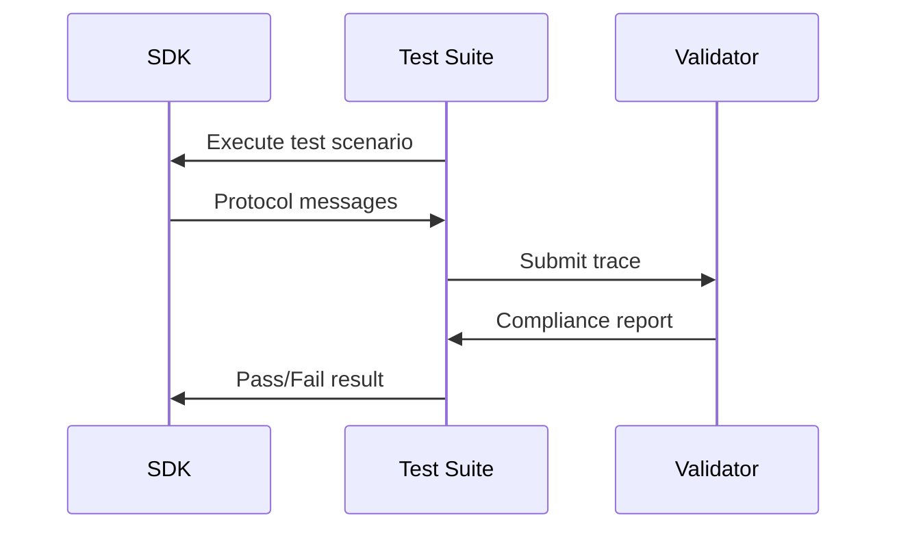

- **状态（Status）**: Final
- **类型（Type）**: Standards Track
- **创建（Created）**: 2025-10-29
- **作者（Author(s)）**: Inna Harper, Felix Weinberger
- **Issue**: #1730

## 摘要

本 SEP 为模型上下文协议（MCP）SDK 提议一套分级体系，以确立对特性支持、维护承诺和质量标准的清晰预期。该体系定义了三个 SDK 支持等级，并配有客观、可衡量的分类标准。

## 动机

MCP 生态需要 SDK 协调（harmonization）以帮助用户作出知情决策。用户当前面临以下挑战：

- **特性支持的不确定性**：没有标准化的方式知道哪些 SDK 支持特定的 MCP 特性（OAuth，客户端/服务器/系统特性，如采样、传输）
- **维护预期**：对缺陷修复、安全补丁和特性更新的承诺程度不清晰
- **实现时间线**：无法看到 SDK 何时会支持新的协议版本和特性

## 规范

### 等级定义

#### Tier 1：完全受支持

此等级的 SDK 提供完整的协议实现，且受到良好支持

**要求：**

- **特性完整且完全支持协议**
  - 所有合规测试通过
  - 在新规范版本发布之前提供新的协议特性。（Release Candidate 与新协议版本发布之间有两周窗口）
- **SDK 维护**
  - 在两个工作日内确认并分诊 issue
  - 在七天内解决安全和严重缺陷
  - 稳定发布和 SDK 版本控制有清晰记录
- **文档**
  - 全面的文档，为所有特性提供示例
  - 已发布的依赖更新政策

#### Tier 2：承诺完全受支持

已有确立实现、正积极朝完整协议支持推进的 SDK。

**要求：**

- **特性完整且完全支持协议**
  - 80% 的合规测试通过
  - 在六个月内实现新的协议特性
- **SDK 维护**
  - 积极的 issue 跟踪和管理
  - 至少一个稳定发布
- **文档**
  - 涵盖核心特性的基础文档
  - 已发布的依赖更新政策
- **迈向 Tier 1 的承诺**
  - 已发布的路线图，展示达到 Tier 1 的意图；或者，如果 SDK 将无限期停留在 Tier 2，则提供关于 SDK 方向以及未做到特性完整之原因的透明路线图

#### Tier 3：实验性

处于早期阶段或专门化、正在探索协议空间的 SDK。

**特征：**

- 无特性完整性保证
- 无稳定发布要求
- 可能聚焦于特定用例或实验性特性
- 无更新的时间线承诺
- 适合可能停留在此等级的小众实现

### 合规测试

所有 SDK 都必须使用协议轨迹（trace）验证进行合规测试：详情见[合规测试 RFC（即将推出）](https://github.com/modelcontextprotocol/modelcontextprotocol/issues/1627)。本 SEP 不聚焦于合规测试。对于分级的初始版本，我们将采用简化版本，即为每个 SDK 提供一个示例服务器，并对其运行简化的合规测试。

**合规评分：**

- SDK 根据测试结果获得一个百分比分数
- 分数可以显示为徽章（例如 "90% MCP Compliant"）
- Tier 1：要求 100% 合规
- Tier 2：要求 80% 合规
- Tier 3：无最低要求

### 等级晋升流程

1. **自评：** 维护者对照等级标准评估其 SDK
2. **申请：** 提交带证据的等级晋升请求
3. **评审：** 社区评审期（2 周）
4. **验证：** 自动化合规测试、issue 的 github 统计
5. **决定：** 由 MCP 维护者进行等级认定

### 等级降级流程

1. **自动验证：**
   1. Tier 1 的合规测试连续四周未通过
   2. Tier 2 的合规测试连续四周有 20% 未通过
2. Issue：
   1. issue 在两个月内未获处理

### 要求矩阵

| 特性                                              | SDK A   | SDK B    | SDK C  |
| :------------------------------------------------ | :------ | :------- | :----- |
| **协议特性支持（合规测试）**                      | 85%     | 60%%     | 100%   |
| **GitHub 支持统计**                               | 10 天   | 100 天   | 5 天   |
| **文档（自我申报）**                              | 良好    | 极少     | 良好   |
| **等级（由上述计算得出）**                        | Tier 2  | Tier 3   | Tier 1 |

## 理由

### 为何三个等级？

- **Tier 1** 确保用户拥有受良好支持、特性完整的 SDK
- **Tier 2** 为改进 SDK 提供清晰路径
- **Tier 3** 允许实验，而不制造进入壁垒

### 为何基于时间的承诺？

尽管社区对僵化的时间线表达了顾虑，但它们提供了：

- 对用户的清晰预期
- 对维护者的可衡量目标
- 通过等级推进带来的灵活性

### 为何不只用特性矩阵？

仅有特性矩阵无法传达：

- 维护承诺
- 质量标准
- 支持预期

分级体系将特性支持与质量保证结合起来。

## 所考虑的替代方案

### 1. 仅特性矩阵

**被否决，因为：** 无法传达维护承诺或质量标准

### 2. 基于百分比的评分

**被否决，因为：** 过于细粒度，且无法捕捉支持之类的定性方面

### 3. 基于属性的体系

**被否决，因为：** 多个重叠的属性可能令用户困惑

### 4. 仅列出最新版本

**被否决，因为：** 仅仅列出"支持某 MCP 日期"无法捕捉关键信息：

- 版本支持可能不完整（例如支持 \<日期\> 但 OAuth 除外）
- 没有维护承诺或 issue 响应时间的指示
- 缺乏关于安全补丁时间线的信息
- 无法传达依赖更新政策
- 仅版本号无法指示生产就绪度

### 5. 无正式体系

**被否决，因为：** 当前临时性的方式给用户造成不确定性

## 向后兼容性

本提案引入一套新的分类体系，无破坏性变更：

- 既有 SDK 继续运作
- 分类初期为选择加入
- 为既有 SDK 达到等级状态设有宽限期

## 安全影响

- Tier 1 SDK 必须在 7 天内处理安全问题
- 鼓励所有等级遵循安全最佳实践
- 合规测试包括安全验证

## 实现计划

- [ ] 敲定简化的合规测试套件 —— 2025 年 11 月 4 日
- [ ] SDK 维护者自评并申请等级 —— 2025 年 11 月 14 日
- [ ] 初始等级认定 —— 在 11 月规范发布之前
- [ ] 实现完整的合规测试
- [ ] 为 SDK 实现自动化的 issue 跟踪分析

## 社区影响

### SDK 维护者

- 清晰的改进目标
- 对高质量实现的认可
- 结构化的晋升路径

### SDK 用户

- 对 SDK 的知情选择
- 对支持的清晰预期
- 对 Tier 1 实现的信心

### 生态

- 整体 SDK 质量的改善
- 标准化的特性支持
- 各实现之间的良性竞争

## 参考资料

- [SDK 维护者会议纪要（#1648）](https://github.com/modelcontextprotocol/modelcontextprotocol/issues/1648)
- [SDK 协调目标（#1444）](https://github.com/modelcontextprotocol/modelcontextprotocol/issues/1444)
- [合规测试 SEP（草案）](https://github.com/modelcontextprotocol/modelcontextprotocol/issues/1627)

## 附录

### 简化的合规测试

在我们制定[全面的合规测试提案](https://github.com/modelcontextprotocol/modelcontextprotocol/issues/1627)（其实现需要一些时间）的同时，我们希望至少以某种自动化方式向前推进，以检查 SDK 是否具备完整的特性集。我们将从服务器特性集开始，因为我们的服务器远多于客户端，且绝大多数使用 SDK 的开发者是服务器实现者。

最直接的方式是为每个 SDK 提供一个示例服务器，类似于 [Everything Server](https://github.com/modelcontextprotocol/servers/tree/main/src/everything)。然后我们将有一个包含所有我们希望能够测试之测试用例的合规测试客户端，例如：

- 执行 "hello world" 工具
- 获取提示
- 获取补全
- 获取资源模板
- 接收通知

**需要 SDK 维护者做的：** 基于规范实现 everything 服务器。规范将形如：

- 工具 "say_hello" 返回简单文本
- 工具 "show_image" 返回一张图像
- 工具 "tool_with_logging" 以 \<\> 格式返回结构化输出，并记录三个事件：start、process、end
- 工具 "tool_with_notifications" 以 \<\> 格式返回结构化输出，并有两个通知 \<\>

鉴于服务器有定义良好的规范和 SDK 文档，借助任何编码代理应该都很容易实现它。我们希望将它检入每个 SDK 的仓库，因为它将作为服务器实现者的示例。

一旦每个 SDK 都有了 everything 服务器，我们就会对其运行合规测试客户端。
