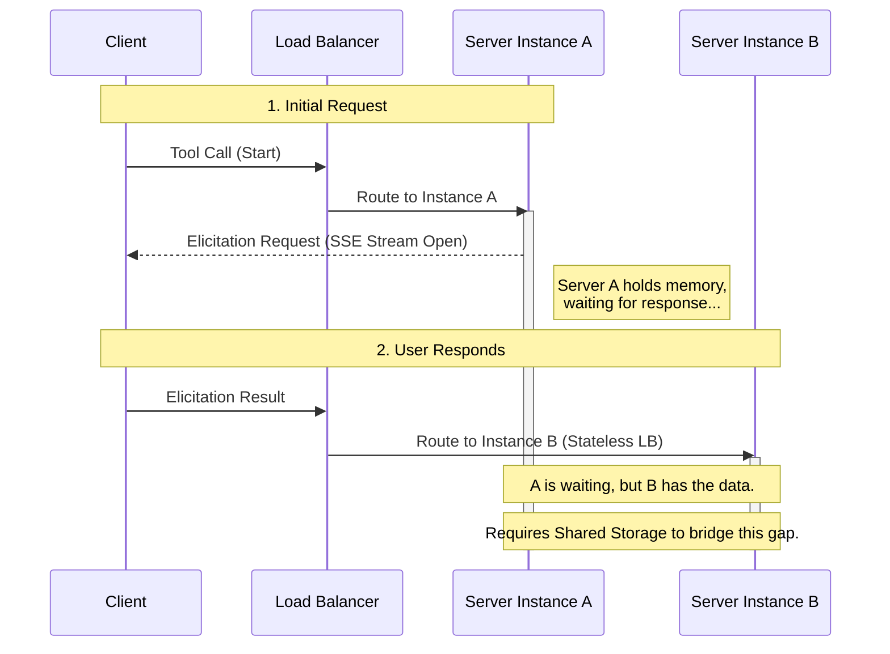
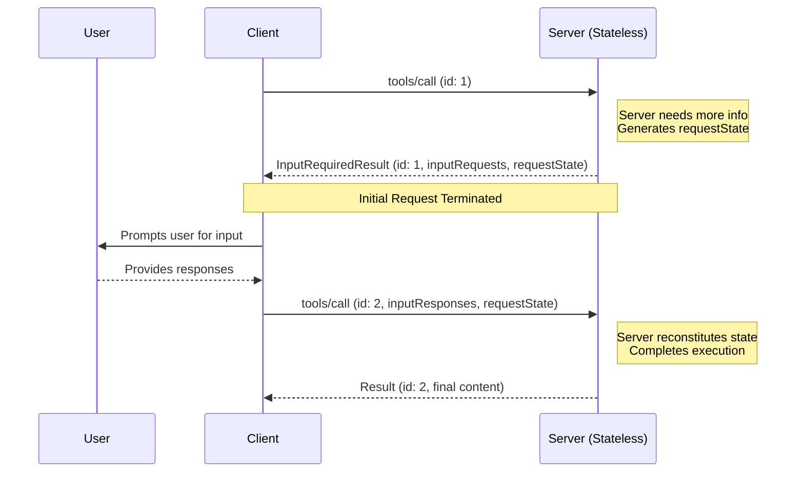
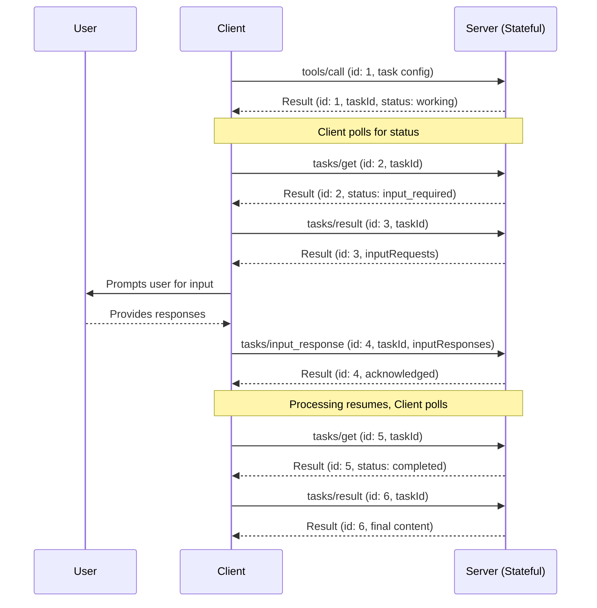

- **状态（Status）**: Final
- **类型（Type）**: Standards Track
- **创建时间（Created）**: 2026-02-03
- **作者（Author(s)）**: Mark D. Roth (@markdroth), Caitie McCaffrey (@CaitieM20),
  Gabriel Zimmerman (@gjz22)
- **发起人（Sponsor）**: Caitie McCaffrey (@CaitieM20)
- **PR**: https://github.com/modelcontextprotocol/specification/pull/{2322}

## 摘要（Abstract）

本提案规定了一种简单的方式，在客户端发起请求的上下文中处理服务器发起的请求（例如工具调用上下文中的一次征询请求），无需跨服务器实例共享的存储层，也无需负载均衡中的有状态性。这将在常见情形下显著降低大规模运营 MCP 服务器的成本。它还减少了 HTTP 传输对 SSE 流的依赖——SSE 流在许多无法支持长连接的环境中会带来问题。

这种处理服务器发起请求的方式将取代当前发送服务器发起请求的做法。这是一项破坏性变更。

本 SEP 还规定了服务器可以在其上发送服务器发起请求的客户端请求子集。相较于当前规范，这缩小了范围，同样是一项破坏性变更。

在此做出破坏性变更是必要的，因为对于许多远程 MCP 服务器或服务器托管客户端而言，由于支持 SSE 流和服务端状态所带来的运维复杂度，征询（Elicitation）、采样（Sampling）与 ListRoots 等服务器发起请求特性的采用率非常低或被阻断。

## 动机（Motivation）

注意：本 SEP 旨在为在任意客户端发起请求的上下文中处理任意服务器发起请求提供一种通用机制。为清晰起见，本文档全程会具体以工具调用作为任意客户端发起请求的代表来讨论，但应理解为同样适用于（例如）资源或提示请求；同样，我们会以征询请求作为任意服务器发起请求的代表来讨论，但应理解为同样适用于（例如）采样请求。

我们从一个观察出发：MCP 工具有两种类型：

1. **临时型（Ephemeral）**：服务端不累积任何状态。
   - 若服务器需要更多信息来处理工具调用，它可以在拿到附加信息后从头开始。
   - 示例：天气应用、访问电子邮件
2. **持久型（Persistent）**：服务端累积状态。
   - 服务器在向客户端请求更多信息之前，可能已生成大量状态，并且在收到信息后可能需要取回该状态以继续处理。
   - 服务器可能需要在等待客户端提供更多信息时于后台继续处理，此时需要服务端状态来跟踪该正在进行的处理。
   - 示例：访问一个 agent、启动一台 VM 并需要用户交互来操作该 VM

绝大多数 MCP 工具将是临时型的，而工具部署在水平扩展、负载均衡的服务中又极为常见，因此我们需要针对这种情形进行优化。

如今，若某工具需要发送一次征询请求才能推进，其工作流如下：

1. 客户端发送工具调用请求。在此示例中，我们假设负载均衡器恰好把该请求发给服务器实例 A。
2. 服务器 A 打开一条 SSE 流，并在该流上发送征询请求。
3. 客户端将征询响应作为一个独立的请求发送，负载均衡器会完全独立于第 1 步的选择来选择服务器实例。在本示例中，我们假设负载均衡器恰好把该请求发给服务器实例 B。
4. 服务器 A 必须以某种方式发现被投递到服务器 B 的征询响应。
5. 服务器 A 随后在第 2 步打开的 SSE 流上发送工具调用结果。



这里的难点是第 4 步，它要求服务端具备某种有状态性。当今解决该问题的主要途径是设置一个跨所有服务器实例共享的存储层，从而让多个服务器实例能够把一个服务器实例上的征询响应与另一个服务器实例上原始正在进行的工具调用匹配起来。

当今解决该问题主要有两种途径：

- **跨服务器实例共享的持久存储层**：服务器可以部署并管理一个持久存储层（例如 PostgreSQL、Redis、DynamoDB），使多个服务器实例能够把一个实例上的征询响应与另一个实例上原始正在进行的工具调用匹配。此途径有若干缺点：
  - 持久存储层 **极其昂贵**，尤其对于本来可能并不具备此类层的临时型工具（例如天气工具）而言。
  - 持久存储层带来显著的可靠性顾虑：它成为关键依赖，因而是潜在的单点故障。为避免这一点，它必须提供高可用、复制与备份机制。
  - 持久存储层成为瓶颈，限制水平扩展性。地理分布则需要昂贵的全局复制或粘性路由。
  - 持久存储层还带来显著的运维复杂度。在水平扩展的部署中，它需要分布式锁或共识协议。它还需要特殊的垃圾回收逻辑来判断何时可以清理共享状态，而这需要谨慎权衡：过于激进地清理状态能降低存储成本但会限制用户响应的时间窗口，而清理不够激进则能容纳慢速用户但会增加存储成本。
  - 此途径要求工具实现具备与持久存储层集成的特殊行为。如今的 MCP SDK 并没有针对此类存储层集成的特殊钩子，这意味着通过 SDK 内联编写代码非常困难。
- **负载均衡中的有状态性**：借助 cookie，负载均衡层有可能确保第 3 步中的征询请求被投递到与第 1 步原始请求相同的服务器实例。此途径虽通常比持久存储层便宜，但有以下缺点：
  - 它需要负载均衡器中的特殊配置与行为，通常难以管理。
  - 它破坏了正常的负载均衡模型，导致负载分布不均，从而增加运行服务的成本。
  - 它需要客户端具备传播用于有状态性的 cookie 的特殊行为。
  - 它要求工具实现把征询请求与正在进行的工具调用匹配起来。（MCP SDK 有一些处理此事的代码，但在 HTTP 世界中这仍是一种非常奇怪的模式。）
  - 它不具备容错性。若服务器实例宕机，所有状态都会丢失，工具调用将不得不从头开始。（这对临时型工具未必要紧，但对持久型工具是个问题。）

此外，这两种途径都依赖 SSE 流的使用，而 SSE 流在无法支持长连接的环境中会带来问题。它们还要求工具的一个实例无限期地驻留在某个特定服务器实例的内存中。这对征询请求尤为棘手，因为结果可能在无界的时间内才会从用户返回（例如可能是数天或数月，甚至可能永远不会返回）。

本 SEP 的目标是提出一种更简单的方式，在客户端发起请求的上下文中处理服务器发起请求这一模式。具体而言，我们需要在临时型工具部署于水平扩展、负载均衡环境这一常见情形下，让支持此模式变得更便宜。这意味着我们需要一个不依赖 SSE 流、也不需要持久存储层或有状态负载均衡的方案，进而意味着我们需要避免请求之间的依赖：服务器必须能够仅使用某个请求中存在的信息、不借助其他任何信息来处理该请求。

请注意，尽管这里的目标是优化临时型工具这一常见情形，但我们确实希望继续支持持久型工具——后者通常本就已经需要持久存储层。

## 规范（Specification）

本 SEP 提出一种在客户端请求上下文中处理服务器请求的新机制。这一新机制在临时型工具与持久型工具上有略微不同的工作流，后者将利用 Tasks。不过，两种工作流都使用相同的数据结构。

### Schema 变更

首先，我们引入 `InputRequests` 的概念，它表示一组一个或多个待发送给客户端的服务器发起请求；以及 `InputResponses`，它表示客户端对这些请求的响应。请求和响应都存储在以字符串为键的 map 中。对于 `InputRequests`，map 值是服务器发起的请求（例如征询或采样请求），而对于 `InputResponses`，map 值是对这些请求的响应。以下是在 TypeScript MCP schema 中的样子：

```typescript
export type InputRequest =
  CreateMessageRequest | ElicitRequest | ListRootsRequest;

export interface InputRequests {
  [key: string]: InputRequest;
}

export type InputResponse =
  CreateMessageResult | ElicitResult | ListRootsResult;

export interface InputResponses {
  [key: string]: InputResponse;
}
```

键由服务器在发出请求时分配。客户端将使用对应的键发送每个请求的响应。例如，服务器可能发送以下输入请求：

```json5
"inputRequests": {
  // Elicitation request.
  "github_login": {
    "method": "elicitation/create",
    "params": {
      "mode": "form",
      "message": "Please provide your GitHub username",
      "requestedSchema": {
        "type": "object",
        "properties": {
          "name": {
            "type": "string"
          }
        },
        "required": ["name"]
      }
    }
  },
  // Sampling request.
  "capital_of_france" : {
    "method": "sampling/createMessage",
    "params": {
      "messages": [
        {
          "role": "user",
          "content": {
            "type": "text",
            "text": "What is the capital of France?"
          }
        }
      ],
      "modelPreferences": {
        "hints": [
          {
            "name": "claude-3-sonnet"
          }
        ],
        "intelligencePriority": 0.8,
        "speedPriority": 0.5
      },
      "systemPrompt": "You are a helpful assistant.",
      "maxTokens": 100
    }
  }
}
```

客户端随后将以如下形式发送响应：

```json5
"inputResponses": {
  // Elicitation response (ElicitResult).
  "github_login": {
    "action": "accept",
    "content": {
      "name": "octocat"
    }
  },
  // Sampling response (CreateMessageResult).
  "capital_of_france": {
    "role": "assistant",
    "content": {
      "type": "text",
      "text": "The capital of France is Paris."
    },
    "model": "claude-3-sonnet-20240307",
    "stopReason": "endTurn"
  }
}
```

schema 如下所示：

```typescript
export interface InputRequiredResult extends Result {
  // Requests issued by the server that must be complete before the
  // client can retry the original request.
  inputRequests?: InputRequests;
  // Request state to be passed back to the server when the client
  // retries the original request.
  // Note: The client must treat this as an opaque blob; it must not
  // interpret it in any way.
  requestState?: string;
}

// RequestParams type that includes input responses and request state.
// These parameters may be included in any client-initiated request.
export interface InputResponseRequestParams extends RequestParams {
  // New field to carry the responses for the server's requests from the
  // InputRequiredResult message. For each key in the response's inputRequests
  // field, the same key must appear here with the associated response.
  inputResponses?: InputResponses;
  // Request state passed back to the server from the client.
  requestState?: string;
}
```

由于此变更为 `tools/call` 等方法调用创建了一个多态响应，我们向 `Result` 引入一个新字段来指示 `ResultType`。客户端应解析该字段以确定消息中所含 `Result` 的类型。若未提供该字段，客户端应为向后兼容假定 `ResultType` 为 `"complete"`。

扩展 **可以（MAY）** 添加额外的 `ResultType` 值。所支持的 `ResultType` 值集合 **必须（MUST）** 由核心协议中定义的集合构建而来，并包含经能力（capabilities）广告的所支持扩展的任何附加值。

客户端 **应当（SHOULD）** 将无法识别的值视为无效的协议响应。

schema 变更如下所示：

```typescript
/**
 * Common result fields.
 *
 * @category Common Types
 */
export interface Result {
  _meta?: MetaObject;
  // New field to indicate the type of the result, which allows the client to determine how to parse the result object. If no resultType is specified "complete" should be assumed.
  resultType: ResultType;
  [key: string]: unknown;
}

export type ResultType =
  | "complete" // the request completed successfully and the result contains the final content.
  | "input_required" // the request is incomplete and the result contains an {@link InputRequiredResult} object
  | string; // open to extensions
```

我们预计该字段对未来的可扩展性会有用，因为它让我们能够引入新类型的结果，并且也可应用于 `tasks`。

这些类型将用于两个不同的工作流，一个用于临时型工具，另一个用于持久型工具。

### 客户端请求的服务器发起请求支持

许多 `ClientRequest` 并没有明确的用例需要服务器向客户端请求更多信息。本 SEP 在 [SEP-2260](https://modelcontextprotocol.io/seps/2260-Require-Server-requests-to-be-associated-with-Client-requests) 的基础上，进一步限制服务器何时可以向客户端发送服务器发起请求。

服务器 可以（MAY）在以下客户端请求上发送 `InputRequiredResult` 响应：

| ClientRequest           | ServerResult           | 支持 InputRequiredResult |
| ----------------------- | ---------------------- | ------------------------ |
| `GetPromptRequest`      | `GetPromptResult`      | 是                       |
| `ReadResourceRequest`   | `ReadResourceResult`   | 是                       |
| `CallToolRequest`       | `CallToolResult`       | 是                       |
| `GetTaskPayloadRequest` | `GetTaskPayloadResult` | 是                       |

服务器 必须（MUST NOT）不在任何其他客户端请求上发送 `InputRequiredResult` 响应。下表列出撰写本 SEP 时这排除了哪些 `ClientRequest`。

| ClientRequest                  | 支持 InputRequiredResult |
| ------------------------------ | ------------------------ |
| `PingRequest`                  | 否                       |
| `InitializeRequest`            | 否                       |
| `CompleteRequest`              | 否                       |
| `SetLevelRequest`              | 否                       |
| `ListPromptsRequest`           | 否                       |
| `ListResourcesRequest`         | 否                       |
| `ListResourceTemplatesRequest` | 否                       |
| `SubscribeRequest`             | 否                       |
| `UnsubscribeRequest`           | 否                       |
| `ListToolsRequest`             | 否                       |
| `GetTaskRequest`               | 否                       |
| `ListTasksRequest`             | 否                       |
| `CancelTaskRequest`            | 否                       |
| `TaskInputResponseRequest`     | 否                       |

### 临时型工具工作流

对于临时型用例，除了输入请求之外，我们引入请求状态（request state）的概念。在服务器需要更多信息的情况下，请求状态被发送给客户端，客户端将该状态回传给服务器，从而让服务器保持无状态。

我们将为临时型工具采用以下工作流：

1. 客户端发送工具调用请求。
2. 服务器回送单个响应，指示该请求未完成。该响应可能包含客户端必须完成的输入请求。它也可能包含客户端必须回传给服务器的某些请求状态。该响应终止原始请求。它通常将作为单个响应发送，而非在 SSE 流上发送，尽管就目前而言（这可能在未来的 SEP 中改变）在（例如）进度通知之后于 SSE 流上发送该响应也是合法的。若这个未完成响应在 SSE 流上发送，它必须是该 SSE 流上的最后一条消息，正如它是一个普通响应一样。
3. 客户端发送一个全新的工具调用请求，与原始请求完全独立。该新工具调用包含对第 2 步输入请求的响应。它还包含服务器在第 2 步指定的请求状态。
4. 服务器回送一个 CallToolResponse。



请注意，第 1 步和第 3 步的请求是完全独立的：处理第 3 步请求的服务器不需要任何未直接出现在该请求中的信息。为支持这种解耦，第 1 步与第 3 步发送的请求之间的 JsonRPC Id 必须（MUST）不同。

请注意，"inputRequests" 与 "requestState" 字段只影响客户端对原始请求的下一次重试。它们不会用于客户端可能并行发送的任何其他请求（例如工具列表，甚至另一个工具调用）。

<details>
<summary>点击展开：临时型工具的示例流程</summary>
<b>临时型工具的示例流程</b>

注意：这是一个人为构造的示例，仅用于说明流程。

1. 客户端发送初始的工具调用请求：

```json
{
  "jsonrpc": "2.0",
  "id": 2,
  "method": "tools/call",
  "params": {
    "name": "get_weather",
    "arguments": {
      "location": "New York"
    }
  }
}
```

2. 服务器以一个未完成响应回复，指示客户端需要响应一次征询请求才能使工具调用完成，并包含待回传的请求状态：

```json
{
  "jsonrpc": "2.0",
  "id": 2,
  "result": {
    "resultType": "input_required",
    "inputRequests": {
      "github_login": {
        "method": "elicitation/create",
        "params": {
          "mode": "form",
          "message": "Please provide your GitHub username",
          "requestedSchema": {
            "type": "object",
            "properties": {
              "name": {
                "type": "string"
              }
            },
            "required": ["name"]
          }
        }
      }
    },
    "requestState": "foo"
  }
}
```

3. 客户端随后重试原始工具调用，这次包含对输入服务器请求的响应以及请求状态：

```json
{
  "jsonrpc": "2.0",
  "id": 3,
  "method": "tools/call",
  "params": {
    "name": "get_weather",
    "arguments": {
      "location": "New York"
    },
    "inputResponses": {
      "github_login": {
        "action": "accept",
        "content": {
          "name": "octocat"
        }
      }
    },
    "requestState": "foo"
  }
}
```

4. 最后，服务器完成工具调用：

```json
{
  "jsonrpc": "2.0",
  "id": 3,
  "result": {
    "resultType": "complete",
    "content": [
      {
        "type": "text",
        "text": "Current weather in New York:\nTemperature: 72°F\nConditions: Partly cloudy"
      }
    ],
    "isError": false
  }
}
```

</details>

#### 临时型工作流的真实世界示例

本示例演示 `requestState` 如何支持由 [Azure DevOps 自定义规则](https://learn.microsoft.com/en-us/azure/devops/organizations/settings/work/custom-rules?view=azure-devops)驱动的多轮往返征询流程。该场景涉及一个 `update_work_item` 工具，将一个 Bug 工作项转换为 "Resolved"。ADO 自定义规则要求在发生某些状态转换时提供特定字段，服务器使用迭代式征询来收集它们——跨多轮在 `requestState` 中累积上下文，从而无需任何服务端存储即可执行最终更新。

<details>
<summary>点击展开：ADO 自定义规则示例</summary>

**背景——生效中的 ADO 自定义规则：**

- _规则 1：_ 当 State 变为 "Resolved" 时 → 要求 "Resolution" 字段（例如 Fixed、Won't Fix、Duplicate、By Design）。
- _规则 2：_ 当 Resolution 为 "Duplicate" 时 → 要求 "Duplicate Of" 字段（指向原始工作项的链接）。

##### 第 1 轮——工具调用触发状态变更，服务器征询 Resolution

1. 客户端调用 `update_work_item` 工具以解决 Bug #4522：

```json
{
  "jsonrpc": "2.0",
  "id": 1,
  "method": "tools/call",
  "params": {
    "name": "update_work_item",
    "arguments": {
      "workItemId": 4522,
      "fields": { "System.State": "Resolved" }
    }
  }
}
```

2. 服务器识别到将 State 设为 "Resolved" 会触发规则 1，该规则要求一个 Resolution 值。服务器不使调用失败，而是返回一个带征询请求的未完成响应。此时尚不需要 `requestState`，因为原始工具调用参数将在重试时被重新发送：

```json
{
  "jsonrpc": "2.0",
  "id": 1,
  "result": {
    "resultType": "input_required",
    "inputRequests": {
      "resolution": {
        "method": "elicitation/create",
        "params": {
          "message": "Resolving Bug #4522 requires a resolution. How was this bug resolved?",
          "requestedSchema": {
            "type": "object",
            "properties": {
              "resolution": {
                "type": "string",
                "enum": ["Fixed", "Won't Fix", "Duplicate", "By Design"],
                "description": "Resolution type for this bug"
              }
            },
            "required": ["resolution"]
          }
        }
      }
    }
  }
}
```

3. 用户选择 "Duplicate"。客户端带征询响应重试原始工具调用：

```json
{
  "jsonrpc": "2.0",
  "id": 2,
  "method": "tools/call",
  "params": {
    "name": "update_work_item",
    "arguments": {
      "workItemId": 4522,
      "fields": { "System.State": "Resolved" }
    },
    "inputResponses": {
      "resolution": {
        "action": "accept",
        "content": { "resolution": "Duplicate" }
      }
    }
  }
}
```

##### 第 2 轮——Resolution 触发另一条规则，服务器征询 Duplicate Of

4. 服务器合并用户的响应，发现 Resolution = "Duplicate" 触发了规则 2，需要一个 "Duplicate Of" 链接。它返回另一个未完成响应，这次将已收集的 resolution 编码到 `requestState` 中，以便无论下一次重试由哪个服务器实例处理都可用：

```json
{
  "jsonrpc": "2.0",
  "id": 2,
  "result": {
    "resultType": "input_required",
    "inputRequests": {
      "duplicate_of": {
        "method": "elicitation/create",
        "params": {
          "message": "Since this is a duplicate, which work item is the original?",
          "requestedSchema": {
            "type": "object",
            "properties": {
              "duplicateOfId": {
                "type": "number",
                "description": "Work item ID of the original bug"
              }
            },
            "required": ["duplicateOfId"]
          }
        }
      }
    },
    "requestState": "eyJyZXNvbHV0aW9uIjoiRHVwbGljYXRlIn0..."
  }
}
```

5. 用户提供原始工作项 ID。客户端重试工具调用，回传 `requestState` 并包含新的征询响应：

```json
{
  "jsonrpc": "2.0",
  "id": 3,
  "method": "tools/call",
  "params": {
    "name": "update_work_item",
    "arguments": {
      "workItemId": 4522,
      "fields": { "System.State": "Resolved" }
    },
    "inputResponses": {
      "duplicate_of": {
        "action": "accept",
        "content": { "duplicateOfId": 4301 }
      }
    },
    "requestState": "eyJyZXNvbHV0aW9uIjoiRHVwbGljYXRlIn0..."
  }
}
```

##### 最终——服务器完成更新

6. 服务器解码 `requestState`（其中含有 resolution），读取 `inputResponses`（其中含有 duplicate ID），此时已拥有全部必需字段。它完成工具调用：

```json
{
  "jsonrpc": "2.0",
  "id": 3,
  "result": {
    "resultType": "complete",
    "content": [
      {
        "type": "text",
        "text": "Bug #4522 resolved as Duplicate of Bug #4301. State set to Resolved and duplicate link created."
      }
    ],
    "isError": false
  }
}
```

**关键要点：** 在两轮征询中，服务器都未持有任何内存中或持久化的状态。`requestState` 字段通过客户端携带了累积的上下文，任何服务器实例都可以处理任意单独一轮。

</details>

#### 请求状态的用例

"requestState" 机制提供了在同一逻辑请求上进行多轮往返的手段。主要有两个用例。

##### 用例 1：滚动升级

假设你正在对水平扩展的服务器实例进行滚动升级，以部署工具实现的新版本。旧版本有两个输入请求，键为 "github_login" 和 "google_login"。然而在工具实现的新版本中，它仍然使用 "github_login" 输入请求，但用一个新的 "microsoft_login" 输入请求替换了 "google_login" 输入请求。

如果第一个请求命中运行旧版本的服务器，而第二次尝试（包含输入响应）命中运行新版本的服务器，那么服务器将看到它需要的 "github_login" 结果，但看不到 "microsoft_login" 的结果。（它也会看到 "google_login" 的结果，但它不再需要该结果，故无关紧要。）此时服务器需要为 "microsoft_login" 发送一个新的输入请求，但它也不想丢失已经拿到的 "github_login" 答案，因此它会使用 1685 中提出的那种状态来保留该信息，而无需在服务端存储状态。

此处的工作流如下：

1. 客户端发送工具调用请求，命中运行旧版本的服务器实例。
2. 服务器回送一个未完成响应，指示 "github_login" 和 "google_login" 的输入请求。
3. 客户端发送一个新的工具调用请求，包含对 "github_login" 和 "google_login" 输入请求的响应。这次它命中运行新版本的服务器实例。
4. 服务器回送另一个未完成响应，指示客户端尚未提供的 "microsoft_login" 输入请求。然而，该响应还包含含有已提供的 "github_login" 响应的请求状态，以便客户端无需再次向用户询问同样的信息。
5. 客户端发送第三个工具调用请求，包含对 "microsoft_login" 输入请求的响应，并回传服务器在第 4 步提供的请求状态。
6. 服务器现在在请求状态中看到 "github_login" 信息、在输入响应中看到 "microsoft_login" 状态，因此该请求现在包含服务器执行工具调用并回送完整响应所需的一切。

##### 用例 2：卸载负载（Load Shedding）

假设你有一个 MCP 服务器实例正在处理一批工具调用，并注意到自己负载过重，因此想把其中一个正在进行的工具调用迁移到另一个服务器实例。然而，它已经在该工具调用上完成了大量处理，因此它不想简单地使调用失败、让客户端在另一个服务器实例上从头开始；相反，它想保留已累积的状态，以便无论哪个服务器实例恢复处理都能从原始服务器实例停下的地方继续。这可以通过发送一个包含请求状态但不包含任何输入请求的未完成请求来实现。

此处的工作流如下：

1. 客户端发送原始请求，负载均衡器将其路由到服务器实例 A。
2. 服务器实例 A 做了大量计算后决定需要卸载负载。它发送一个未完成响应，在 `requestState` 字段中含有其累积的状态，但不含 `inputRequests` 字段。
3. 客户端带着 `requestState` 字段重试请求。负载均衡器将该请求路由到服务器实例 B。
4. 服务器实例 B 从它在 `requestState` 字段中看到的状态开始，从而从服务器实例 A 停下的地方接续计算，并最终返回一个完整响应。

#### 临时型工作流的协议要求

1. **服务器行为：**
   - 服务器 可以（MAY）以 `InputRequiredResult` 响应任何客户端发起的请求。该消息 可以（MAY）作为独立响应发送，或作为 SSE 流上的最后一条消息发送，不过鼓励实现优先选择前者。若使用 SSE 流，服务器 必须（MUST NOT）不在未完成响应消息之后于流上发送任何消息。
   - `InputRequiredResult` 可以（MAY）包含 `inputRequests` 字段。
   - `InputRequiredResult` 可以（MAY）包含 `requestState` 字段。若指定，该字段是一个仅对服务器有意义的不透明字符串。服务器可以自由地以任意格式编码该状态（例如纯 JSON、base64 编码的 JSON、加密的 JWT、序列化的二进制等）。
   - 若请求包含 `requestState` 字段，服务器 必须（MUST）始终校验该状态，因为客户端是不可信的中间方。若担心被篡改，服务器 应当（SHOULD）使用其选择的加密算法（例如可使用 AES-GCM 或签名的 JWT）加密 `requestState` 字段，以确保机密性与完整性。请注意，还存在重放/劫持攻击的风险，即已认证的攻击者重发原本发给另一个用户的状态。因此，若请求状态包含任何特定于原始用户的数据，服务器 必须（MUST）使用某种机制将数据以密码学方式绑定到原始用户，并 必须（MUST）验证客户端发送的 `requestState` 数据与当前已认证用户相关联。使用明文状态的服务器 必须（MUST）将解码后的值视为不可信输入，并像校验任何客户端提供的数据一样校验它们。

2. **客户端行为：**
   - 若客户端收到 `InputRequiredResult` 消息，且该消息包含 `inputRequests` 字段，则客户端 必须（MUST）在重试原始请求之前构造所请求的输入。相反，若该消息 _不_ 包含 `inputRequests` 字段，则客户端 可以（MAY）立即重试原始请求。
   - 若客户端收到包含 `requestState` 字段的 `InputRequiredResult` 消息，它 必须（MUST）在重试原始请求时回传该字段的确切值。客户端 必须（MUST NOT）不检查、解析、修改或对 `requestState` 内容做任何假设。若 `InputRequiredResult` 不包含 `requestState` 字段，客户端 必须（MUST NOT）不在重试中包含它。

### 持久型工具工作流

持久型工具工作流将利用 Tasks。[`Tasks`](https://modelcontextprotocol.io/specification/draft/basic/utilities/tasks) 已经提供了一种机制来指示需要更多信息才能完成请求。`input_required` Task 状态允许服务器指示需要额外信息才能完成对任务的处理。

`Tasks` 的工作流如下：

1. 服务器将 Task 状态设为 `input_required`。服务器此时可以暂停处理请求。
2. 客户端通过调用 `tasks/get` 取回 Task 状态，看到需要更多信息。
3. 客户端调用 `tasks/result`。
4. 服务器返回 `InputRequests` 对象。
5. 客户端发送 `tasks/input_response` 请求，其中包含 `InputResponses` 对象以及 `Task` 元数据字段。
6. 服务器恢复处理，将 TaskStatus 设回 `working`。



由于 `Tasks` 很可能运行时间较长、关联有状态且计算成本较高，请求更多信息并不会终结原本请求的操作（例如工具调用）。相反，一旦提供了必要信息，服务器可以恢复处理。

为与 MRTR 语义保持一致，服务器将以 `InputRequests` 对象响应 `tasks/result` 请求。两者将具有相同的 JsonRPC `id`。当客户端以 `InputResponses` 对象响应时，这是一个带有新 JSONRPC `id` 的新客户端请求，因此需要一个新的方法名。我们提议 `tasks/input_response`。

上述工作流及下方示例均未利用任何可选的 Task 状态通知，尽管本 SEP 并不排斥使用它们。

<details>
<summary>点击展开：持久型工具的示例流程</summary>

下方示例走过一个 Echo 工具的完整 Task 消息流程，该工具可通过征询向客户端请求额外信息。

1. <b>客户端请求</b>调用 EchoTool。

```json
{
  "jsonrpc": "2.0",
  "id": 1,
  "method": "tools/call",
  "params": {
    "name": "echo",
    "task": {
      "ttl": 60000
    }
  }
}
```

2. <b>服务器响应</b>返回一个 `Task`

```json
{
  "id": 1,
  "jsonrpc": "2.0",
  "result": {
    "task": {
      "taskId": "echo_dc792e24-01b5-4c0a-abcb-0559848ca3c5",
      "status": "working",
      "statusMessage": "Task has been created for echo tool invocation.",
      "createdAt": "2026-01-27T03:32:48.3148180Z",
      "lastUpdatedAt": "2026-01-27T03:32:48.3148180Z",
      "ttl": 60000,
      "pollInterval": 100
    }
  }
}
```

3. <b>客户端请求</b>使用 `tasks/get` 定期检查 `Task` 的状态。

```json
{
  "jsonrpc": "2.0",
  "id": 2,
  "method": "tasks/get",
  "params": {
    "taskId": "echo_dc792e24-01b5-4c0a-abcb-0559848ca3c5"
  }
}
```

4. <b>服务器响应</b>返回 Task 状态 `input_required`

```json
{
  "id": 2,
  "jsonrpc": "2.0",
  "result": {
    "taskId": "echo_dc792e24-01b5-4c0a-abcb-0559848ca3c5",
    "status": "input_required",
    "statusMessage": "Input Required to Proceed call tasks/result",
    "createdAt": "2026-01-27T03:38:07.7534643Z",
    "lastUpdatedAt": "2026-01-27T03:38:07.7534643Z",
    "ttl": 60000,
    "pollInterval": 100
  }
}
```

5. <b>客户端请求</b>发送 `tasks/result` 消息以发现继续处理所需的输入。

```json
{
  "jsonrpc": "2.0",
  "id": 3,
  "method": "tasks/result",
  "params": {
    "taskId": "echo_dc792e24-01b5-4c0a-abcb-0559848ca3c5"
  }
}
```

6. <b>服务器响应</b>返回 `inputRequests` 以请求额外输入

```json
{
  "id": 3,
  "jsonrpc": "2.0",
  "result": {
    "resultType": "input_required",
    "inputRequests": {
      "echo_input": {
        "method": "elicitation/create",
        "params": {
          "mode": "form",
          "message": "Please provide the input string to echo back",
          "requestedSchema": {
            "type": "object",
            "properties": {
              "input": { "type": "string" }
            },
            "required": ["input"]
          }
        }
      }
    }
  },
  "_meta": {
    "io.modelcontextprotocol/related-task": {
      "taskId": "echo_dc792e24-01b5-4c0a-abcb-0559848ca3c5"
    }
  }
}
```

7. <b>客户端请求</b>向用户呈现征询并收集输入，然后向服务器发送消息。

```json
{
  "jsonrpc": "2.0",
  "id": 4,
  "method": "tasks/input_response",
  "params": {
    "inputResponses": {
      "echo_input": {
        "action": "accept",
        "content": {
          "input": "Hello World!"
        }
      }
    },
    "_meta": {
      "io.modelcontextprotocol/related-task": {
        "taskId": "echo_dc792e24-01b5-4c0a-abcb-0559848ca3c5"
      }
    }
  }
}
```

8. <b>服务器响应</b>服务器应通过发送 `JSONRPCResponse` 来确认收到 `tasks/input_response` 消息。若消息成功接收，则发送包含 `taskId` 的 `JSONRPCResultResponse`。若发生错误，则发送 `JSONRPCErrorResponse`。服务器现在可以使用所提供的输入继续完成 `Task`，`Task` 状态变为 `Working`。

```json
{
  "id": 4,
  "jsonrpc": "2.0",
  "result": {
    "_meta": {
      "io.modelcontextprotocol/related-task": {
        "taskId": "echo_dc792e24-01b5-4c0a-abcb-0559848ca3c5"
      }
    }
  }
}
```

9. <b>客户端请求</b>继续使用 `tasks/get` 轮询输入状态，直到服务器以 Task 状态 `Completed` 响应

```json
{
  "jsonrpc": "2.0",
  "id": 5,
  "method": "tasks/get",
  "params": {
    "taskId": "echo_dc792e24-01b5-4c0a-abcb-0559848ca3c5"
  }
}
```

10. <b>服务器响应</b>返回 Task 状态 `completed`

```json
{
  "id": 5,
  "jsonrpc": "2.0",
  "result": {
    "taskId": "echo_dc792e24-01b5-4c0a-abcb-0559848ca3c5",
    "status": "completed",
    "statusMessage": "Task has been completed successfully, call tasks/result",
    "createdAt": "2026-01-27T03:38:07.7534643Z",
    "lastUpdatedAt": "2026-01-27T03:38:08.1234567Z",
    "ttl": 60000,
    "pollInterval": 100
  }
}
```

11. <b>客户端请求</b>调用 `tasks/result` 从服务器获取 `Task` 的最终结果。

```json
{
  "id": 6,
  "jsonrpc": "2.0",
  "method": "tasks/result",
  "params": {
    "taskId": "echo_dc792e24-01b5-4c0a-abcb-0559848ca3c5"
  }
}
```

12. <b>服务器响应</b>返回 `Task` 的最终结果

```json
{
  "id": 6,
  "jsonrpc": "2.0",
  "result": {
    "resultType": "complete",
    "isError": false,
    "content": [
      {
        "type": "text",
        "text": "Echo: Hello World!"
      }
    ],
    "_meta": {
      "io.modelcontextprotocol/related-task": {
        "taskId": "echo_dc792e24-01b5-4c0a-abcb-0559848ca3c5"
      }
    }
  }
}
```

</details>

#### 持久型工作流的协议要求

1. **服务器行为：**
   - 服务器 可以（MAY）通过指示任务处于 `input_required` 状态来响应 `tasks/get`。
   - 当任务处于 `input_required` 状态时，服务器 必须（MUST）在 `tasks/result` 响应中包含 `inputRequests` 字段。

2. **客户端行为：**
   - 当 `tasks/get` 显示状态为 `input_required` 时，客户端 必须（MUST）调用 `tasks/result` 以获取输入请求。客户端 应当（SHOULD）构造这些请求的结果，然后调用 `tasks/input_response` 携带输入响应来为任务提供所需输入。
   - 客户端 可以（MAY）选择不满足这些输入请求，此时它们可以取消任务。

### 临时型与持久型工作流之间的交互

如果某个工具实现需要客户端先响应一组输入请求才能开始处理，但之后又需要进行持久处理，它可以先使用临时型工作流，然后在那个点创建一个任务，从而切换到持久型工作流。这避免了服务器在真正拥有开始处理请求所需信息之前就必须存储状态。此工作流如下：

1. 客户端发送带任务元数据的工具调用请求。
2. 服务器回送 `inputRequests` 响应，指示需要更多信息来处理请求。这会终止原始请求。
3. 客户端发送一个全新的工具调用请求，与原始请求完全独立，包含 `inputResponses` 对象以及任务元数据。
4. 服务器回送一个任务 ID，指示它将在后台处理请求。所有后续交互都将通过 Tasks API 完成。

请注意，反过来则不成立：一旦某个工具实现返回了任务，它就承诺在任务期间在服务端存储状态，且没有办法切换回临时型模型。所有后续交互都必须通过 Tasks API 执行。

### 错误处理指引

本节为客户端在 `inputResponses` 对象中提供意料之外或格式错误数据的场景提供错误处理的实现指引。

与任何收到的请求一样，服务器 应当（SHOULD）校验客户端提供的数据是有效的 `inputResponses` 对象，且其中的信息可被正确解析。诸如格式错误的 JSON、无效 schema 或阻止请求处理的内部服务器错误等协议错误，应返回带有适当错误码与消息的 `JSONRPCErrorResponse`。

若 `inputResponses` 对象中提供了额外参数，服务器 应当（SHOULD）将其视为可选参数。因此，它 应当（SHOULD）忽略 `inputResponses` 对象中它无法识别或不需要的任何意料之外的信息。

客户端也可能未发送先前 `inputRequests` 中请求的全部信息。若缺失的被请求信息是服务器处理请求所必需的，则它 应当（SHOULD）以一个新的 `InputRequiredResult` 响应。

我们讨论过返回一个特定的应用级错误码，然而客户端在所有场景下未必有足够信息来恢复。因此，我们决定依赖通过 `InputRequiredResult` 请求更多输入的既有机制，以确保客户端总能通过让服务器再次请求必要信息来恢复。

恶意客户端可能故意在 `inputResponses` 对象中发送错误信息，并通过令服务器反复请求同样的信息来在服务器上产生负载。然而，这并非本工作流引入的新顾虑，因为恶意客户端本就可以通过发送格式错误的请求来产生负载。服务器实现者可以使用限流、节流等标准技术来保护自己免受此类攻击。

在临时型工作流中，这将如下所示：

1. 客户端重试原始工具调用，这次包含 `inputResponses` 对象，但响应缺少服务器处理请求所需的必要信息。

```json
{
  "jsonrpc": "2.0",
  "id": 3,
  "method": "tools/call",
  "params": {
    "name": "get_weather",
    "arguments": {
      "location": "New York"
    },
    "inputResponses": {
      "not_requested_info": {
        "action": "accept",
        "content": {
          "not_requested_param_name": "Information the server did not request"
        }
      }
    }
  }
}
```

2. 服务器以一个未完成响应回复，指示客户端需要响应一次征询请求才能使工具调用完成，并包含待回传的请求状态：

```json
{
  "jsonrpc": "2.0",
  "id": 2,
  "result": {
    "resultType": "input_required",
    "inputRequests": {
      "github_login": {
        "method": "elicitation/create",
        "params": {
          "mode": "form",
          "message": "Please provide your GitHub username",
          "requestedSchema": {
            "type": "object",
            "properties": {
              "name": {
                "type": "string"
              }
            },
            "required": ["name"]
          }
        }
      }
    }
  }
}
```

2. 服务器以一个未完成响应回复，指示客户端需要提供缺失的信息才能使请求成功。

在持久型工作流中，这将如下所示：
上文第 7 步：<b>客户端请求</b>客户端错误地或恶意地向服务器发送意料之外但格式良好的数据来响应输入请求。

```json
{
  "jsonrpc": "2.0",
  "id": 4,
  "method": "tasks/input_response",
  "params": {
    "inputResponses": {
      "echo_input": {
        "action": "accept",
        "content": {
          "not_requested_parameter": "Information the server did not request."
        }
      }
    },
    "_meta": {
      "io.modelcontextprotocol/related-task": {
        "taskId": "echo_dc792e24-01b5-4c0a-abcb-0559848ca3c5"
      }
    }
  }
}
```

上文第 8 步。<b>服务器响应</b>服务器通过发送 `JSONRPCResultResponse` 确认收到响应。然而，由于该响应缺少必需信息，服务器不继续处理任务，并将 Task 状态保持为 `input_required`。下次客户端调用 `tasks/result` 时，服务器以一个新的 `inputRequest` 响应，再次请求必要信息。

```json
{
  "id": 4,
  "jsonrpc": "2.0",
  "result": {
    "_meta": {
      "io.modelcontextprotocol/related-task": {
        "taskId": "echo_dc792e24-01b5-4c0a-abcb-0559848ca3c5"
      }
    }
  }
}
```

## 理由（Rationale）

我们曾考虑用一种双向流方式取代 SSE 流。然而，那种方式会使线协议更复杂（例如它会要求 HTTP/2 或 HTTP/3）。此外，它既不会消除无法支持长连接环境的问题，也不会解决容错问题。

关于输入请求应是一个 map 还是仅一个单一对象、也许利用请求内部的某个字段（例如征询 ID）来区分它们，曾有过讨论。我们判定 map 是合理的，因为它在结构上保证了键的唯一性，从而避免了 SDK 与应用中为避免冲突而进行显式检查的需要。

在持久型工作流中，我们曾考虑将输入请求直接包含在 `tasks/get` 响应中，而不要求客户端看到 `input_required` 状态后再调用 `tasks/result` 获取输入请求。我们决定将这两件事分开，以照顾那些为任务状态与实际工具实现使用独立基础设施的实现；其思路是 `tasks/get` 调用应具有一致的时延特征，无论任务状态实际如何。我们认识到这需要向服务器多一次往返，但若此成为问题，我们可以在未来优化。

## 向后兼容性（Backward Compatibility）

如今许多 SDK 以内联但异步的方式支持征询，即在原始 SSE 流上发送工具调用响应之前等待征询响应，这对于单进程或能确保请求粘性路由的 MCP 服务器有效。

```python
def my_tool():
  do_work()
  await elicit_more_info()
  do_more_work()
  return tool_result
```

SDK 可以（MAY）为既有工具及向后兼容继续支持这种风格的征询，然而它们 应当（SHOULD）将此模式标记为遗留/已弃用。

展望未来，示例与 SDK 需要支持新风格的征询，其中代码不能假设同一进程处理两次工具调用。这种编程模型不那么吸引人，然而它确保 MCP 服务器能够从单进程 stdio MCP 服务器过渡到多进程远程 MCP 服务器而无需重大改写，并确保我们在未来有一种单一推荐的征询方式。

```python
def my_tool(request):
  if(request.requestState):
      state = decode(request.requestState)
  if(request.inputResponses):
      additionalInfo = decode(request.inputResponses)

  do_work(state, additionalInfo)
  if(more_info_needed):
    return IncompleteResponse();
  else
    do_more_work()
    return tool_result
```

此处考虑过的其他选项是提供两种独立的编程模型，让开发者根据其 MCP 服务器部署（单进程或多进程）在两者间选择，以继续支持 await 语义，然而这会给开发者体验增加复杂度，并会使开发者在单进程与多进程部署之间切换更加困难。

## 安全影响（Security Implications）

由于 `requestState` 会经过客户端，恶意或被攻陷的客户端可能试图修改它以改变服务器行为、绕过授权检查或破坏服务器逻辑。为缓解这一点，我们要求服务器按上文协议要求所述校验该状态。

## 参考实现（Reference Implementation）

TBD

### 致谢（Acknowledgments）

感谢 Luca Chang (@LucaButBoring) 就如何将输入请求集成进 Tasks 提供的宝贵意见。
