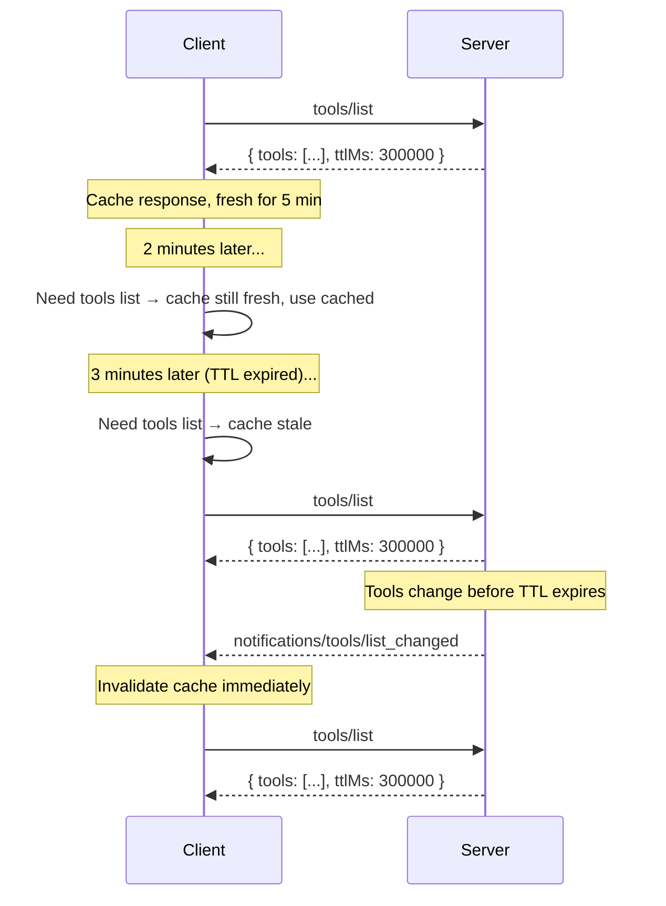

- **状态（Status）**: Final
- **类型（Type）**: Standards Track
- **创建（Created）**: 2026-04-09
- **作者（Author(s)）**: Caitie McCaffrey (@CaitieM20)
- **担保人（Sponsor）**: @CaitieM20
- **PR**: https://github.com/modelcontextprotocol/specification/pull/2549

## 摘要

本 SEP 提议添加字段，以支持对 `tools/list`、`prompts/list`、`resources/list`、`resources/read` 和 `resources/templates/list` 返回的结果对象进行缓存。将添加两个字段 `ttlMs` 和 `cacheScope`。TTL 告诉客户端在重新获取之前，响应可以被视为新鲜多长时间。这允许客户端缓存特性列表，减少对服务器推送通知的依赖，同时保持完全向后兼容。`cacheScope` 字段控制谁可以缓存某个响应。TTL 是对既有通知机制的补充而非替代——两者可以共存。

## 动机

如今，MCP 客户端通过调用服务器上的方法来发现服务器特性。这些调用返回当前的特性集。为了解变化，客户端依赖来自服务器的推送通知。下表将服务器方法映射到通知类型。

| 服务器方法                 | 通知类型                               |
| -------------------------- | -------------------------------------- |
| `tools/list`               | `notifications/tools/list_changed`     |
| `prompts/list`             | `notifications/prompts/list_changed`   |
| `resources/list`           | `notifications/resources/list_changed` |
| `resources/templates/list` | `notifications/resources/list_changed` |
| `resources/read`           | `notifications/resources/updated`      |

这种方式有若干局限：

1. **基于 HTTP 的传输需要 SSE 流**：许多客户端和服务器在支持长期存在的 SSE 流（通知所必需）方面存在挑战。目标是让 SSE 流成为一种可选的优化，而在没有它们的情况下也能支持协议功能。TTL 允许客户端按可预测的计划轮询，而不依赖服务器推送通知。

2. **实现复杂性**：客户端和服务器都必须实现通知订阅和投递基础设施。许多简单的服务器其特性列表很少（或从不）变化，但如果想让客户端保持最新，仍必须支持通知机制。

3. **无新鲜度信号**：即使能够接收通知的客户端，也没有关于列表"稳定性"的指示。一个工具列表每天变化一次的服务器和一个每秒变化的服务器，在客户端看来完全相同——两者都只是在变化发生时发送通知。TTL 提供了一个显式的新鲜度提示。

4. **与 Web 标准对齐**：HTTP 缓存（`Cache-Control: max-age`）和 DNS TTL 长期以来已证明，基于时间的新鲜度提示是一种简单、被充分理解的机制，用于减少不必要的重新获取。MCP 可以受益于同样的模式。

向列表响应添加 TTL 字段，以最小的、向后兼容的协议变更解决了所有这些问题。

## 规范

### 新接口：`CacheableResult`

引入一个新的 `CacheableResult` 接口，作为扩展 `Result` 的独立类型。它拥有 `ttlMs` 和 `cacheScope` 字段。

#### Schema 变更（TypeScript）

```typescript
/**
 * A result that supports a time-to-live (TTL) hint for client-side caching.
 *
 * @internal
 */
export interface CacheableResult extends Result {
  /**
   * A hint from the server indicating how long (in milliseconds) the
   * client MAY cache this response before re-fetching. Semantics are
   * analogous to HTTP Cache-Control max-age.
   *
   * - If 0, The response SHOULD be considered immediately stale, The client
   *   MAY re-fetch every time the result is needed.
   * - If positive, the client SHOULD consider the result fresh for this many
   *   milliseconds after receiving the response.
   */
  ttlMs: number & { readonly minimum: 0 };

  /**
   * Indicates the intended scope of the cached response, analogous to HTTP
   * Cache-Control: public vs Cache-Control: private.
   *
   * - "public": Any client or intermediary (e.g., shared gateway, proxy)
   *   MAY cache the response and serve it to any user.
   * - "private": Only the requesting user's client MAY cache the response.
   *   Shared caches (e.g., multi-tenant gateways) MUST NOT serve a cached
   *   copy to a different user.
   *
   * Defaults to "public" if absent.
   */
  cacheScope: "public" | "private";
}
```

### 语义

TTL 是一个新鲜度估计，而非保证。服务器**可以（MAY）**在 TTL 过期前更改底层列表；这样做且已公告 listChanged 的服务器**应当（SHOULD）**发送相应的通知。

服务器**必须（MUST）**在 `tools/list`、`prompts/list`、`resources/list`、`resources/read` 和 `resources/templates/list` 返回的 `Result` 上提供 `ttlMs`。

`ttlMs` **必须（MUST）** >= 0。如果服务器返回负值，客户端**应当（SHOULD）**忽略它并将其视为 0（立即过期）。

| 条件                                          | 客户端行为                                                                                                    |
| -------------------------------------------------- | ------------------------------------------------------------------------------------------------------------- |
| `ttlMs` = 0                                        | 响应**应当（SHOULD）**被视为立即过期，客户端在每次需要结果时**可以（MAY）**重新获取。                          |
| `ttlMs` > 0                                        | 客户端**应当（SHOULD）**在收到响应后的 `ttlMs` 毫秒内将其视为新鲜。                                           |
| TTL 有效期间收到相关通知                          | 该通知使缓存的响应失效。无论剩余 TTL 如何，客户端**应当（SHOULD）**重新获取。                                  |
| `cacheScope` = `"public"`                          | 任何客户端或共享中介（网关、代理）**可以（MAY）**缓存并向任何用户提供该响应。                                  |
| `cacheScope` = `"private"`                         | 只有发起请求的用户的客户端**可以（MAY）**缓存。共享缓存**不得（MUST NOT）**向不同用户提供缓存副本。            |

#### 新鲜度计算

客户端记录收到响应的本地时间（`t_received`）。当 `now < t_received + ttlMs` 时，响应被视为**新鲜**。一旦 TTL 过期，响应即为**过期**，客户端**应当（SHOULD）**在下次访问时重新获取。

客户端**不应当（SHOULD NOT）**将 TTL 视为触发自动后台重新获取的轮询间隔。TTL 是一个**新鲜度提示**：客户端在需要列表时检查新鲜度，仅在过期时重新获取。确实选择轮询的实现**应当（SHOULD）**应用抖动（jitter）和退避（backoff）。

即使 TTL 尚未过期，客户端在有理由相信数据已变化时也**可以（MAY）**重新获取。例如在工具调用上收到意外错误，表明该方法未找到或参数无效。

如果重新获取结果时发生错误（例如网络问题、服务器停机），客户端**可以（MAY）**提供过期的响应。TTL 是关于客户端能安全依赖数据多久的提示，但现实条件可能需要灵活性。

### 缓存作用域

`cacheScope` 字段控制谁可以缓存某个响应：

- **`"public"`**：响应不包含用户特定的数据。任何客户端、共享网关或缓存代理**可以（MAY）**存储该缓存响应并向任何用户提供。这适合对所有用户都相同的工具、提示和资源模板列表。
- **`"private"`**：响应包含用户特定的数据。只有发起请求的用户的客户端**可以（MAY）**缓存它。共享缓存（例如多租户 API 网关）**不得（MUST NOT）**向不同用户提供 `"private"` 缓存响应。这适合依赖已认证用户的 `resources/read` 结果，或逐用户变化的过滤后列表结果。

此设计参照 HTTP 的 `Cache-Control: public` vs `Cache-Control: private`，在 MCP 协议层面应用同样被充分理解的语义。

### 与通知的交互

TTL 和服务器推送通知是互补的：

- 服务器**可以（MAY）**提供 `ttlMs` 而不在其能力中公告 `listChanged: true`。在此情况下，客户端完全依赖 TTL。
- 服务器**可以（MAY）**公告 `listChanged: true` **并**提供 `ttlMs`。在此情况下，客户端可以使用 TTL 避免通知之间不必要的重新获取，而通知充当立即失效的信号。



### 与分页的交互

当列表结果被分页（包含 `nextCursor`）时，每一页都是一个可独立缓存的响应——这与 HTTP `Cache-Control` 处理分页资源的方式一致。具体而言：

- 每个分页响应携带其自己的 `ttlMs` 值。每页的新鲜度时钟从该页被接收时开始。
- 服务器**可以（MAY）**在不同页返回不同的 `ttlMs` 值（例如稳定列表的前几页 TTL 更长，最后一页 TTL 更短）。
- 不存在跨页一致性保证。如果底层数据在分页获取之间发生变化，客户端可能观察到重复或缺口——这与适用于 HTTP 分页 API 的取舍相同。
- 需要完整列表一致快照的客户端**应当（SHOULD）**从头重新获取（不带游标）。
- 如果某个游标失效（例如服务器对先前有效的游标返回错误），客户端**应当（SHOULD）**丢弃所有缓存的页并从头重新获取。

对于给定的列表请求，服务器**必须（MUST）**对所有响应页应用相同的 cacheScope。例如，如果 `tools/list` 响应的第一页为 `cacheScope: "private"`，则该请求的所有后续页也**必须（MUST）**被视为 `"private"`。

### 错误处理

- 为向后兼容，如果 `ttlMs` 缺失，客户端**应当（SHOULD）**假定默认 `ttlMs` 为 `0`（立即过期），并依赖其自身的缓存启发式或通知。
- 如果 `ttlMs` 存在但为负整数，客户端**应当（SHOULD）**忽略它，并表现得如同它为 0（立即过期）。

## 理由

### 为何不替换 `list_changed` 通知？

通知提供立即失效，这对长期连接很有价值。TTL 提供一种互补机制，为无状态传输和减少不必要轮询而优化。两种机制服务于不同的用例，自然共存。

### 为何 TTL 用整数毫秒？

我们选择整数毫秒而非秒，因为我们希望在整个 MCP 协议中 TTL 使用统一单位。Tasks 有亚秒级 TTL 的用例，使用毫秒允许 MCP 中所有 TTL 有一致的表示。

许多既有系统对 TTL 使用整数秒，但有些（例如 gRPC retry pushback）使用毫秒。关键是为 MCP 中所有 TTL 选择单一、一致的单位。整数毫秒提供了必要的精度，同时保持易于实现和理解。

| 系统                          | 机制                  | 备注                                                            |
| ----------------------------- | --------------------- | ---------------------------------------------------------------- |
| HTTP `Cache-Control: max-age` | 整数秒                | Web 基础设施中部署最广泛的新鲜度提示                            |
| DNS TTL                       | 整数秒                | 控制解析器缓存 DNS 记录多久                                     |
| GraphQL `@cacheControl`       | `maxAge` 整数秒       | GraphQL 响应中的逐字段缓存提示                                  |
| gRPC `grpc-retry-pushback-ms` | 毫秒                  | 服务器提供的重试提示（不同用例，相似模式）                      |

### 为何不直接使用 HTTP 缓存？

MCP 与传输无关。虽然基于 HTTP 的传输理论上可以使用 `Cache-Control` 头部，但 MCP 也运行在 stdio 之上，并支持可能没有 HTTP 头部的可插拔传输。将 TTL 嵌入 JSON 响应体确保它在所有传输上统一工作。

## 向后兼容性

- 不提供它的既有服务器继续保持不变地工作。如果 `ttlMs` 字段缺失，客户端**应当（SHOULD）**假定默认 ttlMs 为 0（立即过期），并依赖其自身的缓存启发式或通知，这是当前的行为。
- 不理解该字段的既有客户端会忽略它，因为 MCP 结果对象在 `Result` 基类型上通过 `[key: string]: unknown` 允许额外属性。
- `cacheScope` 是必需的，因为对较旧的服务器没有安全的默认值。服务器必须显式声明预期的缓存作用域，以防止意外缓存用户特定的数据。
- 不修改或移除任何既有字段或行为。
- 无需能力协商。
- SDK 维护者可以选择在其 SDK 中为 ttl 和 cacheScope 添加默认值以简化采用，但这对合规而言不是必需的。

## 参考实现

_尚无参考实现。_

---

## 安全影响

配置错误或恶意的服务器可能设置过长的 TTL，导致客户端缓存过期数据的时间比期望的更长。然而，由于 TTL 是一个提示，客户端可以选择忽略它或在怀疑变化时重新获取，安全风险很小。客户端应被设计为优雅地处理意外的 TTL 值。
