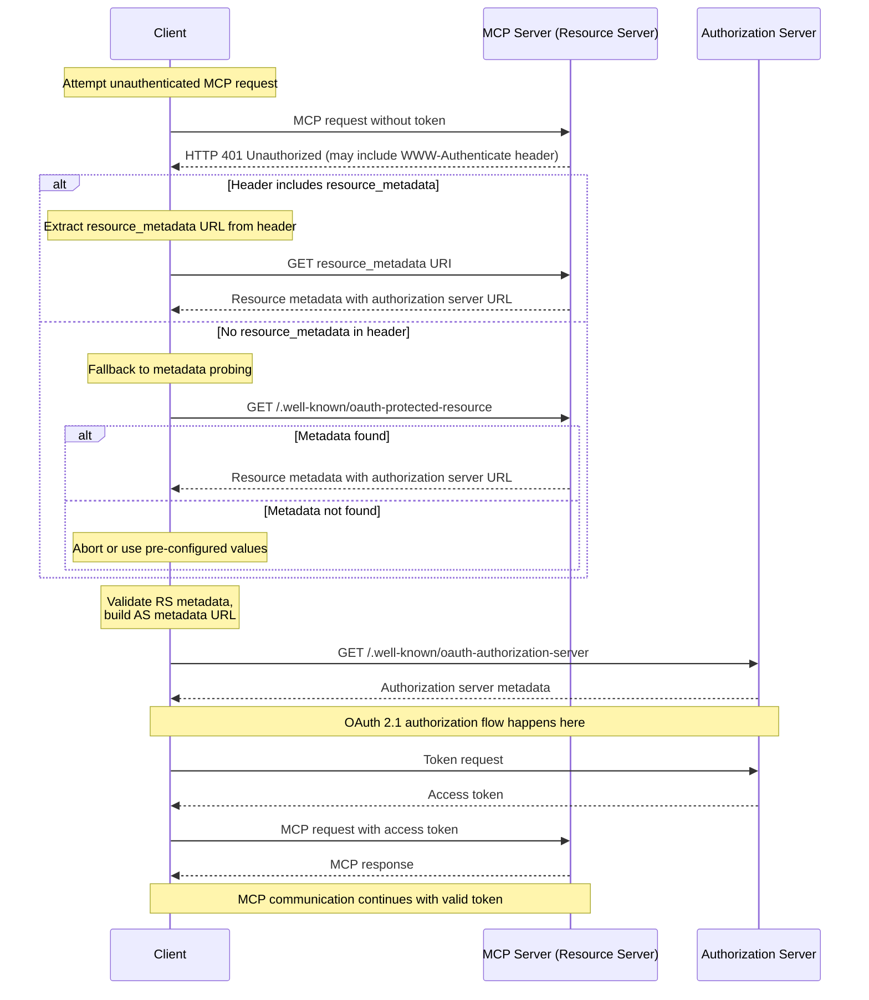

- **状态（Status）**: Final
- **类型（Type）**: Standards Track
- **创建（Created）**: 2025-07-16
- **作者（Author(s)）**: sunishsheth2009
- **Issue**: #985

## 摘要

本提案使 MCP 规范对 OAuth 2.0 受保护资源元数据的处理与 [RFC 9728](https://datatracker.ietf.org/doc/html/rfc9728#name-obtaining-protected-resourc) 保持一致。

当前，MCP 规范要求在返回 401 Unauthorized 时使用 HTTP WWW-Authenticate 头部来指示受保护资源元数据的位置。然而，[RFC 9728 第 5 节](https://datatracker.ietf.org/doc/html/rfc9728#section-5)指出：

"受保护资源**可以（MAY）**使用 RFC 9110 中讨论的 WWW-Authenticate HTTP 响应头部字段，向客户端返回其受保护资源元数据的 URL。"

这表明 MCP 规范可以在保持 RFC 合规的同时变得更灵活。

## 理由

许多大规模、动态、多租户的环境依赖于一个独立于后端资源服务器的集中式认证服务。在此类部署中，由于关注点分离和基础设施复杂性，从后端服务注入 WWW-Authenticate 头部并非易事。

在这些场景下，能够通过 well-known URL 发现元数据提供了一条更易于采用 MCP 的实用路径。仅要求使用头部会在各组件之间强加显著的通信开销，尤其是在数百或数千个 MCP 实例被动态创建和销毁时。此外，如果存在特定的托管 MCP 服务器，在集中式系统中采用头部会带来显著的开销。

虽然这增加了客户端的复杂性——客户端现在必须实现探测元数据端点的逻辑——但它降低了服务器部署的摩擦，并可能鼓励更广泛的采用。这里存在权衡：

对服务器开发者的好处：避免复杂的头部注入；简化分布式环境中的集成。

对客户端开发者的坏处：当头部缺失时，客户端必须回退到元数据发现逻辑，增加了客户端的复杂性。

## 提议状态

将 MCP 规范更新为：

```
Clients MUST interpret the WWW-Authenticate header, and fallback to probing for metadata if not present.
Servers SHOULD return the WWW-Authenticate header
```

**略微偏离 RFC 的原因：**
对 WWW-Authenticate 选择 SHOULD 而非 MAY，是因为这使得支持其他特性（如增量授权）更容易（例如：你为某个工具发起请求，但需要额外的作用域，于是收到一个指明所需作用域的 WWW-Authenticate 质询）。

基于上述内容，遵循更新后的流程：

- 在不带令牌的情况下尝试发起 MCP 请求。
- 如果收到 401 Unauthorized 响应：检查是否有 WWW-Authenticate 头部。如果存在且包含 resource_metadata 参数，用它来定位资源元数据。
- 如果头部缺失或不包含 resource_metadata，回退到请求 /.well-known/oauth-protected-resource。

此变更允许更灵活的部署模型，同时不移除现有能力。



## 向后兼容性

本提案完全向后兼容。

它保留了对 WWW-Authenticate 头部的支持（已在规范中），并引入了一种使用 .well-known 元数据路径的回退机制，而该路径在 MCP 中已被定义为必须（MUST）支持的位置。

已经支持元数据探测的客户端可从改进的互操作性中受益。如果发出 WWW-Authenticate 头部不可行，服务器无需发出它，但仍鼓励这样做，以降低客户端复杂性并支持未来的可扩展性。
