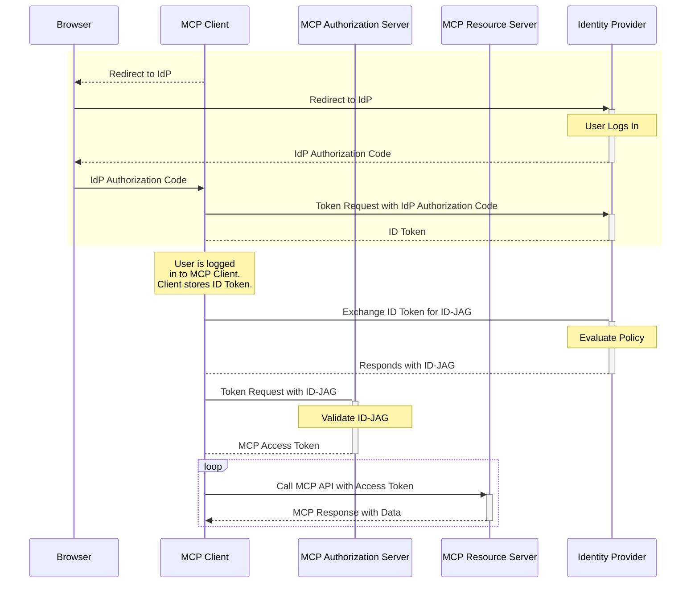

- **状态（Status）**: Final
- **类型（Type）**: Standards Track
- **创建（Created）**: 2025-06-04
- **作者（Author(s)）**: Aaron Parecki (@aaronpk)
- **PR**: #646
- **Issue**: #990

## 摘要

本扩展旨在借助既有的企业身份基础设施，在企业环境中促成对 MCP 客户端的安全、可互操作的授权。

- 对终端用户而言，这免去了手动将 MCP 客户端连接并授权到组织内各个服务的需要。
- 对企业管理员而言，这带来了对组织内可以使用哪些 MCP 服务器的可见性和控制力。

## 这是如何测试的？

我们在[此处](https://github.com/oktadev/okta-cross-app-access-mcp)有一个端到端的实现，并与一些合作伙伴进行了进行中的 MCP 实现。

## 破坏性变更

本扩展旨在增强既有的 OAuth 配置文件，在企业 IdP 下使用时提供一种替代方案。MCP 客户端可以在必要时选择加入此配置文件。

## 补充背景

有关此问题的更多背景，你可以参考我关于此主题的博客文章：

[Enterprise-Ready MCP](https://aaronparecki.com/2025/05/12/27/enterprise-ready-mcp)

我也在 5 月的 MCP Dev Summit 上介绍了这一方案。

该流程的高层概览如下：

> [!IMPORTANT]
> **状态：** 准备评审（Ready to Review）
