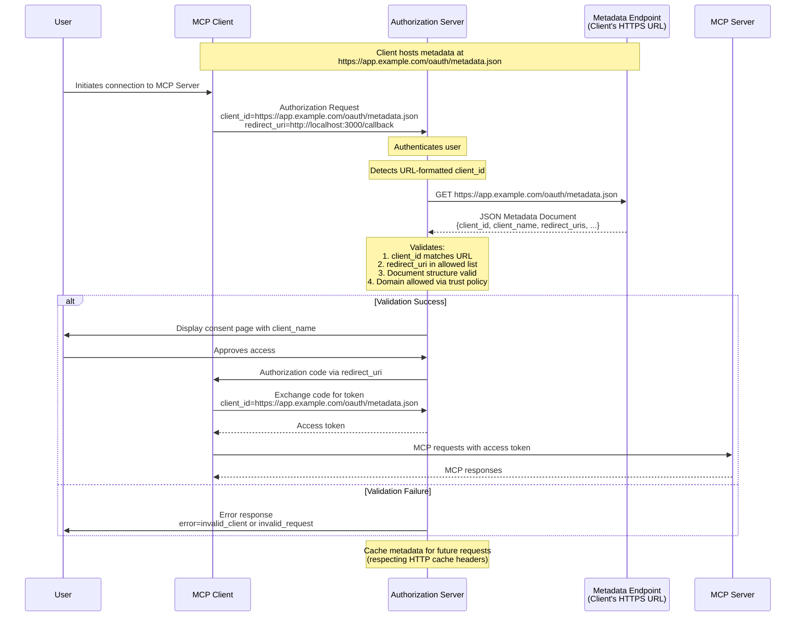

- **状态（Status）**: Final
- **类型（Type）**: Standards Track
- **创建（Created）**: 2025-07-07
- **作者（Author(s)）**: Paul Carleton (@pcarleton) Aaron Parecki (@aaronpk)
- **Issue**: #991

# SEP：面向 MCP 的 OAuth 客户端 ID 元数据文档

## 摘要

本 SEP 提议采用 [draft-parecki-oauth-client-id-metadata-document-03](https://datatracker.ietf.org/doc/draft-parecki-oauth-client-id-metadata-document/) 中规定的 OAuth 客户端 ID 元数据文档，作为模型上下文协议（MCP）的一种额外客户端注册机制。此方式允许 OAuth 客户端使用 HTTPS URL 作为客户端标识符，其中该 URL 指向一个包含客户端元数据的 JSON 文档。它专门针对服务器与客户端之间没有既有关系的常见 MCP 场景，使服务器无需预先协调即可信任客户端，同时保持对访问策略的完全控制。

## 动机

模型上下文协议目前支持两种客户端注册方式：

1. **预注册（Pre-registration）**：要求客户端开发者或用户手动向每个服务器注册客户端
2. **动态客户端注册（DCR）**：通过向授权服务器上的注册端点发送客户端元数据，允许即时（just-in-time）注册。

对于 MCP 客户端经常需要连接到从未遇到过的服务器这一用例，两种方式都有显著局限：

- 由开发者预注册不切实际，因为客户端发布时服务器可能尚不存在
- 由用户预注册造成糟糕的 UX，需要手动管理凭据
- DCR 要求服务器管理无界的数据库、处理过期，并信任自我声明的元数据

### 目标用例：没有既有关系

本提案专门针对以下常见的 MCP 场景：

- 用户想将客户端连接到其发现的某个服务器
- 客户端开发者从未听说过这个服务器
- 服务器运营者从未听说过这个客户端
- 双方需要在没有先前协调的情况下建立信任

对于存在既有关系的场景，预注册仍是最优解。然而，MCP 的价值来自其连接任意客户端和服务器的能力，这使得"没有既有关系"的情况成为必须解决的关键。

与此相关，MCP 服务器远多于客户端（类似于 Web 浏览器远多于 API）。一个常见场景是 MCP 服务器开发者想将使用限制在一组他们信任的客户端上。

### 关键创新：无需预先协调的服务器控制信任

客户端 ID 元数据文档实现了一种独特的信任模型：

1. **服务器可以信任从未见过的客户端**，基于：
   - 托管元数据的 HTTPS 域名
   - 元数据内容本身
   - 域名信誉和安全策略

2. **服务器通过灵活的策略保持完全控制**：
   - **开放服务器**：可以接受任何 HTTPS client_id，实现最大互操作性
   - **受保护服务器**：可以限制到受信任的域名或特定客户端

3. **无需客户端预先协调**：
   - 客户端无需事先了解服务器
   - 客户端只需托管其元数据文档
   - 信任源自客户端的域名，而非先前的注册

## 规范变更

对规范的变更是：将客户端 ID 元数据文档添加为 SHOULD，并将 DCR 改为 MAY，因为我们认为客户端 ID 元数据文档对此场景而言是更好的默认选项。

我们将主要依赖所链接 RFC 中的文本，力求不重复其大部分内容。以下是我们需要规定内容的简短版本。



### 客户端要求

- 客户端**必须（MUST）**遵循 RFC 要求，在一个 HTTPS URL 上托管其元数据文档
- client_id URL **必须（MUST）**使用 "https" scheme 且包含路径部分
- 元数据文档**必须（MUST）**是有效的 JSON，并至少包含：
  - `client_id`：与文档 URL 完全匹配
  - `client_name`：用于授权提示的人类可读名称
  - `redirect_uris`：允许的重定向 URI 数组
  - `token_endpoint_auth_method`：公共客户端为 "none"

注意，鉴于客户端元数据可以提供公钥信息，客户端可以将 `private_key_jwt` 用作 `token_endpoint_auth_method`。

### 服务器要求

- 服务器**应当（SHOULD）**在遇到 URL 格式的 client_id 时获取元数据文档
- 服务器**必须（MUST）**验证获取的文档包含匹配的 client_id
- 服务器**应当（SHOULD）**遵循 HTTP 头部缓存元数据（建议最长 24 小时）
- 服务器**必须（MUST）**验证重定向 URI 与元数据文档中的一致

### 发现

- 服务器通过 OAuth 元数据公告支持：`client_id_metadata_document_supported: true`
- 客户端检测支持情况，若不可用则可回退到 DCR 或预注册

元数据文档示例：

```json
{
  "client_id": "https://app.example.com/oauth/client-metadata.json",
  "client_name": "Example MCP Client",
  "client_uri": "https://app.example.com",
  "logo_uri": "https://app.example.com/logo.png",
  "redirect_uris": [
    "http://127.0.0.1:3000/callback",
    "http://localhost:3000/callback"
  ],
  "grant_types": ["authorization_code"],
  "response_types": ["code"],
  "token_endpoint_auth_method": "none"
}
```

### 与既有 MCP 授权的集成

本提案将客户端 ID 元数据文档作为第三种注册选项，与预注册和 DCR 并列。服务器**可以（MAY）**支持这些方式的任意组合：

- 预注册保持不变
- DCR 保持不变
- 客户端 ID 元数据文档通过 URL 格式的 client_id 检测，服务器支持在 OAuth 元数据中公告。

## 理由

### 为何这能解决"没有既有关系"问题

与需要协调的预注册、或需要服务器管理注册数据库的 DCR 不同，客户端 ID 元数据文档提供：

1. **可验证的身份**：HTTPS URL 同时充当标识符和信任锚
2. **无需协调**：客户端发布元数据，服务器消费它
3. **灵活的信任策略**：服务器自行决定信任标准，无需客户端改动
4. **稳定的标识符**：与 DCR 的临时 ID 不同，URL 稳定且可审计

### 重定向 URI 证明

客户端 ID 元数据文档的一个关键好处是对重定向 URI 的证明：

1. **元数据文档通过 HTTPS 将重定向 URI 以密码学方式绑定到客户端身份**
2. **服务器可以信任元数据中的重定向 URI 受客户端控制**——而非攻击者提供
3. **这防止了自我声明注册中常见的重定向 URI 篡改攻击**

### 此方式的风险

#### 风险：Localhost URL 冒充

客户端 ID 元数据文档的一个局限是，它本身无法防止 localhost URL 冒充。攻击者可以通过以下方式声称自己是任何客户端：

1. 提供合法客户端的元数据 URL 作为其 client_id
2. 绑定到合法客户端使用的同一个 localhost 端口
3. 在用户批准时拦截授权码

此攻击令人担忧，因为服务器看到的是正确的元数据文档，用户看到的是正确的客户端名称，使得检测变得困难。

平台特定的证明（iOS DeviceCheck、Android Play Integrity）可以解决这一问题，但它们并非普遍可用。其工作方式是：开发者运行一个后端服务，消费 DeviceCheck / Play Integrity 签名，并返回一个可用作 `token_endpoint_auth_method` 之 `private_key_jwt` 认证的 JWT。

一种不需要平台特定证明、但仍能提高攻击成本的类似方式，是使用 JWKS 和由客户端开发者托管的服务器端组件签名的短期 JWT。该组件可以使用平台特定之外的证明机制来证明客户端身份，例如客户端的标准登录流。使用短期 JWT 降低了凭据泄露和重放的风险，但并不能完全消除——攻击者仍可代理请求到合法客户端的签名端点。

完全缓解此风险超出本提案范围。本提案在 localhost 重定向场景中具有与 DCR 相同的风险。

服务器**应当（SHOULD）**为仅限 localhost 的客户端显示额外警告。

#### 风险：服务器端请求伪造（SSRF）

授权服务器从未知客户端接收一个 URL 作为输入，然后获取该 URL。恶意客户端可以借此代表授权服务器发送非元数据请求。一个例子是发送一个对应于授权服务器有权访问的私有管理端点的 URL。

这可以通过在发起获取请求之前验证 URL 及其解析到的 IP 来防止。

#### 风险：分布式拒绝服务（DDoS）

类似地，攻击者可能试图利用一批授权服务器对某个非 MCP 服务器发动拒绝服务攻击。

获取请求没有任何额外的放大（即客户端发起请求的带宽大致等于发往目标服务器的请求带宽），且每个授权服务器都可以积极缓存这些元数据获取的结果，因此它不太可能成为有吸引力的 DDoS 向量。

#### 风险：所引用规范的成熟度

客户端 ID 元数据文档的 RFC 仍是草案。它已被 Bluesky 平台实现，但尚未被批准，除该平台外也未被广泛采用，并可能随时间演变。我们的意图是随后续草案和任何最终标准演进并对齐，同时尽量减少对既有实现的扰乱和破坏。

此方式有一个风险：协议中可能存在尚未浮现的实现挑战或缺陷。然而，即便 DCR 已被批准，它在像 MCP 这样的开放生态上下文中被使用时，开发者也面临诸多实现挑战。这些挑战正是本提案背后的动机。

#### 风险：客户端实现负担，尤其是本地客户端

本规范要求客户端提供一份额外的基础设施，因为它们需要在一个 HTTPS URL 后托管一个元数据文件。没有本规范时，客户端可以严格地只是一个桌面应用。

托管此端点的负担预计很低，因为托管一个静态 JSON 文件相当直接，且大多数已知客户端都有一个宣传其客户端或提供下载链接的网页。

#### 风险：授权方式的碎片化

MCP 的授权对客户端和服务器而言本已难以完整实现。关于如何正确实现和最佳实践的问题是社区中最常见的一些问题。为授权流添加另一个分支意味着这可能变得更复杂、更分裂，意味着更少的开发者成功遵循规范，兼容性和开放生态的承诺也因此受损。

本提案旨在通过提供更清晰的机制来信任重定向 URI 并减少运营开销，从而简化授权服务器和资源服务器开发者的处境。本提案依赖于这种简单性对大多数人而言明显是更好的选择，这将推动更多采用并最终成为最受支持的选项。如果我们不相信它明显是更好的选择，那么就不应采用本提案。

本提案还为开放服务器和想要限制可用客户端的服务器提供了统一的机制。本提案的替代方案要求客户端和服务器为开放和受保护用例实现不同的机制。

## 所考虑的替代方案

1. **带软件声明的增强型 DCR**：更复杂，需要 JWKS 托管和 JWT 签名
2. **强制预注册**：对 MCP 的分布式生态而言，开发者和用户体验糟糕
3. **双向 TLS**：需要信任一个客户端证书颁发机构，在开放生态中不切实际
4. **维持现状**：延续服务器实现者当前的痛点

对于最常见的开放生态用例，客户端 ID 元数据文档是相较 DCR 的严格改进。它未来可以进一步扩展，以更好地支持诸如操作系统级证明和 jwks_uri 之类的东西。

## 向后兼容性

本提案完全向后兼容：

- 既有的预注册客户端继续保持不变地工作
- 既有的 DCR 实现继续保持不变地工作
- 服务器可以增量采用客户端 ID 元数据文档
- 客户端可以检测支持情况并回退到其他方法

## 原型实现

一个原型实现可在[此处](https://github.com/modelcontextprotocol/typescript-sdk/pull/839)获取，演示了：

1. 客户端侧的元数据文档托管
2. 服务器侧的元数据获取和验证
3. 与既有 MCP OAuth 流的集成
4. 恰当的错误处理和回退行为

## 安全影响

1. **防钓鱼**：突出显示客户端主机名
2. **SSRF 防护**：验证 URL、限制响应大小、请求超时、对出站请求限速

### 最佳实践

- 仅在认证用户之后才获取客户端元数据
- 对出站元数据获取实施限速
- 对新的/未知的/localhost 域名考虑额外警告
- 记录元数据获取失败以便监控

## 参考资料

- [draft-parecki-oauth-client-id-metadata-document-03](https://www.ietf.org/archive/id/draft-parecki-oauth-client-id-metadata-document-03.txt)
- [OAuth 2.1](https://datatracker.ietf.org/doc/draft-ietf-oauth-v2-1/)
- [RFC 7591 - OAuth 2.0 Dynamic Client Registration](https://www.rfc-editor.org/rfc/rfc7591.html)
- [MCP Specification - Authorization](https://modelcontextprotocol.org/docs/spec/authorization)
- [Evolving OAuth Client Registration in the Model Context Protocol](https://github.com/modelcontextprotocol/modelcontextprotocol/pull/1027/)
