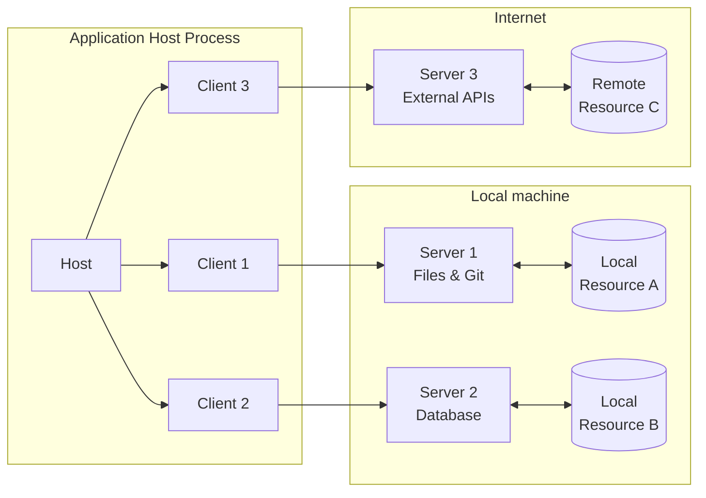
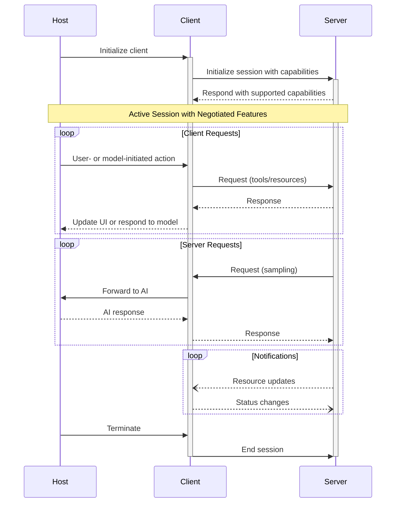

模型上下文协议（MCP）遵循客户端-宿主-服务器架构，其中每个宿主可以运行多个客户端实例。这种架构使用户能够跨应用集成 AI 能力，同时保持清晰的安全边界并隔离关注点。MCP 构建于 JSON-RPC 之上，提供一个有状态的会话协议，专注于客户端与服务器之间的上下文交换和采样协调。

## 核心组件

### 宿主（Host）

宿主进程充当容器和协调者：

- 创建和管理多个客户端实例
- 控制客户端连接权限和生命周期
- 强制执行安全策略和同意要求
- 处理用户授权决策
- 协调 AI/LLM 集成和采样
- 管理跨客户端的上下文聚合

### 客户端（Clients）

每个客户端由宿主创建，并维持一个隔离的服务器连接：

- 为每个服务器建立一个有状态的会话
- 处理协议协商和能力交换
- 双向路由协议消息
- 管理订阅和通知
- 在服务器之间维持安全边界

一个宿主应用创建和管理多个客户端，每个客户端与一个特定的服务器有 1:1 的关系。

### 服务器（Servers）

服务器提供专门的上下文和能力：

- 通过 MCP 原语暴露资源、工具和提示
- 以聚焦的职责独立运作
- 通过客户端接口请求采样
- 必须尊重安全约束
- 可以是本地进程或远程服务

## 设计原则

MCP 建立在若干关键设计原则之上，这些原则指导其架构和实现：

1. **服务器应当极易构建**
   - 宿主应用处理复杂的编排职责
   - 服务器专注于特定的、定义良好的能力
   - 简单的接口最小化实现开销
   - 清晰的分离使代码可维护

2. **服务器应当高度可组合**
   - 每个服务器独立地提供聚焦的功能
   - 多个服务器可以无缝组合
   - 共享的协议实现互操作性
   - 模块化设计支持可扩展性

3. **服务器不应能够读取整个对话，也不能"窥视"其他服务器**
   - 服务器只接收必要的上下文信息
   - 完整的对话历史保留在宿主处
   - 每个服务器连接维持隔离
   - 跨服务器交互由宿主控制
   - 宿主进程强制执行安全边界

4. **特性可以渐进地添加到服务器和客户端**
   - 核心协议提供最小的必需功能
   - 额外的能力可以按需协商
   - 服务器和客户端独立演进
   - 协议为未来的可扩展性而设计
   - 保持向后兼容性

## 能力协商

模型上下文协议使用基于能力的协商系统，其中客户端和服务器在初始化期间显式地声明它们所支持的特性。能力决定了在一个会话期间哪些协议特性和原语可用。

- 服务器声明诸如资源订阅、工具支持和提示模板之类的能力
- 客户端声明诸如采样支持和通知处理之类的能力
- 双方必须在整个会话期间尊重所声明的能力
- 额外的能力可以通过对协议的扩展来协商

每种能力在会话期间解锁特定的协议特性以供使用。例如：

- 已实现的[服务器特性](/specification/2025-11-25/server)必须在服务器的能力中被公布
- 发出资源订阅通知要求服务器声明订阅支持
- 工具调用要求服务器声明工具能力
- [采样](/specification/2025-11-25/client/sampling)要求客户端在其能力中声明支持

这种能力协商确保客户端和服务器对所支持的功能有清晰的理解，同时保持协议的可扩展性。
