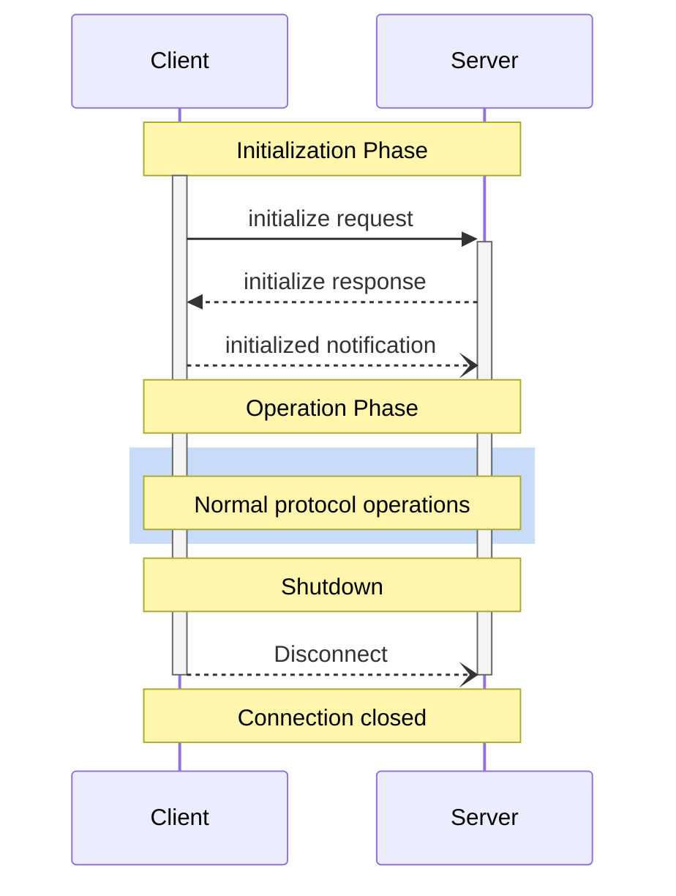

<div id="enable-section-numbers" />

模型上下文协议（MCP）为客户端-服务器连接定义了一个严格的生命周期，以确保正确的能力协商和状态管理。

1. **初始化（Initialization）**：能力协商和协议版本协定
2. **运行（Operation）**：正常的协议通信
3. **关闭（Shutdown）**：连接的优雅终止



## 生命周期阶段

### 初始化

初始化阶段**必须（MUST）**是客户端与服务器之间的第一次交互。在此阶段，客户端和服务器：

- 建立协议版本兼容性
- 交换并协商能力
- 共享实现细节

客户端**必须（MUST）**通过发送一个包含以下内容的 `initialize` 请求来发起此阶段：

- 支持的协议版本
- 客户端能力
- 客户端实现信息

```json
{
  "jsonrpc": "2.0",
  "id": 1,
  "method": "initialize",
  "params": {
    "protocolVersion": "2025-11-25",
    "capabilities": {
      "roots": {
        "listChanged": true
      },
      "sampling": {},
      "elicitation": {
        "form": {},
        "url": {}
      },
      "tasks": {
        "requests": {
          "elicitation": {
            "create": {}
          },
          "sampling": {
            "createMessage": {}
          }
        }
      }
    },
    "clientInfo": {
      "name": "ExampleClient",
      "title": "Example Client Display Name",
      "version": "1.0.0",
      "description": "An example MCP client application",
      "icons": [
        {
          "src": "https://example.com/icon.png",
          "mimeType": "image/png",
          "sizes": ["48x48"]
        }
      ],
      "websiteUrl": "https://example.com"
    }
  }
}
```

服务器**必须（MUST）**以其自己的能力和信息响应：

```json
{
  "jsonrpc": "2.0",
  "id": 1,
  "result": {
    "protocolVersion": "2025-11-25",
    "capabilities": {
      "logging": {},
      "prompts": {
        "listChanged": true
      },
      "resources": {
        "subscribe": true,
        "listChanged": true
      },
      "tools": {
        "listChanged": true
      },
      "tasks": {
        "list": {},
        "cancel": {},
        "requests": {
          "tools": {
            "call": {}
          }
        }
      }
    },
    "serverInfo": {
      "name": "ExampleServer",
      "title": "Example Server Display Name",
      "version": "1.0.0",
      "description": "An example MCP server providing tools and resources",
      "icons": [
        {
          "src": "https://example.com/server-icon.svg",
          "mimeType": "image/svg+xml",
          "sizes": ["any"]
        }
      ],
      "websiteUrl": "https://example.com/server"
    },
    "instructions": "Optional instructions for the client"
  }
}
```

成功初始化后，客户端**必须（MUST）**发送一个 `initialized` 通知以表明它已准备好开始正常操作：

```json
{
  "jsonrpc": "2.0",
  "method": "notifications/initialized"
}
```

- 在服务器响应 `initialize` 请求之前，客户端**不应（SHOULD NOT）**发送除 [ping](/specification/2025-11-25/basic/utilities/ping) 以外的请求。
- 在收到 `initialized` 通知之前，服务器**不应（SHOULD NOT）**发送除 [ping](/specification/2025-11-25/basic/utilities/ping) 和[日志](/specification/2025-11-25/server/utilities/logging)以外的请求。

#### 版本协商

在 `initialize` 请求中，客户端**必须（MUST）**发送一个它支持的协议版本。这**应当（SHOULD）**是客户端支持的_最新_版本。

如果服务器支持所请求的协议版本，它**必须（MUST）**以相同的版本响应。否则，服务器**必须（MUST）**以另一个它支持的协议版本响应。这**应当（SHOULD）**是服务器支持的_最新_版本。

如果客户端不支持服务器响应中的版本，它**应当（SHOULD）**断开连接。

<Note>
  如果使用 HTTP，客户端**必须（MUST）**在向 MCP 服务器发出的所有后续请求上包含 `MCP-Protocol-Version: <protocol-version>` HTTP header。详情参见[传输中的协议版本 Header 一节](/specification/2025-11-25/basic/transports#protocol-version-header)。
</Note>

#### 能力协商

客户端和服务器的能力确立了会话期间哪些可选的协议特性将可用。

关键能力包括：

| 类别 | 能力           | 描述                                                                                          |
| ---- | -------------- | --------------------------------------------------------------------------------------------- |
| 客户端 | `roots`        | 提供文件系统[根](/specification/2025-11-25/client/roots)的能力                                |
| 客户端 | `sampling`     | 对 LLM [采样](/specification/2025-11-25/client/sampling)请求的支持                            |
| 客户端 | `elicitation`  | 对服务器[征询](/specification/2025-11-25/client/elicitation)请求的支持                        |
| 客户端 | `tasks`        | 对[任务增强](/specification/2025-11-25/basic/utilities/tasks)客户端请求的支持                 |
| 客户端 | `experimental` | 描述对非标准实验性特性的支持                                                                    |
| 服务器 | `prompts`      | 提供[提示模板](/specification/2025-11-25/server/prompts)                                      |
| 服务器 | `resources`    | 提供可读的[资源](/specification/2025-11-25/server/resources)                                  |
| 服务器 | `tools`        | 暴露可调用的[工具](/specification/2025-11-25/server/tools)                                    |
| 服务器 | `logging`      | 发出结构化的[日志消息](/specification/2025-11-25/server/utilities/logging)                    |
| 服务器 | `completions`  | 支持参数[自动补全](/specification/2025-11-25/server/utilities/completion)                     |
| 服务器 | `tasks`        | 对[任务增强](/specification/2025-11-25/basic/utilities/tasks)服务器请求的支持                 |
| 服务器 | `experimental` | 描述对非标准实验性特性的支持                                                                    |

能力对象可以描述子能力，例如：

- `listChanged`：对列表变更通知的支持（用于提示、资源和工具）
- `subscribe`：对订阅单个项目变化的支持（仅资源）

### 运行

在运行阶段，客户端和服务器根据协商的能力交换消息。

双方**必须（MUST）**：

- 尊重协商的协议版本
- 只使用成功协商的能力

### 关闭

在关闭阶段，一方（通常是客户端）干净地终止协议连接。没有定义特定的关闭消息——相反，应使用底层传输机制来示意连接终止：

#### stdio

对于 stdio [传输](/specification/2025-11-25/basic/transports)，客户端**应当（SHOULD）**通过以下方式发起关闭：

1. 首先，关闭到子进程（服务器）的输入流
2. 等待服务器退出，或者如果服务器未在合理时间内退出则发送 `SIGTERM`
3. 如果服务器在 `SIGTERM` 之后仍未在合理时间内退出则发送 `SIGKILL`

服务器**可以（MAY）**通过关闭其到客户端的输出流并退出来发起关闭。

#### HTTP

对于 HTTP [传输](/specification/2025-11-25/basic/transports)，关闭通过关闭关联的 HTTP 连接来指示。

## 超时

实现**应当（SHOULD）**为所有发送的请求建立超时，以防止连接挂起和资源耗尽。当请求在超时期限内未收到成功或错误响应时，发送方**应当（SHOULD）**为该请求发出一个[取消通知](/specification/2025-11-25/basic/utilities/cancellation)并停止等待响应。

SDK 和其他中间件**应当（SHOULD）**允许这些超时按请求逐一配置。

实现**可以（MAY）**选择在收到与请求对应的[进度通知](/specification/2025-11-25/basic/utilities/progress)时重置超时时钟，因为这意味着工作确实在进行。然而，实现**应当（SHOULD）**始终强制执行一个最大超时，无论进度通知如何，以限制行为不当的客户端或服务器的影响。

## 错误处理

实现**应当（SHOULD）**准备好处理这些错误情形：

- 协议版本不匹配
- 未能协商所需的能力
- 请求[超时](#超时)

初始化错误示例：

```json
{
  "jsonrpc": "2.0",
  "id": 1,
  "error": {
    "code": -32602,
    "message": "Unsupported protocol version",
    "data": {
      "supported": ["2024-11-05"],
      "requested": "1.0.0"
    }
  }
}
```
