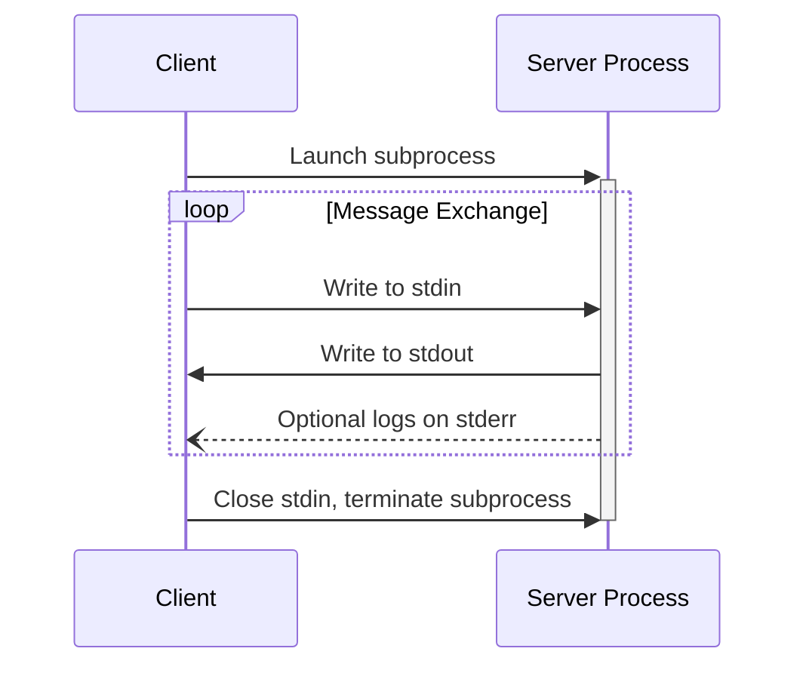
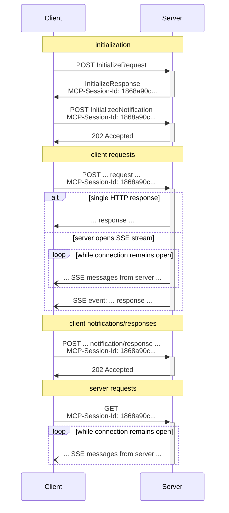

MCP 使用 JSON-RPC 编码消息。JSON-RPC 消息**必须（MUST）**为 UTF-8 编码。

协议当前为客户端-服务器通信定义了两种标准传输机制：

1. [stdio](#stdio)，通过标准输入和标准输出通信
2. [Streamable HTTP](#streamable-http)

客户端**应当（SHOULD）**尽可能支持 stdio。

客户端和服务器也可以以可插拔的方式实现[自定义传输](#custom-transports)。

## stdio

在 **stdio** 传输中：

- 客户端将 MCP 服务器作为子进程启动。
- 服务器从其标准输入（`stdin`）读取 JSON-RPC 消息，并将消息发送到其标准输出（`stdout`）。
- 消息是单个的 JSON-RPC 请求、通知或响应。
- 消息由换行符分隔，并**不得（MUST NOT）**包含嵌入的换行符。
- 服务器**可以（MAY）**为任何日志目的（包括信息性、调试和错误消息）向其标准错误（`stderr`）写入 UTF-8 字符串。
- 客户端**可以（MAY）**捕获、转发或忽略服务器的 `stderr` 输出，并**不应（SHOULD NOT）**假定 `stderr` 输出表示错误状况。
- 服务器**不得（MUST NOT）**向其 `stdout` 写入任何不是有效 MCP 消息的内容。
- 客户端**不得（MUST NOT）**向服务器的 `stdin` 写入任何不是有效 MCP 消息的内容。

## Streamable HTTP

<Info>
  这取代了协议版本 2024-11-05 中的 [HTTP+SSE 传输](/specification/2024-11-05/basic/transports#http-with-sse)。参见下方的[向后兼容](#backwards-compatibility)指南。
</Info>

在 **Streamable HTTP** 传输中，服务器作为一个独立的进程运行，可以处理多个客户端连接。此传输使用 HTTP POST 和 GET 请求。服务器可以选择性地使用 [Server-Sent Events](https://en.wikipedia.org/wiki/Server-sent_events)（SSE）来流式传输多条服务器消息。这既支持基本的 MCP 服务器，也支持更功能丰富的、支持流式传输和服务器到客户端通知与请求的服务器。

服务器**必须（MUST）**提供一个同时支持 POST 和 GET 方法的单一 HTTP 端点路径（此后称为 **MCP 端点**）。例如，这可以是像 `https://example.com/mcp` 这样的 URL。

#### 安全警告

在实现 Streamable HTTP 传输时：

1. 服务器**必须（MUST）**校验所有入站连接上的 `Origin` header，以防止 DNS 重绑定攻击
   - 如果 `Origin` header 存在且无效，服务器**必须（MUST）**以 HTTP 403 Forbidden 响应。HTTP 响应体**可以（MAY）**由一个没有 `id` 的 JSON-RPC _错误响应_ 构成
2. 在本地运行时，服务器**应当（SHOULD）**只绑定到 localhost（127.0.0.1），而非所有网络接口（0.0.0.0）
3. 服务器**应当（SHOULD）**为所有连接实现适当的身份认证

没有这些保护，攻击者可能利用 DNS 重绑定从远程网站与本地 MCP 服务器交互。

### 向服务器发送消息

从客户端发送的每条 JSON-RPC 消息**必须（MUST）**是向 MCP 端点发起的一个新的 HTTP POST 请求。

1. 客户端**必须（MUST）**使用 HTTP POST 向 MCP 端点发送 JSON-RPC 消息。
2. 客户端**必须（MUST）**包含一个 `Accept` header，将 `application/json` 和 `text/event-stream` 都列为受支持的内容类型。
3. POST 请求的 body **必须（MUST）**是单个 JSON-RPC _请求_、_通知_ 或 _响应_。
4. 如果输入是一个 JSON-RPC _响应_ 或 _通知_：
   - 如果服务器接受该输入，服务器**必须（MUST）**返回 HTTP 状态码 202 Accepted，且无 body。
   - 如果服务器无法接受该输入，它**必须（MUST）**返回一个 HTTP 错误状态码（例如 400 Bad Request）。HTTP 响应体**可以（MAY）**由一个没有 `id` 的 JSON-RPC _错误响应_ 构成。
5. 如果输入是一个 JSON-RPC _请求_，服务器**必须（MUST）**要么返回 `Content-Type: text/event-stream` 以发起一个 SSE 流，要么返回 `Content-Type: application/json` 以返回一个 JSON 对象。客户端**必须（MUST）**支持这两种情况。
6. 如果服务器发起一个 SSE 流：
   - 服务器**应当（SHOULD）**立即发送一个由事件 ID 和空 `data` 字段组成的 SSE 事件，以便让客户端准备好重连（使用该事件 ID 作为 `Last-Event-ID`）。
   - 在服务器向客户端发送了一个带事件 ID 的 SSE 事件之后，服务器**可以（MAY）**在任意时刻关闭_连接_（而不终止 _SSE 流_），以避免持有长连接。客户端随后**应当（SHOULD）**通过尝试重连来"轮询"该 SSE 流。
   - 如果服务器确实在终止 _SSE 流_ 之前关闭了_连接_，它**应当（SHOULD）**在关闭连接之前发送一个带标准 [`retry`](https://html.spec.whatwg.org/multipage/server-sent-events.html#:~:text=field%20name%20is%20%22retry%22) 字段的 SSE 事件。客户端**必须（MUST）**尊重 `retry` 字段，在尝试重连之前等待给定的毫秒数。
   - SSE 流**应当（SHOULD）**最终包含针对 POST body 中所发送 JSON-RPC _请求_ 的一个 JSON-RPC _响应_。
   - 服务器**可以（MAY）**在发送 JSON-RPC _响应_ 之前发送 JSON-RPC _请求_ 和 _通知_。这些消息**应当（SHOULD）**与发起的客户端 _请求_ 相关。
   - 如果[会话](#session-management)过期，服务器**可以（MAY）**终止 SSE 流。
   - 在 JSON-RPC _响应_ 已被发送之后，服务器**应当（SHOULD）**终止 SSE 流。
   - 断开连接**可以（MAY）**在任意时刻发生（例如由于网络状况）。因此：
     - 断开连接**不应（SHOULD NOT）**被解释为客户端取消其请求。
     - 要取消，客户端**应当（SHOULD）**显式发送一个 MCP `CancelledNotification`。
     - 为避免因断开连接而丢失消息，服务器**可以（MAY）**使该流[可恢复](#resumability-and-redelivery)。

### 监听来自服务器的消息

1. 客户端**可以（MAY）**向 MCP 端点发起一个 HTTP GET。这可用于打开一个 SSE 流，允许服务器在客户端未先通过 HTTP POST 发送数据的情况下与客户端通信。
2. 客户端**必须（MUST）**包含一个 `Accept` header，将 `text/event-stream` 列为受支持的内容类型。
3. 服务器**必须（MUST）**要么响应此 HTTP GET 返回 `Content-Type: text/event-stream`，要么返回 HTTP 405 Method Not Allowed，指示服务器在此端点不提供 SSE 流。
4. 如果服务器发起一个 SSE 流：
   - 服务器**可以（MAY）**在该流上发送 JSON-RPC _请求_ 和 _通知_。
   - 这些消息**应当（SHOULD）**与来自客户端的任何并发运行的 JSON-RPC _请求_ 无关。
   - 服务器**不得（MUST NOT）**在该流上发送 JSON-RPC _响应_，**除非**正在[恢复](#resumability-and-redelivery)一个与先前客户端请求关联的流。
   - 服务器**可以（MAY）**在任意时刻关闭 SSE 流。
   - 如果服务器在不终止_流_的情况下关闭_连接_，它**应当（SHOULD）**遵循与 POST 请求所述相同的轮询行为：发送一个 `retry` 字段并允许客户端重连。
   - 客户端**可以（MAY）**在任意时刻关闭 SSE 流。

### 多个连接

1. 客户端**可以（MAY）**同时保持连接到多个 SSE 流。
2. 服务器**必须（MUST）**只在已连接的流之一上发送其每条 JSON-RPC 消息；也就是说，它**不得（MUST NOT）**跨多个流广播同一条消息。
   - 通过使流[可恢复](#resumability-and-redelivery)，可以缓解消息丢失的风险。

### 可恢复性与重投递

为支持恢复中断的连接并重投递可能丢失的消息：

1. 服务器**可以（MAY）**为其 SSE 事件附加一个 `id` 字段，如 [SSE 标准](https://html.spec.whatwg.org/multipage/server-sent-events.html#event-stream-interpretation)所述。
   - 若存在，ID**必须（MUST）**在该[会话](#session-management)内所有流中全局唯一——或者，如果未使用会话管理，则在与该特定客户端的所有流中全局唯一。
   - 事件 ID **应当（SHOULD）**编码足够的信息以识别发起流，使服务器能够将 `Last-Event-ID` 关联到正确的流。
2. 如果客户端希望在断开连接（无论是由于网络故障还是服务器发起的关闭）后恢复，它**应当（SHOULD）**向 MCP 端点发起一个 HTTP GET，并包含 [`Last-Event-ID`](https://html.spec.whatwg.org/multipage/server-sent-events.html#the-last-event-id-header) header 以指示它收到的最后一个事件 ID。
   - 服务器**可以（MAY）**使用此 header 来重放本应_在断开的流上_在最后一个事件 ID 之后发送的消息，并从该点恢复流。
   - 服务器**不得（MUST NOT）**重放本应在不同流上投递的消息。
   - 此机制无论原始流是如何发起的（通过 POST 或 GET）都适用。恢复始终通过带 `Last-Event-ID` 的 HTTP GET 进行。

换句话说，这些事件 ID 应由服务器_按流_分配，充当该特定流内的游标。

### 会话管理

一个 MCP "会话"由客户端与服务器之间逻辑相关的交互组成，从[初始化阶段](/specification/2025-11-25/basic/lifecycle)开始。为支持希望建立有状态会话的服务器：

1. 使用 Streamable HTTP 传输的服务器**可以（MAY）**在初始化时分配一个会话 ID，方法是将其包含在包含 `InitializeResult` 的 HTTP 响应的 `MCP-Session-Id` header 中。
   - 会话 ID **应当（SHOULD）**全局唯一且密码学安全（例如安全生成的 UUID、JWT 或密码学哈希）。
   - 会话 ID **必须（MUST）**只包含可见 ASCII 字符（范围从 0x21 到 0x7E）。
   - 客户端**必须（MUST）**以安全的方式处理会话 ID，详见[会话劫持缓解措施](/specification/2025-11-25/basic/security_best_practices#session-hijacking)。
2. 如果服务器在初始化期间返回了 `MCP-Session-Id`，使用 Streamable HTTP 传输的客户端**必须（MUST）**在其所有后续 HTTP 请求上于 `MCP-Session-Id` header 中包含它。
   - 要求会话 ID 的服务器**应当（SHOULD）**对没有 `MCP-Session-Id` header 的请求（初始化除外）以 HTTP 400 Bad Request 响应。
3. 服务器**可以（MAY）**在任意时刻终止会话，此后它**必须（MUST）**对包含该会话 ID 的请求以 HTTP 404 Not Found 响应。
4. 当客户端收到 HTTP 404 作为对包含 `MCP-Session-Id` 请求的响应时，它**必须（MUST）**通过发送一个未附加会话 ID 的新 `InitializeRequest` 来开始一个新会话。
5. 不再需要某个特定会话的客户端（例如因为用户正在离开客户端应用）**应当（SHOULD）**向 MCP 端点发送一个带 `MCP-Session-Id` header 的 HTTP DELETE，以显式终止会话。
   - 服务器**可以（MAY）**对此请求以 HTTP 405 Method Not Allowed 响应，指示服务器不允许客户端终止会话。

### 序列图

### 协议版本 Header

如果使用 HTTP，客户端**必须（MUST）**在向 MCP 服务器发出的所有后续请求上包含 `MCP-Protocol-Version: <protocol-version>` HTTP header，使 MCP 服务器能够基于 MCP 协议版本进行响应。

例如：`MCP-Protocol-Version: 2025-11-25`

客户端发送的协议版本**应当（SHOULD）**是[初始化期间协商的](/specification/2025-11-25/basic/lifecycle#version-negotiation)那个。

为了向后兼容，如果服务器_未_收到 `MCP-Protocol-Version` header，并且没有其他方式识别版本——例如依赖初始化期间协商的协议版本——服务器**应当（SHOULD）**假定协议版本 `2025-03-26`。

如果服务器收到带有无效或不受支持的 `MCP-Protocol-Version` 的请求，它**必须（MUST）**以 `400 Bad Request` 响应。

### 向后兼容

客户端和服务器可以按如下方式与已弃用的 [HTTP+SSE 传输](/specification/2024-11-05/basic/transports#http-with-sse)（来自协议版本 2024-11-05）保持向后兼容：

想要支持较旧客户端的**服务器**应：

- 继续托管旧传输的 SSE 和 POST 端点，与为 Streamable HTTP 传输定义的新"MCP 端点"并存。
  - 也可以将旧 POST 端点与新 MCP 端点合并，但这可能引入不必要的复杂度。

想要支持较旧服务器的**客户端**应：

1. 从用户处接受一个 MCP 服务器 URL，它可能指向使用旧传输或新传输的服务器。
2. 尝试向该服务器 URL POST 一个 `InitializeRequest`，并带上如上定义的 `Accept` header：
   - 如果成功，客户端可以假定这是一个支持新 Streamable HTTP 传输的服务器。
   - 如果失败并返回以下 HTTP 状态码 "400 Bad Request"、"404 Not Found" 或 "405 Method Not Allowed"：
     - 向该服务器 URL 发起一个 GET 请求，预期这将打开一个 SSE 流并返回一个 `endpoint` 事件作为第一个事件。
     - 当 `endpoint` 事件到达时，客户端可以假定这是一个运行旧 HTTP+SSE 传输的服务器，并应对所有后续通信使用该传输。

## 自定义传输

客户端和服务器**可以（MAY）**实现额外的自定义传输机制以满足其特定需要。协议与传输无关，可以在任何支持双向消息交换的通信信道上实现。

选择支持自定义传输的实现者**必须（MUST）**确保它们保留 MCP 定义的 JSON-RPC 消息格式和生命周期要求。自定义传输**应当（SHOULD）**记录其特定的连接建立和消息交换模式，以助于互操作性。
