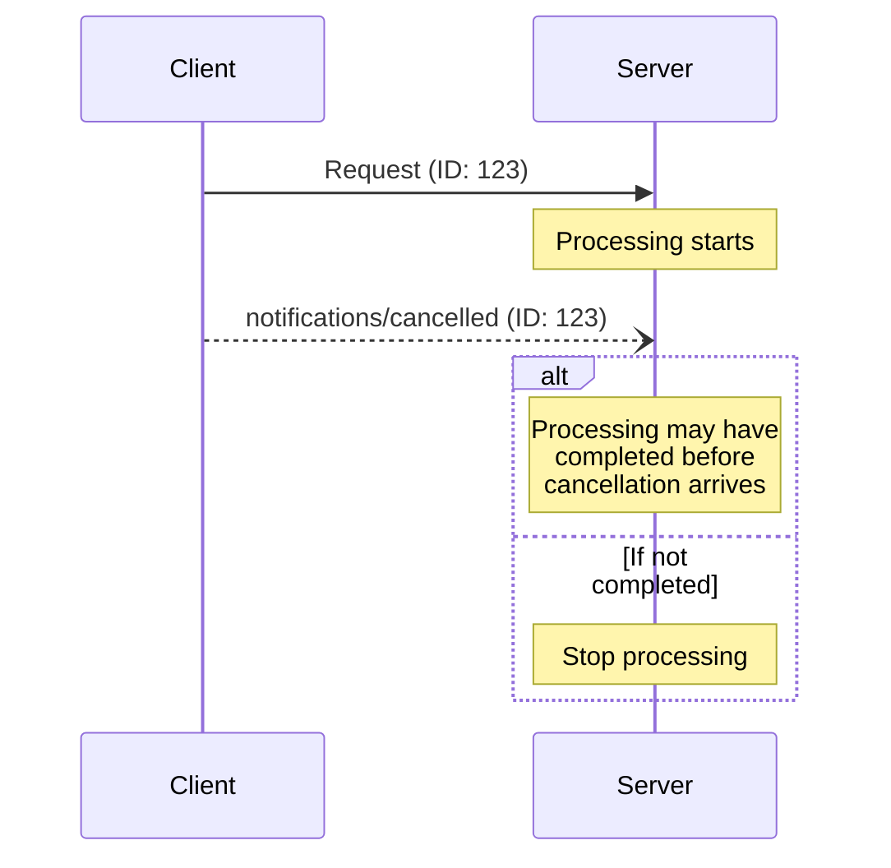

<div id="enable-section-numbers" />

模型上下文协议（MCP）通过通知消息为进行中的请求支持可选的取消。任意一方都可以发送取消通知，以表明先前发出的某个请求应被终止。

## 取消流程

当一方想要取消一个进行中的请求时，它发送一个包含以下内容的 `notifications/cancelled` 通知：

- 要取消的请求的 ID
- 一个可选的原因字符串，可用于记录或显示

```json
{
  "jsonrpc": "2.0",
  "method": "notifications/cancelled",
  "params": {
    "requestId": "123",
    "reason": "User requested cancellation"
  }
}
```

## 行为要求

1. 取消通知**必须（MUST）**只引用满足以下条件的请求：
   - 先前在同一方向上发出的
   - 被认为仍在进行中的
1. `initialize` 请求**不得（MUST NOT）**被客户端取消
1. 对于[任务增强请求](./tasks)，**必须（MUST）**使用 `tasks/cancel` 请求而非 `notifications/cancelled` 通知。任务有其自己专用的取消机制，会返回最终的任务状态。
1. 取消通知的接收方**应当（SHOULD）**：
   - 停止处理被取消的请求
   - 释放关联的资源
   - 不为被取消的请求发送响应
1. 接收方在以下情况**可以（MAY）**忽略取消通知：
   - 被引用的请求未知
   - 处理已经完成
   - 该请求无法被取消
1. 取消通知的发送方**应当（SHOULD）**忽略此后到达的对该请求的任何响应

## 时序考量

由于网络时延，取消通知可能在请求处理已经完成之后到达，甚至可能在响应已经发送之后到达。

双方都**必须（MUST）**优雅地处理这些竞态条件：



## 实现说明

- 双方都**应当（SHOULD）**记录取消原因以便调试
- 应用 UI **应当（SHOULD）**在请求取消时予以指示

## 错误处理

无效的取消通知**应当（SHOULD）**被忽略：

- 未知的请求 ID
- 已经完成的请求
- 格式错误的通知

这在保持通知"发后即忘"（fire and forget）性质的同时，也允许异步通信中的竞态条件。
