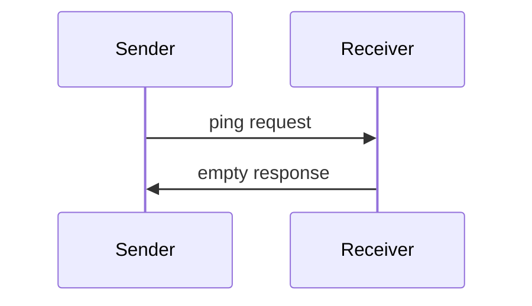

<div id="enable-section-numbers" />

模型上下文协议包含一个可选的 ping 机制，允许任意一方验证其对端仍有响应且连接仍然存活。

## 概述

ping 功能通过一个简单的请求/响应模式实现。客户端或服务器都可以通过发送一个 `ping` 请求来发起 ping。

## 消息格式

ping 请求是一个不带参数的标准 JSON-RPC 请求：

```json
{
  "jsonrpc": "2.0",
  "id": "123",
  "method": "ping"
}
```

## 行为要求

1. 接收方**必须（MUST）**及时以一个空响应回复：

```json
{
  "jsonrpc": "2.0",
  "id": "123",
  "result": {}
}
```

2. 如果在合理的超时期限内未收到响应，发送方**可以（MAY）**：
   - 认为连接已失效
   - 终止连接
   - 尝试重连流程

## 使用模式



## 实现考量

- 实现**应当（SHOULD）**定期发出 ping 以检测连接健康状况
- ping 的频率**应当（SHOULD）**可配置
- 超时**应当（SHOULD）**适合网络环境
- **应当（SHOULD）**避免过度 ping 以减少网络开销

## 错误处理

- 超时**应当（SHOULD）**被视为连接失败
- 多次 ping 失败**可以（MAY）**触发连接重置
- 实现**应当（SHOULD）**记录 ping 失败以便诊断
