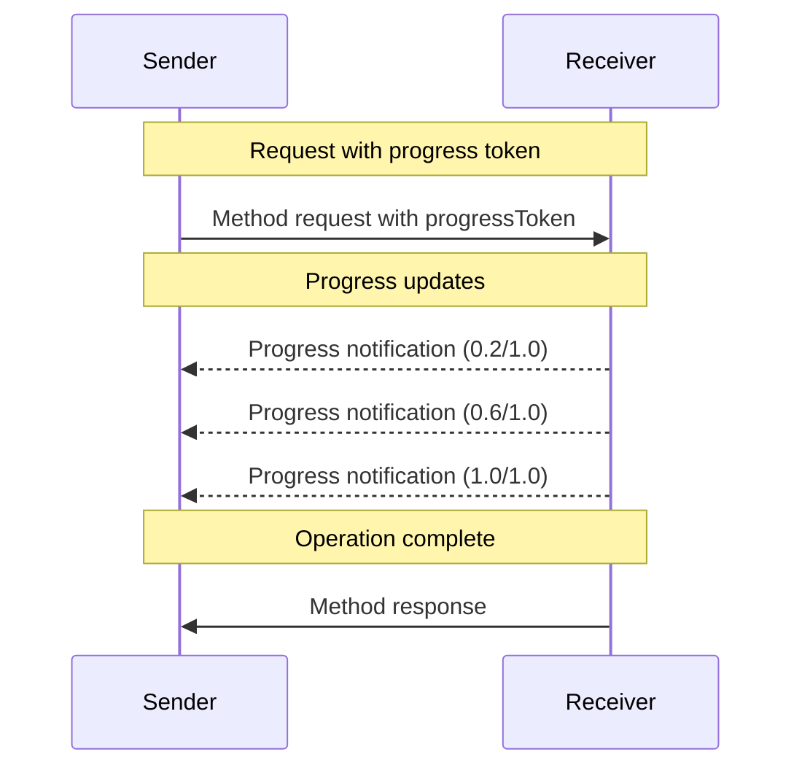

<div id="enable-section-numbers" />

模型上下文协议（MCP）通过通知消息为长时运行的操作支持可选的进度跟踪。任意一方都可以发送进度通知，以提供关于操作状态的更新。

## 进度流程

当一方想要_接收_某个请求的进度更新时，它在请求元数据中包含一个 `progressToken`。

- 进度令牌**必须（MUST）**是字符串或整数值
- 进度令牌可以由发送方以任意方式选择，但**必须（MUST）**在所有活跃请求中唯一。

```json
{
  "jsonrpc": "2.0",
  "id": 1,
  "method": "some_method",
  "params": {
    "_meta": {
      "progressToken": "abc123"
    }
  }
}
```

接收方**可以（MAY）**随后发送包含以下内容的进度通知：

- 原始的进度令牌
- 到目前为止的当前进度值
- 一个可选的 "total" 值
- 一个可选的 "message" 值

```json
{
  "jsonrpc": "2.0",
  "method": "notifications/progress",
  "params": {
    "progressToken": "abc123",
    "progress": 50,
    "total": 100,
    "message": "Reticulating splines..."
  }
}
```

- `progress` 值**必须（MUST）**随每次通知而增加，即使 total 未知。
- `progress` 和 `total` 值**可以（MAY）**是浮点数。
- `message` 字段**应当（SHOULD）**提供相关的人类可读进度信息。

## 行为要求

1. 进度通知**必须（MUST）**只引用以下令牌：
   - 在活跃请求中提供的
   - 与进行中的操作关联的

2. 进度请求的接收方**可以（MAY）**：
   - 选择不发送任何进度通知
   - 以它们认为合适的任意频率发送通知
   - 在 total 未知时省略它

3. 对于[任务增强请求](./tasks)，原始请求中提供的 `progressToken`**必须（MUST）**在任务的整个生命周期内继续用于进度通知，即使在 `CreateTaskResult` 已被返回之后也是如此。进度令牌保持有效并与任务关联，直到任务达到终态。
   - 任务的进度通知**必须（MUST）**使用初始任务增强请求中提供的同一个 `progressToken`
   - 任务的进度通知**必须（MUST）**在任务达到终态（`completed`、`failed` 或 `cancelled`）后停止



## 实现说明

- 发送方和接收方**应当（SHOULD）**跟踪活跃的进度令牌
- 双方都**应当（SHOULD）**实施限流以防止泛洪
- 进度通知**必须（MUST）**在完成后停止
