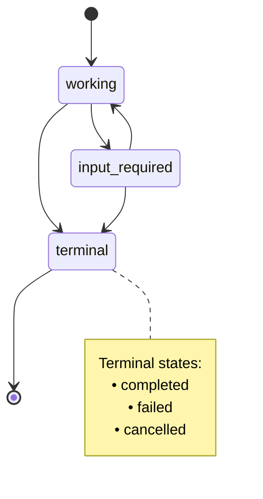
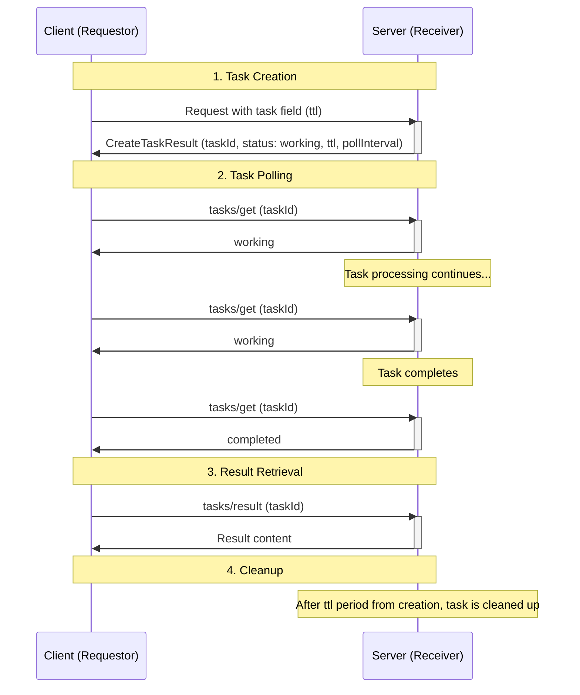
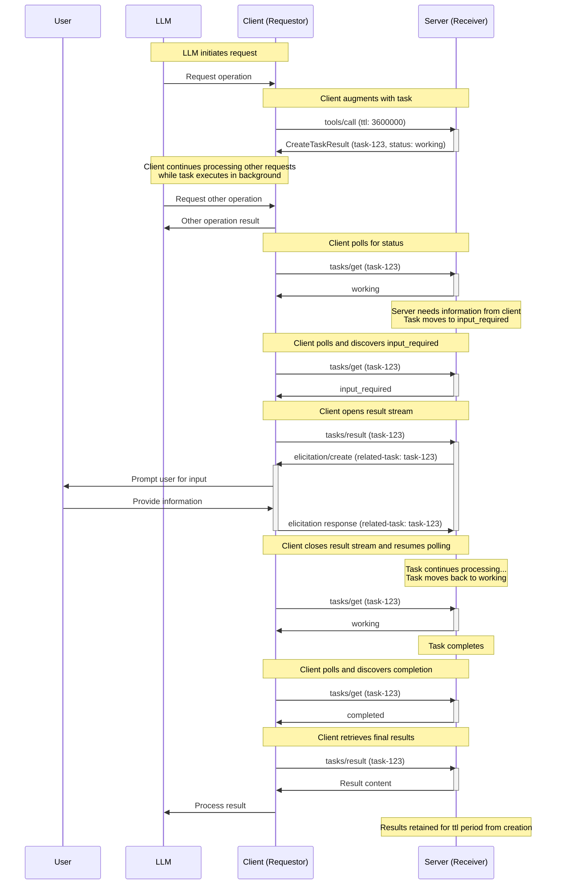
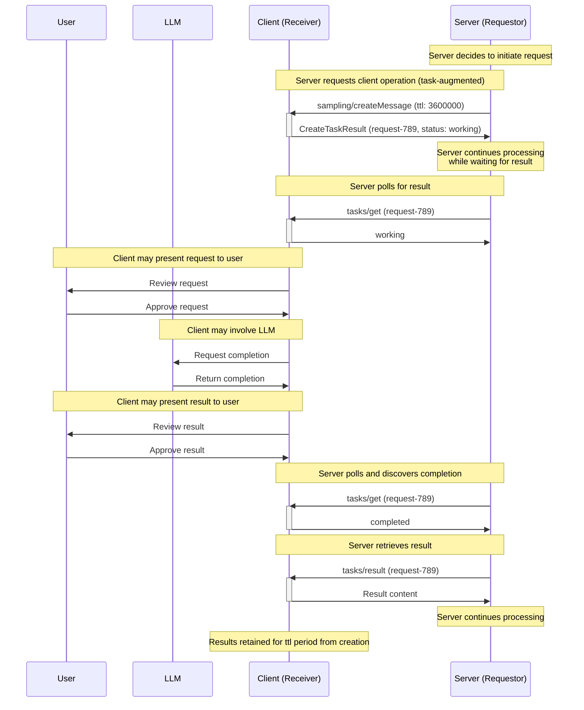
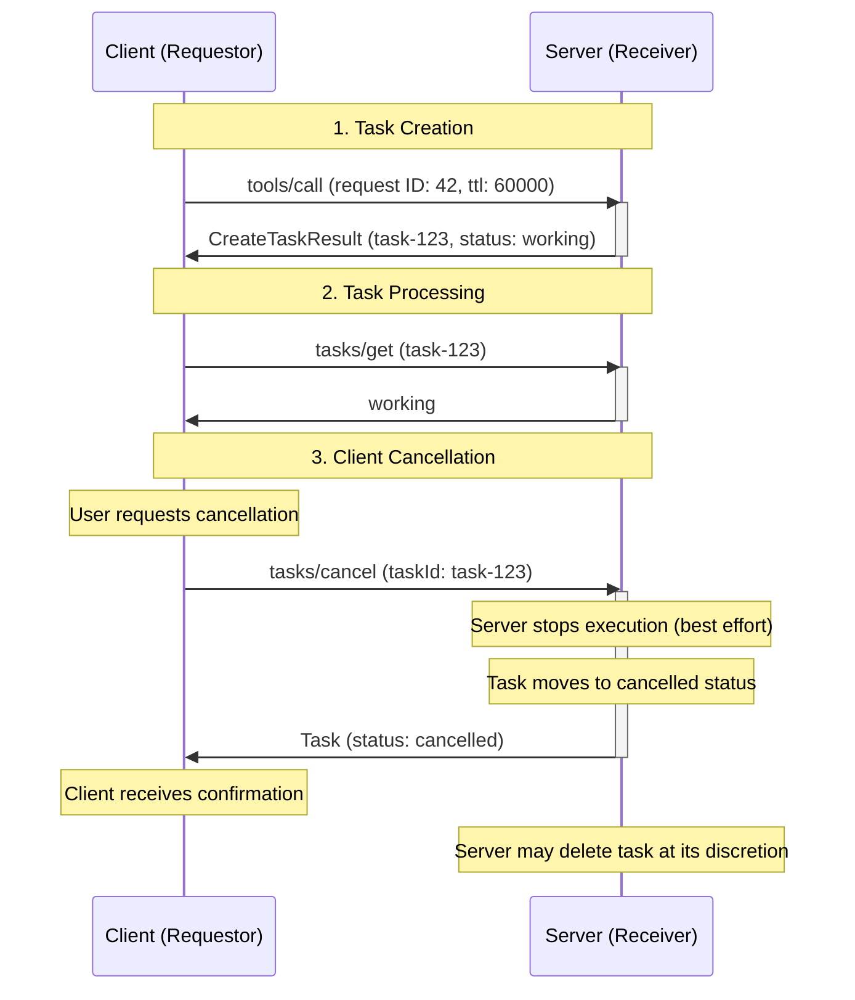

<div id="enable-section-numbers" />

<Note>
  任务在 MCP 规范的 2025-11-25 版本中引入，当前被视为**实验性（experimental）**。任务的设计和行为可能在未来的协议版本中演进。
</Note>

模型上下文协议（MCP）允许请求方（requestor，可以是客户端或服务器，取决于通信方向）用**任务（tasks）**增强其请求。任务是持久的状态机，携带关于它们所包裹请求底层执行状态的信息，旨在用于请求方轮询和延迟的结果检索。每个任务由接收方生成的**任务 ID（task ID）**唯一标识。

任务对于表示昂贵计算和批处理请求很有用，并与外部作业 API 无缝集成。

## 定义

任务将各方表示为"请求方（requestors）"或"接收方（receivers）"，定义如下：

- **请求方（Requestor）：** 任务增强请求的发送方。这可以是客户端或服务器——两者都可以创建任务。
- **接收方（Receiver）：** 任务增强请求的接收方，以及执行任务的实体。这可以是客户端或服务器——两者都可以接收和执行任务。

## 用户交互模型

任务被设计为**由请求方驱动（requestor-driven）**——请求方负责用任务增强请求并轮询这些任务的结果；与此同时，接收方严格控制哪些请求（如果有的话）支持基于任务的执行，并管理这些任务的生命周期。

这种由请求方驱动的方式确保了确定性的响应处理，并启用了诸如派发并发请求之类的精巧模式，而只有请求方拥有足够的上下文来编排它们。

实现可以自由地通过任何适合其需要的界面模式暴露任务——协议本身并不强制任何特定的用户交互模型。

## 能力（Capabilities）

支持任务增强请求的服务器和客户端**必须（MUST）**在初始化期间声明一个 `tasks` 能力。`tasks` 能力按请求类别结构化，以布尔属性指示哪些特定请求类型支持任务增强。

### 服务器能力

服务器声明它们是否支持任务，如果支持，则声明哪些服务器端请求可以被任务增强。

| 能力                        | 描述                                          |
| --------------------------- | --------------------------------------------- |
| `tasks.list`                | 服务器支持 `tasks/list` 操作                   |
| `tasks.cancel`              | 服务器支持 `tasks/cancel` 操作                 |
| `tasks.requests.tools.call` | 服务器支持任务增强的 `tools/call` 请求         |

```json
{
  "capabilities": {
    "tasks": {
      "list": {},
      "cancel": {},
      "requests": {
        "tools": {
          "call": {}
        }
      }
    }
  }
}
```

### 客户端能力

客户端声明它们是否支持任务，如果支持，则声明哪些客户端端请求可以被任务增强。

| 能力                                    | 描述                                                     |
| --------------------------------------- | -------------------------------------------------------- |
| `tasks.list`                            | 客户端支持 `tasks/list` 操作                             |
| `tasks.cancel`                          | 客户端支持 `tasks/cancel` 操作                           |
| `tasks.requests.sampling.createMessage` | 客户端支持任务增强的 `sampling/createMessage` 请求       |
| `tasks.requests.elicitation.create`     | 客户端支持任务增强的 `elicitation/create` 请求           |

```json
{
  "capabilities": {
    "tasks": {
      "list": {},
      "cancel": {},
      "requests": {
        "sampling": {
          "createMessage": {}
        },
        "elicitation": {
          "create": {}
        }
      }
    }
  }
}
```

### 能力协商

在初始化阶段，双方交换其 `tasks` 能力以确立哪些操作支持基于任务的执行。请求方**应当（SHOULD）**仅在接收方声明了相应能力时才用任务增强请求。

例如，如果服务器的能力包含 `tasks.requests.tools.call: {}`，则客户端可以用任务增强 `tools/call` 请求。如果客户端的能力包含 `tasks.requests.sampling.createMessage: {}`，则服务器可以用任务增强 `sampling/createMessage` 请求。

如果 `capabilities.tasks` 未定义，对端**不应（SHOULD NOT）**尝试在请求期间创建任务。

`capabilities.tasks.requests` 中的能力集合是穷尽的。如果某个请求类型不在其中，它就不支持任务增强。

`capabilities.tasks.list` 控制该方是否支持 `tasks/list` 操作。

`capabilities.tasks.cancel` 控制该方是否支持 `tasks/cancel` 操作。

### 工具级协商

为任务增强的目的，工具调用受到特殊考虑。在 `tools/list` 的结果中，工具通过 `execution.taskSupport` 声明对任务的支持，若存在，其值可以是 `"required"`、`"optional"` 或 `"forbidden"`。

这应被解释为能力之外的一个细粒度层，遵循以下规则：

1. 如果服务器的能力不包含 `tasks.requests.tools.call`，则客户端**不得（MUST NOT）**尝试在该服务器的工具上使用任务增强，无论 `execution.taskSupport` 值如何。
1. 如果服务器的能力包含 `tasks.requests.tools.call`，则客户端考虑 `execution.taskSupport` 的值并相应处理：
   1. 如果 `execution.taskSupport` 不存在或为 `"forbidden"`，则客户端**不得（MUST NOT）**尝试将该工具作为任务调用。如果客户端尝试这样做，服务器**应当（SHOULD）**返回一个 `-32601`（Method not found）错误。这是默认行为。
   1. 如果 `execution.taskSupport` 为 `"optional"`，则客户端**可以（MAY）**将该工具作为任务或作为普通请求调用。
   1. 如果 `execution.taskSupport` 为 `"required"`，则客户端**必须（MUST）**将该工具作为任务调用。如果客户端不尝试这样做，服务器**必须（MUST）**返回一个 `-32601`（Method not found）错误。

## 协议消息

### 创建任务

任务增强请求遵循一种不同于普通请求的两阶段响应模式：

- **普通请求**：服务器处理请求并直接返回实际的操作结果。
- **任务增强请求**：服务器接受请求并立即返回一个包含任务数据的 `CreateTaskResult`。实际的操作结果稍后在任务完成后通过 `tasks/result` 变得可用。

要创建任务，请求方发送一个在请求 params 中包含 `task` 字段的请求。请求方**可以（MAY）**包含一个 `ttl` 值，指示自创建起期望的任务生命周期时长（以毫秒计）。

**请求：**

```json
{
  "jsonrpc": "2.0",
  "id": 1,
  "method": "tools/call",
  "params": {
    "name": "get_weather",
    "arguments": {
      "city": "New York"
    },
    "task": {
      "ttl": 60000
    }
  }
}
```

**响应：**

```json
{
  "jsonrpc": "2.0",
  "id": 1,
  "result": {
    "task": {
      "taskId": "786512e2-9e0d-44bd-8f29-789f320fe840",
      "status": "working",
      "statusMessage": "The operation is now in progress.",
      "createdAt": "2025-11-25T10:30:00Z",
      "lastUpdatedAt": "2025-11-25T10:40:00Z",
      "ttl": 60000,
      "pollInterval": 5000
    }
  }
}
```

当接收方接受一个任务增强请求时，它返回一个包含任务数据的 [`CreateTaskResult`](/specification/2025-11-25/schema#createtaskresult)。该响应不包含实际的操作结果。实际结果（例如 `tools/call` 的工具结果）只在任务完成后通过 `tasks/result` 变得可用。

<Note>
  当任务作为对 `tools/call` 请求的响应被创建时，宿主应用可能希望在任务执行期间将控制权返还给模型。这允许模型在等待任务完成时继续处理其他请求或执行额外工作。

  为支持此模式，服务器可以在 `CreateTaskResult` 的 `_meta` 字段中提供一个可选的 `io.modelcontextprotocol/model-immediate-response` 键。此键的值应是一个字符串，旨在作为即时工具结果传递给模型。如果服务器不提供此字段，宿主应用可以回退到其自己的预定义消息。

  此指导是非约束性的，是旨在应对该特定用例的临时逻辑。此行为可能在未来的协议版本中作为 `CreateTaskResult` 的一部分被正式化或修改。
</Note>

### 获取任务

<Note>
  在 Streamable HTTP（SSE）传输中，客户端**可以（MAY）**在任意时刻从服务器为响应 `tasks/get` 请求而打开的 SSE 流断开。

  尽管本说明对 SSE 流的具体使用不作规定，所有实现**必须（MUST）**继续遵循既有的 [Streamable HTTP 传输规范](../transports#sending-messages-to-the-server)。
</Note>

请求方通过发送 [`tasks/get`](/specification/2025-11-25/schema#tasks%2Fget) 请求来轮询任务完成。请求方在确定轮询频率时**应当（SHOULD）**尊重响应中提供的 `pollInterval`。

请求方**应当（SHOULD）**持续轮询，直到任务达到终态（`completed`、`failed` 或 `cancelled`），或直到遇到 [`input_required`](#input-required-status) 状态。请注意，调用 `tasks/result` 并不意味着请求方需要停止轮询——如果请求方没有主动等待 `tasks/result` 完成，它**应当（SHOULD）**继续通过 `tasks/get` 轮询任务状态。

**请求：**

```json
{
  "jsonrpc": "2.0",
  "id": 3,
  "method": "tasks/get",
  "params": {
    "taskId": "786512e2-9e0d-44bd-8f29-789f320fe840"
  }
}
```

**响应：**

```json
{
  "jsonrpc": "2.0",
  "id": 3,
  "result": {
    "taskId": "786512e2-9e0d-44bd-8f29-789f320fe840",
    "status": "working",
    "statusMessage": "The operation is now in progress.",
    "createdAt": "2025-11-25T10:30:00Z",
    "lastUpdatedAt": "2025-11-25T10:40:00Z",
    "ttl": 30000,
    "pollInterval": 5000
  }
}
```

### 检索任务结果

<Note>
  在 Streamable HTTP（SSE）传输中，客户端**可以（MAY）**在任意时刻从服务器为响应 `tasks/result` 请求而打开的 SSE 流断开。

  尽管本说明对 SSE 流的具体使用不作规定，所有实现**必须（MUST）**继续遵循既有的 [Streamable HTTP 传输规范](../transports#sending-messages-to-the-server)。
</Note>

在任务完成后，操作结果通过 [`tasks/result`](/specification/2025-11-25/schema#tasks%2Fresult) 检索。这不同于初始的 `CreateTaskResult` 响应——后者只包含任务数据。结果结构匹配原始请求类型（例如 `tools/call` 的 `CallToolResult`）。

要检索已完成任务的结果，请求方可以发送一个 `tasks/result` 请求：

虽然 `tasks/result` 会阻塞直到任务达到终态，但如果请求方没有主动阻塞等待结果（例如其先前的 `tasks/result` 请求失败或被取消），它可以并行地继续通过 `tasks/get` 轮询。这允许请求方在任务执行期间监控状态变化或显示进度更新，即使在调用 `tasks/result` 之后也是如此。

**请求：**

```json
{
  "jsonrpc": "2.0",
  "id": 4,
  "method": "tasks/result",
  "params": {
    "taskId": "786512e2-9e0d-44bd-8f29-789f320fe840"
  }
}
```

**响应：**

```json
{
  "jsonrpc": "2.0",
  "id": 4,
  "result": {
    "content": [
      {
        "type": "text",
        "text": "Current weather in New York:\nTemperature: 72°F\nConditions: Partly cloudy"
      }
    ],
    "isError": false,
    "_meta": {
      "io.modelcontextprotocol/related-task": {
        "taskId": "786512e2-9e0d-44bd-8f29-789f320fe840"
      }
    }
  }
}
```

### 任务状态通知

当任务状态变化时，接收方**可以（MAY）**发送一个 [`notifications/tasks/status`](/specification/2025-11-25/schema#notifications%2Ftasks%2Fstatus) 通知以将变化告知请求方。此通知包含完整的任务状态。

**通知：**

```json
{
  "jsonrpc": "2.0",
  "method": "notifications/tasks/status",
  "params": {
    "taskId": "786512e2-9e0d-44bd-8f29-789f320fe840",
    "status": "completed",
    "createdAt": "2025-11-25T10:30:00Z",
    "lastUpdatedAt": "2025-11-25T10:50:00Z",
    "ttl": 60000,
    "pollInterval": 5000
  }
}
```

该通知包含完整的 [`Task`](/specification/2025-11-25/schema#task) 对象，包括更新后的 `status` 和 `statusMessage`（如果存在）。这允许请求方在不发起额外 `tasks/get` 请求的情况下访问完整的任务状态。

请求方**不得（MUST NOT）**依赖收到此通知，因为它是可选的。接收方不要求发送状态通知，并可能选择只为某些状态转换发送它们。请求方**应当（SHOULD）**继续通过 `tasks/get` 轮询，以确保它们收到状态更新。

### 列出任务

要检索任务列表，请求方可以发送一个 [`tasks/list`](/specification/2025-11-25/schema#tasks%2Flist) 请求。此操作支持分页。

**请求：**

```json
{
  "jsonrpc": "2.0",
  "id": 5,
  "method": "tasks/list",
  "params": {
    "cursor": "optional-cursor-value"
  }
}
```

**响应：**

```json
{
  "jsonrpc": "2.0",
  "id": 5,
  "result": {
    "tasks": [
      {
        "taskId": "786512e2-9e0d-44bd-8f29-789f320fe840",
        "status": "working",
        "createdAt": "2025-11-25T10:30:00Z",
        "lastUpdatedAt": "2025-11-25T10:40:00Z",
        "ttl": 30000,
        "pollInterval": 5000
      },
      {
        "taskId": "abc123-def456-ghi789",
        "status": "completed",
        "createdAt": "2025-11-25T09:15:00Z",
        "lastUpdatedAt": "2025-11-25T10:40:00Z",
        "ttl": 60000
      }
    ],
    "nextCursor": "next-page-cursor"
  }
}
```

### 取消任务

要显式取消一个任务，请求方可以发送一个 [`tasks/cancel`](/specification/2025-11-25/schema#tasks%2Fcancel) 请求。

**请求：**

```json
{
  "jsonrpc": "2.0",
  "id": 6,
  "method": "tasks/cancel",
  "params": {
    "taskId": "786512e2-9e0d-44bd-8f29-789f320fe840"
  }
}
```

**响应：**

```json
{
  "jsonrpc": "2.0",
  "id": 6,
  "result": {
    "taskId": "786512e2-9e0d-44bd-8f29-789f320fe840",
    "status": "cancelled",
    "statusMessage": "The task was cancelled by request.",
    "createdAt": "2025-11-25T10:30:00Z",
    "lastUpdatedAt": "2025-11-25T10:40:00Z",
    "ttl": 30000,
    "pollInterval": 5000
  }
}
```

## 行为要求

这些要求适用于所有支持接收任务增强请求的各方。

### 任务支持与处理

1. 未为某请求类型声明任务能力的接收方**必须（MUST）**正常处理该类型的请求，忽略任何存在的任务增强元数据。
1. 为某请求类型声明了任务能力的接收方**可以（MAY）**为非任务增强请求返回错误，要求请求方使用任务增强。

### 任务 ID 要求

1. 任务 ID **必须（MUST）**是一个字符串值。
1. 任务 ID **必须（MUST）**在创建任务时由接收方生成。
1. 任务 ID **必须（MUST）**在接收方控制的所有任务间唯一。

### 任务状态生命周期

1. 任务在创建时**必须（MUST）**以 `working` 状态开始。
1. 接收方**必须（MUST）**仅通过以下有效路径转换任务：
   1. 从 `working`：可移至 `input_required`、`completed`、`failed` 或 `cancelled`
   1. 从 `input_required`：可移至 `working`、`completed`、`failed` 或 `cancelled`
   1. 处于 `completed`、`failed` 或 `cancelled` 状态的任务处于终态，并**不得（MUST NOT）**转换到任何其他状态

**任务状态状态图：**



### Input Required 状态

<Note>
  在 Streamable HTTP（SSE）传输中，服务器通常在投递一条响应消息后关闭 SSE 流，这可能导致关于后续任务消息所用流的歧义。

  服务器可以通过将消息入队到客户端来处理这一点，从而在其他响应之外旁路发送任务相关消息。

  服务器在任务轮询和结果检索期间管理 SSE 流的方式上有灵活性，客户端**应当（SHOULD）**预期消息可以在任何 SSE 流上投递，包括 HTTP GET 流。一种可能的方式是在 `tasks/result` 上维护一个 SSE 流（参见关于 `input_required` 状态的说明）。在可能时，服务器**不应（SHOULD NOT）**为响应 `tasks/get` 请求而升级到 SSE 流，因为客户端已表明它希望轮询结果。

  尽管本说明对 SSE 流的具体使用不作规定，所有实现**必须（MUST）**继续遵循既有的 [Streamable HTTP 传输规范](../transports#sending-messages-to-the-server)。
</Note>

1. 当任务接收方有完成任务所必需的、给请求方的消息时，接收方**应当（SHOULD）**将任务移至 `input_required` 状态。
1. 接收方**必须（MUST）**在该请求中包含 `io.modelcontextprotocol/related-task` 元数据以将其与任务关联。
1. 当请求方遇到 `input_required` 状态时，它**应当（SHOULD）**先行调用 `tasks/result`。
1. 当接收方收到所有必需输入时，任务**应当（SHOULD）**转换出 `input_required` 状态（通常回到 `working`）。

### TTL 与资源管理

1. 接收方**必须（MUST）**在所有任务响应中包含一个 `createdAt` [ISO 8601](https://datatracker.ietf.org/doc/html/rfc3339#section-5) 格式的时间戳，以指示任务的创建时间。
1. 接收方**必须（MUST）**在所有任务响应中包含一个 `lastUpdatedAt` [ISO 8601](https://datatracker.ietf.org/doc/html/rfc3339#section-5) 格式的时间戳，以指示任务的最后更新时间。
1. 接收方**可以（MAY）**覆盖所请求的 `ttl` 时长。
1. 接收方**必须（MUST）**在 `tasks/get` 响应中包含实际的 `ttl` 时长（或 `null` 表示无限）。
1. 在任务的 `ttl` 生命周期过去后，接收方**可以（MAY）**删除该任务及其结果，无论任务状态如何。
1. 接收方**可以（MAY）**在 `tasks/get` 响应中包含一个 `pollInterval` 值（以毫秒计）以建议轮询间隔。请求方在提供时**应当（SHOULD）**尊重该值。

### 结果检索

1. 接受任务增强请求的接收方**必须（MUST）**返回一个 `CreateTaskResult` 作为响应。此结果**应当（SHOULD）**在接受任务后尽快返回。
1. 当接收方收到针对处于终态（`completed`、`failed` 或 `cancelled`）任务的 `tasks/result` 请求时，它**必须（MUST）**返回底层请求的最终结果，无论那是成功结果还是 JSON-RPC 错误。
1. 当接收方收到针对处于任何其他非终态（`working` 或 `input_required`）任务的 `tasks/result` 请求时，它**必须（MUST）**阻塞响应直到任务达到终态。
1. 对于处于终态的任务，接收方**必须（MUST）**从 `tasks/result` 恰好返回底层请求本会返回的内容，无论那是成功结果还是 JSON-RPC 错误。

### 关联任务相关消息

1. 与某任务相关的所有请求、通知与响应**必须（MUST）**在其 `_meta` 字段中包含 `io.modelcontextprotocol/related-task` 键，其值设为一个 `taskId` 与关联任务 ID 匹配的对象。
   1. 例如，一个任务增强工具调用所依赖的征询**必须（MUST）**与该工具调用的任务共享相同的相关任务 ID。
1. 对于 `tasks/get`、`tasks/result` 和 `tasks/cancel` 操作，请求中的 `taskId` 参数**必须（MUST）**被用作识别目标任务的可信来源。请求方**不应（SHOULD NOT）**在这些请求中包含 `io.modelcontextprotocol/related-task` 元数据，接收方**必须（MUST）**在其存在时忽略此类元数据，转而采用 RPC 方法参数。同样，对于 `tasks/get`、`tasks/list` 和 `tasks/cancel` 操作，接收方**不应（SHOULD NOT）**在结果消息中包含 `io.modelcontextprotocol/related-task` 元数据，因为 `taskId` 已存在于响应结构中。

### 任务通知

1. 当任务状态变化时，接收方**可以（MAY）**发送 `notifications/tasks/status` 通知。
1. 请求方**不得（MUST NOT）**依赖收到 `notifications/tasks/status` 通知，因为它是可选的。
1. 发送时，`notifications/tasks/status` 通知**不应（SHOULD NOT）**包含 `io.modelcontextprotocol/related-task` 元数据，因为任务 ID 已存在于通知参数中。

### 任务进度通知

任务增强请求支持 [进度](./progress) 规范中定义的进度通知。初始请求中提供的 `progressToken` 在整个任务生命周期内保持有效。

### 任务列表

1. 接收方**应当（SHOULD）**使用基于游标的分页来限制单个响应中返回的任务数量。
1. 若有更多任务可用，接收方**必须（MUST）**在响应中包含一个 `nextCursor`。
1. 请求方**必须（MUST）**将游标视为不透明令牌，不尝试解析或修改它们。
1. 若某任务对某请求方可经由 `tasks/get` 检索，则它**必须（MUST）**对该请求方可经由 `tasks/list` 检索。

### 任务取消

1. 接收方**必须（MUST）**以错误码 `-32602`（Invalid params）拒绝对已处于终态（`completed`、`failed` 或 `cancelled`）任务的取消请求。
1. 收到有效的取消请求后，接收方**应当（SHOULD）**尝试停止任务执行，并**必须（MUST）**在发送响应之前将任务转换到 `cancelled` 状态。
1. 一旦任务被取消，即使执行继续至完成或失败，它也**必须（MUST）**保持在 `cancelled` 状态。
1. `tasks/cancel` 操作不定义删除行为。然而，接收方**可以（MAY）**自行裁量在任意时刻删除已取消的任务，包括取消后立即删除或在任务 `ttl` 过期后删除。
1. 请求方**不应（SHOULD NOT）**依赖已取消的任务被保留任何特定时长，并应在取消前检索任何所需信息。

## 消息流程

### 基本任务生命周期



### 带征询的任务增强工具调用



### 任务增强的采样请求



### 任务取消流程



## 数据类型

### Task

一个任务表示一个请求的执行状态。任务状态包括：

- `taskId`：任务的唯一标识符
- `status`：任务执行的当前状态
- `statusMessage`：描述当前状态的可选人类可读消息（可用于任何状态，包括失败任务的错误详情）
- `createdAt`：任务创建时的 ISO 8601 时间戳
- `ttl`：自创建起、任务可被删除前的时间（毫秒）
- `pollInterval`：建议的状态检查间隔（毫秒）
- `lastUpdatedAt`：任务状态最后更新时的 ISO 8601 时间戳

### Task Status

任务可以处于以下状态之一：

- `working`：请求当前正在被处理。
- `input_required`：接收方需要来自请求方的输入。请求方应调用 `tasks/result` 以接收输入请求，即使任务尚未达到终态。
- `completed`：请求成功完成且结果可用。
- `failed`：关联的请求未成功完成。特别对于工具调用，这包括工具调用结果的 `isError` 被设为 true 的情况。
- `cancelled`：请求在完成前被取消。

### Task 参数

当用任务执行增强请求时，`task` 字段被包含在请求参数中：

```json
{
  "task": {
    "ttl": 60000
  }
}
```

字段：

- `ttl`（number，可选）：自创建起保留任务的请求时长（毫秒）

### Related Task 元数据

与某任务关联的所有请求、响应与通知**必须（MUST）**在 `_meta` 中包含 `io.modelcontextprotocol/related-task` 键：

```json
{
  "io.modelcontextprotocol/related-task": {
    "taskId": "786512e2-9e0d-44bd-8f29-789f320fe840"
  }
}
```

这在整个请求生命周期内将消息与其起源任务关联。

对于 `tasks/get`、`tasks/list` 和 `tasks/cancel` 操作，请求方和接收方**不应（SHOULD NOT）**在其消息中包含此元数据，因为 `taskId` 已存在于消息结构中。`tasks/result` 操作**必须（MUST）**在其响应中包含此元数据，因为结果结构本身不含任务 ID。

## 错误处理

任务使用两种错误报告机制：

1. **协议错误（Protocol Errors）**：用于协议级问题的标准 JSON-RPC 错误
1. **任务执行错误（Task Execution Errors）**：底层请求执行中的错误，通过任务状态报告

### 协议错误

接收方**必须（MUST）**为以下协议错误情形返回标准 JSON-RPC 错误：

- `tasks/get`、`tasks/result` 或 `tasks/cancel` 中无效或不存在的 `taskId`：`-32602`（Invalid params）
- `tasks/list` 中无效或不存在的游标：`-32602`（Invalid params）
- 尝试取消一个已处于终态的任务：`-32602`（Invalid params）
- 内部错误：`-32603`（Internal error）

此外，接收方**可以（MAY）**返回以下错误：

- 当接收方要求某请求类型使用任务增强时的非任务增强请求：`-32600`（Invalid request）

接收方**应当（SHOULD）**提供信息丰富的错误消息来描述错误原因。

**示例：需要任务增强**

```json
{
  "jsonrpc": "2.0",
  "id": 1,
  "error": {
    "code": -32600,
    "message": "Task augmentation required for tools/call requests"
  }
}
```

**示例：任务未找到**

```json
{
  "jsonrpc": "2.0",
  "id": 70,
  "error": {
    "code": -32602,
    "message": "Failed to retrieve task: Task not found"
  }
}
```

**示例：任务已过期**

```json
{
  "jsonrpc": "2.0",
  "id": 71,
  "error": {
    "code": -32602,
    "message": "Failed to retrieve task: Task has expired"
  }
}
```

<Note>
  接收方不要求无限期保留任务。若接收方已清除一个过期任务，它返回一个声明找不到该任务的错误是符合规范的行为。
</Note>

**示例：任务取消被拒绝（已处于终态）**

```json
{
  "jsonrpc": "2.0",
  "id": 74,
  "error": {
    "code": -32602,
    "message": "Cannot cancel task: already in terminal status 'completed'"
  }
}
```

### 任务执行错误

当底层请求未成功完成时，任务移至 `failed` 状态。这包括请求执行期间的 JSON-RPC 协议错误，或特别对于工具调用，当工具结果的 `isError` 被设为 true 时。`tasks/get` 响应**应当（SHOULD）**包含一个带关于失败的诊断信息的 `statusMessage` 字段。

**示例：带执行错误的任务**

```json
{
  "jsonrpc": "2.0",
  "id": 4,
  "result": {
    "taskId": "786512e2-9e0d-44bd-8f29-789f820fe840",
    "status": "failed",
    "createdAt": "2025-11-25T10:30:00Z",
    "lastUpdatedAt": "2025-11-25T10:40:00Z",
    "ttl": 30000,
    "statusMessage": "Tool execution failed: API rate limit exceeded"
  }
}
```

对于包裹工具调用请求的任务，当工具结果的 `isError` 被设为 `true` 时，任务应达到 `failed` 状态。

`tasks/result` 端点恰好返回底层请求本会返回的内容：

- 如果底层请求导致了一个 JSON-RPC 错误，`tasks/result`**必须（MUST）**返回同一个 JSON-RPC 错误。
- 如果请求以一个 JSON-RPC 响应完成，`tasks/result`**必须（MUST）**返回一个包含该结果的成功 JSON-RPC 响应。

## 安全考量

### 任务隔离与访问控制

任务 ID 是访问任务状态和结果的主要机制。若无适当的访问控制，任何能够猜测或获取任务 ID 的一方都可能访问敏感信息或操纵它们并未创建的任务。

当提供了授权上下文时，接收方**必须（MUST）**将任务绑定到该上下文。

上下文绑定并非对所有应用都可行。一些 MCP 服务器运行在没有授权的环境中，如单用户工具，或使用不支持授权的传输。在这些场景中，接收方**应当（SHOULD）**清楚地记录此局限性，因为任务结果可能可被任何能猜出任务 ID 的请求方访问。如果上下文绑定不可用，接收方**必须（MUST）**生成具有足够熵以防止猜测的密码学安全任务 ID，并应考虑使用更短的 TTL 时长以缩小暴露窗口。此外，无法识别请求方的接收方**不应（SHOULD NOT）**声明 `tasks.list` 能力，因为列出任务会将任务元数据暴露给任何请求方，无论任务 ID 熵如何。

如果上下文绑定可用，接收方**必须（MUST）**拒绝针对不属于与请求方相同授权上下文任务的 `tasks/get`、`tasks/result` 和 `tasks/cancel` 请求。对于 `tasks/list` 请求，接收方**必须（MUST）**确保返回的任务列表只包含与请求方授权上下文关联的任务。

此外，接收方**应当（SHOULD）**对任务操作实施限流以防止拒绝服务和枚举攻击。

### 资源管理

1. 接收方**应当（SHOULD）**：
   1. 强制执行每个请求方的并发任务限制
   1. 强制执行最大 `ttl` 时长以防止无限期的资源保留
   1. 及时清理过期任务以释放资源
   1. 记录所支持的最大 `ttl` 时长
   1. 记录每个请求方的最大并发任务数
   1. 为资源使用实现监控与告警

### 审计与日志

1. 接收方**应当（SHOULD）**：
   1. 为审计目的记录任务创建、完成与检索事件
   1. 在可用时将授权上下文纳入日志
   1. 监控可疑模式（例如大量失败的任务查找、过度轮询）
1. 请求方**应当（SHOULD）**：
   1. 为调试与审计目的记录任务生命周期事件
   1. 跟踪任务 ID 及其关联操作
