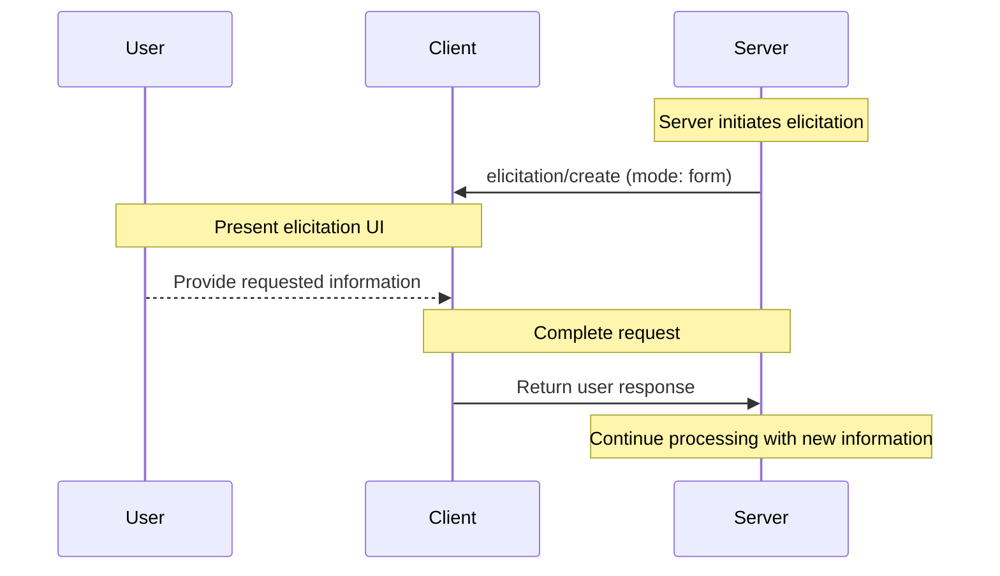
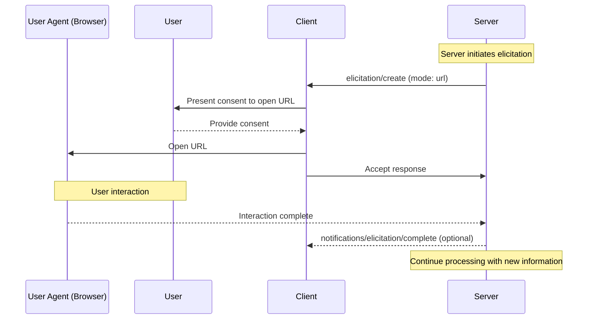
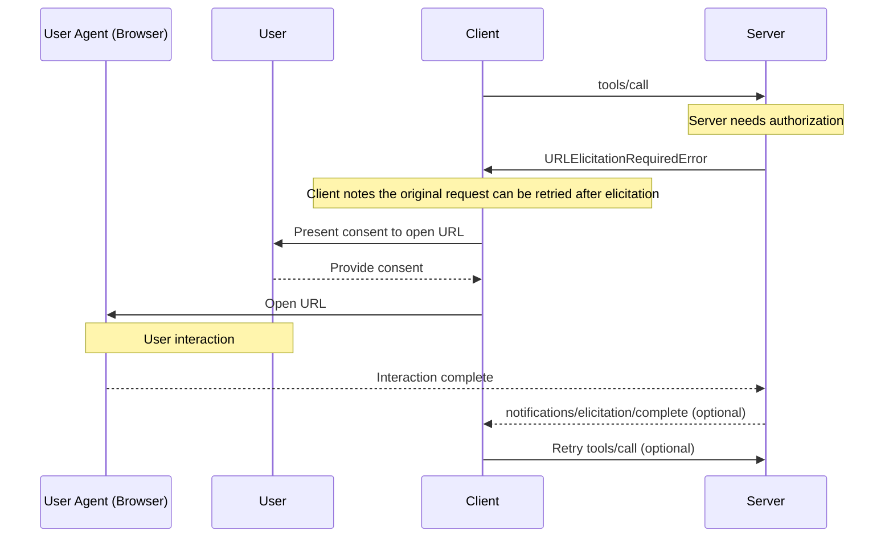
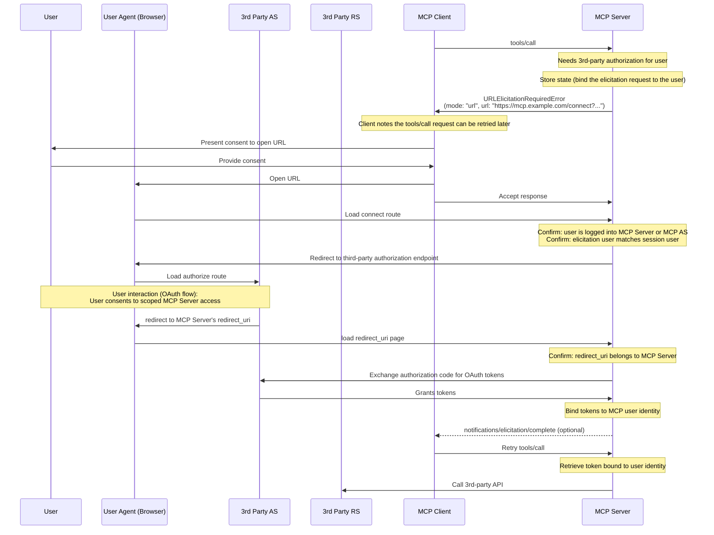

<div id="enable-section-numbers" />

模型上下文协议（MCP）为服务器在交互期间通过客户端向用户请求额外信息提供了一种标准化的方式。此流程允许客户端保持对用户交互和数据共享的控制，同时使服务器能够动态地收集必要信息。

征询支持两种模式：

- **表单模式（Form mode）**：服务器可以通过可选的 JSON schema 向用户请求结构化数据以校验响应
- **URL 模式（URL mode）**：服务器可以将用户引导至外部 URL，以进行**不得**经过 MCP 客户端的敏感交互

## 用户交互模型

MCP 中的征询允许服务器通过使用户输入请求发生在其他 MCP 服务器特性内部的_嵌套_位置来实现交互式工作流。

实现可以自由地通过任何适合其需要的界面模式暴露征询——协议本身并不强制任何特定的用户交互模型。

<Warning>
  出于信任、安全与安全性的考虑：

  - 服务器**不得（MUST NOT）**使用表单模式征询来请求敏感信息，如密码、API 密钥、访问令牌或支付凭据
  - 服务器**必须（MUST）**对涉及此类敏感信息的交互使用 [URL 模式](#url-mode-elicitation-requests)

  此上下文中的"敏感信息"指授予访问权限或授权交易的密钥和凭据。一般的联系或个人资料信息（如姓名、电子邮件地址或用户名）并非一概被禁止；是否通过表单模式请求此类数据由服务器自行裁量，并受用户审查和拒绝能力的约束。

  MCP 客户端**必须（MUST）**：

  - 提供清晰表明是哪个服务器在请求信息的 UI
  - 尊重用户隐私并提供清晰的拒绝和取消选项
  - 对于表单模式，允许用户在发送前审查和修改其响应
  - 对于 URL 模式，清晰地显示目标域名/主机，并在导航到目标 URL 之前征求用户同意
</Warning>

## 能力（Capabilities）

支持征询的客户端**必须（MUST）**在[初始化](../basic/lifecycle#initialization)期间声明 `elicitation` 能力：

```json
{
  "capabilities": {
    "elicitation": {
      "form": {},
      "url": {}
    }
  }
}
```

为了向后兼容，一个空的能力对象等价于只声明对 `form` 模式的支持：

```jsonc
{
  "capabilities": {
    "elicitation": {}, // Equivalent to { "form": {} }
  },
}
```

声明 `elicitation` 能力的客户端**必须（MUST）**至少支持一种模式（`form` 或 `url`）。

服务器**不得（MUST NOT）**发送客户端不支持的模式的征询请求。

## 协议消息

### 征询请求

要向用户请求信息，服务器发送一个 `elicitation/create` 请求。

所有征询请求**必须（MUST）**包含以下参数：

| 名称      | 类型   | 选项          | 描述                                                                                    |
| --------- | ------ | ------------- | --------------------------------------------------------------------------------------- |
| `mode`    | string | `form`、`url` | 征询的模式。对于表单模式为可选（省略时默认为 `"form"`）。                                |
| `message` | string |               | 解释为何需要此交互的人类可读消息。                                                       |

`mode` 参数指定征询的类型：

- `"form"`：带可选 schema 校验的带内结构化数据收集。数据会暴露给客户端。
- `"url"`：通过 URL 导航的带外交互。数据（URL 本身除外）**不会**暴露给客户端。

为了向后兼容，服务器**可以（MAY）**为表单模式征询请求省略 `mode` 字段。客户端**必须（MUST）**将没有 `mode` 字段的请求视为表单模式。

### 表单模式征询请求

表单模式征询允许服务器直接通过 MCP 客户端收集结构化数据。

表单模式征询请求**必须（MUST）**要么指定 `mode: "form"` 要么省略 `mode` 字段，并包含这些额外参数：

| 名称              | 类型   | 描述                                             |
| ----------------- | ------ | ------------------------------------------------ |
| `requestedSchema` | object | 定义预期响应结构的 JSON Schema。                 |

#### 请求的 Schema

`requestedSchema` 参数允许服务器使用 JSON Schema 的一个受限子集来定义预期响应的结构。

为简化客户端用户体验，表单模式征询 schema 被限制为仅具有原始属性的扁平对象。

schema 被限制为这些原始类型：

1. **字符串 Schema**

   ```json
   {
     "type": "string",
     "title": "Display Name",
     "description": "Description text",
     "minLength": 3,
     "maxLength": 50,
     "pattern": "^[A-Za-z]+$",
     "format": "email",
     "default": "user@example.com"
   }
   ```

   支持的格式：`email`、`uri`、`date`、`date-time`

2. **数字 Schema**

   ```json
   {
     "type": "number", // or "integer"
     "title": "Display Name",
     "description": "Description text",
     "minimum": 0,
     "maximum": 100,
     "default": 50
   }
   ```

3. **布尔 Schema**

   ```json
   {
     "type": "boolean",
     "title": "Display Name",
     "description": "Description text",
     "default": false
   }
   ```

4. **枚举 Schema**

   单选枚举（不带标题）：

   ```json
   {
     "type": "string",
     "title": "Color Selection",
     "description": "Choose your favorite color",
     "enum": ["Red", "Green", "Blue"],
     "default": "Red"
   }
   ```

   单选枚举（带标题）：

   ```json
   {
     "type": "string",
     "title": "Color Selection",
     "description": "Choose your favorite color",
     "oneOf": [
       { "const": "#FF0000", "title": "Red" },
       { "const": "#00FF00", "title": "Green" },
       { "const": "#0000FF", "title": "Blue" }
     ],
     "default": "#FF0000"
   }
   ```

   多选枚举（不带标题）：

   ```json
   {
     "type": "array",
     "title": "Color Selection",
     "description": "Choose your favorite colors",
     "minItems": 1,
     "maxItems": 2,
     "items": {
       "type": "string",
       "enum": ["Red", "Green", "Blue"]
     },
     "default": ["Red", "Green"]
   }
   ```

   多选枚举（带标题）：

   ```json
   {
     "type": "array",
     "title": "Color Selection",
     "description": "Choose your favorite colors",
     "minItems": 1,
     "maxItems": 2,
     "items": {
       "anyOf": [
         { "const": "#FF0000", "title": "Red" },
         { "const": "#00FF00", "title": "Green" },
         { "const": "#0000FF", "title": "Blue" }
       ]
     },
     "default": ["#FF0000", "#00FF00"]
   }
   ```

客户端可以使用此 schema 来：

1. 生成合适的输入表单
2. 在发送前校验用户输入
3. 为用户提供更好的引导

所有原始类型都支持可选的默认值，以提供合理的起点。支持默认值的客户端应当（SHOULD）用这些值预填充表单字段。

请注意，复杂的嵌套结构、对象数组（枚举之外）以及其他高级 JSON Schema 特性被有意地不予支持，以简化客户端用户体验。

#### 示例：简单文本请求

**请求：**

```json
{
  "jsonrpc": "2.0",
  "id": 1,
  "method": "elicitation/create",
  "params": {
    "mode": "form",
    "message": "Please provide your GitHub username",
    "requestedSchema": {
      "type": "object",
      "properties": {
        "name": {
          "type": "string"
        }
      },
      "required": ["name"]
    }
  }
}
```

**响应：**

```json
{
  "jsonrpc": "2.0",
  "id": 1,
  "result": {
    "action": "accept",
    "content": {
      "name": "octocat"
    }
  }
}
```

#### 示例：结构化数据请求

**请求：**

```json
{
  "jsonrpc": "2.0",
  "id": 2,
  "method": "elicitation/create",
  "params": {
    "mode": "form",
    "message": "Please provide your contact information",
    "requestedSchema": {
      "type": "object",
      "properties": {
        "name": {
          "type": "string",
          "description": "Your full name"
        },
        "email": {
          "type": "string",
          "format": "email",
          "description": "Your email address"
        },
        "age": {
          "type": "number",
          "minimum": 18,
          "description": "Your age"
        }
      },
      "required": ["name", "email"]
    }
  }
}
```

**响应：**

```json
{
  "jsonrpc": "2.0",
  "id": 2,
  "result": {
    "action": "accept",
    "content": {
      "name": "Monalisa Octocat",
      "email": "octocat@github.com",
      "age": 30
    }
  }
}
```

### URL 模式征询请求

<Note>
  **新特性：** URL 模式征询在 MCP 规范的 `2025-11-25` 版本中引入。其设计和实现可能在未来的协议修订中改变。
</Note>

URL 模式征询使服务器能够将用户引导至外部 URL，以进行不得经过 MCP 客户端的带外交互。这对于认证流程、支付处理和其他敏感或安全操作至关重要。

URL 模式征询请求**必须（MUST）**指定 `mode: "url"`、一个 `message`，并包含这些额外参数：

| 名称            | 类型   | 描述                       |
| --------------- | ------ | -------------------------- |
| `url`           | string | 用户应导航到的 URL。       |
| `elicitationId` | string | 征询的唯一标识符。         |

`url` 参数**必须（MUST）**包含一个有效的 URL。

<Note>
  **重要**：URL 模式征询*不是*为了授权 MCP 客户端访问 MCP 服务器（那由 [MCP 授权](../basic/authorization)处理）。相反，它用于当 MCP 服务器需要代表用户获取敏感信息或第三方授权时。MCP 客户端的 bearer token 保持不变。客户端唯一的责任是向用户提供关于服务器希望他们打开的征询 URL 的上下文。
</Note>

#### 示例：请求敏感数据

此示例展示一个 URL 模式征询请求，将用户引导至一个安全 URL，他们可以在那里提供敏感信息（例如一个 API 密钥）。同一请求也可以将用户引导进 OAuth 授权流程或支付流程。唯一的区别是 URL 和消息。

**请求：**

```json
{
  "jsonrpc": "2.0",
  "id": 3,
  "method": "elicitation/create",
  "params": {
    "mode": "url",
    "elicitationId": "550e8400-e29b-41d4-a716-446655440000",
    "url": "https://mcp.example.com/ui/set_api_key",
    "message": "Please provide your API key to continue."
  }
}
```

**响应：**

```json
{
  "jsonrpc": "2.0",
  "id": 3,
  "result": {
    "action": "accept"
  }
}
```

带 `action: "accept"` 的响应表示用户已同意此交互。它并不意味着交互已完成。交互发生在带外，客户端在服务器发送指示完成的通知之前（除非发送）都不知道结果。

### URL 模式征询的完成通知

当由 URL 模式征询发起的带外交互完成时，服务器**可以（MAY）**发送一个 `notifications/elicitation/complete` 通知。这允许客户端在适当时以编程方式做出反应。

发送通知的服务器：

- **必须（MUST）**只向发起该征询请求的客户端发送该通知。
- **必须（MUST）**包含原始 `elicitation/create` 请求中确立的 `elicitationId`。

客户端：

- **必须（MUST）**忽略引用未知或已完成 ID 的通知。
- **可以（MAY）**等待此通知，以自动重试收到 [URLElicitationRequiredError](#error-handling) 的请求、更新用户界面，或以其他方式继续交互。
- **应当（SHOULD）**仍提供手动控制，让用户在通知从未到达时重试或取消原始请求（或以其他方式恢复与客户端的交互）。

#### 示例

```json
{
  "jsonrpc": "2.0",
  "method": "notifications/elicitation/complete",
  "params": {
    "elicitationId": "550e8400-e29b-41d4-a716-446655440000"
  }
}
```

### URL 征询必需错误

当一个请求在征询完成之前无法被处理时，服务器**可以（MAY）**返回一个 [`URLElicitationRequiredError`](#error-handling)（码 `-32042`），以向客户端表明需要一次 URL 模式征询。服务器**不得（MUST NOT）**在 URL 模式征询非必需时返回此错误。

该错误**必须（MUST）**包含一个在原始请求可被重试之前需要完成的征询列表。

错误中返回的任何征询**必须（MUST）**是 URL 模式征询并具有 `elicitationId` 属性。

**错误响应：**

```json
{
  "jsonrpc": "2.0",
  "id": 2,
  "error": {
    "code": -32042, // URL_ELICITATION_REQUIRED
    "message": "This request requires more information.",
    "data": {
      "elicitations": [
        {
          "mode": "url",
          "elicitationId": "550e8400-e29b-41d4-a716-446655440000",
          "url": "https://mcp.example.com/connect?elicitationId=550e8400-e29b-41d4-a716-446655440000",
          "message": "Authorization is required to access your Example Co files."
        }
      ]
    }
  }
}
```

## 消息流程

### 表单模式流程



### URL 模式流程



### 带征询必需错误的 URL 模式流程



## 响应动作

征询响应使用三动作模型来清晰地区分不同的用户动作。这些动作适用于表单和 URL 两种征询模式。

```json
{
  "jsonrpc": "2.0",
  "id": 1,
  "result": {
    "action": "accept", // or "decline" or "cancel"
    "content": {
      "propertyName": "value",
      "anotherProperty": 42
    }
  }
}
```

三种响应动作是：

1. **接受**（`action: "accept"`）：用户显式地批准并带数据提交
   - 对于表单模式：`content` 字段包含匹配所请求 schema 的已提交数据
   - 对于 URL 模式：省略 `content` 字段
   - 示例：用户点击了 "Submit"、"OK"、"Confirm" 等

2. **拒绝**（`action: "decline"`）：用户显式地拒绝了请求
   - 通常省略 `content` 字段
   - 示例：用户点击了 "Reject"、"Decline"、"No" 等

3. **取消**（`action: "cancel"`）：用户在未做出显式选择的情况下关闭
   - 通常省略 `content` 字段
   - 示例：用户关闭了对话框、点击了外部、按了 Escape、浏览器加载失败等

服务器应恰当地处理每种状态：

- **接受**：处理已提交的数据
- **拒绝**：处理显式拒绝（例如提供替代方案）
- **取消**：处理关闭（例如稍后再次提示）

## 实现考量

### 有状态性

征询的大多数实际用途要求服务器维护关于用户的状态：

- 是否已收集必需信息（例如通过表单模式征询获取用户的显示名称）
- 资源访问的状态（例如通过 URL 模式征询获取的 API 密钥或支付流程）

实现征询的服务器**必须（MUST）**遵循[安全最佳实践](../basic/security_best_practices)文档中的指南，安全地将此状态与各个用户关联。具体而言：

- 状态**不得（MUST NOT）**仅与会话 ID 关联
- 状态存储**必须（MUST）**受到保护以防未授权访问
- 对于远程 MCP 服务器，用户识别**必须（MUST）**在可能时从通过 [MCP 授权](../basic/authorization)获取的凭据派生（例如 `sub` claim）

<Note>
  本节中的示例是非规范性的，用于说明征询的潜在用途。实现者应在保持安全最佳实践的同时，将这些模式适配到其特定要求。
</Note>

### 用于敏感数据的 URL 模式征询

对于与需要敏感信息（例如凭据、支付信息）的外部 API 交互的服务器，URL 模式征询提供了一种安全机制，让用户在不将信息暴露给 MCP 客户端的情况下提供这些信息。

在此模式中：

1. 服务器将用户引导至一个安全的网页（通过 HTTPS 提供）
2. 该页面在用户信任的域上呈现一个带品牌的表单 UI
3. 用户将敏感凭据直接输入到安全表单中
4. 服务器安全地存储凭据，绑定到用户的身份
5. 后续的 MCP 请求使用这些存储的凭据进行 API 访问

此方式确保敏感凭据绝不经过 LLM 上下文、MCP 客户端或任何中间 MCP 服务器，从而降低通过客户端日志或其他攻击向量暴露的风险。

### 用于 OAuth 流程的 URL 模式征询

URL 模式征询启用了一种模式，其中 MCP 服务器充当第三方资源服务器的 OAuth 客户端。由 URL 模式征询启用的与外部 API 的授权与 [MCP 授权](../basic/authorization)是分开的。MCP 服务器**不得（MUST NOT）**依赖 URL 模式征询来为其自身授权用户。

#### 理解这一区分

- **MCP 授权**：MCP 客户端与 MCP 服务器之间的必需 OAuth 流程（在[授权规范](../basic/authorization)中涵盖）
- **外部（第三方）授权**：MCP 服务器与第三方资源服务器之间的可选授权，经由 URL 模式征询发起

在外部授权中，服务器同时充当：

- 一个 OAuth 资源服务器（对 MCP 客户端而言）
- 一个 OAuth 客户端（对第三方资源服务器而言）

示例场景：

- 一个 MCP 客户端连接到一个 MCP 服务器
- 该 MCP 服务器与各种不同的第三方服务集成
- 当 MCP 客户端调用一个需要访问某第三方服务的工具时，MCP 服务器需要该服务的凭据

关键的安全要求是：

1. **第三方凭据不得经过 MCP 客户端**：客户端必须绝不看到第三方凭据，以保护安全边界
2. **MCP 服务器不得将客户端的凭据用于第三方服务**：那将是[令牌透传](../basic/security_best_practices#token-passthrough)，是被禁止的
3. **用户必须直接授权 MCP 服务器**：该交互发生在 MCP 协议之外，不涉及 MCP 客户端
4. **MCP 服务器负责令牌**：MCP 服务器负责存储和管理通过 URL 模式征询获取的第三方令牌（换句话说，MCP 服务器必须是有状态的）。

通过 URL 模式征询获取的凭据不同于 MCP 客户端使用的 MCP 服务器凭据。MCP 服务器**不得（MUST NOT）**将通过 URL 模式征询获取的凭据传输给 MCP 客户端。

<Note>
  有关更多背景，请参阅安全最佳实践文档的[令牌透传一节](../basic/security_best_practices#token-passthrough)，以理解为何 MCP 服务器不能充当透传代理。
</Note>

#### 实现模式

通过 URL 模式征询实现外部授权时：

1. MCP 服务器生成一个授权 URL，充当第三方服务的 OAuth 客户端
2. MCP 服务器存储将征询请求与用户身份关联（绑定）的内部状态。
3. MCP 服务器向客户端发送一个带有可启动授权流程 URL 的 URL 模式征询请求。
4. 用户直接与第三方授权服务器完成 OAuth 流程
5. 第三方授权服务器重定向回 MCP 服务器
6. MCP 服务器安全地存储第三方令牌，绑定到用户的身份
7. 未来的 MCP 请求可以利用这些存储的令牌进行对第三方资源服务器的 API 访问

以下是关于如何实现此模式的一个非规范性示例：



此模式在保持清晰安全边界的同时，实现了与需要用户授权的第三方服务的丰富集成。

## 错误处理

服务器**必须（MUST）**为常见的失败情形返回标准 JSON-RPC 错误：

- 当一个请求在征询完成之前无法被处理时：`-32042`（`URLElicitationRequiredError`）

客户端**必须（MUST）**为常见的失败情形返回标准 JSON-RPC 错误：

- 服务器发送了一个模式未在客户端能力中声明的 `elicitation/create` 请求：`-32602`（Invalid params）

## 安全考量

1. 服务器**必须（MUST）**将征询请求绑定到客户端和用户身份
1. 客户端**必须（MUST）**清晰地指示是哪个服务器在请求信息
1. 客户端**应当（SHOULD）**实现用户审批控制
1. 客户端**应当（SHOULD）**允许用户随时拒绝征询请求
1. 客户端**应当（SHOULD）**实现限流
1. 客户端**应当（SHOULD）**以清晰表明正在请求什么信息以及为何请求的方式呈现征询请求

### 安全的 URL 处理

请求征询的 MCP 服务器：

1. **不得（MUST NOT）**在 URL 征询请求发送给客户端的 URL 中包含关于最终用户的敏感信息，包括凭据、个人身份信息等。
2. **不得（MUST NOT）**提供一个已预先认证可访问受保护资源的 URL，因为该 URL 可能被恶意客户端用来冒充用户。
3. **不应（SHOULD NOT）**在表单模式征询请求的任何字段中包含意图可点击的 URL。
4. **应当（SHOULD）**在非开发环境中使用 HTTPS URL。

这些服务器要求确保客户端实现有清晰的规则来判断何时向用户呈现 URL，以便下面的客户端侧规则可以一致地应用。

实现 URL 模式征询的客户端**必须（MUST）**谨慎处理 URL，以防止用户在不知情的情况下点击恶意链接。

在处理 URL 模式征询请求时，MCP 客户端：

1. **不得（MUST NOT）**自动预取该 URL 或其任何元数据。
2. **不得（MUST NOT）**在未经用户显式同意的情况下打开该 URL。
3. **必须（MUST）**在同意前向用户展示完整的 URL 以供检查。
4. **必须（MUST）**以一种不使客户端或 LLM 能够检查内容或用户输入的安全方式打开服务器提供的 URL。例如，在 iOS 上，[SFSafariViewController](https://developer.apple.com/documentation/safariservices/sfsafariviewcontroller) 是好的，而 [WkWebView](https://developer.apple.com/documentation/webkit/wkwebview) 不是。
5. **应当（SHOULD）**突出显示 URL 的域名以缓解子域名欺骗。
6. **应当（SHOULD）**对含糊/可疑的 URI（即包含 Punycode 的）设置警告。
7. **不应（SHOULD NOT）**在征询请求的任何字段中将 URL 渲染为可点击，除了 URL 征询请求中的 `url` 字段（受上述限制约束）。

### 识别用户

服务器**不得（MUST NOT）**在没有服务器验证的情况下依赖客户端提供的用户识别，因为这可能被伪造。相反，服务器**应当（SHOULD）**遵循[安全最佳实践](../basic/security_best_practices)。

非规范性示例：

- 错误：将像 "I am joe@example.com" 这样的用户输入视为权威
- 正确：依赖[授权](../basic/authorization)来识别用户

### 表单模式安全

1. 服务器**不得（MUST NOT）**通过表单模式请求敏感信息（密码、API 密钥等）
2. 客户端**应当（SHOULD）**依据所提供的 schema 校验所有响应
3. 服务器**应当（SHOULD）**校验收到的数据匹配所请求的 schema

#### 钓鱼

URL 模式征询返回一个攻击者可用来发送给受害者的 URL。MCP 服务器**必须（MUST）**在接受信息之前验证打开该 URL 的用户的身份。

通常，身份验证通过利用 [MCP 授权服务器](../basic/authorization)来识别用户完成，方式是通过浏览器中的会话 cookie 或等价物。

例如，URL 模式征询可用于执行 OAuth 流程，其中服务器充当另一个资源服务器的 OAuth 客户端。若无适当缓解，以下钓鱼攻击是可能的：

1. 连接到一个善意服务器的恶意用户（Alice）触发一个征询请求
2. 该善意服务器生成一个授权 URL，充当第三方授权服务器的 OAuth 客户端
3. Alice 的客户端显示该 URL 并请求同意
4. Alice 不点击该链接，而是诱骗同一善意服务器的一个受害用户（Bob）点击它
5. Bob 打开该链接并完成授权，以为他们正在授权自己与该善意服务器的连接
6. 该善意服务器从第三方授权服务器收到回调/重定向，并假定这是 Alice 的请求
7. 第三方服务器的令牌被绑定到 Alice 的会话和身份，而非 Bob 的，导致账户被接管

为防止此攻击，服务器**必须（MUST）**确保发起征询请求的用户（通过 MCP 客户端访问服务器的最终用户）与完成授权流程的用户是同一个人。

有许多方式可以实现这一点，最佳方式将取决于具体的实现。

作为一个常见的非规范性示例，考虑一个 MCP 服务器可经由 web 访问并希望执行第三方授权码流程的情况。为防止钓鱼攻击，服务器会创建一个指向 `https://mcp.example.com/connect?elicitationId=...` 的 URL 模式征询，而非第三方授权端点。这个"连接 URL"必须确保打开该页面的用户与该征询为其生成的用户是同一个人。例如，它会检查用户拥有一个有效的会话 cookie，且该会话 cookie 对应于正在使用 MCP 客户端生成该 URL 模式征询的同一用户。这可以通过比较来自 MCP 服务器授权服务器的权威主体（`sub` claim）与来自会话 cookie 的主体来完成。一旦该页面确保是同一用户，它就可以将用户送往位于 `https://example.com/authorize?...` 的第三方授权服务器，在那里可以完成一个正常的 OAuth 流程。

在其他情况下，服务器可能无法经由 web 访问，也可能无法使用会话 cookie 来识别用户。在这种情况下，服务器必须使用不同的机制来识别打开征询 URL 的用户与该征询为其生成的用户是同一个人。

在所有实现中，服务器**必须（MUST）**确保用于确定用户身份的机制能够抵御攻击者可以修改征询 URL 的攻击。
