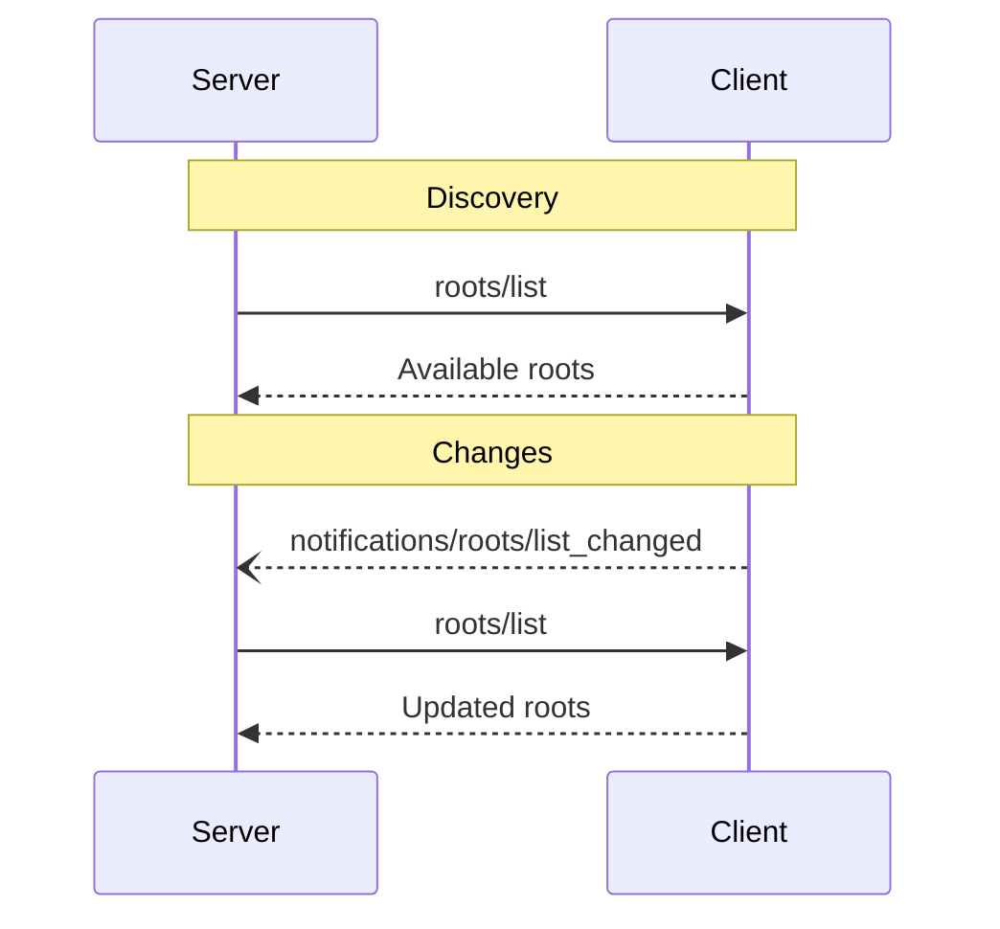

<div id="enable-section-numbers" />

模型上下文协议（MCP）为客户端向服务器暴露文件系统"根（roots）"提供了一种标准化的方式。根定义了服务器可以在文件系统中操作的边界，让它们理解自己有权访问哪些目录和文件。服务器可以向支持的客户端请求根列表，并在该列表变化时收到通知。

## 用户交互模型

MCP 中的根通常通过工作区或项目配置界面暴露。

例如，实现可以提供一个工作区/项目选择器，允许用户选择服务器应有权访问的目录和文件。这可以与从版本控制系统或项目文件进行的自动工作区检测相结合。

不过，实现可以自由地通过任何适合其需要的界面模式暴露根——协议本身并不强制任何特定的用户交互模型。

## 能力（Capabilities）

支持根的客户端**必须（MUST）**在[初始化](/specification/2025-11-25/basic/lifecycle#initialization)期间声明 `roots` 能力：

```json
{
  "capabilities": {
    "roots": {
      "listChanged": true
    }
  }
}
```

`listChanged` 指示客户端是否会在根列表变化时发出通知。

## 协议消息

### 列出根

要取回根，服务器发送一个 `roots/list` 请求：

**请求：**

```json
{
  "jsonrpc": "2.0",
  "id": 1,
  "method": "roots/list"
}
```

**响应：**

```json
{
  "jsonrpc": "2.0",
  "id": 1,
  "result": {
    "roots": [
      {
        "uri": "file:///home/user/projects/myproject",
        "name": "My Project"
      }
    ]
  }
}
```

### 根列表变更

当根变化时，支持 `listChanged` 的客户端**必须（MUST）**发送一个通知：

```json
{
  "jsonrpc": "2.0",
  "method": "notifications/roots/list_changed"
}
```

## 消息流程



## 数据类型

### Root

一个根定义包括：

- `uri`：根的唯一标识符。在当前规范中，这**必须（MUST）**是一个 `file://` URI。
- `name`：用于显示目的的可选人类可读名称。

面向不同用例的示例根：

#### 项目目录

```json
{
  "uri": "file:///home/user/projects/myproject",
  "name": "My Project"
}
```

#### 多个仓库

```json
[
  {
    "uri": "file:///home/user/repos/frontend",
    "name": "Frontend Repository"
  },
  {
    "uri": "file:///home/user/repos/backend",
    "name": "Backend Repository"
  }
]
```

## 错误处理

客户端**应当（SHOULD）**为常见的失败情形返回标准 JSON-RPC 错误：

- 客户端不支持根：`-32601`（Method not found）
- 内部错误：`-32603`

错误示例：

```json
{
  "jsonrpc": "2.0",
  "id": 1,
  "error": {
    "code": -32601,
    "message": "Roots not supported",
    "data": {
      "reason": "Client does not have roots capability"
    }
  }
}
```

## 安全考量

1. 客户端**必须（MUST）**：
   - 只暴露具有适当权限的根
   - 校验所有根 URI 以防止路径遍历
   - 实现适当的访问控制
   - 监控根的可访问性

2. 服务器**应当（SHOULD）**：
   - 处理根变得不可用的情况
   - 在操作期间尊重根边界
   - 依据所提供的根校验所有路径

## 实现指引

1. 客户端**应当（SHOULD）**：
   - 在向服务器暴露根之前征求用户同意
   - 为根管理提供清晰的用户界面
   - 在暴露前校验根的可访问性
   - 监控根的变化

2. 服务器**应当（SHOULD）**：
   - 在使用前检查 roots 能力
   - 优雅地处理根列表变更
   - 在操作中尊重根边界
   - 适当地缓存根信息
