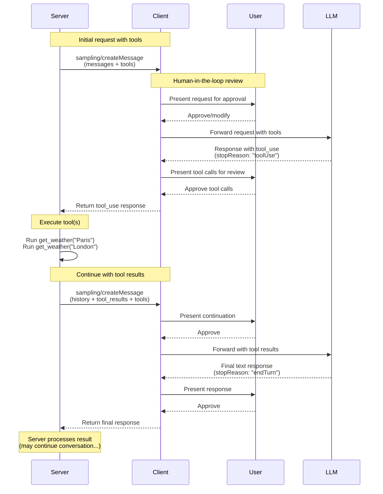
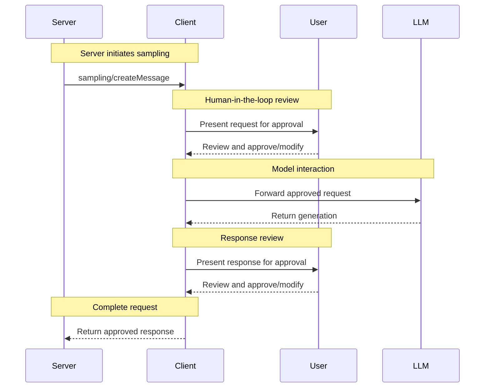

<div id="enable-section-numbers" />

模型上下文协议（MCP）为服务器通过客户端向语言模型请求 LLM 采样（"补全"或"生成"）提供了一种标准化的方式。此流程允许客户端保持对模型访问、选择和权限的控制，同时使服务器能够利用 AI 能力——无需服务器 API 密钥。服务器可以请求基于文本、音频或图像的交互，并可选地在其提示中包含来自 MCP 服务器的上下文。

## 用户交互模型

MCP 中的采样允许服务器通过使 LLM 调用发生在其他 MCP 服务器特性内部的_嵌套_位置来实现智能体行为。

实现可以自由地通过任何适合其需要的界面模式暴露采样——协议本身并不强制任何特定的用户交互模型。

<Warning>
  出于信任、安全与安全性的考虑，**应当（SHOULD）**始终有一个能够拒绝采样请求的人在环。

  应用**应当（SHOULD）**：

  - 提供易于且直观地审查采样请求的 UI
  - 允许用户在发送前查看和编辑提示
  - 在交付前呈现生成的响应以供审查
</Warning>

## 采样中的工具

服务器可以通过在其采样请求中提供一个 `tools` 数组和可选的 `toolChoice` 配置，来请求客户端的 LLM 在采样期间使用工具。这使服务器能够实现智能体行为，其中 LLM 可以调用工具、接收结果并继续对话——全部在单个采样请求流程内完成。

客户端**必须（MUST）**通过 `sampling.tools` 能力声明对工具使用的支持，才能接收启用工具的采样请求。服务器**不得（MUST NOT）**向未通过 `sampling.tools` 能力声明工具使用支持的客户端发送启用工具的采样请求。

## 能力（Capabilities）

支持采样的客户端**必须（MUST）**在[初始化](/specification/2025-11-25/basic/lifecycle#initialization)期间声明 `sampling` 能力：

**基本采样：**

```json
{
  "capabilities": {
    "sampling": {}
  }
}
```

**带工具使用支持：**

```json
{
  "capabilities": {
    "sampling": {
      "tools": {}
    }
  }
}
```

**带上下文包含支持（软弃用）：**

```json
{
  "capabilities": {
    "sampling": {
      "context": {}
    }
  }
}
```

<Note>
  `includeContext` 参数值 `"thisServer"` 和 `"allServers"` 已被软弃用。服务器**应当（SHOULD）**避免使用这些值（例如可以直接省略 `includeContext`，因为它默认为 `"none"`），并**不应（SHOULD NOT）**使用它们，除非客户端声明了 `sampling.context` 能力。这些值可能在未来的规范发布中被移除。
</Note>

## 协议消息

### 创建消息

要请求语言模型生成，服务器发送一个 `sampling/createMessage` 请求：

**请求：**

```json
{
  "jsonrpc": "2.0",
  "id": 1,
  "method": "sampling/createMessage",
  "params": {
    "messages": [
      {
        "role": "user",
        "content": {
          "type": "text",
          "text": "What is the capital of France?"
        }
      }
    ],
    "modelPreferences": {
      "hints": [
        {
          "name": "claude-3-sonnet"
        }
      ],
      "intelligencePriority": 0.8,
      "speedPriority": 0.5
    },
    "systemPrompt": "You are a helpful assistant.",
    "maxTokens": 100
  }
}
```

**响应：**

```json
{
  "jsonrpc": "2.0",
  "id": 1,
  "result": {
    "role": "assistant",
    "content": {
      "type": "text",
      "text": "The capital of France is Paris."
    },
    "model": "claude-3-sonnet-20240307",
    "stopReason": "endTurn"
  }
}
```

### 带工具的采样

下图演示了带工具采样的完整流程，包括多轮工具循环：



要请求带工具使用能力的 LLM 生成，服务器在请求中包含 `tools` 以及可选的 `toolChoice`：

**请求（服务器 -> 客户端）：**

```json
{
  "jsonrpc": "2.0",
  "id": 1,
  "method": "sampling/createMessage",
  "params": {
    "messages": [
      {
        "role": "user",
        "content": {
          "type": "text",
          "text": "What's the weather like in Paris and London?"
        }
      }
    ],
    "tools": [
      {
        "name": "get_weather",
        "description": "Get current weather for a city",
        "inputSchema": {
          "type": "object",
          "properties": {
            "city": {
              "type": "string",
              "description": "City name"
            }
          },
          "required": ["city"]
        }
      }
    ],
    "toolChoice": {
      "mode": "auto"
    },
    "maxTokens": 1000
  }
}
```

**响应（客户端 -> 服务器）：**

```json
{
  "jsonrpc": "2.0",
  "id": 1,
  "result": {
    "role": "assistant",
    "content": [
      {
        "type": "tool_use",
        "id": "call_abc123",
        "name": "get_weather",
        "input": {
          "city": "Paris"
        }
      },
      {
        "type": "tool_use",
        "id": "call_def456",
        "name": "get_weather",
        "input": {
          "city": "London"
        }
      }
    ],
    "model": "claude-3-sonnet-20240307",
    "stopReason": "toolUse"
  }
}
```

### 多轮工具循环

在从 LLM 收到工具使用请求后，服务器通常：

1. 执行所请求的工具使用。
2. 发送一个附加了工具结果的新采样请求
3. 接收 LLM 的响应（可能包含新的工具使用）
4. 按需重复多次（服务器可能会限制最大迭代次数，例如在最后一次迭代传入 `toolChoice: {mode: "none"}` 以强制得到最终结果）

**带工具结果的后续请求（服务器 -> 客户端）：**

```json
{
  "jsonrpc": "2.0",
  "id": 2,
  "method": "sampling/createMessage",
  "params": {
    "messages": [
      {
        "role": "user",
        "content": {
          "type": "text",
          "text": "What's the weather like in Paris and London?"
        }
      },
      {
        "role": "assistant",
        "content": [
          {
            "type": "tool_use",
            "id": "call_abc123",
            "name": "get_weather",
            "input": { "city": "Paris" }
          },
          {
            "type": "tool_use",
            "id": "call_def456",
            "name": "get_weather",
            "input": { "city": "London" }
          }
        ]
      },
      {
        "role": "user",
        "content": [
          {
            "type": "tool_result",
            "toolUseId": "call_abc123",
            "content": [
              {
                "type": "text",
                "text": "Weather in Paris: 18°C, partly cloudy"
              }
            ]
          },
          {
            "type": "tool_result",
            "toolUseId": "call_def456",
            "content": [
              {
                "type": "text",
                "text": "Weather in London: 15°C, rainy"
              }
            ]
          }
        ]
      }
    ],
    "tools": [
      {
        "name": "get_weather",
        "description": "Get current weather for a city",
        "inputSchema": {
          "type": "object",
          "properties": {
            "city": { "type": "string" }
          },
          "required": ["city"]
        }
      }
    ],
    "maxTokens": 1000
  }
}
```

**最终响应（客户端 -> 服务器）：**

```json
{
  "jsonrpc": "2.0",
  "id": 2,
  "result": {
    "role": "assistant",
    "content": {
      "type": "text",
      "text": "Based on the current weather data:\n\n- **Paris**: 18°C and partly cloudy - quite pleasant!\n- **London**: 15°C and rainy - you'll want an umbrella.\n\nParis has slightly warmer and drier conditions today."
    },
    "model": "claude-3-sonnet-20240307",
    "stopReason": "endTurn"
  }
}
```

## 消息内容约束

### 工具结果消息

当一条用户消息包含工具结果（type: "tool_result"）时，它**必须（MUST）**只包含工具结果。不允许在同一条消息中将工具结果与其他内容类型（文本、图像、音频）混合。

此约束确保与那些为工具结果使用专用角色的提供方 API 兼容（例如 OpenAI 的 "tool" 角色、Gemini 的 "function" 角色）。

**有效——单个工具结果：**

```json
{
  "role": "user",
  "content": {
    "type": "tool_result",
    "toolUseId": "call_123",
    "content": [{ "type": "text", "text": "Result data" }]
  }
}
```

**有效——多个工具结果：**

```json
{
  "role": "user",
  "content": [
    {
      "type": "tool_result",
      "toolUseId": "call_123",
      "content": [{ "type": "text", "text": "Result 1" }]
    },
    {
      "type": "tool_result",
      "toolUseId": "call_456",
      "content": [{ "type": "text", "text": "Result 2" }]
    }
  ]
}
```

**无效——混合内容：**

```json
{
  "role": "user",
  "content": [
    {
      "type": "text",
      "text": "Here are the results:"
    },
    {
      "type": "tool_result",
      "toolUseId": "call_123",
      "content": [{ "type": "text", "text": "Result data" }]
    }
  ]
}
```

### 工具使用与结果的平衡

在采样中使用工具使用时，每条包含 `ToolUseContent` 块的 assistant 消息**必须（MUST）**紧跟一条完全由 `ToolResultContent` 块组成的 user 消息，其中每个工具使用（例如带 `id: $id`）由一个对应的工具结果（带 `toolUseId: $id`）匹配，然后才能有任何其他消息。

此要求确保：

- 工具使用在对话继续之前总是被解决
- 提供方 API 可以并发处理多个工具使用并并行获取其结果
- 对话维持一致的请求-响应模式

**有效序列示例：**

1. 用户消息："What's the weather like in Paris and London?"
2. Assistant 消息：`ToolUseContent`（`id: "call_abc123", name: "get_weather", input: {city: "Paris"}`）+ `ToolUseContent`（`id: "call_def456", name: "get_weather", input: {city: "London"}`）
3. 用户消息：`ToolResultContent`（`toolUseId: "call_abc123", content: "18°C, partly cloudy"`）+ `ToolResultContent`（`toolUseId: "call_def456", content: "15°C, rainy"`）
4. Assistant 消息：比较两个城市天气的文本响应

**无效序列——缺少工具结果：**

1. 用户消息："What's the weather like in Paris and London?"
2. Assistant 消息：`ToolUseContent`（`id: "call_abc123", name: "get_weather", input: {city: "Paris"}`）+ `ToolUseContent`（`id: "call_def456", name: "get_weather", input: {city: "London"}`）
3. 用户消息：`ToolResultContent`（`toolUseId: "call_abc123", content: "18°C, partly cloudy"`）← 缺少 call_def456 的结果
4. Assistant 消息：文本响应（无效——并非所有工具使用都已被解决）

## 跨 API 兼容性

采样规范被设计为可跨多个 LLM 提供方 API（Claude、OpenAI、Gemini 等）工作。为兼容性做出的关键设计决策：

### 消息角色

MCP 使用两个角色："user" 和 "assistant"。

工具使用请求以 "assistant" 角色在 CreateMessageResult 中发送。工具结果以 "user" 角色在消息中发回。带工具结果的消息不能包含其他种类的内容。

### 工具选择模式

`CreateMessageRequest.params.toolChoice` 控制模型的工具使用能力：

- `{mode: "auto"}`：模型决定是否使用工具（默认）
- `{mode: "required"}`：模型必须（MUST）在完成前至少使用一个工具
- `{mode: "none"}`：模型不得（MUST NOT）使用任何工具

### 并行工具使用

MCP 允许模型并行发起多个工具使用请求（返回一个 `ToolUseContent` 数组）。所有主流提供方 API 都支持这一点：

- **Claude**：原生支持并行工具使用
- **OpenAI**：支持并行工具调用（可通过 `parallel_tool_calls: false` 禁用）
- **Gemini**：原生支持并行函数调用

包装那些支持禁用并行工具使用的提供方的实现可以（MAY）将其作为扩展暴露，但它不属于核心 MCP 规范。

## 消息流程



## 数据类型

### 消息

采样消息可以包含：

#### 文本内容

```json
{
  "type": "text",
  "text": "The message content"
}
```

#### 图像内容

```json
{
  "type": "image",
  "data": "base64-encoded-image-data",
  "mimeType": "image/jpeg"
}
```

#### 音频内容

```json
{
  "type": "audio",
  "data": "base64-encoded-audio-data",
  "mimeType": "audio/wav"
}
```

### 模型偏好

MCP 中的模型选择需要谨慎的抽象，因为服务器和客户端可能使用具有不同模型产品的不同 AI 提供方。服务器不能简单地按名称请求特定模型，因为客户端可能无法访问那个确切的模型，或者可能更倾向于使用另一个提供方的等价模型。

为解决这一点，MCP 实现了一个偏好系统，将抽象的能力优先级与可选的模型提示相结合：

#### 能力优先级

服务器通过三个归一化的优先级值（0-1）表达其需求：

- `costPriority`：最小化成本有多重要？更高的值倾向于更便宜的模型。
- `speedPriority`：低时延有多重要？更高的值倾向于更快的模型。
- `intelligencePriority`：高级能力有多重要？更高的值倾向于更强的模型。

#### 模型提示

优先级帮助基于特性选择模型，而 `hints` 允许服务器建议特定的模型或模型系列：

- 提示被视为可以灵活匹配模型名称的子串
- 多个提示按偏好顺序被评估
- 客户端**可以（MAY）**将提示映射到来自不同提供方的等价模型
- 提示是建议性的——客户端做出最终的模型选择

例如：

```json
{
  "hints": [
    { "name": "claude-3-sonnet" }, // Prefer Sonnet-class models
    { "name": "claude" } // Fall back to any Claude model
  ],
  "costPriority": 0.3, // Cost is less important
  "speedPriority": 0.8, // Speed is very important
  "intelligencePriority": 0.5 // Moderate capability needs
}
```

客户端处理这些偏好，从其可用选项中选择一个合适的模型。例如，如果客户端无法访问 Claude 模型但拥有 Gemini，它可能基于相似的能力将 sonnet 提示映射到 `gemini-1.5-pro`。

## 错误处理

客户端**应当（SHOULD）**为常见的失败情形返回错误：

- 用户拒绝了采样请求：`-1`
- 请求中缺少工具结果：`-32602`（Invalid params）
- 工具结果与其他内容混合：`-32602`（Invalid params）

错误示例：

```json
{
  "jsonrpc": "2.0",
  "id": 3,
  "error": {
    "code": -1,
    "message": "User rejected sampling request"
  }
}
```

```json
{
  "jsonrpc": "2.0",
  "id": 4,
  "error": {
    "code": -32602,
    "message": "Tool result missing in request"
  }
}
```

## 安全考量

1. 客户端**应当（SHOULD）**实现用户审批控制
2. 双方都**应当（SHOULD）**校验消息内容
3. 客户端**应当（SHOULD）**尊重模型偏好提示
4. 客户端**应当（SHOULD）**实现限流
5. 双方都**必须（MUST）**妥善处理敏感数据

当在采样中使用工具时，还适用额外的安全考量：

6. 服务器**必须（MUST）**确保在回复 `stopReason: "toolUse"` 时，每个 `ToolUseContent` 项都以一个带匹配 `toolUseId` 的 `ToolResultContent` 项予以响应，并且用户消息只包含工具结果（不含其他内容类型）
7. 双方都**应当（SHOULD）**为工具循环实现迭代限制
