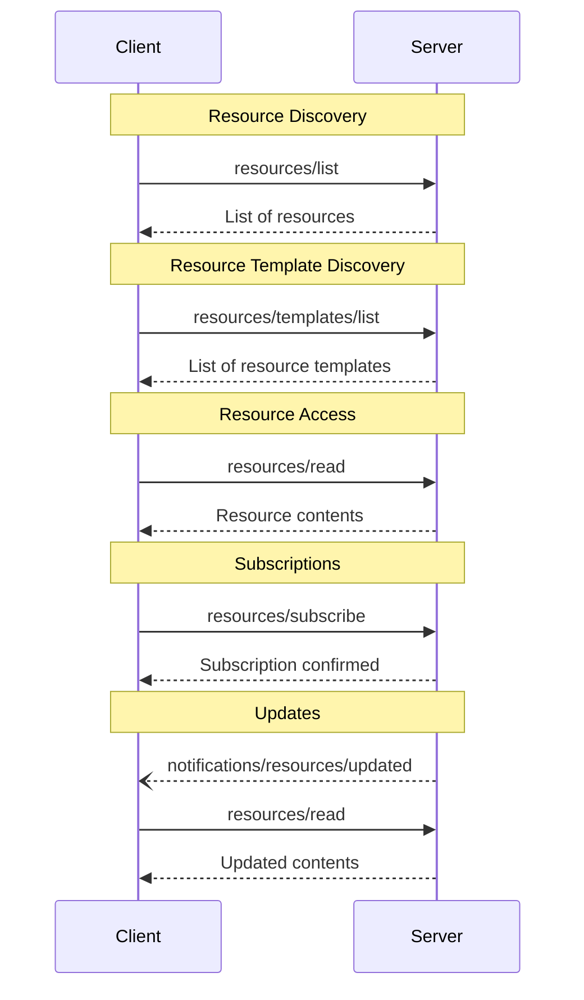

<div id="enable-section-numbers" />

模型上下文协议（MCP）为服务器向客户端暴露资源提供了一种标准化的方式。资源允许服务器共享为语言模型提供上下文的数据，例如文件、数据库 schema 或应用特定的信息。每个资源由一个 [URI](https://datatracker.ietf.org/doc/html/rfc3986) 唯一标识。

## 用户交互模型

MCP 中的资源被设计为**应用驱动的（application-driven）**，由宿主应用根据其需要决定如何并入上下文。

例如，应用可以：

- 通过 UI 元素（在树形或列表视图中）暴露资源以供显式选择
- 允许用户搜索和过滤可用的资源
- 基于启发式方法或 AI 模型的选择实现自动的上下文包含


不过，实现可以自由地通过任何适合其需要的界面模式暴露资源——协议本身并不强制任何特定的用户交互模型。

## 能力（Capabilities）

支持资源的服务器**必须（MUST）**声明 `resources` 能力：

```json
{
  "capabilities": {
    "resources": {
      "subscribe": true,
      "listChanged": true
    }
  }
}
```

该能力支持两个可选特性：

- `subscribe`：客户端是否可以订阅以在单个资源变化时收到通知。
- `listChanged`：服务器是否会在可用资源列表变化时发出通知。

`subscribe` 和 `listChanged` 都是可选的——服务器可以两者都不支持、支持其一，或两者都支持：

```json
{
  "capabilities": {
    "resources": {} // Neither feature supported
  }
}
```

```json
{
  "capabilities": {
    "resources": {
      "subscribe": true // Only subscriptions supported
    }
  }
}
```

```json
{
  "capabilities": {
    "resources": {
      "listChanged": true // Only list change notifications supported
    }
  }
}
```

## 协议消息

### 列出资源

要发现可用的资源，客户端发送一个 `resources/list` 请求。此操作支持[分页](/specification/2025-11-25/server/utilities/pagination)。

**请求：**

```json
{
  "jsonrpc": "2.0",
  "id": 1,
  "method": "resources/list",
  "params": {
    "cursor": "optional-cursor-value"
  }
}
```

**响应：**

```json
{
  "jsonrpc": "2.0",
  "id": 1,
  "result": {
    "resources": [
      {
        "uri": "file:///project/src/main.rs",
        "name": "main.rs",
        "title": "Rust Software Application Main File",
        "description": "Primary application entry point",
        "mimeType": "text/x-rust",
        "icons": [
          {
            "src": "https://example.com/rust-file-icon.png",
            "mimeType": "image/png",
            "sizes": ["48x48"]
          }
        ]
      }
    ],
    "nextCursor": "next-page-cursor"
  }
}
```

### 读取资源

要取回资源内容，客户端发送一个 `resources/read` 请求：

**请求：**

```json
{
  "jsonrpc": "2.0",
  "id": 2,
  "method": "resources/read",
  "params": {
    "uri": "file:///project/src/main.rs"
  }
}
```

**响应：**

```json
{
  "jsonrpc": "2.0",
  "id": 2,
  "result": {
    "contents": [
      {
        "uri": "file:///project/src/main.rs",
        "mimeType": "text/x-rust",
        "text": "fn main() {\n    println!(\"Hello world!\");\n}"
      }
    ]
  }
}
```

### 资源模板

资源模板允许服务器使用 [URI 模板](https://datatracker.ietf.org/doc/html/rfc6570)暴露参数化的资源。参数可以通过[补全 API](/specification/2025-11-25/server/utilities/completion)自动补全。

**请求：**

```json
{
  "jsonrpc": "2.0",
  "id": 3,
  "method": "resources/templates/list"
}
```

**响应：**

```json
{
  "jsonrpc": "2.0",
  "id": 3,
  "result": {
    "resourceTemplates": [
      {
        "uriTemplate": "file:///{path}",
        "name": "Project Files",
        "title": "📁 Project Files",
        "description": "Access files in the project directory",
        "mimeType": "application/octet-stream",
        "icons": [
          {
            "src": "https://example.com/folder-icon.png",
            "mimeType": "image/png",
            "sizes": ["48x48"]
          }
        ]
      }
    ]
  }
}
```

### 列表变更通知

当可用资源列表变化时，声明了 `listChanged` 能力的服务器**应当（SHOULD）**发送一个通知：

```json
{
  "jsonrpc": "2.0",
  "method": "notifications/resources/list_changed"
}
```

### 订阅

协议支持对资源变化的可选订阅。客户端可以订阅特定资源，并在它们变化时收到通知：

**订阅请求：**

```json
{
  "jsonrpc": "2.0",
  "id": 4,
  "method": "resources/subscribe",
  "params": {
    "uri": "file:///project/src/main.rs"
  }
}
```

**更新通知：**

```json
{
  "jsonrpc": "2.0",
  "method": "notifications/resources/updated",
  "params": {
    "uri": "file:///project/src/main.rs"
  }
}
```

## 消息流程



## 数据类型

### Resource

一个资源定义包括：

- `uri`：资源的唯一标识符
- `name`：资源的名称。
- `title`：用于显示目的的可选人类可读资源名称。
- `description`：可选的描述
- `icons`：用于在用户界面中显示的可选图标数组
- `mimeType`：可选的 MIME 类型
- `size`：可选的字节大小

### 资源内容

资源可以包含文本或二进制数据：

#### 文本内容

```json
{
  "uri": "file:///example.txt",
  "mimeType": "text/plain",
  "text": "Resource content"
}
```

#### 二进制内容

```json
{
  "uri": "file:///example.png",
  "mimeType": "image/png",
  "blob": "base64-encoded-data"
}
```

### 注解（Annotations）

资源、资源模板和内容块支持可选的注解，为客户端提供关于如何使用或显示资源的提示：

- **`audience`**：一个数组，指示此资源的目标受众。有效值为 `"user"` 和 `"assistant"`。例如，`["user", "assistant"]` 表示对两者都有用的内容。
- **`priority`**：一个从 0.0 到 1.0 的数字，指示此资源的重要性。值为 1 表示"最重要"（实际上是必需的），而 0 表示"最不重要"（完全可选）。
- **`lastModified`**：一个 ISO 8601 格式的时间戳，指示资源最后一次被修改的时间（例如 `"2025-01-12T15:00:58Z"`）。

带注解的资源示例：

```json
{
  "uri": "file:///project/README.md",
  "name": "README.md",
  "title": "Project Documentation",
  "mimeType": "text/markdown",
  "annotations": {
    "audience": ["user"],
    "priority": 0.8,
    "lastModified": "2025-01-12T15:00:58Z"
  }
}
```

客户端可以使用这些注解来：

- 根据其目标受众过滤资源
- 优先决定将哪些资源包含在上下文中
- 显示修改时间或按新近程度排序

## 常见 URI 方案

协议定义了若干标准 URI 方案。此列表并不详尽——实现始终可以自由使用额外的、自定义的 URI 方案。

### https://

用于表示 web 上可用的资源。

服务器**应当（SHOULD）**仅在客户端能够自行直接从 web 获取和加载资源时才使用此方案——也就是说，它不需要通过 MCP 服务器读取该资源。

对于其他用例，服务器**应当（SHOULD）**优先使用另一种 URI 方案或定义一个自定义方案，即使服务器自身将通过互联网下载资源内容。

### file://

用于标识行为类似文件系统的资源。然而，这些资源不需要映射到实际的物理文件系统。

MCP 服务器**可以（MAY）**用 [XDG MIME 类型](https://specifications.freedesktop.org/shared-mime-info-spec/0.14/ar01s02.html#id-1.3.14)（如 `inode/directory`）来标识 file:// 资源，以表示那些原本没有标准 MIME 类型的非常规文件（如目录）。

### git://

Git 版本控制集成。

### 自定义 URI 方案

自定义 URI 方案**必须（MUST）**符合 [RFC3986](https://datatracker.ietf.org/doc/html/rfc3986)，并考虑上述指导。

## 错误处理

服务器**应当（SHOULD）**为常见的失败情形返回标准 JSON-RPC 错误：

- 资源未找到：`-32002`
- 内部错误：`-32603`

错误示例：

```json
{
  "jsonrpc": "2.0",
  "id": 5,
  "error": {
    "code": -32002,
    "message": "Resource not found",
    "data": {
      "uri": "file:///nonexistent.txt"
    }
  }
}
```

## 安全考量

1. 服务器**必须（MUST）**校验所有资源 URI
2. **应当（SHOULD）**为敏感资源实现访问控制
3. 二进制数据**必须（MUST）**被正确编码
4. **应当（SHOULD）**在操作前检查资源权限
