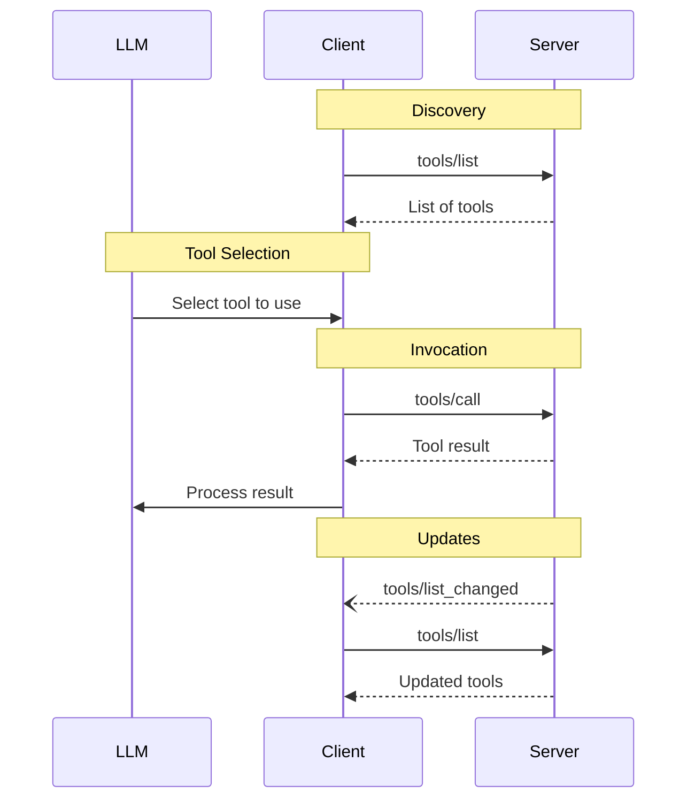

<div id="enable-section-numbers" />

模型上下文协议（MCP）允许服务器暴露可由语言模型调用的工具。工具使模型能够与外部系统交互，例如查询数据库、调用 API 或执行计算。每个工具由一个名称唯一标识，并包含描述其 schema 的元数据。

## 用户交互模型

MCP 中的工具被设计为**由模型控制（model-controlled）**，意味着语言模型可以根据其上下文理解和用户的提示自动发现和调用工具。

不过，实现可以自由地通过任何适合其需要的界面模式暴露工具——协议本身并不强制任何特定的用户交互模型。

<Warning>
  出于信任、安全与安全性的考虑，**应当（SHOULD）**始终有一个能够拒绝工具调用的人在环（human in the loop）。

  应用**应当（SHOULD）**：

  - 提供 UI，清晰地表明哪些工具正被暴露给 AI 模型
  - 在工具被调用时插入清晰的视觉指示
  - 就操作向用户呈现确认提示，以确保有一个人在环
</Warning>

## 能力（Capabilities）

支持工具的服务器**必须（MUST）**声明 `tools` 能力：

```json
{
  "capabilities": {
    "tools": {
      "listChanged": true
    }
  }
}
```

`listChanged` 指示服务器是否会在可用工具列表变化时发出通知。

## 协议消息

### 列出工具

要发现可用的工具，客户端发送一个 `tools/list` 请求。此操作支持[分页](/specification/2025-11-25/server/utilities/pagination)。

**请求：**

```json
{
  "jsonrpc": "2.0",
  "id": 1,
  "method": "tools/list",
  "params": {
    "cursor": "optional-cursor-value"
  }
}
```

**响应：**

```json
{
  "jsonrpc": "2.0",
  "id": 1,
  "result": {
    "tools": [
      {
        "name": "get_weather",
        "title": "Weather Information Provider",
        "description": "Get current weather information for a location",
        "inputSchema": {
          "type": "object",
          "properties": {
            "location": {
              "type": "string",
              "description": "City name or zip code"
            }
          },
          "required": ["location"]
        },
        "icons": [
          {
            "src": "https://example.com/weather-icon.png",
            "mimeType": "image/png",
            "sizes": ["48x48"]
          }
        ],
        "execution": {
          "taskSupport": "optional"
        }
      }
    ],
    "nextCursor": "next-page-cursor"
  }
}
```

### 调用工具

要调用一个工具，客户端发送一个 `tools/call` 请求：

**请求：**

```json
{
  "jsonrpc": "2.0",
  "id": 2,
  "method": "tools/call",
  "params": {
    "name": "get_weather",
    "arguments": {
      "location": "New York"
    }
  }
}
```

**响应：**

```json
{
  "jsonrpc": "2.0",
  "id": 2,
  "result": {
    "content": [
      {
        "type": "text",
        "text": "Current weather in New York:\nTemperature: 72°F\nConditions: Partly cloudy"
      }
    ],
    "isError": false
  }
}
```

### 列表变更通知

当可用工具列表变化时，声明了 `listChanged` 能力的服务器**应当（SHOULD）**发送一个通知：

```json
{
  "jsonrpc": "2.0",
  "method": "notifications/tools/list_changed"
}
```

## 消息流程



## 数据类型

### Tool

一个工具定义包括：

- `name`：工具的唯一标识符
- `title`：用于显示目的的可选人类可读工具名称。
- `description`：功能的人类可读描述
- `icons`：用于在用户界面中显示的可选图标数组
- `inputSchema`：定义预期参数的 JSON Schema
  - 遵循 [JSON Schema 用法指南](/specification/2025-11-25/basic#json-schema-usage)
  - 若不存在 `$schema` 字段则默认为 2020-12
  - **必须（MUST）**是一个有效的 JSON Schema 对象（而非 `null`）
  - 对于没有参数的工具，使用以下有效方式之一：
    - `{ "type": "object", "additionalProperties": false }` —— **推荐**：显式地只接受空对象
    - `{ "type": "object" }` —— 接受任何对象（包括带属性的）
- `outputSchema`：定义预期输出结构的可选 JSON Schema
  - 遵循 [JSON Schema 用法指南](/specification/2025-11-25/basic#json-schema-usage)
  - 若不存在 `$schema` 字段则默认为 2020-12
- `annotations`：描述工具行为的可选属性
- `execution`：描述执行相关属性的可选对象
  - `taskSupport`：指示此工具是否支持[任务增强执行](/specification/2025-11-25/basic/utilities/tasks#tool-level-negotiation)。取值：`"forbidden"`（默认）、`"optional"` 或 `"required"`

<Warning>
  出于信任、安全与安全性的考虑，客户端**必须（MUST）**将工具注解视为不可信的，除非它们来自受信任的服务器。
</Warning>

#### 工具名称

- 工具名称**应当（SHOULD）**在 1 到 128 个字符之间（含）。
- 工具名称**应当（SHOULD）**被视为区分大小写。
- 以下**应当（SHOULD）**是唯一允许的字符：大写和小写 ASCII 字母（A-Z、a-z）、数字（0-9）、下划线（\_）、连字符（-）和点（.）
- 工具名称**不应（SHOULD NOT）**包含空格、逗号或其他特殊字符。
- 工具名称**应当（SHOULD）**在一个服务器内唯一。
- 有效工具名称示例：
  - getUser
  - DATA_EXPORT_v2
  - admin.tools.list

### 工具结果

工具结果可以包含[**结构化**](#structured-content)或**非结构化**内容。

**非结构化**内容在结果的 `content` 字段中返回，可以包含多个不同类型的内容项：

<Note>
  所有内容类型（文本、图像、音频、资源链接和嵌入资源）都支持可选的[注解](/specification/2025-11-25/server/resources#annotations)，用于提供关于受众、优先级和修改时间的元数据。这与资源和提示使用的注解格式相同。
</Note>

#### 文本内容

```json
{
  "type": "text",
  "text": "Tool result text"
}
```

#### 图像内容

```json
{
  "type": "image",
  "data": "base64-encoded-data",
  "mimeType": "image/png",
  "annotations": {
    "audience": ["user"],
    "priority": 0.9
  }
}
```

#### 音频内容

```json
{
  "type": "audio",
  "data": "base64-encoded-audio-data",
  "mimeType": "audio/wav"
}
```

#### 资源链接

工具**可以（MAY）**返回到[资源](/specification/2025-11-25/server/resources)的链接，以提供额外的上下文或数据。在这种情况下，工具将返回一个客户端可以订阅或获取的 URI：

```json
{
  "type": "resource_link",
  "uri": "file:///project/src/main.rs",
  "name": "main.rs",
  "description": "Primary application entry point",
  "mimeType": "text/x-rust"
}
```

资源链接支持与常规资源相同的[资源注解](/specification/2025-11-25/server/resources#annotations)，以帮助客户端理解如何使用它们。

<Info>
  工具返回的资源链接不保证会出现在 `resources/list` 请求的结果中。
</Info>

#### 嵌入的资源

[资源](/specification/2025-11-25/server/resources)**可以（MAY）**使用合适的 [URI 方案](./resources#common-uri-schemes)被嵌入，以提供额外的上下文或数据。使用嵌入资源的服务器**应当（SHOULD）**实现 `resources` 能力：

```json
{
  "type": "resource",
  "resource": {
    "uri": "file:///project/src/main.rs",
    "mimeType": "text/x-rust",
    "text": "fn main() {\n    println!(\"Hello world!\");\n}",
    "annotations": {
      "audience": ["user", "assistant"],
      "priority": 0.7,
      "lastModified": "2025-05-03T14:30:00Z"
    }
  }
}
```

嵌入的资源支持与常规资源相同的[资源注解](/specification/2025-11-25/server/resources#annotations)，以帮助客户端理解如何使用它们。

#### 结构化内容

**结构化**内容在结果的 `structuredContent` 字段中作为一个 JSON 对象返回。

为了向后兼容，返回结构化内容的工具应当（SHOULD）同时在一个 TextContent 块中返回序列化的 JSON。

<Note>
  `structuredContent` 是服务器产出的结果数据，与 LLM 的"结构化输出"（受 schema 约束的模型生成）无关。
</Note>

#### 输出 Schema

工具也可以提供一个输出 schema 以校验结构化结果。如果提供了输出 schema：

- 服务器**必须（MUST）**提供符合此 schema 的结构化结果。
- 客户端**应当（SHOULD）**依据此 schema 校验结构化结果。

带输出 schema 的工具示例：

```json
{
  "name": "get_weather_data",
  "title": "Weather Data Retriever",
  "description": "Get current weather data for a location",
  "inputSchema": {
    "type": "object",
    "properties": {
      "location": {
        "type": "string",
        "description": "City name or zip code"
      }
    },
    "required": ["location"]
  },
  "outputSchema": {
    "type": "object",
    "properties": {
      "temperature": {
        "type": "number",
        "description": "Temperature in celsius"
      },
      "conditions": {
        "type": "string",
        "description": "Weather conditions description"
      },
      "humidity": {
        "type": "number",
        "description": "Humidity percentage"
      }
    },
    "required": ["temperature", "conditions", "humidity"]
  }
}
```

此工具的有效响应示例：

```json
{
  "jsonrpc": "2.0",
  "id": 5,
  "result": {
    "content": [
      {
        "type": "text",
        "text": "{\"temperature\": 22.5, \"conditions\": \"Partly cloudy\", \"humidity\": 65}"
      }
    ],
    "structuredContent": {
      "temperature": 22.5,
      "conditions": "Partly cloudy",
      "humidity": 65
    }
  }
}
```

提供输出 schema 通过以下方式帮助客户端和 LLM 理解并正确处理结构化的工具输出：

- 启用对响应的严格 schema 校验
- 提供类型信息以更好地与编程语言集成
- 引导客户端和 LLM 正确解析和利用返回的数据
- 支持更好的文档和开发者体验

### Schema 示例

#### 使用默认 2020-12 schema 的工具：

```json
{
  "name": "calculate_sum",
  "description": "Add two numbers",
  "inputSchema": {
    "type": "object",
    "properties": {
      "a": { "type": "number" },
      "b": { "type": "number" }
    },
    "required": ["a", "b"]
  }
}
```

#### 使用显式 draft-07 schema 的工具：

```json
{
  "name": "calculate_sum",
  "description": "Add two numbers",
  "inputSchema": {
    "$schema": "http://json-schema.org/draft-07/schema#",
    "type": "object",
    "properties": {
      "a": { "type": "number" },
      "b": { "type": "number" }
    },
    "required": ["a", "b"]
  }
}
```

#### 没有参数的工具：

```json
{
  "name": "get_current_time",
  "description": "Returns the current server time",
  "inputSchema": {
    "type": "object",
    "additionalProperties": false
  }
}
```

## 错误处理

工具使用两种错误报告机制：

1. **协议错误（Protocol Errors）**：用于以下问题的标准 JSON-RPC 错误：
   - 未知工具
   - 格式错误的请求（未能满足 [CallToolRequest schema](/specification/2025-11-25/schema#calltoolrequest) 的请求）
   - 服务器错误

2. **工具执行错误（Tool Execution Errors）**：在工具结果中以 `isError: true` 报告：
   - API 失败
   - 输入校验错误（例如日期格式错误、值超出范围）
   - 业务逻辑错误

**工具执行错误**包含可操作的反馈，语言模型可以用它来自我纠正并使用调整后的参数重试。**协议错误**指示请求结构本身的问题，模型较不可能修复。客户端**应当（SHOULD）**向语言模型提供工具执行错误以启用自我纠正。客户端**可以（MAY）**向语言模型提供协议错误，尽管这些较不可能带来成功的恢复。

协议错误示例：

```json
{
  "jsonrpc": "2.0",
  "id": 3,
  "error": {
    "code": -32602,
    "message": "Unknown tool: invalid_tool_name"
  }
}
```

工具执行错误示例（输入校验）：

```json
{
  "jsonrpc": "2.0",
  "id": 4,
  "result": {
    "content": [
      {
        "type": "text",
        "text": "Invalid departure date: must be in the future. Current date is 08/08/2025."
      }
    ],
    "isError": true
  }
}
```

## 安全考量

1. 服务器**必须（MUST）**：
   - 校验所有工具输入
   - 实现适当的访问控制
   - 对工具调用进行限流
   - 净化工具输出

2. 客户端**应当（SHOULD）**：
   - 对敏感操作提示用户确认
   - 在调用服务器之前向用户展示工具输入，以避免恶意或意外的数据外泄
   - 在传递给 LLM 之前校验工具结果
   - 为工具调用实现超时
   - 记录工具使用以便审计
