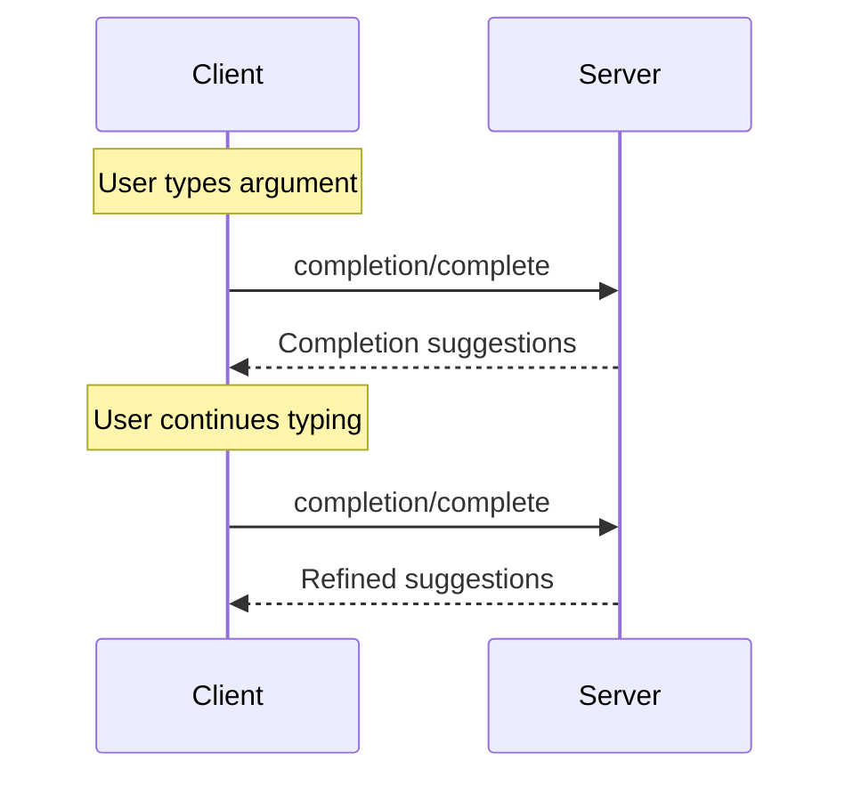

<div id="enable-section-numbers" />

模型上下文协议（MCP）为服务器提供了一种标准化的方式，为提示和资源模板的参数提供自动补全建议。当用户正在为特定提示（由名称标识）或资源模板（由 URI 标识）填写参数值时，服务器可以提供上下文相关的建议。

## 用户交互模型

MCP 中的补全被设计为支持类似于 IDE 代码补全的交互式用户体验。

例如，应用可以在用户输入时在下拉菜单或弹出菜单中显示补全建议，并能够从可用选项中过滤和选择。

然而，实现可以自由地通过任何适合其需求的界面模式暴露补全——协议本身不强制规定任何特定的用户交互模型。

## 能力

支持补全的服务器**必须（MUST）**声明 `completions` 能力：

```json
{
  "capabilities": {
    "completions": {}
  }
}
```

## 协议消息

### 请求补全

要获取补全建议，客户端发送一个 `completion/complete` 请求，通过一个引用类型指定正在补全什么：

**请求：**

```json
{
  "jsonrpc": "2.0",
  "id": 1,
  "method": "completion/complete",
  "params": {
    "ref": {
      "type": "ref/prompt",
      "name": "code_review"
    },
    "argument": {
      "name": "language",
      "value": "py"
    }
  }
}
```

**响应：**

```json
{
  "jsonrpc": "2.0",
  "id": 1,
  "result": {
    "completion": {
      "values": ["python", "pytorch", "pyside"],
      "total": 10,
      "hasMore": true
    }
  }
}
```

对于带多个参数的提示或 URI 模板，客户端应在 `context.arguments` 对象中包含先前的补全，以为后续请求提供上下文。

**请求：**

```json
{
  "jsonrpc": "2.0",
  "id": 1,
  "method": "completion/complete",
  "params": {
    "ref": {
      "type": "ref/prompt",
      "name": "code_review"
    },
    "argument": {
      "name": "framework",
      "value": "fla"
    },
    "context": {
      "arguments": {
        "language": "python"
      }
    }
  }
}
```

**响应：**

```json
{
  "jsonrpc": "2.0",
  "id": 1,
  "result": {
    "completion": {
      "values": ["flask"],
      "total": 1,
      "hasMore": false
    }
  }
}
```

### 引用类型

协议支持两种类型的补全引用：

| 类型           | 描述                               | 示例                                             |
| -------------- | ----------------------------------------- | --------------------------------------------------- |
| `ref/prompt`   | 按名称引用一个提示               | `{"type": "ref/prompt", "name": "code_review"}`     |
| `ref/resource` | 引用一个资源 URI | `{"type": "ref/resource", "uri": "file:///{path}"}` |

### 补全结果

服务器返回一个按相关性排名的补全值数组，带有：

- 每个响应最多 100 项
- 可选的可用匹配总数
- 一个指示是否存在额外结果的布尔值

## 消息流



## 数据类型

### CompleteRequest

- `ref`：一个 `PromptReference` 或 `ResourceReference`
- `argument`：包含以下内容的对象：
  - `name`：参数名
  - `value`：当前值
- `context`：包含以下内容的对象：
  - `arguments`：一个从已解析的参数名到它们的值的映射。

### CompleteResult

- `completion`：包含以下内容的对象：
  - `values`：建议数组（最多 100 个）
  - `total`：可选的匹配总数
  - `hasMore`：额外结果标志

## 错误处理

服务器**应当（SHOULD）**为常见的失败情况返回标准的 JSON-RPC 错误：

- 方法未找到：`-32601`（不支持该能力）
- 无效的提示名：`-32602`（Invalid params）
- 缺少必需的参数：`-32602`（Invalid params）
- 内部错误：`-32603`（Internal error）

## 实现考量

1. 服务器**应当（SHOULD）**：
   - 返回按相关性排序的建议
   - 在适当时实现模糊匹配
   - 对补全请求进行速率限制
   - 校验所有输入

2. 客户端**应当（SHOULD）**：
   - 对快速的补全请求进行去抖（debounce）
   - 在适当时缓存补全结果
   - 优雅地处理缺失或部分的结果

## 安全

实现**必须（MUST）**：

- 校验所有补全输入
- 实现适当的速率限制
- 控制对敏感建议的访问
- 防止基于补全的信息泄露
