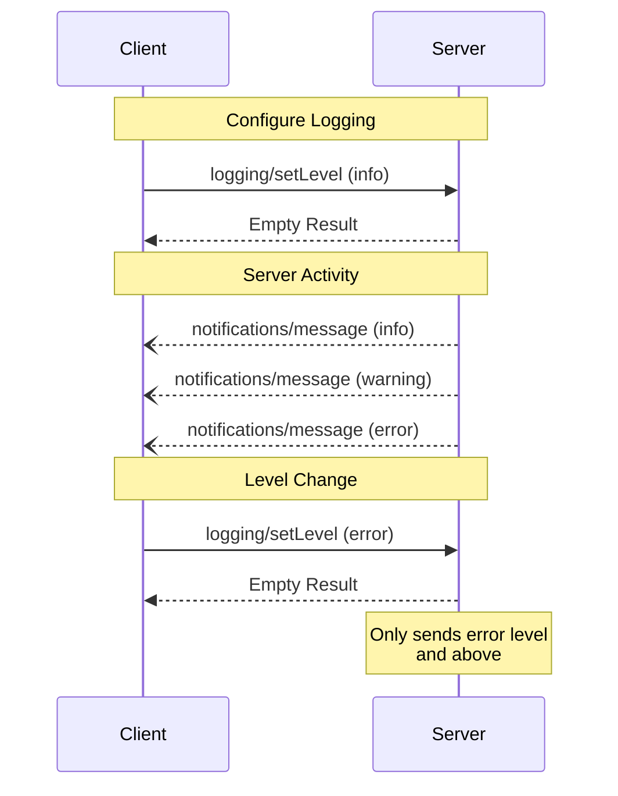

<div id="enable-section-numbers" />

模型上下文协议（MCP）为服务器向客户端发送结构化日志消息提供了一种标准化的方式。客户端可以通过设置最低日志级别来控制日志详细程度，服务器则发送包含严重性级别、可选 logger 名称以及任意 JSON 可序列化数据的通知。

## 用户交互模型

实现可以自由地通过任何适合其需要的界面模式暴露日志——协议本身并不强制任何特定的用户交互模型。

## 能力（Capabilities）

发出日志消息通知的服务器**必须（MUST）**声明 `logging` 能力：

```json
{
  "capabilities": {
    "logging": {}
  }
}
```

## 日志级别（Log Levels）

协议遵循 [RFC 5424](https://datatracker.ietf.org/doc/html/rfc5424#section-6.2.1) 中规定的标准 syslog 严重性级别：

| 级别      | 描述                             | 示例用例                   |
| --------- | -------------------------------- | -------------------------- |
| debug     | 详细的调试信息                   | 函数进入/退出点            |
| info      | 一般性信息消息                   | 操作进度更新               |
| notice    | 正常但重要的事件                 | 配置变更                   |
| warning   | 警告状况                         | 使用已弃用特性             |
| error     | 错误状况                         | 操作失败                   |
| critical  | 严重状况                         | 系统组件故障               |
| alert     | 必须立即采取行动                 | 检测到数据损坏             |
| emergency | 系统不可用                       | 系统完全故障               |

## 协议消息

### 设置日志级别

要配置最低日志级别，客户端**可以（MAY）**发送一个 `logging/setLevel` 请求：

**请求：**

```json
{
  "jsonrpc": "2.0",
  "id": 1,
  "method": "logging/setLevel",
  "params": {
    "level": "info"
  }
}
```

### 日志消息通知

服务器使用 `notifications/message` 通知发送日志消息：

```json
{
  "jsonrpc": "2.0",
  "method": "notifications/message",
  "params": {
    "level": "error",
    "logger": "database",
    "data": {
      "error": "Connection failed",
      "details": {
        "host": "localhost",
        "port": 5432
      }
    }
  }
}
```

## 消息流程



## 错误处理

服务器**应当（SHOULD）**为常见的失败情形返回标准 JSON-RPC 错误：

- 无效的日志级别：`-32602`（Invalid params）
- 配置错误：`-32603`（Internal error）

## 实现考量

1. 服务器**应当（SHOULD）**：
   - 对日志消息进行限流
   - 在 data 字段中包含相关的上下文
   - 使用一致的 logger 名称
   - 移除敏感信息

2. 客户端**可以（MAY）**：
   - 在 UI 中呈现日志消息
   - 实现日志过滤/搜索
   - 以可视方式显示严重性
   - 持久化日志消息

## 安全

1. 日志消息**不得（MUST NOT）**包含：
   - 凭据或密钥
   - 个人身份信息
   - 可能助长攻击的内部系统细节

2. 实现**应当（SHOULD）**：
   - 对消息进行限流
   - 校验所有数据字段
   - 控制日志访问
   - 监控敏感内容
