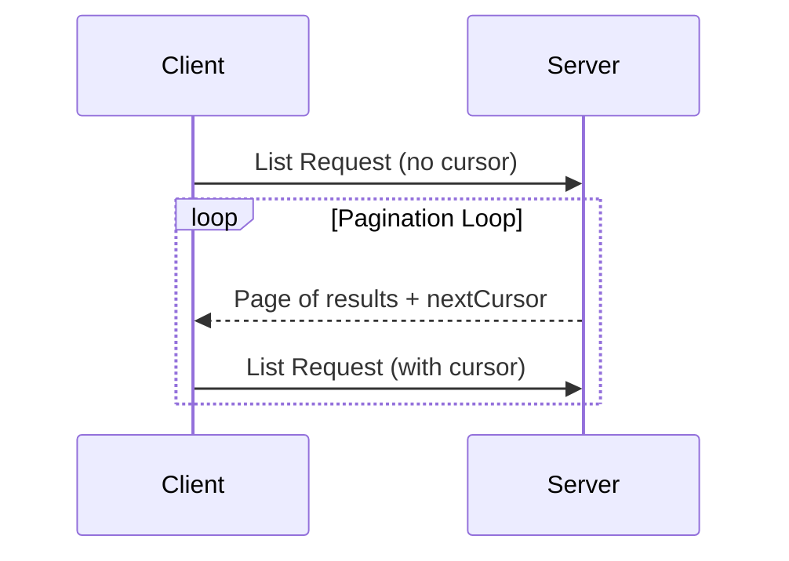

<div id="enable-section-numbers" />

模型上下文协议（MCP）支持对可能返回大结果集的列表操作进行分页。分页允许服务器以较小的块产出结果，而不是一次性全部产出。

在通过互联网连接到外部服务时，分页尤其重要，但对于本地集成也很有用，以避免大数据集的性能问题。

## 分页模型

MCP 中的分页使用一种基于不透明游标（cursor）的方法，而不是编号的页。

- **游标**是一个不透明的字符串 token，表示结果集中的一个位置
- **页大小**由服务器确定，客户端**不得（MUST NOT）**假定固定的页大小

## 响应格式

分页在服务器发送一个包含以下内容的**响应**时开始：

- 当前页的结果
- 如果存在更多结果，则一个可选的 `nextCursor` 字段

```json
{
  "jsonrpc": "2.0",
  "id": "123",
  "result": {
    "resources": [...],
    "nextCursor": "eyJwYWdlIjogM30="
  }
}
```

## 请求格式

在收到一个游标后，客户端可以通过发出一个包含该游标的请求来_继续_分页：

```json
{
  "jsonrpc": "2.0",
  "id": "124",
  "method": "resources/list",
  "params": {
    "cursor": "eyJwYWdlIjogMn0="
  }
}
```

## 分页流程



## 支持分页的操作

以下 MCP 操作支持分页：

- `resources/list` —— 列出可用的资源
- `resources/templates/list` —— 列出资源模板
- `prompts/list` —— 列出可用的提示
- `tools/list` —— 列出可用的工具

## 实现指南

1. 服务器**应当（SHOULD）**：
   - 提供稳定的游标
   - 优雅地处理无效的游标

2. 客户端**应当（SHOULD）**：
   - 将缺失的 `nextCursor` 视为结果的结束
   - 同时支持分页和非分页的流程

3. 客户端**必须（MUST）**将游标视为不透明的 token：
   - 不对游标格式做出假设
   - 不尝试解析或修改游标
   - 不跨会话持久化游标

## 错误处理

无效的游标**应当（SHOULD）**导致一个代码为 -32602（Invalid params）的错误。
