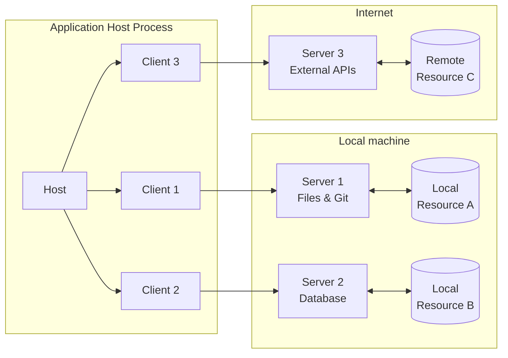
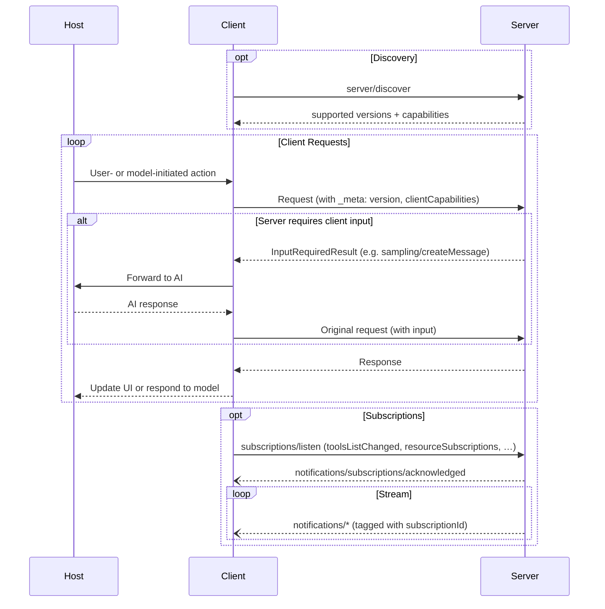

模型上下文协议（Model Context Protocol，MCP）遵循客户端-宿主-服务器架构，其中每个宿主可以运行多个客户端实例。MCP 是一个无状态协议：每个请求都是自包含的，并携带其自己的协议版本和能力。这种架构使用户能够跨应用集成 AI 能力，同时维持清晰的安全边界并隔离关注点。MCP 构建于 JSON-RPC 之上，提供了一个聚焦于客户端与服务器之间上下文交换和采样协调的协议。

## 核心组件

### 宿主（Host）

宿主进程充当容器和协调者：

- 创建和管理多个客户端实例
- 控制客户端连接权限和生命周期
- 强制执行安全策略和同意要求
- 处理用户授权决策
- 协调 AI/LLM 集成和采样
- 管理跨客户端的上下文聚合

### 客户端（Clients）

每个客户端由宿主创建，并与恰好一个服务器通信：

- 与恰好一个服务器通信
- 为每个请求附加协议版本和能力
- 双向路由协议消息
- 管理订阅和通知
- 维持服务器之间的安全边界

宿主应用创建和管理多个客户端，每个客户端与一个特定的服务器具有 1:1 的关系。

### 服务器（Servers）

服务器提供专门的上下文和能力：

- 通过 MCP 原语暴露资源、工具和提示
- 以聚焦的职责独立运作
- 通过回复中的 `InputRequiredResult` 请求客户端输入（采样、征询、roots）
- 必须尊重安全约束
- 可以是本地进程或远程服务

## 设计原则

MCP 建立在若干关键设计原则之上，这些原则指导其架构和实现：

1. **服务器应当极其易于构建**
   - 宿主应用处理复杂的编排职责
   - 服务器聚焦于特定的、明确定义的能力
   - 简单的接口最小化实现开销
   - 清晰的分离使代码可维护

2. **服务器应当高度可组合**
   - 每个服务器独立地提供聚焦的功能
   - 多个服务器可以无缝组合
   - 共享的协议实现互操作性
   - 模块化设计支持可扩展性

3. **服务器不应能够读取整个对话，也不应"窥视"其他服务器**
   - 服务器只接收必要的上下文信息
   - 完整的对话历史保留在宿主处
   - 每个服务器维持隔离
   - 跨服务器交互由宿主控制
   - 宿主进程强制执行安全边界

4. **可以渐进地向服务器和客户端添加特性**
   - 核心协议提供最小的必需功能
   - 可以根据需要协商额外的能力
   - 服务器和客户端独立演进
   - 协议为未来的可扩展性而设计
   - 保持向后兼容

## 能力协商

模型上下文协议使用一个基于能力的协商系统，其中客户端和服务器在每个请求上声明它们所支持的特性。客户端在每个请求的 `_meta.io.modelcontextprotocol/clientCapabilities` 中包含它们的能力。服务器在响应 [`server/discover`](/specification/2026-07-28/server/discover) 时公布它们的能力，客户端可以在任何其他请求之前调用它以进行预先的能力发现。

- 服务器声明诸如工具支持、资源订阅和提示模板之类的能力
- 客户端声明诸如采样支持和征询处理之类的能力
- 双方在整个交互过程中必须尊重所声明的能力
- 可以通过对协议的扩展来协商额外的能力

每个能力都在按请求的基础上解锁特定的协议特性。例如：

- 已实现的[服务器特性](/specification/2026-07-28/server)必须在服务器的能力中公布
- 接收资源更新通知需要用所期望的资源 URI 打开一个 [`subscriptions/listen`](/specification/2026-07-28/basic/patterns/subscriptions) 流
- [工具](/specification/2026-07-28/server/tools)调用需要服务器声明工具能力

这种能力协商确保客户端和服务器对所支持的功能有清晰的理解，同时维持协议的可扩展性。
