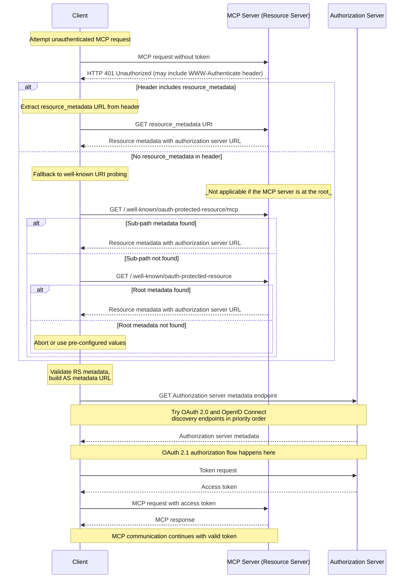

本文档描述 MCP 服务器向 MCP 客户端公布其关联授权服务器的机制，以及 MCP 客户端借以确定授权服务器端点和所支持能力的发现过程。

## 授权服务器位置

MCP 服务器**必须（MUST）**实现 OAuth 2.0 Protected Resource Metadata（[RFC9728](https://datatracker.ietf.org/doc/html/rfc9728)）规范以指示授权服务器的位置。MCP 服务器返回的受保护资源元数据文档**必须（MUST）**包含 `authorization_servers` 字段，其中至少包含一个授权服务器。

`authorization_servers` 的具体使用超出本规范的范围；实现者应查阅 OAuth 2.0 Protected Resource Metadata（[RFC9728](https://datatracker.ietf.org/doc/html/rfc9728)）以获得关于实现细节的指导。

实现者应注意，受保护资源元数据文档可以定义多个授权服务器。选择使用哪个授权服务器的责任在于 MCP 客户端，遵循 [RFC9728 第 7.6 节 "Authorization Servers"](https://datatracker.ietf.org/doc/html/rfc9728#name-authorization-servers)中指定的指南。

当 `authorization_servers` 中列出多个授权服务器时，每个都是一个独立的 OAuth 2.0 授权服务器。与 [RFC 6749 第 2.2 节](https://datatracker.ietf.org/doc/html/rfc6749#section-2.2)一致，客户端标识符对签发它们的授权服务器是唯一的。客户端**必须（MUST）**为每个授权服务器维护单独的注册状态（客户端凭据、令牌），并**不得（MUST NOT）**假定对一个授权服务器有效的凭据会被另一个接受。有关将客户端凭据与签发它们的授权服务器关联的要求，参见[授权服务器绑定](/specification/2026-07-28/basic/authorization/client-registration#authorization-server-binding)。

## 受保护资源元数据发现要求

MCP 服务器**必须（MUST）**实现以下发现机制之一，以向 MCP 客户端提供授权服务器位置信息：

1. **WWW-Authenticate Header**：在返回 `401 Unauthorized` 响应时，将资源元数据 URL 包含在 `WWW-Authenticate` HTTP header 中的 `resource_metadata` 下，如 [RFC9728 第 5.1 节](https://datatracker.ietf.org/doc/html/rfc9728#name-www-authenticate-response)所述。

2. **Well-Known URI**：在一个 well-known URI 处提供元数据，如 [RFC9728](https://datatracker.ietf.org/doc/html/rfc9728) 所指定。这可以是：
   - 在服务器 MCP 端点的路径处：`https://example.com/public/mcp` 可以在 `https://example.com/.well-known/oauth-protected-resource/public/mcp` 处托管元数据
   - 在根处：`https://example.com/.well-known/oauth-protected-resource`

MCP 客户端**必须（MUST）**支持两种发现机制，并在存在时使用来自已解析 `WWW-Authenticate` header 的资源元数据 URL；否则，它们**必须（MUST）**回退到按上面列出的顺序构造并请求 well-known URI。

MCP 客户端**必须（MUST）**能够解析 `WWW-Authenticate` header 并对来自 MCP 服务器的 `HTTP 401 Unauthorized` 响应做出适当响应。

服务器还可以在 `WWW-Authenticate` 质询中包含一个 `scope` 参数以指示访问该资源所需的 scope；scope 语义和关联的客户端行为在 [Scope 选择策略](/specification/2026-07-28/basic/authorization#scope-selection-strategy)一节中定义。

## 授权服务器元数据发现

MCP 使用 [RFC 8414 第 3.1 节](https://datatracker.ietf.org/doc/html/rfc8414#section-3.1)中定义的默认 `oauth-authorization-server` well-known URI 后缀进行授权服务器元数据发现。MCP 不定义特定于应用的 well-known URI 后缀。

为处理不同的 issuer URL 格式并确保与 OAuth 2.0 Authorization Server Metadata 和 OpenID Connect Discovery 1.0 规范的互操作性，MCP 客户端在发现授权服务器元数据时**必须（MUST）**尝试多个 well-known 端点。

发现方法基于 [RFC 8414 第 3.1 节 "Authorization Server Metadata Request"](https://datatracker.ietf.org/doc/html/rfc8414#section-3.1)（用于 OAuth 2.0 Authorization Server Metadata 发现）和 [RFC 8414 第 5 节 "Compatibility Notes"](https://datatracker.ietf.org/doc/html/rfc8414#section-5)（用于 OpenID Connect Discovery 1.0 互操作性）。

对于带 path 组成部分的 issuer URL（例如 `https://auth.example.com/tenant1`），客户端**必须（MUST）**按以下优先级顺序尝试端点：

1. 带 path 插入的 OAuth 2.0 Authorization Server Metadata：
   `https://auth.example.com/.well-known/oauth-authorization-server/tenant1`
2. 带 path 插入的 OpenID Connect Discovery 1.0：
   `https://auth.example.com/.well-known/openid-configuration/tenant1`
3. path 追加的 OpenID Connect Discovery 1.0：
   `https://auth.example.com/tenant1/.well-known/openid-configuration`

对于不带 path 组成部分的 issuer URL（例如 `https://auth.example.com`），客户端**必须（MUST）**尝试：

1. OAuth 2.0 Authorization Server Metadata：
   `https://auth.example.com/.well-known/oauth-authorization-server`
2. OpenID Connect Discovery 1.0：
   `https://auth.example.com/.well-known/openid-configuration`

在检索一个元数据文档后，MCP 客户端**必须（MUST）**按 [RFC8414 第 3.3 节](https://datatracker.ietf.org/doc/html/rfc8414#section-3.3)或 [OpenID Connect Discovery 第 4.3 节](https://openid.net/specs/openid-connect-discovery-1_0.html#ProviderConfigurationValidation)的要求校验它：文档中的 `issuer` 值**必须（MUST）**与用于构造 well-known URL 的 issuer 标识符相同。如果它们不同，客户端**不得（MUST NOT）**使用该元数据。例如，一个从 `https://attacker.example/.well-known/oauth-authorization-server` 获取的、包含 `"issuer": "https://honest.example"` 的文档**必须（MUST）**被拒绝。

## 序列图

以下图表概述一个示例流程：

