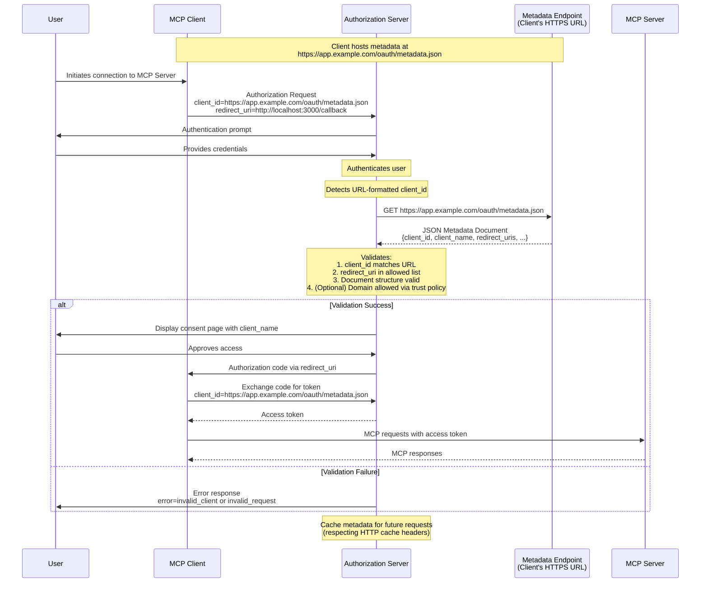

<div id="enable-section-numbers" />

MCP 支持三种客户端注册机制。根据你的场景选择：

- **[客户端 ID 元数据文档](#客户端-id-元数据文档)**：当客户端和服务器没有先前关系时（最常见）
- **[预注册](#预注册)**：当客户端和服务器已有既存关系时
- **[动态客户端注册](#动态客户端注册)**：用于向后兼容或特定要求

支持所有选项的客户端**应当（SHOULD）**使用以下优先级顺序：

1. 如果客户端有针对该服务器的预注册客户端信息可用，则使用它
2. 如果授权服务器指示它支持客户端 ID 元数据文档（通过 OAuth Authorization Server Metadata 中的 `client_id_metadata_document_supported`），则使用它们
3. 如果授权服务器支持动态客户端注册（通过 OAuth Authorization Server Metadata 中的 `registration_endpoint`），则将其用作回退
4. 如果没有其他选项可用，提示用户输入客户端信息

## 客户端 ID 元数据文档

MCP 客户端和授权服务器**应当（SHOULD）**支持 [OAuth Client ID Metadata Document](https://datatracker.ietf.org/doc/html/draft-ietf-oauth-client-id-metadata-document-00)中所指定的 OAuth 客户端 ID 元数据文档用于客户端注册。

这种方法使客户端能够使用 HTTPS URL 作为客户端标识符，其中该 URL 指向一个包含客户端元数据的 JSON 文档。这解决了服务器和客户端没有既存关系的常见 MCP 场景。

### 实现要求

支持客户端 ID 元数据文档的 MCP 实现**必须（MUST）**遵循 [OAuth Client ID Metadata Document](https://datatracker.ietf.org/doc/html/draft-ietf-oauth-client-id-metadata-document-00)中指定的要求。关键要求包括：

**对于 MCP 客户端：**

- 客户端**必须（MUST）**在一个遵循 RFC 要求的 HTTPS URL 处托管它们的元数据文档
- `client_id` URL **必须（MUST）**使用 "https" scheme 并包含一个 path 组成部分，例如 `https://example.com/client.json`
- 元数据文档**必须（MUST）**至少包含以下属性：`client_id`、`client_name`、`redirect_uris`
- 客户端**必须（MUST）**确保元数据中的 `client_id` 值与文档 URL 完全匹配
- 客户端**可以（MAY）**使用 `private_key_jwt` 进行客户端认证（例如用于对令牌端点的请求），并采用 [Client ID Metadata Document 第 6.2 节](https://www.ietf.org/archive/id/draft-ietf-oauth-client-id-metadata-document-00.html#section-6.2)中所述的适当 JWKS 配置

**对于授权服务器：**

- **应当（SHOULD）**在遇到 URL 格式的 client_id 时获取元数据文档
- **必须（MUST）**校验所获取文档的 `client_id` 与 URL 完全匹配
- **应当（SHOULD）**遵循 HTTP 缓存 header 缓存元数据
- **必须（MUST）**对照元数据文档中的重定向 URI 校验授权请求中出示的重定向 URI
- **必须（MUST）**校验文档结构是有效的 JSON 并包含必需字段
- **应当（SHOULD）**遵循 [Client ID Metadata Document 第 6 节](https://www.ietf.org/archive/id/draft-ietf-oauth-client-id-metadata-document-00.html#section-6)以及[客户端 ID 元数据文档安全](/specification/2026-07-28/basic/authorization/security-considerations#client-id-metadata-document-security)中的安全考量

### 元数据文档示例

```json
{
  "client_id": "https://app.example.com/oauth/client-metadata.json",
  "client_name": "Example MCP Client",
  "client_uri": "https://app.example.com",
  "logo_uri": "https://app.example.com/logo.png",
  "redirect_uris": [
    "http://127.0.0.1:3000/callback",
    "http://localhost:3000/callback"
  ],
  "grant_types": ["authorization_code"],
  "response_types": ["code"],
  "token_endpoint_auth_method": "none"
}
```

### 客户端 ID 元数据文档流程

以下图表说明使用客户端 ID 元数据文档时的完整流程：



### 公布 CIMD 支持

授权服务器通过在其 OAuth Authorization Server 元数据中包含以下属性，来公布它支持使用客户端 ID 元数据文档的客户端：

```json
{
  "client_id_metadata_document_supported": true
}
```

MCP 客户端**应当（SHOULD）**检查此能力，并在不可用时**可以（MAY）**回退到[动态客户端注册](#动态客户端注册)或[预注册](#预注册)。

## 预注册

MCP 客户端**应当（SHOULD）**支持一个用于静态客户端凭据的选项，例如由预注册流程提供的凭据。这可以是：

1. 为 MCP 客户端在与该授权服务器交互时使用而专门硬编码一个 client ID（以及，如果适用，客户端凭据），或
2. 在用户自己注册一个 OAuth 客户端（例如通过服务器托管的配置界面）之后，向用户呈现一个允许他们输入这些详情的 UI。

## 动态客户端注册

<Warning>
  动态客户端注册已弃用。新的实现应改用[客户端 ID 元数据文档](#客户端-id-元数据文档)。此选项为与不支持客户端 ID 元数据文档的授权服务器向后兼容而保留。
</Warning>

MCP 客户端和授权服务器**可以（MAY）**支持 OAuth 2.0 动态客户端注册协议 [RFC7591](https://datatracker.ietf.org/doc/html/rfc7591)，以允许 MCP 客户端在无需用户交互的情况下获取 OAuth client ID。此选项为与 MCP 授权规范的早期版本向后兼容而包含。

### 应用类型和重定向 URI 约束

当授权服务器支持 OpenID Connect（OIDC）和动态客户端注册时，它们可能根据 [OpenID Connect Dynamic Client Registration 1.0](https://openid.net/specs/openid-connect-registration-1_0.html)中定义的 `application_type` 参数对重定向 URI 强制执行额外的约束。

MCP 客户端在动态客户端注册期间**必须（MUST）**指定一个适当的 `application_type`。省略它在 OIDC 下默认为 `"web"`，这可能与原生风格的重定向 URI 冲突；非 OIDC 服务器安全地忽略该参数。

- **原生应用**（桌面应用、移动应用、CLI 工具，以及通过 `localhost` 访问的本地托管 Web 应用）**应当（SHOULD）**使用 `application_type: "native"`
- **Web 应用**（从非本地主机提供的、基于浏览器的远程应用）**应当（SHOULD）**使用 `application_type: "web"`

MCP 客户端**必须（MUST）**准备好在授权服务器实现 OIDC 时处理由于重定向 URI 约束导致的注册失败。当一个注册请求被拒绝时，客户端**应当（SHOULD）**向用户或开发者呈现一个有意义的错误。客户端**可以（MAY）**用一个调整后的 `application_type`，或用符合授权服务器对给定应用类型要求的重定向 URI 重试注册。

## 授权服务器绑定

使用预注册凭据，或持久化通过动态客户端注册获得的客户端凭据的客户端，**必须（MUST）**将这些凭据与签发它们的特定授权服务器关联，以授权服务器的 `issuer` 标识符为键。当授权服务器变更时（通过更新后的[受保护资源元数据](/specification/2026-07-28/basic/authorization/authorization-server-discovery#authorization-server-location)检测到），客户端**不得（MUST NOT）**重用来自不同授权服务器的客户端凭据，并**必须（MUST）**向新的授权服务器重新注册。

预注册凭据本质上特定于一个特定的授权服务器。如果受保护资源元数据所指示的授权服务器不再与凭据注册时的授权服务器匹配，客户端**应当（SHOULD）**呈现一个错误，而不是静默地尝试使用不匹配的凭据。

基于客户端 ID 元数据文档的 client ID 在授权服务器之间是可移植的，因为它们是由授权服务器按需解析的自托管 HTTPS URL。当授权服务器变更时无需重新注册。
