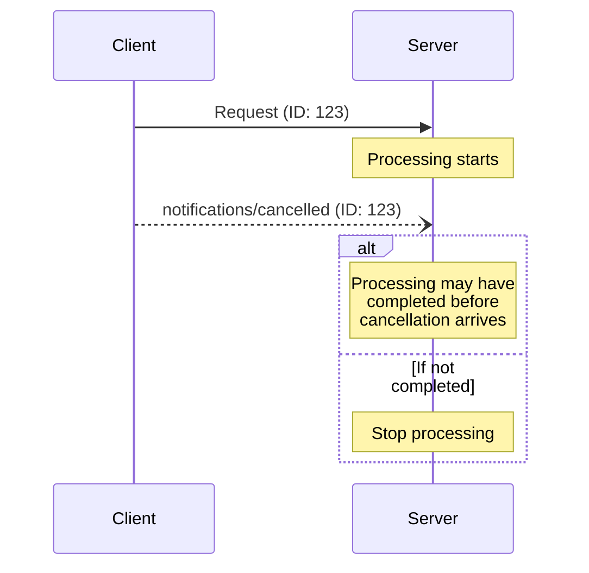

<div id="enable-section-numbers" />

模型上下文协议（MCP）通过通知消息支持对进行中请求的可选取消。客户端**应当（SHOULD）**发送一个取消通知，以表明它先前发出的某个请求应被终止。

服务器在拆除某个订阅流时**必须（MUST）**发送引用该 `subscriptions/listen` 请求 ID 的 `notifications/cancelled`（参见[订阅][subscriptions]）。服务器**不得（MUST NOT）**为任何其他目的发送 `notifications/cancelled`。

## 取消流程

当客户端想要取消一个进行中的请求时，它发送一个包含以下内容的 `notifications/cancelled` 通知：

- 要取消的请求的 ID
- 一个可选的、可被记录或显示的原因字符串

```json
{
  "jsonrpc": "2.0",
  "method": "notifications/cancelled",
  "params": {
    "requestId": "123",
    "reason": "User requested cancellation"
  }
}
```

## 特定于传输的取消

客户端如何发出取消信号取决于传输：

- **Streamable HTTP**：关闭 SSE 响应流即是取消信号。服务器**必须（MUST）**将客户端断开连接视为该请求的取消。不需要也不预期 `notifications/cancelled` 消息。
- **stdio**：没有可关闭的每请求流。客户端**必须（MUST）**发送一个引用该请求 ID 的 `notifications/cancelled` 通知。

## 超时

实现**应当（SHOULD）**为所有发送的请求建立超时，以防止挂起的连接和资源耗尽。当请求在超时期限内未收到成功或错误响应时，发送方**应当（SHOULD）**取消该请求并停止等待响应。如[特定于传输的取消](#特定于传输的取消)所述，这意味着：

- **Streamable HTTP**：关闭该请求的响应流，这构成取消。
- **stdio**：发送一个引用该请求 ID 的 `notifications/cancelled` 通知。

SDK 和其他中间件**应当（SHOULD）**允许在按请求的基础上配置这些超时。

实现**可以（MAY）**选择在收到对应于该请求的[进度通知](/specification/2026-07-28/basic/patterns/progress)时重置超时计时器，因为这意味着工作确实在进行。然而，实现**应当（SHOULD）**始终强制执行一个最大超时（无论进度通知如何），以限制行为不当的客户端或服务器的影响。

## 行为要求

1. 取消通知**必须（MUST）**只引用满足以下条件的请求：
   - 曾由客户端先前发出
   - 被认为仍在进行中
1. 服务器发送的取消通知**必须（MUST）**引用一个 `subscriptions/listen` 请求，以终止该订阅流
1. 收到取消通知的服务器**应当（SHOULD）**：
   - 停止处理被取消的请求
   - 释放关联的资源
   - 不为被取消的请求发送响应
1. 服务器**可以（MAY）**在以下情况下忽略取消通知：
   - 被引用的请求是未知的
   - 处理已经完成
   - 该请求无法被取消
1. 客户端**应当（SHOULD）**忽略此后到达的对已取消请求的任何响应

## 时序考量

由于网络延迟，取消通知可能在请求处理已完成之后到达，并且可能在响应已经发送之后。

双方**必须（MUST）**优雅地处理这些竞态条件：



## 实现注意事项

- 双方**应当（SHOULD）**记录取消原因以便调试
- 应用 UI **应当（SHOULD）**指示何时请求了取消

## 错误处理

无效的取消通知**应当（SHOULD）**被忽略：

- 未知的请求 ID
- 已完成的请求
- 格式错误的通知

这在允许异步通信中出现竞态条件的同时，维持了通知的"发射后不管"（fire and forget）特性。

[subscriptions]: /specification/2026-07-28/basic/patterns/subscriptions
