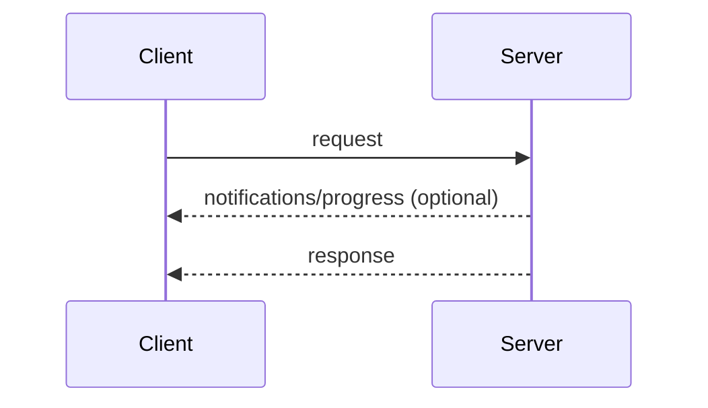
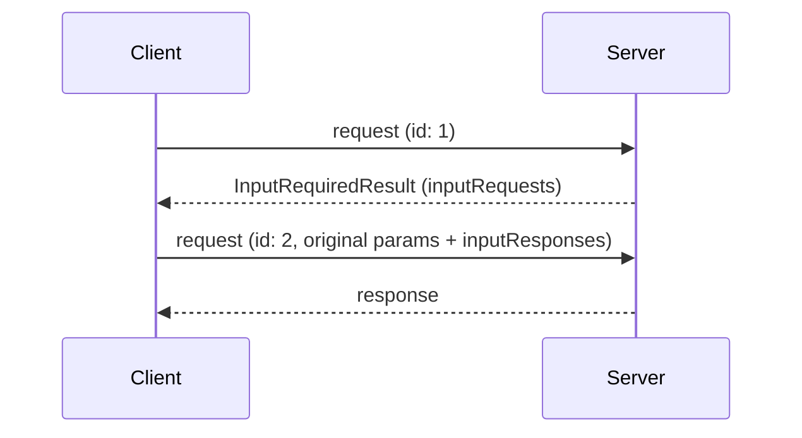
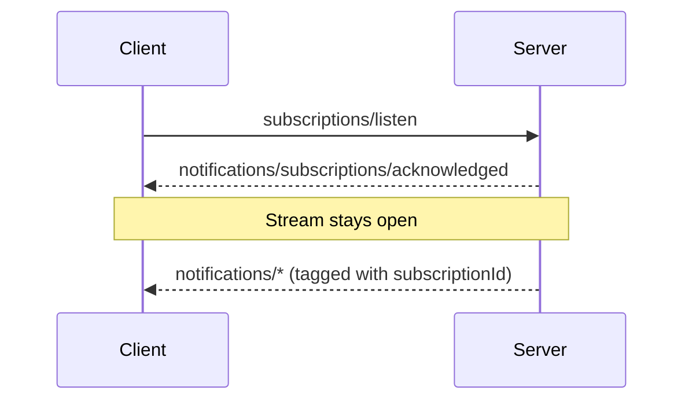

本页定义核心协议的消息模式：客户端和服务器将 JSON-RPC [请求、响应和通知](/specification/2026-07-28/basic/index#messages)组合成交互的方式。每种[传输](/specification/2026-07-28/basic/transports)都承载所有这些模式；传输之间的区别仅在于消息如何被分帧和投递。

每次交互都始于客户端：

- **客户端**发送 JSON-RPC _请求_和_通知_。
- **服务器**以一个 JSON-RPC _响应_（结果或错误）回答每个请求，可选地在其前面附上限定于该请求的_通知_。

服务器**不得（MUST NOT）**发起 JSON-RPC 请求，且客户端不发送 JSON-RPC 响应。

## 请求与响应

客户端发送一个请求；服务器以结果或错误回答它。在请求进行中时，服务器**可以（MAY）**发送限定于它的通知，例如 [`notifications/progress`](/specification/2026-07-28/basic/patterns/progress) 和 [`notifications/message`](/specification/2026-07-28/server/utilities/logging)。

## 多轮往返请求

当服务器需要客户端输入（采样、征询或 roots）来完成一个请求时，它以一个 [`InputRequiredResult`](/specification/2026-07-28/basic/patterns/mrtr#inputrequiredresult) 回答，客户端以匹配的 `inputResponses` 重试该请求。参见[多轮往返请求](/specification/2026-07-28/basic/patterns/mrtr)。

## 订阅与通知

要接收变更通知（列表变更、资源更新），客户端发送一个 [`subscriptions/listen`](/specification/2026-07-28/basic/patterns/subscriptions) 请求；其回复是一个所请求通知类型的长期存在的流。流状态被限定于请求：如果底层信道丢失，客户端重新发出该请求。

## 添加模式

所有核心协议特性都由这些模式构建而成。一个添加模式的协议修订版在本页定义它。传输无需变更即可承载新模式，因为模式完全以请求、响应和通知的形式表达。
