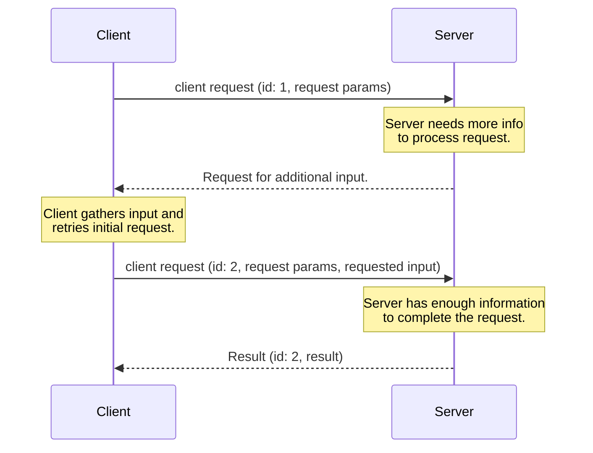
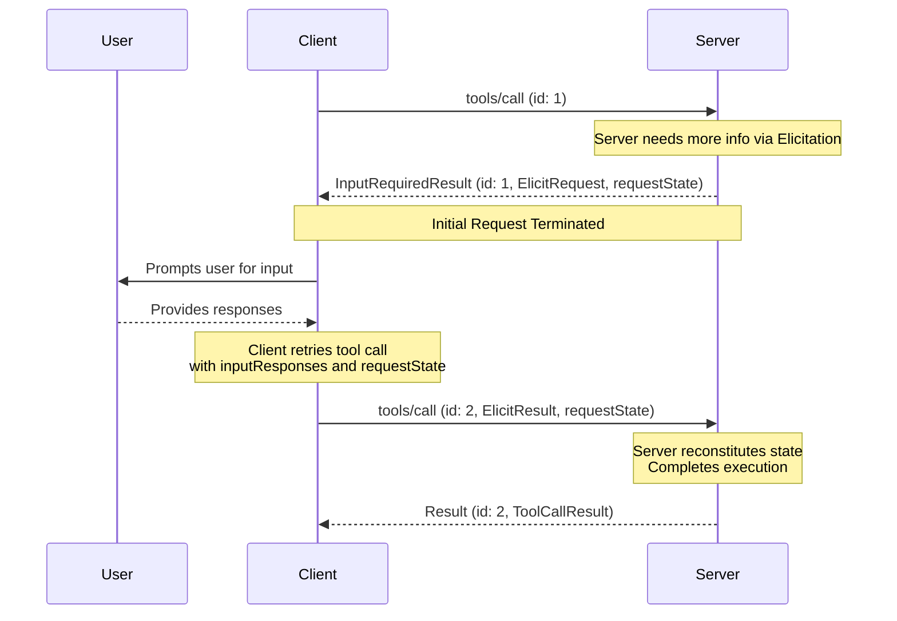

<div id="enable-section-numbers" />

<Note>
  多轮往返请求（Multi Round-Trip Requests，MRTR）在本版本的 MCP 规范中引入。它替换了之前发送服务器发起请求的方法。服务器**必须（MUST）**使用 MRTR 模式发送服务器到客户端的请求（例如 `roots/list`、`sampling/createMessage` 或 `elicitation/create`）。之前的服务器发起请求模式不再受支持。这是一个破坏性变更。
</Note>

<Note>
  为简洁起见，本页的请求示例省略了 `_meta` 请求元数据（`io.modelcontextprotocol/protocolVersion`、`io.modelcontextprotocol/clientInfo` 和 `io.modelcontextprotocol/clientCapabilities`）。每个请求**必须（MUST）**包含必需的 `_meta` 字段；参见 [`_meta`](/specification/2026-07-28/basic/index#meta)。
</Note>

## 多轮往返请求

模型上下文协议（MCP）定义了若干方式，供服务器在处理客户端请求（例如 `roots/list`、`sampling/createMessage` 或 `elicitation/create`）期间向用户请求额外信息。**多轮往返请求**模式提供了一种标准化的方式来处理这些服务器请求，而无需跨服务器实例的共享存储层，也无需有状态的负载均衡。

高层流程运作如下：

1. 客户端向服务器发送一个初始请求，带有执行操作所需的参数。
1. 服务器确定需要额外信息来完成该请求，并以请求更多信息的方式响应。
1. 客户端从用户或其他来源收集所请求的信息，然后重试原始请求，其中包含额外请求的信息。
1. 服务器确定它有足够的信息来完成操作，并以最终结果响应。



### 核心类型

此流程在 MCP 中使用以下类型实现。

#### InputRequests

一个 [`InputRequests`](/specification/2026-07-28/schema#inputrequests) 对象是一个服务器-客户端请求的映射。键是服务器分配的字符串标识符；值是请求对象（例如 [`ElicitRequest`](/specification/2026-07-28/schema#elicitrequest)、[`CreateMessageRequest`](/specification/2026-07-28/schema#createmessagerequest) 或 [`ListRootsRequest`](/specification/2026-07-28/schema#listrootsrequest)）。

```json
{
  "github_login": {
    "method": "elicitation/create",
    "params": {
      "mode": "form",
      "message": "Please provide your GitHub username",
      "requestedSchema": {
        "type": "object",
        "properties": {
          "name": { "type": "string" }
        },
        "required": ["name"]
      }
    }
  },
  "capital_of_france": {
    "method": "sampling/createMessage",
    "params": {
      "messages": [
        {
          "role": "user",
          "content": {
            "type": "text",
            "text": "What is the capital of France?"
          }
        }
      ],
      "systemPrompt": "You are a helpful assistant.",
      "maxTokens": 100
    }
  }
}
```

#### InputResponses

一个 [`InputResponses`](/specification/2026-07-28/schema#inputresponses) 对象是一个客户端对服务器请求的响应的映射。键对应于 `InputRequests` 映射中的键；值是客户端对每个请求的结果（例如 [`ElicitResult`](/specification/2026-07-28/schema#elicitresult)、[`CreateMessageResult`](/specification/2026-07-28/schema#createmessageresult) 或 [`ListRootsResult`](/specification/2026-07-28/schema#listrootsresult)）。

```json
{
  "github_login": {
    "action": "accept",
    "content": {
      "name": "octocat"
    }
  },
  "capital_of_france": {
    "role": "assistant",
    "content": {
      "type": "text",
      "text": "The capital of France is Paris."
    },
    "model": "claude-3-sonnet-20240307",
    "stopReason": "endTurn"
  }
}
```

#### InputRequiredResult

一个 [`InputRequiredResult`](/specification/2026-07-28/schema#inputrequiredresult) 是一种 [`Result`](/specification/2026-07-28/basic#responses)，表示在请求可以完成之前需要额外的输入。

- `inputRequests`（_可选_）：一个 [`InputRequests`](/specification/2026-07-28/schema#inputrequests) 映射，包含客户端必须完成的服务器发起请求。
- `requestState`（_可选_）：一个仅对服务器有意义的不透明字符串。客户端**不得（MUST NOT）**检查、解析、修改或对其内容做出任何假设。

```json
{
  "jsonrpc": "2.0",
  "id": 1,
  "result": {
    "resultType": "input_required",
    "inputRequests": {
      // Elicitation request.
      "github_login": {
        "method": "elicitation/create",
        "params": {
          "mode": "form",
          "message": "Please provide your GitHub username",
          "requestedSchema": {
            "type": "object",
            "properties": {
              "name": { "type": "string" }
            },
            "required": ["name"]
          }
        }
      },
      // Sampling request.
      "capital_of_france": {
        "method": "sampling/createMessage",
        "params": {
          "messages": [
            {
              "role": "user",
              "content": {
                "type": "text",
                "text": "What is the capital of France?"
              }
            }
          ],
          "modelPreferences": {
            "hints": [{ "name": "claude-3-sonnet" }],
            "intelligencePriority": 0.8,
            "speedPriority": 0.5
          },
          "systemPrompt": "You are a helpful assistant.",
          "maxTokens": 100
        }
      }
    },
    "requestState": "AEAD-protected blob"
  }
}
```

### 受支持的请求

服务器**可以（MAY）**在以下客户端请求上发送 `InputRequiredResult` 响应：

| 客户端请求                                                                   | 支持 InputRequiredResult |
| -------------------------------------------------------------------------------- | ---------------------------- |
| [`prompts/get`](/specification/2026-07-28/server/prompts#getting-a-prompt)       | 是                          |
| [`resources/read`](/specification/2026-07-28/server/resources#reading-resources) | 是                          |
| [`tools/call`](/specification/2026-07-28/server/tools#calling-tools)             | 是                          |

服务器**不得（MUST NOT）**在任何其他客户端请求上发送 `InputRequiredResult` 响应。

### 基本工作流

基本工作流描述服务器如何作为客户端-服务器请求的一部分向客户端请求额外的输入。在本示例中，我们使用 `tools/call` 作为客户端请求，但同样的模式适用于上面列出的任何受支持的请求。

值得注意的是，它允许服务器在不维护任何服务器端状态的情况下请求额外信息。服务器将任何所需的上下文编码到 `requestState` 字段中，客户端在重试时将其回传。



请注意，每个步骤中的请求是完全独立的：处理重试的服务器不需要任何超出重试请求中直接存在的信息之外的信息。

#### 服务器要求（基本工作流）

1. 服务器**可以（MAY）**以一个 `InputRequiredResult` 响应任何[受支持的客户端请求](#受支持的请求)。
1. `InputRequiredResult` **可以（MAY）**包含一个 `inputRequests` 字段。
   - `inputRequests` 键是服务器分配的标识符，并**必须（MUST）**在请求的范围内唯一。
   - `inputRequests` 值是请求对象，**必须（MUST）**是 [`ElicitRequest`](/specification/2026-07-28/schema#elicitrequest)、[`CreateMessageRequest`](/specification/2026-07-28/schema#createmessagerequest) 或 [`ListRootsRequest`](/specification/2026-07-28/schema#listrootsrequest) 之一

1. `InputRequiredResult` **可以（MAY）**包含一个 `requestState` 字段。如果指定，此字段是一个仅对服务器有意义的不透明字符串。服务器可以自由地以任何格式编码状态（例如 base64 编码的 JSON、加密的 JWT、序列化的二进制）。
1. 如果一个客户端请求包含一个 `requestState` 字段，服务器**必须（MUST）**将 `requestState` 视为攻击者控制的输入。如果 `requestState` 影响授权、资源访问或业务逻辑，服务器**必须（MUST）**保护其完整性（例如 HMAC 或 AEAD），并**必须（MUST）**拒绝未通过验证的状态。仅当篡改不会造成比请求失败更糟的后果时，才**可以（MAY）**省略完整性保护。
1. 为防止重放，服务器**应当（SHOULD）**在受完整性保护的 `requestState` 负载内包含以下内容，并在接收时逐一验证：
   - 已认证的主体（principal），拒绝由不同主体出示的状态。
   - 一个短的过期时间（TTL），拒绝在其失效后出示的状态；
   - 一个发起请求的标识符，例如方法名及其显著参数的摘要，拒绝在不匹配的请求上出示的状态。
     <Warning>
       请注意，这些措施限制了重放窗口并防止跨用户和跨请求的重用，但它们本身并不保证单次使用。对于给定的 `requestState` 必须至多被消费一次的服务器（例如一次性兑换），**必须（MUST）**在服务器端强制执行该不变量。
     </Warning>

1. 服务器**必须（MUST）**在每个 `InputRequiredResult` 响应中至少包含 `inputRequests` 或 `requestState` 之一。
1. 服务器**不得（MUST NOT）**发送客户端未在其能力中声明支持的 `inputRequests`。例如，如果客户端不声明对 `elicitation` 的支持，服务器**不得（MUST NOT）**在 `inputRequests` 字段中包含任何 `elicitation/create` 请求。
1. 服务器**不得（MUST NOT）**假定客户端会完成 `inputRequests` 或重试原始请求。如果服务器想要反复提示用户提供信息，直到它有了完成请求所需的内容，它**可以（MAY）**选择在同一请求的多次尝试中返回 `InputRequiredResult`。

#### 客户端要求（基本工作流）

1. 如果客户端收到一个包含 `inputRequests` 字段的 `InputRequiredResult`，客户端**必须（MUST）**在重试原始请求之前构造所请求的输入。如果 `InputRequiredResult` _不_包含 `inputRequests` 字段，客户端**可以（MAY）**立即重试原始请求。
1. 如果一个 `InputRequiredResult` 包含 `requestState` 字段，客户端在重试原始请求时**必须（MUST）**回传该字段的确切值。客户端**不得（MUST NOT）**检查、解析、修改或对 `requestState` 内容做出任何假设。如果 `InputRequiredResult` 不包含 `requestState` 字段，客户端**不得（MUST NOT）**在重试中包含一个。
1. JSON-RPC `id` 在初始请求和重试之间**必须（MUST）**不同，因为它们是独立的请求。
1. `inputRequests` 和 `requestState` 字段都只影响客户端对原始请求的重试。它们**不得（MUST NOT）**用于客户端可能并行发送的任何其他请求。

### 错误处理

服务器**应当（SHOULD）**校验客户端所提供的数据是一个有效的 `InputResponses` 对象，并且其中的信息可以被正确解析。协议错误（格式错误的 JSON、无效的 schema、内部服务器错误）**应当（SHOULD）**返回一个带有适当错误代码和消息的 JSON-RPC 错误响应。

如果 `InputResponses` 对象中提供了额外的、意外的参数，服务器**应当（SHOULD）**忽略任何它不识别或不需要的信息。

如果客户端未能发送先前 `InputRequests` 中所请求的所有信息，且缺失的信息是服务器处理请求所必需的，服务器**应当（SHOULD）**以一个新的 `InputRequiredResult` 响应，再次请求缺失的信息，而不是返回一个错误。

### 安全考量

由于 `requestState` 经过客户端，恶意或被入侵的客户端可能试图修改它以改变服务器行为、绕过授权检查或破坏服务器逻辑。服务器**必须（MUST）**如上面[服务器要求](#服务器要求（基本工作流）)中所述校验请求状态。
