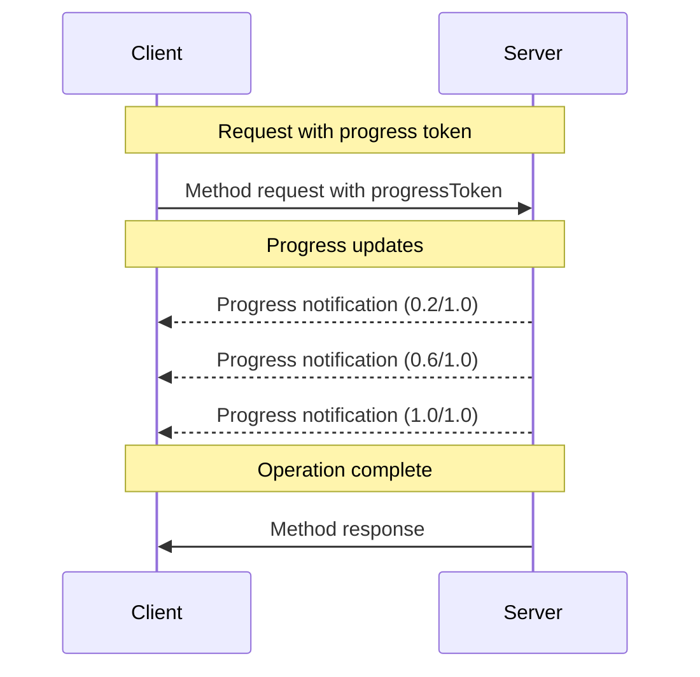

<div id="enable-section-numbers" />

模型上下文协议（MCP）通过通知消息支持对长时运行操作的可选进度跟踪。服务器**可以（MAY）**发送进度通知来报告客户端已发出请求的状态。

## 进度流程

当客户端想要_接收_某个请求的进度更新时，它在请求元数据中包含一个 `progressToken`。

- 进度 token **必须（MUST）**是一个字符串或整数值
- 进度 token 可以由客户端以任何方式选择，但**必须（MUST）**在所有活动请求中唯一。

```json
{
  "jsonrpc": "2.0",
  "id": 1,
  "method": "some_method",
  "params": {
    "_meta": {
      "progressToken": "abc123"
    }
  }
}
```

服务器随后**可以（MAY）**发送包含以下内容的进度通知：

- 原始的进度 token
- 到目前为止的当前进度值
- 一个可选的 "total" 值
- 一个可选的 "message" 值

```json
{
  "jsonrpc": "2.0",
  "method": "notifications/progress",
  "params": {
    "progressToken": "abc123",
    "progress": 50,
    "total": 100,
    "message": "Reticulating splines..."
  }
}
```

- `progress` 值**必须（MUST）**随每次通知递增，即使总数未知。
- `progress` 和 `total` 值**可以（MAY）**是浮点数。
- `message` 字段**应当（SHOULD）**提供相关的人类可读进度信息。

## 行为要求

1. 进度通知**必须（MUST）**只引用满足以下条件的 token：
   - 曾在一个活动请求中提供
   - 与一个进行中的操作关联

2. 收到带进度 token 请求的服务器**可以（MAY）**：
   - 选择不发送任何进度通知
   - 以它们认为适当的任何频率发送通知
   - 若总数未知则省略 total 值



## 实现注意事项

- 客户端和服务器**应当（SHOULD）**跟踪活动的进度 token
- 双方**应当（SHOULD）**实现速率限制以防止泛洪
- 进度通知**必须（MUST）**在完成后停止
