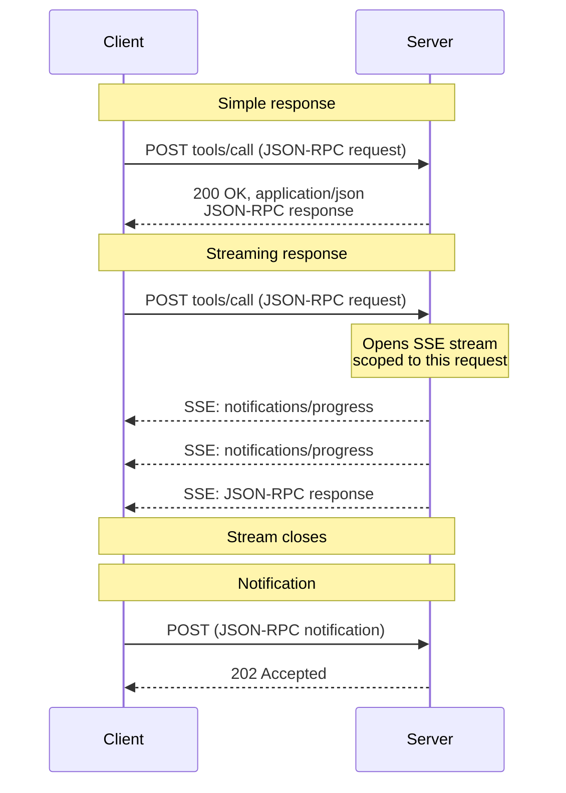
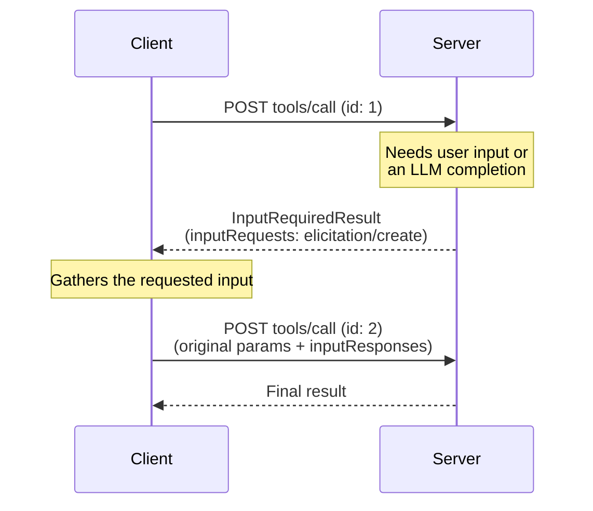
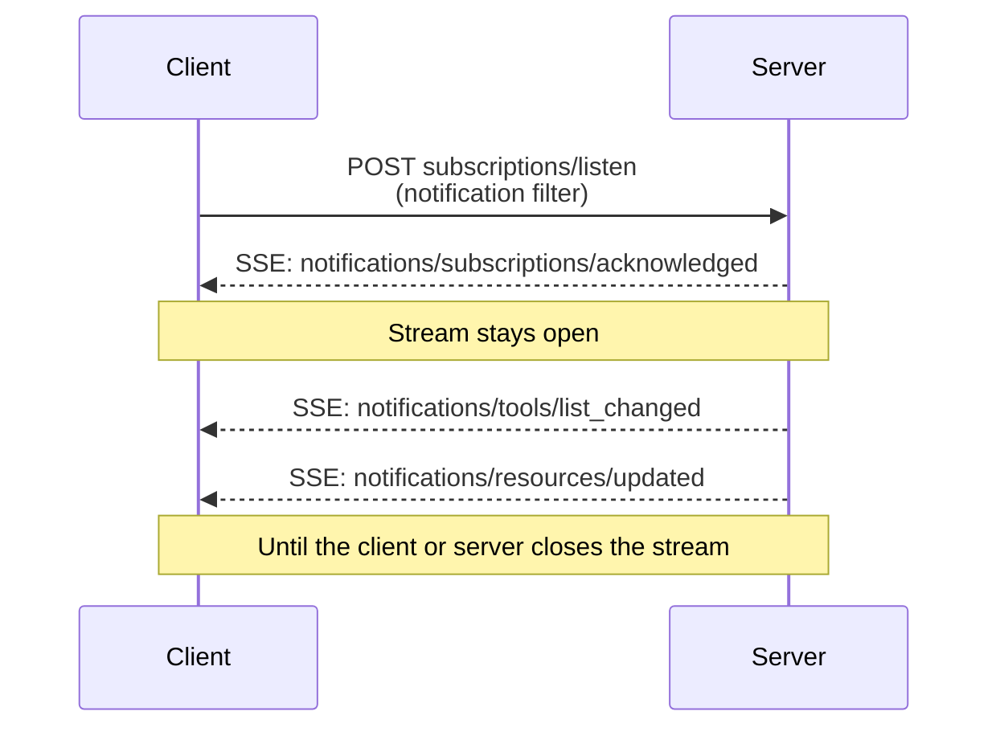

<div id="enable-section-numbers" />

<Info>

Streamable HTTP 在协议版本 2025-03-26 中引入，作为协议版本 2024-11-05 的 [HTTP+SSE 传输][http-sse]的替代。

</Info>

<Info>

修订版 2026-07-28 改变了 Streamable HTTP 的行为。客户端必须确保它们正确地处理向后兼容。变更包括：

- 移除 GET 流端点。
- 移除协议级别的会话。

参见[变更日志](/specification/2026-07-28/changelog)和下方的[向后兼容](#向后兼容)。

</Info>

在 **Streamable HTTP** 传输中，服务器作为一个可以处理多个客户端连接的独立进程运作。概览：

- 服务器暴露一个接受 POST 的单一 HTTP 端点（**MCP 端点**）。
- 客户端将每个 JSON-RPC 请求或通知作为它自己的 HTTP POST 发送。
- 服务器以一个单一的 JSON 对象或一个限定于该请求的 [Server-Sent Events][sse]（SSE）流回答每个请求，携带请求相关的通知，随后是最终响应。
- 服务器到客户端的交互（采样、征询、roots）根据[多轮往返请求（MRTR）][mrtr]（[SEP-2322][sep-2322]）作为输入请求嵌入在结果中。
- 长期存在的变更通知（例如列表变更和资源更新）在一个 [`subscriptions/listen`][subscriptions-listen] 请求的响应流上投递。

这些交互的序列图参见[消息流](#消息流)。

服务器**必须（MUST）**提供一个支持 POST 的单一 HTTP 端点路径（此后称为 **MCP 端点**）。例如，这可以是一个像 `https://example.com/mcp` 这样的 URL。

[http-sse]: /specification/2024-11-05/basic/transports#http-with-sse
[sse]: https://en.wikipedia.org/wiki/Server-sent_events

## 安全与端点

在实现 Streamable HTTP 传输时：

1. 服务器**必须（MUST）**校验所有传入连接上的 `Origin` header 以防止 DNS 重绑定攻击。
   - 如果 `Origin` header 存在且无效，服务器**必须（MUST）**以 HTTP 403 Forbidden 响应。HTTP 响应体**可以（MAY）**由一个没有 `id` 的 JSON-RPC _错误响应_构成。
2. 在本地运行时，服务器**应当（SHOULD）**只绑定到 localhost（127.0.0.1），而不是所有网络接口（0.0.0.0）。
3. 服务器**应当（SHOULD）**为所有连接实现适当的认证。

没有这些保护，攻击者可能使用 DNS 重绑定从远程网站与本地 MCP 服务器交互。

## 发送消息

客户端发送的每条 JSON-RPC 消息**必须（MUST）**是对 MCP 端点的一个新的 HTTP POST 请求。

1. 客户端**必须（MUST）**使用 HTTP POST 发送 JSON-RPC 消息。
2. 客户端**必须（MUST）**包含一个 `Accept` header，将 `application/json` 和 `text/event-stream` 都列为受支持的内容类型。
3. 客户端**必须（MUST）**在每个 POST 请求上包含[请求元数据 header](#请求元数据)。
4. HTTP POST 的消息体**必须（MUST）**是单个 JSON-RPC _请求_或_通知_。客户端**不得（MUST NOT）**发送 JSON-RPC _响应_。
5. 如果消息体是一个 JSON-RPC _通知_：
   - 如果服务器接受它，服务器**必须（MUST）**返回 HTTP 状态码 `202 Accepted` 且无消息体。
   - 如果服务器无法接受它，它**必须（MUST）**返回一个 HTTP 错误状态码（例如 `400 Bad Request`）。HTTP 响应体**可以（MAY）**由一个没有 `id` 的 JSON-RPC _错误响应_构成。
6. 如果消息体是一个 JSON-RPC _请求_，服务器**必须（MUST）**返回 `Content-Type: application/json`（一个单一的 JSON 对象）或 `Content-Type: text/event-stream`（一个 SSE 响应流）。客户端**必须（MUST）**支持两者。

<Note>

本核心协议修订版未定义 Streamable HTTP 上的客户端到服务器_通知_。核心协议中唯一由客户端发送的通知 `notifications/cancelled` 仅在 [stdio](/specification/2026-07-28/basic/transports/stdio) 传输上使用；在 Streamable HTTP 上，关闭 SSE 响应流本身就是取消信号，不预期 `notifications/cancelled` 消息（参见[取消][cancellation]）。上面的通知规则描述了一个通知 POST 的传输机制；本修订版未定义通知 POST 的 header 要求。

</Note>

## 接收消息

当服务器返回一个 SSE 响应流（`Content-Type: text/event-stream`）时：

- 服务器**可以（MAY）**在最终响应之前发送 JSON-RPC _通知_——例如 [`notifications/progress`][notifications-progress] 或 [`notifications/message`][notifications-message]。这些通知**必须（MUST）**与发起的客户端请求相关。
- 服务器**不得（MUST NOT）**在此流上发送独立的 JSON-RPC _请求_。服务器到客户端的交互（采样、征询、list-roots）根据 [MRTR][mrtr]（[SEP-2322][sep-2322]）作为输入请求嵌入在一个 [`InputRequiredResult`][input-required-result] 内，而不是作为单独的请求在此流或任何其他流上投递。这是相对于协议版本 `2025-03-26` 到 `2025-11-25` 中的 Streamable HTTP 的一个变更，在那些版本中服务器可以在 SSE 流上发送此类请求。
- 最终的 JSON-RPC _响应_**应当（SHOULD）**终止该流。

长期存在的通知流通过发送一个 [`subscriptions/listen`][subscriptions-listen] 请求获得。服务器的响应本身是一个保持打开的 SSE 流，并投递客户端所选择加入的变更通知（例如 `notifications/tools/list_changed` 或 `notifications/resources/updated`）。诸如 `notifications/progress` 和 `notifications/message` 之类的请求范围通知**不**在监听流上投递——它们只在它们所关联的请求的响应流上流动。

在发起一个 SSE 流时，服务器**应当（SHOULD）**在 HTTP 响应中包含 `X-Accel-Buffering: no` header。这指示反向代理（例如 nginx）禁用响应缓冲，确保 SSE 事件立即被投递给客户端，而不是被保留在缓冲区中。没有此 header，代理可能在将消息发送给客户端之前累积它们，引入不希望的延迟并可能破坏 SSE 通信的实时性质。

<Note>

对于长期存在的流——特别是 [`subscriptions/listen`][subscriptions-listen] 响应流——鼓励服务器定期发出一个 SSE 注释行（以冒号开头的行，例如 `:\r\n`）作为保活（keep-alive）。这在没有通知流动的安静期间防止连接被中间方或客户端空闲超时关闭。根据 [SSE 规范][sse]，任何以冒号开头的行都是不携带事件数据的注释；客户端必须忽略此类行，且不得将它们视为格式错误的输入。

</Note>

不支持通过 `Last-Event-ID` 实现的可恢复 SSE 流。

[notifications-progress]: /specification/2026-07-28/basic/patterns/progress
[notifications-message]: /specification/2026-07-28/server/utilities/logging
[input-required-result]: /specification/2026-07-28/schema#inputrequiredresult
[mrtr]: /specification/2026-07-28/basic/patterns/mrtr
[sep-2322]: /seps/2322-MRTR
[subscriptions-listen]: /specification/2026-07-28/basic/patterns/subscriptions

## 消息流

以下图表说明了单个 MCP 端点上的消息流。

**请求与响应。** 每个请求是它自己的 POST；服务器按请求选择是以一个单一的 JSON 对象还是一个 SSE 流响应：



**服务器到客户端的交互（MRTR）。** 当服务器需要来自客户端的输入时——采样、征询或 roots——它不发送它自己的 JSON-RPC 请求。它返回一个包含 `inputRequests` 的 [`InputRequiredResult`][input-required-result]，客户端以匹配的 `inputResponses` 重试原始请求（参见[多轮往返请求][mrtr]）：



**变更通知。** 想要服务器发起的变更通知的客户端用 [`subscriptions/listen`][subscriptions-listen] 打开一个长期存在的流；响应流保持打开并只携带客户端所选择加入的通知类型：



## 取消

服务器**必须（MUST）**将关闭 SSE 响应流视为该请求的取消。因为每个请求都有它自己的响应流，传输级别的断开是明确无歧义的。服务器**应当（SHOULD）**尽快停止对被取消请求的工作，并**不得（MUST NOT）**为它发送任何进一步的消息。完整规则参见[取消][cancellation]。

[cancellation]: /specification/2026-07-28/basic/patterns/cancellation

## 请求元数据

Streamable HTTP 传输将选定的 JSON-RPC 消息体字段镜像到 HTTP header 中，以便中间方（负载均衡器、网关、可观测性工具）可以在不解析消息体的情况下路由和检查请求。

### 协议版本 header

对 MCP 端点的每个 POST 请求**必须（MUST）**包含一个 `MCP-Protocol-Version` header。

例如：`MCP-Protocol-Version: 2026-07-28`

该 header 值**必须（MUST）**与请求体 `_meta` 中携带的 `io.modelcontextprotocol/protocolVersion` 字段匹配。如果这些值不匹配，服务器**必须（MUST）**以 `400 Bad Request` 和一个 `HeaderMismatch` JSON-RPC 错误拒绝该请求（参见[服务器校验](#服务器校验)）。

如果服务器不实现所请求的协议版本（无论该版本对服务器是未知的，还是一个服务器选择不支持的已知版本），它**必须（MUST）**以 `400 Bad Request` 和一个列出其所支持版本的 [`UnsupportedProtocolVersionError`][unsupported-version] 响应。协商流程参见[版本管理：协议版本协商][lifecycle-version]。

如果服务器不实现所请求的 RPC 方法，它**必须（MUST）**以 `404 Not Found` 和一个代码为 `-32601`（`Method not found`）的 JSON-RPC 错误响应。JSON-RPC 错误体将这种情况与一个不托管现代 MCP 端点的旧式 [HTTP+SSE][http-sse] 服务器返回的 `404` 区分开来（参见[向后兼容](#向后兼容)）。

一个支持实现早于 `2025-06-18` 的协议版本（它没有定义 `MCP-Protocol-Version` header）的客户端的服务器**可以（MAY）**将一个省略该 header 的请求视为协议版本 `2025-03-26`。一个不支持此类客户端的服务器**必须（MUST）**根据[服务器校验](#服务器校验)拒绝没有该 header 的请求。

[unsupported-version]: /specification/2026-07-28/schema#unsupportedprotocolversionerror
[lifecycle-version]: /specification/2026-07-28/basic/versioning#protocol-version-negotiation

### 标准请求 header

| Header 名称  | 源字段                  | 对以下情况必需                                           |
| ------------ | ----------------------------- | ------------------------------------------------------ |
| `Mcp-Method` | `method`                      | 所有请求                                           |
| `Mcp-Name`   | `params.name` 或 `params.uri` | `tools/call`、`resources/read`、`prompts/get` 请求 |

这些 header 为合规性所**必需（REQUIRED）**。

如果 `Mcp-Name` 源值无法被安全地表示为一个纯 ASCII header 值，客户端**必须（MUST）**使用[值编码](#值编码)中所述的 Base64 哨兵格式对它进行编码。

**`tools/call` 请求：**

```http
POST /mcp HTTP/1.1
Content-Type: application/json
MCP-Protocol-Version: 2026-07-28
Mcp-Method: tools/call
Mcp-Name: get_weather

{
  "jsonrpc": "2.0",
  "id": 1,
  "method": "tools/call",
  "params": {
    "name": "get_weather",
    "arguments": {
      "location": "Seattle, WA"
    },
    "_meta": {
      "io.modelcontextprotocol/protocolVersion": "2026-07-28",
      "io.modelcontextprotocol/clientInfo": {
        "name": "ExampleClient",
        "version": "1.0.0"
      },
      "io.modelcontextprotocol/clientCapabilities": {}
    }
  }
}
```

**`resources/read` 请求：**

```http
POST /mcp HTTP/1.1
Content-Type: application/json
MCP-Protocol-Version: 2026-07-28
Mcp-Method: resources/read
Mcp-Name: file:///projects/myapp/config.json

{
  "jsonrpc": "2.0",
  "id": 2,
  "method": "resources/read",
  "params": {
    "uri": "file:///projects/myapp/config.json",
    "_meta": {
      "io.modelcontextprotocol/protocolVersion": "2026-07-28",
      "io.modelcontextprotocol/clientInfo": {
        "name": "ExampleClient",
        "version": "1.0.0"
      },
      "io.modelcontextprotocol/clientCapabilities": {}
    }
  }
}
```

### 来自工具参数的自定义 header

MCP 服务器**可以（MAY）**使用工具 `inputSchema` 内参数 schema 中的一个 `x-mcp-header` 扩展属性，指定特定的工具参数被镜像到 HTTP header 中。有关如何注解工具参数的详情，参见[工具定义][tool-definitions]。

虽然对服务器而言 `x-mcp-header` 的使用是可选的，但客户端**必须（MUST）**支持此特性。当服务器的工具定义包含 `x-mcp-header` 注解时，合规的客户端**必须（MUST）**将指定的参数值镜像到 HTTP header 中。

[tool-definitions]: /specification/2026-07-28/server/tools#x-mcp-header

#### Schema 扩展

`x-mcp-header` 属性指定用于构造 header 名 `Mcp-Param-{name}` 的名称部分。

**对 `x-mcp-header` 值的约束**：

- **不得（MUST NOT）**为空
- **必须（MUST）**匹配 HTTP 字段名 token 语法（`1*tchar`，[RFC 9110 第 5.1 节](https://datatracker.ietf.org/doc/html/rfc9110#section-5.1)）
- **不得（MUST NOT）**包含控制字符，包括回车（CR，`\r`）或换行（LF，`\n`）
- 在 `inputSchema` 中的所有 `x-mcp-header` 值之间**必须（MUST）**大小写不敏感地唯一
- **必须（MUST）**只应用于具有原始类型（integer、string、boolean）的参数。不允许类型为 `number` 的参数。整数值**必须（MUST）**在 JavaScript 的安全范围内（−2<sup>53</sup>+1 到 2<sup>53</sup>−1）
- **必须（MUST）**只应用于从 schema 根_静态可达_的属性：可通过一条仅由 `properties` 键组成的链到达。该链**不得（MUST NOT）**经过 `items`（或任何其他数组关键字）、组合关键字（`oneOf`、`anyOf`、`allOf`、`not`）、条件关键字（`if`/`then`/`else`）或 `$ref`。只要链中的每一步都是一个 `properties` 键，就允许嵌套的对象属性。在其他任何地方的 `x-mcp-header` 注解都会使该注解——从而使该工具定义——无效。

Header 提取被定义为读取被注解属性的确切属性路径（通向它的 `properties` 键链）处的实例值。如果调用参数中该路径处不存在值，则省略该 header。

使用 Streamable HTTP 传输的客户端**必须（MUST）**拒绝任何 `x-mcp-header` 值违反这些约束的工具定义。拒绝意味着客户端**必须（MUST）**将无效的工具从 `tools/list` 的结果中排除。客户端在拒绝一个工具定义时**应当（SHOULD）**记录一个警告，包括工具名和拒绝原因。这确保单个格式错误的工具定义不会阻止其他有效工具被使用。使用其他传输（例如 stdio）的客户端**可以（MAY）**完全忽略 `x-mcp-header` 注解。

**工具定义示例：**

```json
{
  "name": "execute_sql",
  "description": "Execute SQL on Google Cloud Spanner",
  "inputSchema": {
    "type": "object",
    "properties": {
      "region": {
        "type": "string",
        "description": "The region to execute the query in",
        "x-mcp-header": "Region"
      },
      "query": {
        "type": "string",
        "description": "The SQL query to execute"
      }
    },
    "required": ["region", "query"]
  }
}
```

**产生的 HTTP 请求：**

```http
POST /mcp HTTP/1.1
Content-Type: application/json
MCP-Protocol-Version: 2026-07-28
Mcp-Method: tools/call
Mcp-Name: execute_sql
Mcp-Param-Region: us-west1

{
  "jsonrpc": "2.0",
  "id": 1,
  "method": "tools/call",
  "params": {
    "_meta": {
      "io.modelcontextprotocol/protocolVersion": "2026-07-28",
      "io.modelcontextprotocol/clientInfo": {
        "name": "ExampleClient",
        "version": "1.0.0"
      },
      "io.modelcontextprotocol/clientCapabilities": {}
    },
    "name": "execute_sql",
    "arguments": {
      "region": "us-west1",
      "query": "SELECT * FROM users"
    }
  }
}
```

#### 值编码

客户端**必须（MUST）**在将参数值包含到 HTTP header 中之前对它们进行编码，以确保安全传输并防止注入攻击。

**类型转换**：将参数值转换为其字符串表示：

- `string`：按原样使用该值
- `integer`：转换为十进制字符串表示（例如 `42`、`-7`）
- `boolean`：转换为小写的 `"true"` 或 `"false"`

根据 [RFC 9110][rfc9110-values]，HTTP header 字段值必须由可见 ASCII 字符（0x21-0x7E）、空格（0x20）和水平制表符（0x09）组成。当一个值无法被安全地表示为一个纯 ASCII header 值时（例如它包含非 ASCII 字符、控制字符，或有前导/尾随空白），客户端**必须（MUST）**使用其 UTF-8 表示的 Base64 编码，采用以下格式：

```text
Mcp-Param-{Name}: =?base64?{Base64EncodedValue}?=
```

同样的编码规则适用于 `Mcp-Name` header 值。工具名和提示名仅被**应当（SHOULD）**约束为 header 安全的字符，因此一个在安全集之外的名称（或资源 URI）被携带为：

```text
Mcp-Name: =?base64?{Base64EncodedValue}?=
```

前缀 `=?base64?` 和后缀 `?=` 表示该值是 Base64 编码的。这些标记是大小写敏感的，并**必须（MUST）**完全按所示（小写）出现。需要检查这些值的服务器和中间方**必须（MUST）**相应地解码它们。特别是，服务器在[服务器校验](#服务器校验)期间将一个编码的 `Mcp-Name` 或 `Mcp-Param-{Name}` 值与对应的请求体值比较之前，**必须（MUST）**先解码它。

为避免歧义，客户端还**必须（MUST）**对任何匹配哨兵模式的纯 ASCII 值（即以 `=?base64?` 开头并以 `?=` 结尾）进行 Base64 编码。

**编码示例：**

| 原始值         | 原因                   | 编码后的 header 值                                  |
| ---------------------- | ------------------------ | ----------------------------------------------------- |
| `"us-west1"`           | 纯 ASCII              | `Mcp-Param-Region: us-west1`                          |
| `"Hello, 世界"`        | 包含非 ASCII       | `Mcp-Param-Greeting: =?base64?SGVsbG8sIOS4lueVjA==?=` |
| `" padded "`           | 前导/尾随空格  | `Mcp-Param-Text: =?base64?IHBhZGRlZCA=?=`             |
| `"line1\nline2"`       | 包含换行         | `Mcp-Param-Text: =?base64?bGluZTEKbGluZTI=?=`         |
| `"=?base64?literal?="` | 匹配哨兵模式 | `Mcp-Param-Val: =?base64?PT9iYXNlNjQ/bGl0ZXJhbD89?=`  |

[rfc9110-values]: https://datatracker.ietf.org/doc/html/rfc9110#name-field-values

#### 客户端行为

在通过 HTTP 传输构造一个 `tools/call` 请求时，客户端**必须（MUST）**：

1. 从请求体中提取任何标准 header 的值（例如 `method`、`params.name`、`params.uri`）。
2. 将 `Mcp-Method` header 以及（如果适用）`Mcp-Name` header 附加到请求。
3. 检查工具的 `inputSchema` 中标记有 `x-mcp-header` 的属性，并提取每个被注解属性的确切属性路径处的值，当不存在值时省略该 header（参见 [Schema 扩展](#schema-扩展)）。
4. 根据[值编码](#值编码)规则对这些值进行编码。
5. 将一个 `Mcp-Param-{Name}: {Value}` header 附加到请求。

如果服务器因为必需的 `Mcp-Param-*` header 缺失或与消息体不匹配而以一个 [`HeaderMismatch`](#服务器校验) 错误拒绝一个请求，客户端**应当（SHOULD）**调用 `tools/list` 以检查工具的 `inputSchema` 是否有变更，然后以适当的 header 重试原始请求。

#### 自定义 header 的服务器行为

不识别某个 `Mcp-Param-{Name}` header 的中间服务器**必须（MUST）**转发它并在其他方面忽略它，如 [HTTP Semantics RFC][http-semantics] 所要求。

服务器**必须（MUST）**拒绝带有一个包含无效字符的已识别 `Mcp-Param-{Name}` header 的请求（参见[值编码](#值编码)）。

任何处理消息体的服务器**必须（MUST）**校验编码后的 header 值（若为 Base64 编码则在解码后）与请求体中对应的值匹配。如果任何校验失败，服务器**必须（MUST）**以 `400 Bad Request` HTTP 状态和 JSON-RPC 错误代码 `-32020`（`HeaderMismatch`）拒绝请求。

| 场景                                 | 客户端行为                | 服务器行为                          |
| ---------------------------------------- | ------------------------------ | ---------------------------------------- |
| 提供了参数值                 | 客户端必须包含该 header | 服务器必须校验 header 与消息体匹配 |
| 参数值为 `null`                | 客户端必须省略该 header    | 服务器不得预期该 header        |
| 参数不在 arguments 中               | 客户端必须省略该 header    | 服务器不得预期该 header        |
| 客户端省略了 header 但值在消息体中 | 不合规的客户端          | 服务器必须拒绝该请求           |

[http-semantics]: https://www.rfc-editor.org/rfc/rfc9110.html#name-field-names

### 大小写敏感性

Header 名称（在 [RFC 9110][rfc9110-names] 中称为"字段名"）是大小写不敏感的。客户端和服务器**必须（MUST）**对 header 名称使用大小写不敏感的比较。Header _值_（例如方法名）是大小写敏感的。

[rfc9110-names]: https://datatracker.ietf.org/doc/html/rfc9110#name-field-names

### 服务器校验

处理请求体的服务器**必须（MUST）**拒绝 header 中指定的值与请求体中对应值不匹配的请求。这防止了当网络中不同组件依赖不同真实来源时（例如负载均衡器基于 header 值路由，而 MCP 服务器基于消息体值执行）潜在的安全漏洞。

<Note>

在校验整数参数值时，服务器**应当（SHOULD）**以数值而非字符串的方式比较 header 值和消息体值（例如 `42.0` 和 `42` 被视为相等）。

</Note>

在因 header 校验失败而拒绝一个请求时，服务器**必须（MUST）**返回 HTTP 状态 `400 Bad Request` 并**必须（MUST）**包含一个使用以下错误代码的 JSON-RPC 错误响应：

| 代码     | 名称                                                                     | 描述                                                                                                            |
| -------- | ------------------------------------------------------------------------ | ---------------------------------------------------------------------------------------------------------------------- |
| `-32020` | [`HeaderMismatch`](/specification/2026-07-28/schema#headermismatcherror) | HTTP header 与请求体中对应的值不匹配，或必需的 header 缺失/格式错误。 |

此错误代码从 MCP 规范为协议定义的错误保留的子范围中分配。参见[错误代码](/specification/2026-07-28/basic/index#error-codes)。

**错误响应示例：**

```json
{
  "jsonrpc": "2.0",
  "id": 1,
  "error": {
    "code": -32020,
    "message": "Header mismatch: Mcp-Name header value 'foo' does not match body value 'bar'"
  }
}
```

校验失败的条件包括：

- 缺少一个必需的标准 header（`MCP-Protocol-Version`、`Mcp-Method`、`Mcp-Name`）。
- 一个 header 值与对应的请求体值不匹配。对于允许 Base64 哨兵编码的 header（`Mcp-Name` 和 `Mcp-Param-{Name}`），服务器在将它们与消息体值比较之前**必须（MUST）**解码编码后的值（参见[值编码](#值编码)）。
- 一个 header 值包含无效字符。

<Note>

中间方**必须（MUST）**为校验失败返回一个适当的 HTTP 错误状态（例如 `400 Bad Request`），但不要求返回一个 JSON-RPC 错误响应。

</Note>

<Note>

基于镜像 header 强制执行策略的中间方（例如按租户路由或限流）**应当（SHOULD）**验证 `MCP-Protocol-Version` header 指示一个需要 header–消息体校验的版本。如果版本较旧或该 header 缺失，中间方**应当（SHOULD）**拒绝该请求，而不是信任未经校验的 header 值。

</Note>

## 向后兼容

一个同时支持现代（每请求元数据）MCP 版本和一个需要 `initialize` 握手的旧式版本的客户端**可以（MAY）**通过先尝试一个现代请求来检测服务器实现哪个时代。在 `400 Bad Request` 时，客户端在回退之前**应当（SHOULD）**检查响应体：现代服务器也为 [`UnsupportedProtocolVersionError`][unsupported-version]、`MissingRequiredClientCapabilityError` 和 header 校验失败使用 `400`。

- 如果消息体包含一个已识别的现代 JSON-RPC 错误，服务器讲的是一个现代版本的 MCP——使用公布的 `supported` 版本重试或纠正请求，而不是回退。
- 如果消息体为空或不是一个已识别的现代 JSON-RPC 错误，回退到 `initialize` 并在后续请求中继续使用旧式版本。

时代模型和供实现者使用的兼容性矩阵参见[版本管理：向后兼容][lifecycle-compat]。

### 早期的 Streamable HTTP 修订版

协议版本 `2025-03-26` 到 [`2025-11-25`](/specification/2025-11-25/basic/transports) 也使用 Streamable HTTP 传输，但形态不同：服务器可以通过 `Mcp-Session-Id` header 分配一个会话（用 HTTP DELETE 终止），客户端可以用 HTTP GET 打开一个独立的 SSE 流以接收服务器发起的消息，服务器可以在 SSE 流上发送 JSON-RPC _请求_，并且流可以通过 `Last-Event-ID` 恢复。这些机制都不是本修订版的一部分。

一个仅支持本修订版并从一个较旧客户端收到此类流量的服务器**应当（SHOULD）**按如下方式响应：

- 对 MCP 端点的 HTTP GET 或 DELETE：以 `405 Method Not Allowed` 响应。
- 请求上的 `Mcp-Session-Id` header：忽略它，且不铸造或回传会话 ID。
- `Last-Event-ID` header：忽略它；流不可恢复。

需要与讲那些协议版本的对端互操作的服务器和客户端，除了上面所述的版本协商回退之外，还实现相应修订版中所述的行为（例如 [2025-11-25：Streamable HTTP](/specification/2025-11-25/basic/transports#streamable-http)）。

### HTTP+SSE 传输（2024-11-05）

<Warning>
  **已弃用**：协议版本 2024-11-05 的 [HTTP+SSE 传输][http-sse]自协议版本 `2025-03-26` 起已弃用，并根据[特性生命周期策略](/community/feature-lifecycle#deprecating-a-feature)（[SEP-2596](https://github.com/modelcontextprotocol/modelcontextprotocol/pull/2596)）被分类为已弃用。新的实现**不应（SHOULD NOT）**采用它；现有的实现**应当（SHOULD）**迁移到 [Streamable HTTP](/specification/2026-07-28/basic/transports/streamable-http)。它符合在未来某个修订版中被移除的条件；参见[已弃用特性登记表](/specification/2026-07-28/deprecated)。
</Warning>

客户端和服务器可以按如下方式与已弃用的 [HTTP+SSE 传输][http-sse]（来自协议版本 2024-11-05）保持向后兼容：

想要支持较旧客户端的**服务器**应该：

- 继续托管旧传输的 SSE 和 POST 端点，与为 Streamable HTTP 传输定义的新"MCP 端点"并存。
  - 也可以合并旧的 POST 端点和新的 MCP 端点，但这可能引入不必要的复杂度。

想要支持较旧服务器的**客户端**应该：

1. 从用户处接受一个 MCP 服务器 URL，它可能指向一个使用旧传输或新传输的服务器。
2. 尝试用如上所定义的 `Accept` header 向服务器 URL POST 一个请求：
   - 如果成功，客户端可以假定这是一个支持新的 Streamable HTTP 传输的服务器。
   - 如果它以 HTTP 状态码 `400 Bad Request`、`404 Not Found` 或 `405 Method Not Allowed` 失败**并且**响应体不是一个已识别的现代 JSON-RPC 错误（现代服务器会为不支持的版本、未知方法或 header 校验失败返回一个）：
     - 向服务器 URL 发出一个 GET 请求，预期这将打开一个 SSE 流并返回一个 `endpoint` 事件作为第一个事件。
     - 当 `endpoint` 事件到达时，客户端可以假定这是一个运行旧 HTTP+SSE 传输的服务器，并应为所有后续通信使用该传输。

[lifecycle-compat]: /specification/2026-07-28/basic/versioning#backward-compatibility-with-initialization-based-versions
