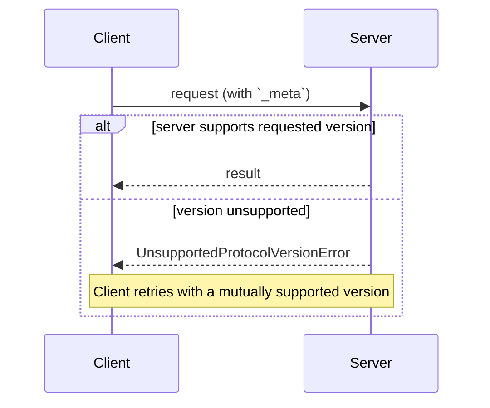

<div id="enable-section-numbers" />

本页定义客户端和服务器如何就它们所讲的内容达成一致：在每个请求上声明的协议版本；通过能力协商的可选扩展；以及与早期的、基于握手的协议修订版的互操作性。

不存在协商握手。每个请求都携带其协议版本，服务器独立地接受或拒绝每个请求：



## 术语

本页使用以下术语来表示跨协议修订版的互操作性：

- **现代（Modern）**：将版本、身份和能力作为每请求元数据来传达的协议版本（修订版 `2026-07-28` 及更高版本）。
- **旧式（Legacy）**：通过 `initialize` 握手建立会话的协议版本（`2025-11-25` 及更早版本）。
- **双时代（Dual-era）**：同时支持现代和旧式版本的实现。

## 协议版本协商

每个请求都在其 [`_meta`](/specification/2026-07-28/basic/index#meta) 字段中声明它所使用的协议版本。在 HTTP 上，这还通过 [`MCP-Protocol-Version` header](/specification/2026-07-28/basic/transports/streamable-http#protocol-version-header) 携带。

如果服务器不实现所请求的版本（无论该版本对服务器是未知的，还是一个服务器选择不支持的已知版本），它**必须（MUST）**以一个列出它所支持版本的 [`UnsupportedProtocolVersionError`](/specification/2026-07-28/schema#unsupportedprotocolversionerror) 响应：

```json
{
  "jsonrpc": "2.0",
  "id": 1,
  "error": {
    "code": -32022,
    "message": "Unsupported protocol version",
    "data": {
      "supported": ["2026-07-28", "2025-11-25"],
      "requested": "1900-01-01"
    }
  }
}
```

客户端**应当（SHOULD）**从 `supported` 列表中选择一个双方都支持的版本并重试该请求，或者在不存在兼容版本时向用户呈现一个错误。

服务器**必须（MUST）**实现 [`server/discover`](/specification/2026-07-28/server/discover)。客户端**可以（MAY）**在发送任何其他请求之前调用它以预先了解服务器所支持的版本，但并非必须：客户端完全可以内联调用任何 RPC，并在其首选版本不受支持时处理 `UnsupportedProtocolVersionError`。

## 扩展协商

客户端和服务器可以协商对核心协议之外的可选[扩展](/docs/extensions/overview)的支持。扩展在能力的 `extensions` 字段中公布，该字段是一个从扩展标识符到每扩展设置对象的映射。扩展标识符**必须（MUST）**遵循 [`_meta` 键命名规则](/specification/2026-07-28/basic/index#meta)，带一个强制的前缀。

以下是一个客户端公布标识为 `io.modelcontextprotocol/ui` 的 [MCP Apps 扩展](/extensions/apps/overview)的示例：

```json
{
  "capabilities": {
    "roots": {},
    "extensions": {
      "io.modelcontextprotocol/ui": {
        "mimeTypes": ["text/html;profile=mcp-app"]
      }
    }
  }
}
```

一个标识为 `io.modelcontextprotocol/tasks` 的 [Tasks 扩展](/extensions/tasks/overview)的示例：

```json
{
  "capabilities": {
    "tools": {},
    "extensions": {
      "io.modelcontextprotocol/tasks": {}
    }
  }
}
```

每个扩展指定其设置对象的 schema；一个空对象表示支持但无额外设置。

如果一方支持某个扩展而另一方不支持，支持的一方**必须（MUST）**要么回退到核心协议行为，要么以一个适当的错误拒绝该请求。扩展**应当（SHOULD）**记录它们预期的回退行为。

## 与基于初始化的版本的向后兼容

一个希望同时支持[旧式](#术语)客户端（期望 `initialize` 握手）和[现代](#术语)客户端（使用每请求元数据）的服务器**可以（MAY）**实现两种行为。

一个需要与两种服务器互操作的客户端使用特定于传输的机制检测服务器的时代，这些机制在绑定页面中指定：

- [stdio](/specification/2026-07-28/basic/transports/stdio#backward-compatibility)：用 `server/discover` 探测，并在任何不是已识别的现代错误的错误上回退。
- [Streamable HTTP](/specification/2026-07-28/basic/transports/streamable-http#backward-compatibility)：尝试一个现代请求，并在回退之前检查 `400 Bad Request` 的正文。

在这两种情况下，一个已识别的现代 JSON-RPC 错误（例如 [`UnsupportedProtocolVersionError`](/specification/2026-07-28/schema#unsupportedprotocolversionerror)）标识一个现代服务器：客户端以一个受支持的版本重试，而不是回退。任何其他情况标识一个旧式服务器。

时代判定是服务器的属性，而不是单个请求的属性。客户端**应当（SHOULD）**在服务器进程（stdio）或 origin（HTTP）的生命周期内缓存该结果，并**可以（MAY）**在同一服务器配置的重启之间持久化它，若缓存的假设后来失败则重新探测。

一个仅支持[现代](#术语)版本的服务器**应当（SHOULD）**在它返回给 `initialize` 请求的任何错误中（在任何传输上）指明它所支持的协议版本：旧式客户端没有前向回退（fall-forward）机制，而此消息可能是它们能够向用户呈现的唯一诊断。

### 兼容性矩阵

以下矩阵总结了客户端和服务器时代每种组合的预期结果：

| 客户端   | 服务器   | 结果                                                                                                                                                                                                                                                                                                                                                                                                                                                                                                                                     |
| -------- | -------- | ------------------------------------------------------------------------------------------------------------------------------------------------------------------------------------------------------------------------------------------------------------------------------------------------------------------------------------------------------------------------------------------------------------------------------------------------------------------------------------------------------------------------------------------- |
| 现代   | 现代   | 有效。`server/discover` 是可选的；版本不匹配以 `UnsupportedProtocolVersionError` 呈现，客户端以一个双方都支持的版本重试。                                                                                                                                                                                                                                                                                                                                                                             |
| 现代   | 旧式   | 失败。服务器可能以一个实现定义的错误拒绝该请求、保持沉默，甚至在旧式语义下处理一个时代模糊的方法。在 stdio 上，客户端**应当（SHOULD）**先发送 `server/discover` 以确定性地失败；客户端随后向用户呈现一个可操作的错误。                                                                                                                                                                                                                                  |
| 双时代 | 现代   | 有效。stdio 探测返回一个 `DiscoverResult`（或 `UnsupportedProtocolVersionError`）；在 HTTP 上，第一个现代请求成功或返回一个现代错误。客户端保持现代。                                                                                                                                                                                                                                                                                                                                                                    |
| 双时代 | 旧式   | 有效。stdio：探测返回一个非现代错误或超时，客户端回退到 `initialize`。HTTP：现代请求返回一个不带已识别现代错误正文的 `4xx`，客户端回退到 `initialize`（并可能进一步回退到已弃用的 HTTP+SSE 传输）。                                                                                                                                                                                                                                         |
| 旧式   | 现代   | 失败。stdio：服务器以一个 JSON-RPC 错误拒绝 `initialize`；确切的代码是实现定义的（`initialize` 是一个未知方法，且该请求还缺少必需的 `_meta` 字段）。HTTP：请求缺少必需的 header，并根据[服务器校验](/specification/2026-07-28/basic/transports/streamable-http#server-validation)以 `400 Bad Request` 被拒绝（在已弃用的 HTTP+SSE 传输上的客户端则在其开场 `GET` 处失败）。旧式客户端没有前向回退机制。 |
| 旧式   | 双时代 | 有效。服务器回答 `initialize` 并根据协商出的旧式修订版为客户端服务。                                                                                                                                                                                                                                                                                                                                                                                                                                                   |
| 旧式   | 旧式   | 根据旧式修订版有效；超出本文档的范围。                                                                                                                                                                                                                                                                                                                                                                                                                                                                                                     |

一个双时代**服务器**根据客户端如何开场来选择其行为：

- 一个携带现代每请求 `_meta` 的请求根据本修订版被无状态地服务。
- 一个 `initialize` 请求选择旧式语义，其范围限定于 stdio 进程（stdio）或会话（HTTP），如协商出的旧式协议版本所指定。

一个双时代服务器**可以（MAY）**在同一端点或进程上并发地服务两个时代。
