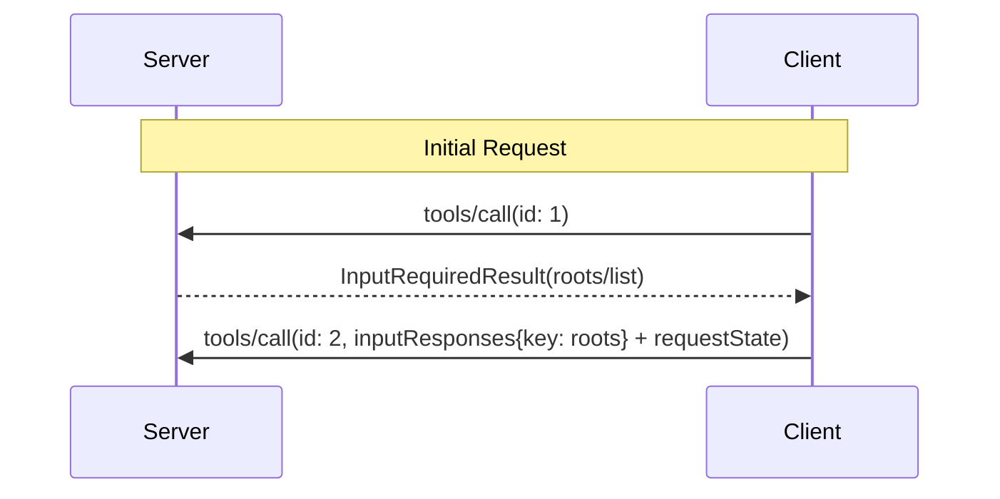

<div id="enable-section-numbers" />

<Warning>
  **已弃用**：Roots 特性自协议版本 `2026-07-28` 起已弃用（[SEP-2577](https://github.com/modelcontextprotocol/modelcontextprotocol/pull/2577)）。根据[特性生命周期策略](/community/feature-lifecycle)，它在本修订版发布后至少保留在规范中十二个月，然后才符合移除条件。新的实现**不应（SHOULD NOT）**采用它；现有的实现**应当（SHOULD）**迁移到通过工具参数、资源 URI 或服务器配置传递目录或文件。参见[已弃用特性登记表](/specification/2026-07-28/deprecated)。
</Warning>

模型上下文协议（MCP）为客户端提供了一种标准化的方式来向服务器暴露文件系统 "roots"。Roots 告知服务器客户端认为相关的目录和文件，以便服务器可以相应地聚焦其操作。它们是信息性的指导，而不是一种访问控制机制。协议不强制服务器停留在 roots 内。服务器可以从支持的客户端请求 roots 列表。

## 用户交互模型

MCP 中的 roots 通常通过工作区或项目配置界面暴露。

例如，实现可以提供一个工作区/项目选择器，允许用户选择服务器应有权访问的目录和文件。这可以与从版本控制系统或项目文件进行的自动工作区检测相结合。

然而，实现可以自由地通过任何适合其需求的界面模式暴露 roots——协议本身不强制规定任何特定的用户交互模型。

## 能力

支持 roots 的客户端**必须（MUST）**在每个请求的 `_meta.io.modelcontextprotocol/clientCapabilities` 中声明 `roots` 能力：

```json
{
  "_meta": {
    "io.modelcontextprotocol/clientCapabilities": {
      "roots": {}
    }
  }
}
```

## 协议消息

### 列出 Roots

要在处理一个客户端请求期间检索 roots，服务器发送一个包含 `roots/list` 请求的 `InputRequiredResult`：

**输入请求（在 [`InputRequiredResult.inputRequests`](/specification/2026-07-28/basic/patterns/mrtr#inputrequests) 内投递）：**

```json
{
  "method": "roots/list"
}
```

**客户端结果（在被重试请求的 `inputResponses` 内返回）：**

```json
{
  "roots": [
    {
      "uri": "file:///home/user/projects/myproject",
      "name": "My Project"
    }
  ]
}
```

## 消息流



## 数据类型

### Root

一个 root 定义包括：

- `uri`：root 的唯一标识符。在当前规范中，这**必须（MUST）**是一个 `file://` URI。
- `name`：用于显示目的的可选人类可读名称。

不同用例的示例 roots：

#### 项目目录

```json
{
  "uri": "file:///home/user/projects/myproject",
  "name": "My Project"
}
```

#### 多个仓库

```json
[
  {
    "uri": "file:///home/user/repos/frontend",
    "name": "Frontend Repository"
  },
  {
    "uri": "file:///home/user/repos/backend",
    "name": "Backend Repository"
  }
]
```

## 错误处理

如果发生错误，客户端不需要用一条错误消息重放初始调用，因为在 `InputRequiredResult` 模式下服务器并不等待响应。

## 安全考量

1. 客户端**必须（MUST）**：
   - 只暴露具有适当权限的 roots
   - 校验所有 root URI 以防止路径遍历
   - 实现适当的访问控制
   - 监控 root 的可访问性

2. 服务器**应当（SHOULD）**：
   - 处理 roots 变得不可用的情况
   - 在操作期间尊重 root 边界
   - 对照所提供的 roots 校验所有路径

## 实现指南

1. 客户端**应当（SHOULD）**：
   - 在向服务器暴露 roots 之前提示用户同意
   - 为 root 管理提供清晰的用户界面
   - 在暴露之前校验 root 的可访问性
   - 监控 root 变更

2. 服务器**应当（SHOULD）**：
   - 在使用之前检查 roots 能力
   - 在操作中尊重 root 边界
   - 适当地缓存 root 信息
