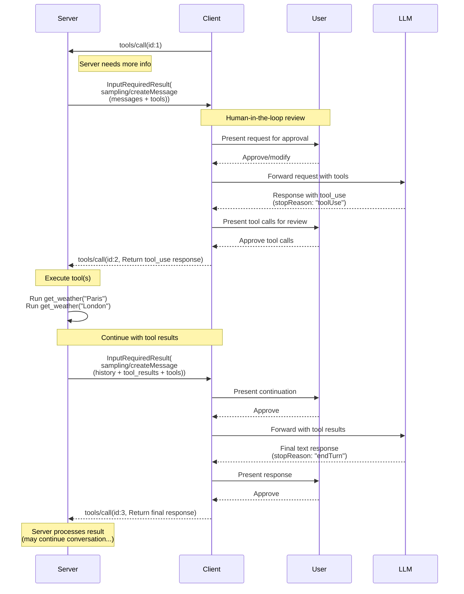
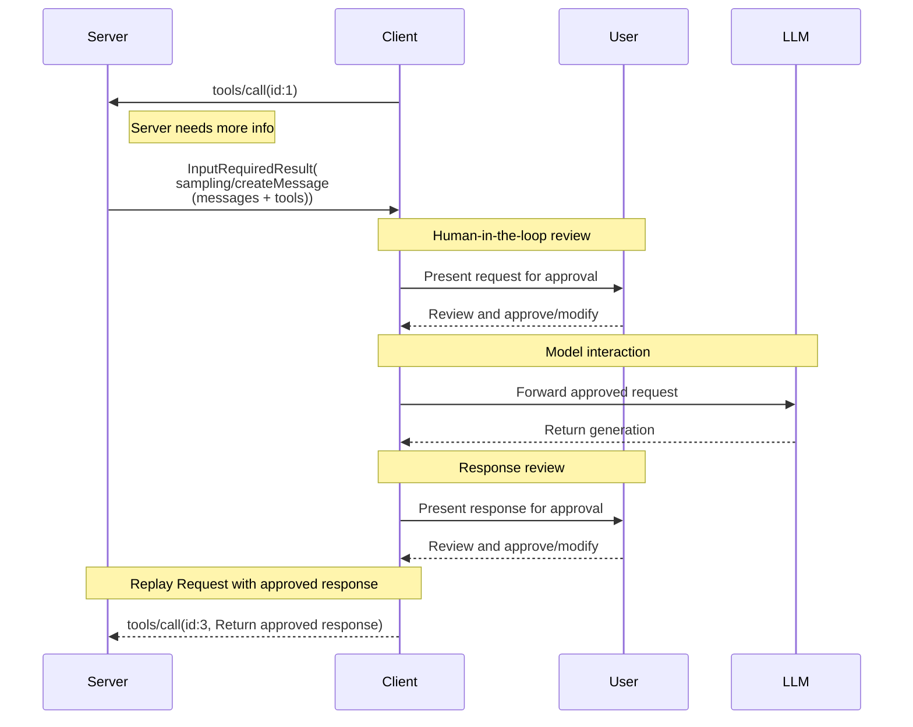

<div id="enable-section-numbers" />

<Warning>
  **已弃用**：Sampling 特性自协议版本 `2026-07-28` 起已弃用（[SEP-2577](https://github.com/modelcontextprotocol/modelcontextprotocol/pull/2577)）。根据[特性生命周期策略](/community/feature-lifecycle)，它在本修订版发布后至少保留在规范中十二个月，然后才符合移除条件。新的实现**不应（SHOULD NOT）**采用它；现有的实现**应当（SHOULD）**迁移到直接与 LLM 提供方的 API 集成。参见[已弃用特性登记表](/specification/2026-07-28/deprecated)。
</Warning>

模型上下文协议（MCP）为服务器提供了一种标准化的方式，通过客户端向语言模型请求 LLM 采样（"补全"或"生成"）。此流程允许客户端保持对模型访问、选择和权限的控制，同时使服务器能够利用 AI 能力——无需服务器 API 密钥。服务器可以请求基于文本、音频或图像的交互，并可选地在其提示中包含来自 MCP 服务器的上下文。

## 用户交互模型

MCP 中的采样允许服务器通过使 LLM 调用发生在其他 MCP 服务器特性内部_嵌套_，来实现智能体（agentic）行为。

实现可以自由地通过任何适合其需求的界面模式暴露采样——协议本身不强制规定任何特定的用户交互模型。

<Warning>

为了信任与安全以及安全性，**应当（SHOULD）**始终有一个人在回路，具有拒绝采样请求的能力。

应用**应当（SHOULD）**：

- 提供使审查采样请求变得容易和直观的 UI
- 允许用户在发送前查看和编辑提示
- 在交付前呈现生成的响应以供审查

</Warning>

## 采样中的工具

服务器可以通过在其采样请求中提供一个 `tools` 数组和可选的 `toolChoice` 配置，请求客户端的 LLM 在采样期间使用工具。`tools` 数组中的工具定义仅限于该采样请求——它们无需与已注册的工具相对应。这使服务器能够实现智能体行为，其中 LLM 可以调用专门指定的工具、接收结果并继续对话——所有这些都在单个采样请求流程内。

客户端**必须（MUST）**通过 `sampling.tools` 能力声明对工具使用的支持，才能接收启用了工具的采样请求。服务器**不得（MUST NOT）**向未通过 `sampling.tools` 能力声明对工具使用支持的客户端发送启用了工具的采样请求。

## 能力

支持采样的客户端**必须（MUST）**在每个请求的 `_meta.io.modelcontextprotocol/clientCapabilities` 中声明 `sampling` 能力：

**基本采样：**

```json
{
  "_meta": {
    "io.modelcontextprotocol/clientCapabilities": {
      "sampling": {}
    }
  }
}
```

**带工具使用支持：**

```json
{
  "_meta": {
    "io.modelcontextprotocol/clientCapabilities": {
      "sampling": {
        "tools": {}
      }
    }
  }
}
```

**带上下文纳入支持（已弃用）：**

```json
{
  "_meta": {
    "io.modelcontextprotocol/clientCapabilities": {
      "sampling": {
        "context": {}
      }
    }
  }
}
```

<Note>
  `includeContext` 参数值 `"thisServer"` 和 `"allServers"` 根据[特性生命周期策略](/community/feature-lifecycle#deprecating-a-feature)（[SEP-2596](https://github.com/modelcontextprotocol/modelcontextprotocol/pull/2596)）已弃用；它们将不迟于 Sampling 特性本身被移除。服务器**应当（SHOULD）**避免使用这些值（例如可以直接省略 `includeContext`，因为它默认为 `"none"`），并**不应（SHOULD NOT）**使用它们，除非客户端声明 `sampling.context` 能力。参见[已弃用特性登记表](/specification/2026-07-28/deprecated)。
</Note>

## 协议消息

### 创建消息

要在处理一个客户端请求期间请求语言模型生成，服务器发送一个包含 `sampling/createMessage` 请求的 `InputRequiredResult`：

**输入请求（在 [`InputRequiredResult.inputRequests`](/specification/2026-07-28/basic/patterns/mrtr#inputrequests) 内投递）：**

```json
{
  "method": "sampling/createMessage",
  "params": {
    "messages": [
      {
        "role": "user",
        "content": {
          "type": "text",
          "text": "What is the capital of France?"
        }
      }
    ],
    "modelPreferences": {
      "hints": [
        {
          "name": "claude-3-sonnet"
        }
      ],
      "costPriority": 0.3,
      "intelligencePriority": 0.8,
      "speedPriority": 0.5
    },
    "temperature": 0.1,
    "systemPrompt": "You are a helpful assistant.",
    "includeContext": "thisServer",
    "maxTokens": 100
  }
}
```

**客户端结果（在被重试请求的 `inputResponses` 内返回）：**

```json
{
  "role": "assistant",
  "content": {
    "type": "text",
    "text": "The capital of France is Paris."
  },
  "model": "claude-3-sonnet-20240307",
  "stopReason": "endTurn"
}
```

### 带工具的采样

以下图表说明带工具的采样的完整流程，包括多轮工具循环：



要请求带工具使用能力的 LLM 生成，服务器在请求中包含 `tools` 以及可选的 `toolChoice`：

**输入请求（服务器 -> 客户端，在 `InputRequiredResult.inputRequests` 内投递）：**

```json
{
  "method": "sampling/createMessage",
  "params": {
    "messages": [
      {
        "role": "user",
        "content": {
          "type": "text",
          "text": "What's the weather like in Paris and London?"
        }
      }
    ],
    "tools": [
      {
        "name": "get_weather",
        "description": "Get current weather for a city",
        "inputSchema": {
          "type": "object",
          "properties": {
            "city": {
              "type": "string",
              "description": "City name"
            }
          },
          "required": ["city"]
        }
      }
    ],
    "toolChoice": {
      "mode": "auto"
    },
    "maxTokens": 1000
  }
}
```

**客户端结果（客户端 -> 服务器，在被重试请求的 `inputResponses` 内返回）：**

```json
{
  "role": "assistant",
  "content": [
    {
      "type": "tool_use",
      "id": "call_abc123",
      "name": "get_weather",
      "input": {
        "city": "Paris"
      }
    },
    {
      "type": "tool_use",
      "id": "call_def456",
      "name": "get_weather",
      "input": {
        "city": "London"
      }
    }
  ],
  "model": "claude-3-sonnet-20240307",
  "stopReason": "toolUse"
}
```

### 多轮工具循环

在从 LLM 收到工具使用请求后，服务器通常：

1. 执行所请求的工具使用。
2. 发送一个附加了工具结果的新采样请求
3. 接收 LLM 的响应（可能包含新的工具使用）
4. 根据需要重复多次（服务器可能设置最大迭代次数的上限，例如在最后一次迭代传递 `toolChoice: {mode: "none"}` 以强制得到最终结果）

**带工具结果的后续输入请求（服务器 -> 客户端，在 `InputRequiredResult.inputRequests` 内投递）：**

```json
{
  "method": "sampling/createMessage",
  "params": {
    "messages": [
      {
        "role": "user",
        "content": {
          "type": "text",
          "text": "What's the weather like in Paris and London?"
        }
      },
      {
        "role": "assistant",
        "content": [
          {
            "type": "tool_use",
            "id": "call_abc123",
            "name": "get_weather",
            "input": { "city": "Paris" }
          },
          {
            "type": "tool_use",
            "id": "call_def456",
            "name": "get_weather",
            "input": { "city": "London" }
          }
        ]
      },
      {
        "role": "user",
        "content": [
          {
            "type": "tool_result",
            "toolUseId": "call_abc123",
            "content": [
              {
                "type": "text",
                "text": "Weather in Paris: 18°C, partly cloudy"
              }
            ]
          },
          {
            "type": "tool_result",
            "toolUseId": "call_def456",
            "content": [
              {
                "type": "text",
                "text": "Weather in London: 15°C, rainy"
              }
            ]
          }
        ]
      }
    ],
    "tools": [
      {
        "name": "get_weather",
        "description": "Get current weather for a city",
        "inputSchema": {
          "type": "object",
          "properties": {
            "city": { "type": "string" }
          },
          "required": ["city"]
        }
      }
    ],
    "maxTokens": 1000
  }
}
```

**最终客户端结果（客户端 -> 服务器，在被重试请求的 `inputResponses` 内返回）：**

```json
{
  "role": "assistant",
  "content": {
    "type": "text",
    "text": "Based on the current weather data:\n\n- **Paris**: 18°C and partly cloudy - quite pleasant!\n- **London**: 15°C and rainy - you'll want an umbrella.\n\nParis has slightly warmer and drier conditions today."
  },
  "model": "claude-3-sonnet-20240307",
  "stopReason": "endTurn"
}
```

## 消息内容约束

### 工具结果消息

当一个 user 消息包含工具结果（type: "tool_result"）时，它**必须（MUST）**只包含工具结果。不允许在同一消息中将工具结果与其他内容类型（text、image、audio）混合。

此约束确保与使用专用角色处理工具结果的提供方 API 兼容（例如 OpenAI 的 "tool" 角色、Gemini 的 "function" 角色）。

**有效——单个工具结果：**

```json
{
  "role": "user",
  "content": {
    "type": "tool_result",
    "toolUseId": "call_123",
    "content": [{ "type": "text", "text": "Result data" }]
  }
}
```

**有效——多个工具结果：**

```json
{
  "role": "user",
  "content": [
    {
      "type": "tool_result",
      "toolUseId": "call_123",
      "content": [{ "type": "text", "text": "Result 1" }]
    },
    {
      "type": "tool_result",
      "toolUseId": "call_456",
      "content": [{ "type": "text", "text": "Result 2" }]
    }
  ]
}
```

**无效——混合内容：**

```json
{
  "role": "user",
  "content": [
    {
      "type": "text",
      "text": "Here are the results:"
    },
    {
      "type": "tool_result",
      "toolUseId": "call_123",
      "content": [{ "type": "text", "text": "Result data" }]
    }
  ]
}
```

### 工具使用与结果的平衡

在采样中使用工具使用时，每个包含 `ToolUseContent` 块的 assistant 消息**必须（MUST）**紧接一个完全由 `ToolResultContent` 块组成的 user 消息，其中每个工具使用（例如带 `id: $id`）由一个对应的工具结果（带 `toolUseId: $id`）匹配，然后才能有任何其他消息。

此要求确保：

- 工具使用总是在对话继续之前被解决
- 提供方 API 可以并发地处理多个工具使用并并行获取它们的结果
- 对话维持一致的请求-响应模式

**有效序列示例：**

1. User 消息："What's the weather like in Paris and London?"
2. Assistant 消息：`ToolUseContent`（`id: "call_abc123", name: "get_weather", input: {city: "Paris"}`）+ `ToolUseContent`（`id: "call_def456", name: "get_weather", input: {city: "London"}`）
3. User 消息：`ToolResultContent`（`toolUseId: "call_abc123", content: "18°C, partly cloudy"`）+ `ToolResultContent`（`toolUseId: "call_def456", content: "15°C, rainy"`）
4. Assistant 消息：比较两个城市天气的文本响应

**无效序列——缺少工具结果：**

1. User 消息："What's the weather like in Paris and London?"
2. Assistant 消息：`ToolUseContent`（`id: "call_abc123", name: "get_weather", input: {city: "Paris"}`）+ `ToolUseContent`（`id: "call_def456", name: "get_weather", input: {city: "London"}`）
3. User 消息：`ToolResultContent`（`toolUseId: "call_abc123", content: "18°C, partly cloudy"`）← 缺少 call_def456 的结果
4. Assistant 消息：文本响应（无效——并非所有工具使用都被解决）

## 跨 API 兼容性

采样规范被设计为跨多个 LLM 提供方 API（Claude、OpenAI、Gemini 等）工作。为兼容性的关键设计决策：

### 消息角色

MCP 使用两个角色："user" 和 "assistant"。

工具使用请求在 CreateMessageResult 中以 "assistant" 角色发送。工具结果在带 "user" 角色的消息中发回。带工具结果的消息不能包含其他种类的内容。

### 工具选择模式

`CreateMessageRequest.params.toolChoice` 控制模型的工具使用能力：

- `{mode: "auto"}`：模型决定是否使用工具（默认）
- `{mode: "required"}`：模型必须（MUST）在完成前至少使用一个工具
- `{mode: "none"}`：模型不得（MUST NOT）使用任何工具

### 并行工具使用

MCP 允许模型并行发起多个工具使用请求（返回一个 `ToolUseContent` 数组）。所有主要提供方 API 都支持这一点：

- **Claude**：原生支持并行工具使用
- **OpenAI**：支持并行工具调用（可用 `parallel_tool_calls: false` 禁用）
- **Gemini**：原生支持并行函数调用

包装支持禁用并行工具使用的提供方的实现可以（MAY）将其暴露为一个扩展，但它不是核心 MCP 规范的一部分。

## 消息流



## 数据类型

### 消息

采样消息**必须（MUST）**包含一个值为 `"user"` 或 `"assistant"` 的 `role` 字段，以及一个表示消息数据的 `content` 字段。

采样请求中的消息列表**不应（SHOULD NOT）**在不同请求之间保留。

`content` 字段可以包含：

#### 文本内容

```json
{
  "type": "text",
  "text": "The message content"
}
```

#### 图像内容

```json
{
  "type": "image",
  "data": "base64-encoded-image-data",
  "mimeType": "image/jpeg"
}
```

#### 音频内容

```json
{
  "type": "audio",
  "data": "base64-encoded-audio-data",
  "mimeType": "audio/wav"
}
```

### 模型偏好

MCP 中的模型选择需要仔细的抽象，因为服务器和客户端可能使用具有不同模型产品的不同 AI 提供方。服务器不能简单地按名称请求一个特定模型，因为客户端可能无法访问那个确切的模型，或可能更愿意使用不同提供方的等价模型。

为解决这一点，MCP 实现了一个偏好系统，它将抽象的能力优先级与可选的模型提示相结合：

#### 能力优先级

服务器通过三个归一化的优先级值（0-1）表达它们的需求：

- `costPriority`：最小化成本有多重要？较高的值偏好更便宜的模型。
- `speedPriority`：低延迟有多重要？较高的值偏好更快的模型。
- `intelligencePriority`：高级能力有多重要？较高的值偏好能力更强的模型。

#### 模型提示

虽然优先级帮助基于特性选择模型，但 `hints` 允许服务器建议特定的模型或模型系列：

- 提示被视为可以灵活匹配模型名称的子字符串
- 多个提示按偏好顺序求值
- 客户端**可以（MAY）**将提示映射到来自不同提供方的等价模型
- 提示是建议性的——客户端做出最终的模型选择

例如：

```json
{
  "hints": [
    { "name": "claude-3-sonnet" }, // Prefer Sonnet-class models
    { "name": "claude" } // Fall back to any Claude model
  ],
  "costPriority": 0.3, // Cost is less important
  "speedPriority": 0.8, // Speed is very important
  "intelligencePriority": 0.5 // Moderate capability needs
}
```

客户端处理这些偏好以从其可用选项中选择一个适当的模型。例如，如果客户端无法访问 Claude 模型但拥有 Gemini，它可能基于类似的能力将 sonnet 提示映射到 `gemini-1.5-pro`。

### 系统提示

可选的 `systemPrompt` 字段允许服务器请求一个特定的系统提示。客户端**可以（MAY）**修改或忽略此字段，而无需向服务器传达这一点。

### 上下文纳入

`includeContext` 参数指定客户端预期在其响应中包含什么上下文信息：

- `"none"`：无额外上下文。
- `"thisServer"`：包含来自发起请求服务器的上下文。
- `"allServers"`：包含来自所有已连接 MCP 服务器的上下文。

`"thisServer"` 和 `"allServers"` 值已弃用；参见[能力](#能力)。

客户端**可以（MAY）**修改或忽略此字段，而无需向服务器传达这一点。例如，客户端可以判断在某个特定请求中尊重此字段将需要与服务器共享敏感信息，并相应地约束其响应。

### 采样参数

LLM 采样可以用以下参数微调：

- `temperature`：控制模型响应中的随机性。较高的值产生更高的随机性，较低的值产生更稳定的输出。有效范围取决于模型提供方。
- `maxTokens`：要生成的最大 token 数；必需。
- `stopSequences`：停止生成的序列数组。
- `metadata`：额外的、提供方特定的参数。

客户端**必须（MUST）**尊重 `maxTokens` 参数。

客户端**可以（MAY）**修改或忽略 `temperature`、`stopSequences` 和 `metadata`。例如，客户端可能使用一个不支持这些参数中一个或多个的模型，因此将无法利用它们。

### 结果字段

采样结果将包含以下字段：

- `role`：消息角色；参见[消息](#消息)。
- `content`：消息内容。这可以是：
  - 当响应只包含一个内容块时（例如单个文本响应），为单个内容块。
  - 当响应包含一个或多个内容块时（例如多个工具使用或混合内容），为一个内容块数组。

  内容块类型参见[消息](#消息)。

- `model`：生成该消息的模型的名称。
- `stopReason`：如果已知，采样停止的原因。规范定义了以下（非穷尽的）停止原因，尽管实现**可以（MAY）**提供它们自己的任意值：
  - `"endTurn"`：参与方将对话让给另一方。
  - `"stopSequence"`：消息生成遇到了所请求的 `stopSequences` 之一。
  - `"maxTokens"`：达到了 token 限制。
  - `"toolUse"`：模型想要使用一个或多个工具。

## 错误处理

如果发生错误或用户拒绝采样请求，客户端不需要用一条错误消息重放初始调用，因为在 `InputRequiredResult` 模式下服务器并不等待响应。

## 安全考量

1. 客户端**应当（SHOULD）**实现用户批准控件
2. 双方**应当（SHOULD）**校验消息内容
3. 客户端**应当（SHOULD）**尊重模型偏好提示
4. 客户端**应当（SHOULD）**实现速率限制
5. 双方**必须（MUST）**妥善处理敏感数据

当在采样中使用工具时，适用额外的安全考量：

6. 服务器**必须（MUST）**确保在回复 `stopReason: "toolUse"` 时，每个 `ToolUseContent` 项都以一个带匹配 `toolUseId` 的 `ToolResultContent` 项响应，且 user 消息只包含工具结果（无其他内容类型）
7. 双方**应当（SHOULD）**为工具循环实现迭代限制
