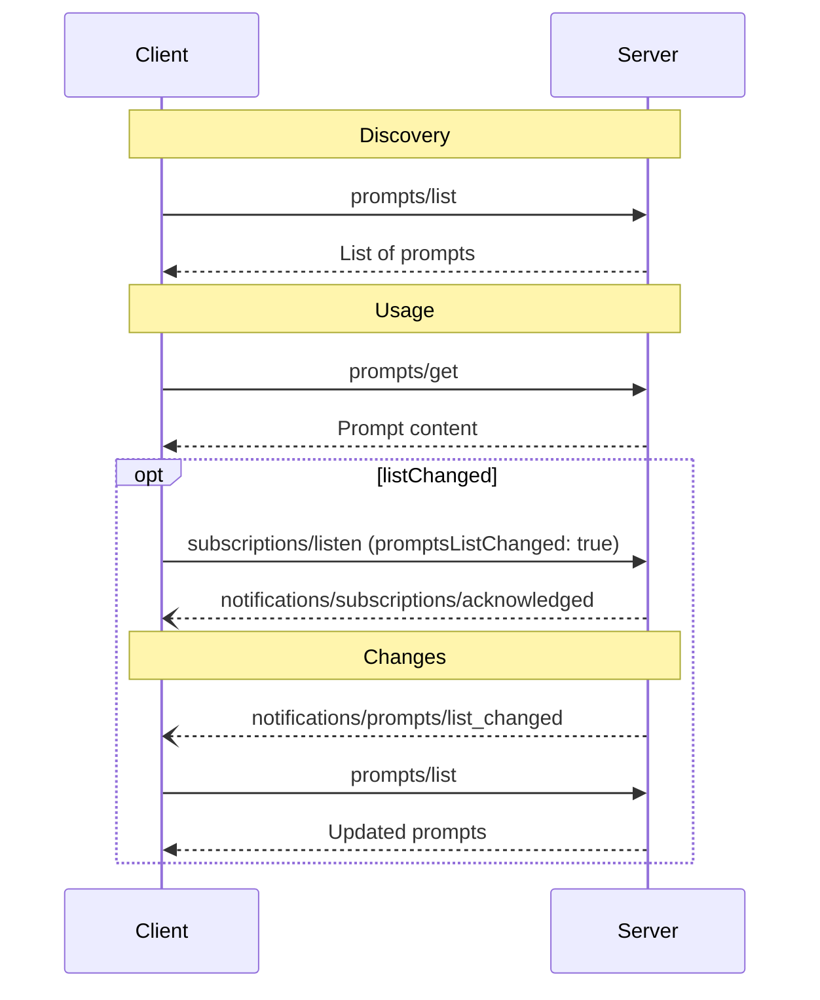

<div id="enable-section-numbers" />

模型上下文协议（MCP）为服务器提供了一种标准化的方式来向客户端暴露提示模板。提示允许服务器提供用于与语言模型交互的结构化消息和指令。客户端可以发现可用的提示、检索它们的内容，并提供参数来自定义它们。

<Note>
  为简洁起见，本页的请求示例省略了 `_meta` 请求元数据（`io.modelcontextprotocol/protocolVersion`、`io.modelcontextprotocol/clientInfo` 和 `io.modelcontextprotocol/clientCapabilities`）。每个请求**必须（MUST）**包含必需的 `_meta` 字段；参见 [`_meta`](/specification/2026-07-28/basic/index#meta)。
</Note>

## 用户交互模型

提示被设计为**由用户控制**，意味着它们从服务器暴露给客户端，意图是让用户能够显式地选择使用它们。这指的是谁决定何时使用提示，而不是谁编写其内容。提示内容由服务器定义。

通常，提示会通过用户界面中由用户发起的命令触发，这允许用户自然地发现和调用可用的提示。

例如，作为斜杠命令：


然而，实现者可以自由地通过任何适合其需求的界面模式暴露提示——协议本身不强制规定任何特定的用户交互模型。

## 能力

支持提示的服务器**必须（MUST）**在其 [`DiscoverResult`](/specification/2026-07-28/schema#discoverresult) 中声明 `prompts` 能力：

```json
{
  "capabilities": {
    "prompts": {
      "listChanged": true
    }
  }
}
```

`listChanged` 指示服务器是否会在可用提示列表变化时发出通知。

声明 `prompts` 能力的服务器**必须（MUST）**以当前对发起请求的客户端可用的提示集合响应 `prompts/list` 请求。此集合**可以（MAY）**为空并**可以（MAY）**随时间变化（参见[列表变更通知](#列表变更通知)），但**不得（MUST NOT）**按连接变化或作为连接上其他请求的副作用变化。此集合**可以（MAY）**按请求上出示的授权变化——例如，只返回调用方被授予的 scope 所允许的提示——因为凭据是每请求输入，而非连接状态。

## 协议消息

### 列出提示

要检索可用的提示，客户端发送一个 `prompts/list` 请求。此操作支持[分页](/specification/2026-07-28/server/utilities/pagination)和[缓存](/specification/2026-07-28/server/utilities/caching)。

**请求：**

```json
{
  "jsonrpc": "2.0",
  "id": 1,
  "method": "prompts/list",
  "params": {
    "cursor": "optional-cursor-value"
  }
}
```

**响应：**

```json
{
  "jsonrpc": "2.0",
  "id": 1,
  "result": {
    "resultType": "complete",
    "prompts": [
      {
        "name": "code_review",
        "title": "Request Code Review",
        "description": "Asks the LLM to analyze code quality and suggest improvements",
        "arguments": [
          {
            "name": "code",
            "description": "The code to review",
            "required": true
          }
        ],
        "icons": [
          {
            "src": "https://example.com/review-icon.svg",
            "mimeType": "image/svg+xml",
            "sizes": ["any"]
          }
        ]
      }
    ],
    "nextCursor": "next-page-cursor",
    "ttlMs": 600000,
    "cacheScope": "public"
  }
}
```

### 获取一个提示

要检索一个特定的提示，客户端发送一个 `prompts/get` 请求。参数可以通过[补全 API](/specification/2026-07-28/server/utilities/completion)自动补全。

**请求：**

```json
{
  "jsonrpc": "2.0",
  "id": 2,
  "method": "prompts/get",
  "params": {
    "name": "code_review",
    "arguments": {
      "code": "def hello():\n    print('world')"
    }
  }
}
```

**响应：**

```json
{
  "jsonrpc": "2.0",
  "id": 2,
  "result": {
    "resultType": "complete",
    "description": "Code review prompt",
    "messages": [
      {
        "role": "user",
        "content": {
          "type": "text",
          "text": "Please review this Python code:\ndef hello():\n    print('world')"
        }
      }
    ]
  }
}
```

服务器**也可以（MAY）**以一个 [`InputRequiredResult`](/specification/2026-07-28/basic/patterns/mrtr#inputrequiredresult) 响应 `prompts/get`，以表明在提示可以被解析之前需要额外的输入。这遵循[多轮往返请求](/specification/2026-07-28/basic/patterns/mrtr#multi-round-trip-requests)机制。在重试请求时，客户端在请求参数中包含 `inputResponses`，以及（如果服务器提供）`requestState`。

### 列表变更通知

当可用提示列表变化时，声明了 `listChanged` 能力的服务器**应当（SHOULD）**向已用 `promptsListChanged: true` 打开一个 [`subscriptions/listen`](/specification/2026-07-28/basic/patterns/subscriptions) 流的客户端发送一个通知：

```json
{
  "jsonrpc": "2.0",
  "method": "notifications/prompts/list_changed"
}
```

## 消息流



## 数据类型

### Prompt

一个提示定义包括：

- `name`：提示的唯一标识符
- `title`：用于显示目的的可选人类可读提示名称。
- `description`：可选的人类可读描述
- `icons`：用于在用户界面中显示的可选图标数组
- `arguments`：用于自定义的可选参数列表

### PromptMessage

提示中的消息可以包含：

- `role`："user" 或 "assistant"，以指示说话者
- `content`：以下内容类型之一：

<Note>
  提示消息中的所有内容类型都支持可选的[注解](/specification/2026-07-28/server/resources#annotations)，用于关于受众、优先级和修改时间的元数据。
</Note>

#### 文本内容

文本内容表示纯文本消息：

```json
{
  "type": "text",
  "text": "The text content of the message"
}
```

这是用于自然语言交互的最常见内容类型。

#### 图像内容

图像内容允许在消息中包含视觉信息：

```json
{
  "type": "image",
  "data": "base64-encoded-image-data",
  "mimeType": "image/png"
}
```

图像数据**必须（MUST）**是 base64 编码的并包含一个有效的 MIME 类型。这实现了视觉上下文重要的多模态交互。

#### 音频内容

音频内容允许在消息中包含音频信息：

```json
{
  "type": "audio",
  "data": "base64-encoded-audio-data",
  "mimeType": "audio/wav"
}
```

音频数据必须（MUST）是 base64 编码的并包含一个有效的 MIME 类型。这实现了音频上下文重要的多模态交互。

#### 资源链接

提示消息**可以（MAY）**包含到[资源](/specification/2026-07-28/server/resources)的链接，以在不直接嵌入资源内容的情况下提供额外的上下文或数据。在这种情况下，提示消息返回一个客户端可以获取的 URI：

```json
{
  "type": "resource_link",
  "uri": "file:///project/src/main.rs",
  "name": "main.rs",
  "description": "Primary application entry point",
  "mimeType": "text/x-rust"
}
```

资源链接支持与常规资源相同的[资源注解](/specification/2026-07-28/server/resources#annotations)，以帮助客户端理解如何使用它们。

#### 嵌入的资源

嵌入的资源允许在消息中直接引用服务器端资源：

```json
{
  "type": "resource",
  "resource": {
    "uri": "resource://example",
    "mimeType": "text/plain",
    "text": "Resource content"
  }
}
```

资源可以包含文本或二进制（blob）数据，并**必须（MUST）**包含：

- 一个有效的资源 URI
- 适当的 MIME 类型
- 文本内容或 base64 编码的 blob 数据

嵌入的资源使提示能够将服务器管理的内容（如文档、代码示例或其他参考材料）无缝地直接并入对话流。

## 错误处理

服务器**应当（SHOULD）**为常见的失败情况返回标准的 JSON-RPC 错误：

- 无效的提示名：`-32602`（Invalid params）
- 缺少必需的参数：`-32602`（Invalid params）
- 内部错误：`-32603`（Internal error）

## 实现考量

1. 服务器**应当（SHOULD）**在处理之前校验提示参数
2. 客户端**应当（SHOULD）**为大型提示列表处理分页
3. 双方**应当（SHOULD）**尊重能力协商

## 安全

实现**必须（MUST）**仔细校验所有提示输入和输出，以防止注入攻击或对资源的未授权访问。
