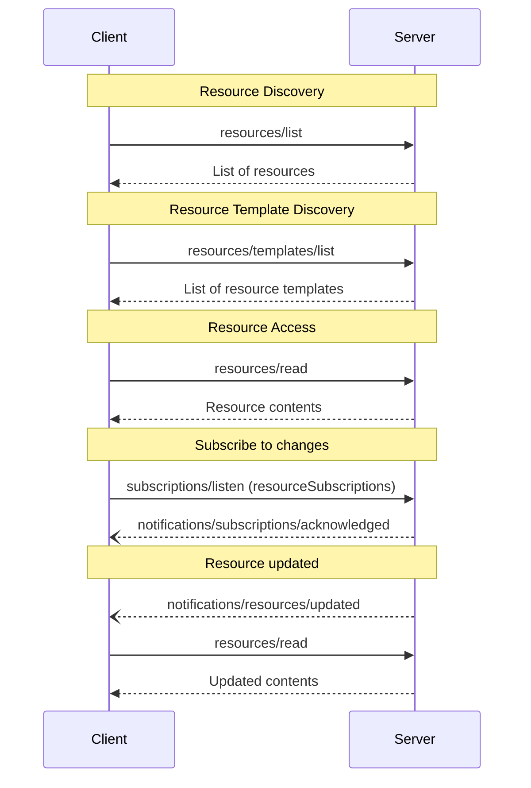

<div id="enable-section-numbers" />

模型上下文协议（MCP）为服务器提供了一种标准化的方式来向客户端暴露资源。资源允许服务器共享为语言模型提供上下文的数据，例如文件、数据库 schema 或应用特定的信息。每个资源由一个 [URI](https://datatracker.ietf.org/doc/html/rfc3986) 唯一标识。

<Note>
  为简洁起见，本页的请求示例省略了 `_meta` 请求元数据（`io.modelcontextprotocol/protocolVersion`、`io.modelcontextprotocol/clientInfo` 和 `io.modelcontextprotocol/clientCapabilities`）。每个请求**必须（MUST）**包含必需的 `_meta` 字段；参见 [`_meta`](/specification/2026-07-28/basic/index#meta)。
</Note>

## 用户交互模型

MCP 中的资源被设计为**由应用驱动**，由宿主应用根据它们的需求确定如何并入上下文。

例如，应用可以：

- 通过 UI 元素在树形或列表视图中暴露资源以供显式选择
- 允许用户搜索和过滤可用的资源
- 基于启发式规则或 AI 模型的选择实现自动上下文纳入


然而，实现可以自由地通过任何适合其需求的界面模式暴露资源——协议本身不强制规定任何特定的用户交互模型。

## 能力

支持资源的服务器**必须（MUST）**声明 `resources` 能力：

```json
{
  "capabilities": {
    "resources": {
      "listChanged": true,
      "subscribe": true
    }
  }
}
```

该能力支持两个可选特性：

- `listChanged`：服务器是否会在可用资源列表变化时发出通知。
- `subscribe`：服务器是否支持针对通过 subscriptions/listen 使用 resourceSubscriptions 过滤器请求的资源的、资源特定的更新通知。

服务器可以独立地、一起或都不公布这两个特性。

既不支持 `listChanged` 也不支持 `subscribe` 的服务器可以省略它：

```json
{
  "capabilities": {
    "resources": {}
  }
}
```

声明 `resources` 能力的服务器**必须（MUST）**以当前对发起请求的客户端可用的资源集合响应 `resources/list` 请求。此集合**可以（MAY）**为空并**可以（MAY）**随时间变化（参见[列表变更通知](#列表变更通知)），但**不得（MUST NOT）**按连接变化或作为连接上其他请求的副作用变化。此集合**可以（MAY）**按请求上出示的授权变化——例如，只返回调用方被授予的 scope 所允许的资源——因为凭据是每请求输入，而非连接状态。

## 协议消息

### 列出资源

要发现可用的资源，客户端发送一个 `resources/list` 请求。此操作支持[分页](/specification/2026-07-28/server/utilities/pagination)和[缓存](/specification/2026-07-28/server/utilities/caching)。

**请求：**

```json
{
  "jsonrpc": "2.0",
  "id": 1,
  "method": "resources/list",
  "params": {
    "cursor": "optional-cursor-value"
  }
}
```

**响应：**

```json
{
  "jsonrpc": "2.0",
  "id": 1,
  "result": {
    "resultType": "complete",
    "resources": [
      {
        "uri": "file:///project/src/main.rs",
        "name": "main.rs",
        "title": "Rust Software Application Main File",
        "description": "Primary application entry point",
        "mimeType": "text/x-rust",
        "icons": [
          {
            "src": "https://example.com/rust-file-icon.png",
            "mimeType": "image/png",
            "sizes": ["48x48"]
          }
        ]
      }
    ],
    "nextCursor": "next-page-cursor",
    "ttlMs": 300000,
    "cacheScope": "public"
  }
}
```

### 读取资源

要检索资源内容，客户端发送一个 `resources/read` 请求。此操作支持[缓存](/specification/2026-07-28/server/utilities/caching)。

**请求：**

```json
{
  "jsonrpc": "2.0",
  "id": 2,
  "method": "resources/read",
  "params": {
    "uri": "file:///project/src/main.rs"
  }
}
```

**响应：**

```json
{
  "jsonrpc": "2.0",
  "id": 2,
  "result": {
    "resultType": "complete",
    "contents": [
      {
        "uri": "file:///project/src/main.rs",
        "mimeType": "text/x-rust",
        "text": "fn main() {\n    println!(\"Hello world!\");\n}"
      }
    ],
    "ttlMs": 60000,
    "cacheScope": "private"
  }
}
```

服务器**可以（MAY）**在对单个 `resources/read` 请求的响应中返回多个资源内容。例如，服务器可以在读取一个目录资源时返回若干文件的内容。

服务器**也可以（MAY）**以一个 [`InputRequiredResult`](/specification/2026-07-28/basic/patterns/mrtr#inputrequiredresult) 响应 `resources/read`，以表明在资源可以被读取之前需要额外的输入。这遵循[多轮往返请求](/specification/2026-07-28/basic/patterns/mrtr#multi-round-trip-requests)机制。在重试请求时，客户端在请求参数中包含 `inputResponses`，以及（如果服务器提供）`requestState`。

或者，如果 `uri` 的 scheme 是 `https://`，客户端可以直接从 Web 获取资源。更多信息参见[常见 URI Scheme 一节](#https)。

### 资源模板

资源模板允许服务器使用 [URI 模板](https://datatracker.ietf.org/doc/html/rfc6570)暴露参数化的资源。参数可以通过[补全 API](/specification/2026-07-28/server/utilities/completion)自动补全。此操作支持[分页](/specification/2026-07-28/server/utilities/pagination)和[缓存](/specification/2026-07-28/server/utilities/caching)。

**请求：**

```json
{
  "jsonrpc": "2.0",
  "id": 3,
  "method": "resources/templates/list",
  "params": {
    "cursor": "optional-cursor-value"
  }
}
```

**响应：**

```json
{
  "jsonrpc": "2.0",
  "id": 3,
  "result": {
    "resultType": "complete",
    "resourceTemplates": [
      {
        "uriTemplate": "file:///{path}",
        "name": "Project Files",
        "title": "📁 Project Files",
        "description": "Access files in the project directory",
        "mimeType": "application/octet-stream",
        "icons": [
          {
            "src": "https://example.com/folder-icon.png",
            "mimeType": "image/png",
            "sizes": ["48x48"]
          }
        ]
      }
    ],
    "nextCursor": "next-page-cursor",
    "ttlMs": 300000,
    "cacheScope": "public"
  }
}
```

### 列表变更通知

当可用资源列表变化时，声明了 `listChanged` 能力的服务器**应当（SHOULD）**发送一个通知：

```json
{
  "jsonrpc": "2.0",
  "method": "notifications/resources/list_changed"
}
```

### 订阅

客户端通过发送一个 [`subscriptions/listen`][subscriptions-listen] 请求（其中资源 URI 列在 `notifications.resourceSubscriptions` 中）来订阅特定资源的变更通知。每当被监视的资源变化时，服务器就在由此产生的流上投递 `notifications/resources/updated`。

```json
{
  "jsonrpc": "2.0",
  "method": "notifications/resources/updated",
  "params": {
    "_meta": { "io.modelcontextprotocol/subscriptionId": 4 },
    "uri": "file:///project/src/main.rs"
  }
}
```

完整的协议机制（确认、`subscriptionId` 关联和取消）参见[订阅][subscriptions]。

[subscriptions-listen]: /specification/2026-07-28/schema#subscriptionslistenrequest
[subscriptions]: /specification/2026-07-28/basic/patterns/subscriptions

## 消息流



## 数据类型

### Resource

一个资源定义包括：

- `uri`：资源的唯一标识符
- `name`：资源的名称。
- `title`：用于显示目的的可选人类可读资源名称。
- `description`：可选的描述
- `icons`：用于在用户界面中显示的可选图标数组
- `mimeType`：可选的 MIME 类型
- `size`：以字节为单位的可选大小

### 资源内容

资源可以包含文本或二进制数据：

#### 文本内容

```json
{
  "uri": "file:///example.txt",
  "mimeType": "text/plain",
  "text": "Resource content"
}
```

#### 二进制内容

```json
{
  "uri": "file:///example.png",
  "mimeType": "image/png",
  "blob": "base64-encoded-data"
}
```

### 注解

资源、资源模板和内容块支持可选的注解，为客户端提供关于如何使用或显示资源的提示：

- **`audience`**：一个数组，指示此资源的预期受众。有效值为 `"user"` 和 `"assistant"`。例如，`["user", "assistant"]` 表示对两者都有用的内容。
- **`priority`**：一个从 0.0 到 1.0 的数字，指示此资源的重要性。值为 1 表示"最重要"（实际上是必需的），而 0 表示"最不重要"（完全可选）。
- **`lastModified`**：一个 ISO 8601 格式的时间戳，指示资源最后修改的时间（例如 `"2025-01-12T15:00:58Z"`）。

带注解的资源示例：

```json
{
  "uri": "file:///project/README.md",
  "name": "README.md",
  "title": "Project Documentation",
  "mimeType": "text/markdown",
  "annotations": {
    "audience": ["user"],
    "priority": 0.8,
    "lastModified": "2025-01-12T15:00:58Z"
  }
}
```

客户端可以使用这些注解来：

- 基于资源的预期受众过滤资源
- 优先决定将哪些资源纳入上下文
- 显示修改时间或按新近程度排序

## 常见 URI Scheme

协议定义了若干标准 URI scheme。此列表并非穷尽——实现始终可以自由使用额外的、自定义的 URI scheme。

### https://

用于表示 Web 上可用的资源。

服务器**应当（SHOULD）**仅在客户端能够自行直接从 Web 获取和加载资源时才使用此 scheme——即，它不需要通过 MCP 服务器读取资源。

对于其他用例，服务器**应当（SHOULD）**优先使用另一个 URI scheme，或定义一个自定义的，即使服务器本身将通过互联网下载资源内容。

### file://

用于标识行为像文件系统的资源。然而，这些资源不需要映射到一个实际的物理文件系统。

MCP 服务器**可以（MAY）**用一个 [XDG MIME 类型](https://specifications.freedesktop.org/shared-mime-info-spec/0.14/ar01s02.html#id-1.3.14)（如 `inode/directory`）标识 file:// 资源，以表示没有标准 MIME 类型的非常规文件（例如目录）。

### git://

Git 版本控制集成。

### 自定义 URI Scheme

自定义 URI scheme **必须（MUST）**符合 [RFC3986](https://datatracker.ietf.org/doc/html/rfc3986)，并考虑上述指导。

## 错误处理

如果所请求的资源不存在，服务器**必须（MUST）**返回一个代码为 `-32602`（Invalid Params）的 JSON-RPC 错误。服务器**应当（SHOULD）**为内部错误返回 `-32603`。

为向后兼容，客户端**应当（SHOULD）**也接受 `-32002` 作为资源未找到错误，因为早期协议版本使用此代码。

服务器**不得（MUST NOT）**为一个不存在的资源返回空的 `contents` 数组。空数组是有歧义的——它可能意味着资源存在但没有内容，或者它根本不存在。

错误示例：

```json
{
  "jsonrpc": "2.0",
  "id": 5,
  "error": {
    "code": -32602,
    "message": "Resource not found",
    "data": {
      "uri": "file:///nonexistent.txt"
    }
  }
}
```

## 安全考量

1. 服务器**必须（MUST）**校验所有资源 URI
2. 对于敏感资源**应当（SHOULD）**实现访问控制
3. 二进制数据**必须（MUST）**被正确编码
4. 资源权限**应当（SHOULD）**在操作之前被检查
5. 在提供 `file://` 资源时，服务器**必须（MUST）**净化文件路径以防止目录遍历攻击
