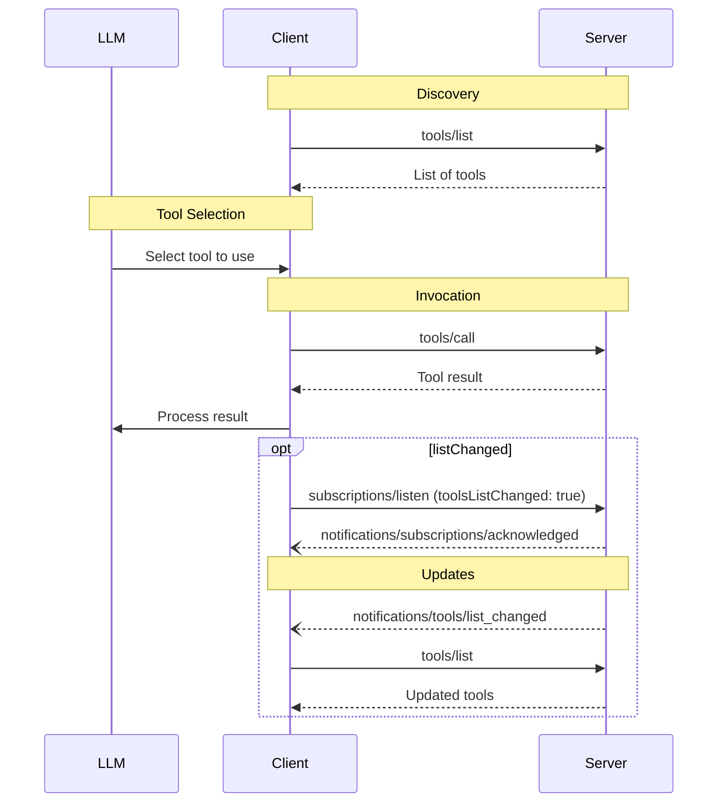

<div id="enable-section-numbers" />

模型上下文协议（MCP）允许服务器暴露可被语言模型调用的工具。工具使模型能够与外部系统交互，例如查询数据库、调用 API 或执行计算。每个工具由一个名称唯一标识，并包含描述其 schema 的元数据。

<Note>
  为简洁起见，本页的请求示例省略了 `_meta` 请求元数据（`io.modelcontextprotocol/protocolVersion`、`io.modelcontextprotocol/clientInfo` 和 `io.modelcontextprotocol/clientCapabilities`）。每个请求**必须（MUST）**包含必需的 `_meta` 字段；参见 [`_meta`](/specification/2026-07-28/basic/index#meta)。
</Note>

## 用户交互模型

MCP 中的工具被设计为**由模型控制**，意味着语言模型可以基于其上下文理解和用户的提示自动发现和调用工具。

然而，实现可以自由地通过任何适合其需求的界面模式暴露工具——协议本身不强制规定任何特定的用户交互模型。

<Warning>

为了信任与安全以及安全性，**应当（SHOULD）**始终有一个人在回路，具有拒绝工具调用的能力。

应用**应当（SHOULD）**：

- 提供清楚表明哪些工具正被暴露给 AI 模型的 UI
- 在工具被调用时插入清晰的视觉指示器
- 为操作向用户呈现确认提示，以确保有一个人在回路

</Warning>

## 能力

支持工具的服务器**必须（MUST）**声明 `tools` 能力：

```json
{
  "capabilities": {
    "tools": {
      "listChanged": true
    }
  }
}
```

`listChanged` 指示服务器是否会在可用工具列表变化时发出通知。

声明 `tools` 能力的服务器**必须（MUST）**以当前对发起请求的客户端可用的工具集合响应 `tools/list` 请求。此集合**可以（MAY）**为空并**可以（MAY）**随时间变化（参见[列表变更通知](#列表变更通知)），但**不得（MUST NOT）**按连接变化或作为连接上其他请求的副作用变化。此集合**可以（MAY）**按请求上出示的授权变化——例如，只返回调用方被授予的 scope 所允许的工具——因为凭据是每请求输入，而非连接状态。

服务器**应当（SHOULD）**以确定性顺序返回工具（即，当底层工具集未变化时，跨请求保持相同的排序）。确定性排序使客户端能够可靠地缓存工具列表，并在工具被包含在模型上下文中时提高 LLM 提示缓存命中率。

## 协议消息

### 列出工具

要发现可用的工具，客户端发送一个 `tools/list` 请求。此操作支持[分页](/specification/2026-07-28/server/utilities/pagination)和[缓存](/specification/2026-07-28/server/utilities/caching)。

**请求：**

```json
{
  "jsonrpc": "2.0",
  "id": 1,
  "method": "tools/list",
  "params": {
    "cursor": "optional-cursor-value"
  }
}
```

**响应：**

```json
{
  "jsonrpc": "2.0",
  "id": 1,
  "result": {
    "resultType": "complete",
    "tools": [
      {
        "name": "get_weather",
        "title": "Weather Information Provider",
        "description": "Get current weather information for a location",
        "inputSchema": {
          "type": "object",
          "properties": {
            "location": {
              "type": "string",
              "description": "City name or zip code"
            }
          },
          "required": ["location"]
        },
        "icons": [
          {
            "src": "https://example.com/weather-icon.png",
            "mimeType": "image/png",
            "sizes": ["48x48"]
          }
        ]
      }
    ],
    "nextCursor": "next-page-cursor",
    "ttlMs": 300000,
    "cacheScope": "public"
  }
}
```

### 调用工具

要调用一个工具，客户端发送一个 `tools/call` 请求：

**请求：**

```json
{
  "jsonrpc": "2.0",
  "id": 2,
  "method": "tools/call",
  "params": {
    "name": "get_weather",
    "arguments": {
      "location": "New York"
    }
  }
}
```

**响应：**

```json
{
  "jsonrpc": "2.0",
  "id": 2,
  "result": {
    "resultType": "complete",
    "content": [
      {
        "type": "text",
        "text": "Current weather in New York:\nTemperature: 72°F\nConditions: Partly cloudy"
      }
    ],
    "isError": false
  }
}
```

### 需要输入的工具结果

服务器**可以（MAY）**以一个 [`InputRequiredResult`](/specification/2026-07-28/basic/patterns/mrtr#inputrequiredresult) 响应 `tools/call`，以表明在工具调用可以完成之前需要额外的输入。这遵循[多轮往返请求](/specification/2026-07-28/basic/patterns/mrtr#multi-round-trip-requests)机制。

在用输入响应重试请求时，客户端在请求参数中包含 `inputResponses`，以及（如果服务器提供）`requestState`：

**需要输入的响应：**

```json
{
  "jsonrpc": "2.0",
  "id": 2,
  "result": {
    "resultType": "input_required",
    "inputRequests": {
      "github_login": {
        "method": "elicitation/create",
        "params": {
          "mode": "form",
          "message": "Please provide your GitHub username",
          "requestedSchema": {
            "type": "object",
            "properties": {
              "name": { "type": "string" }
            },
            "required": ["name"]
          }
        }
      }
    },
    "requestState": "eyJsb2NhdGlvbiI6Ik5ldyBZb3JrIn0..."
  }
}
```

**带输入响应的重试：**

```json
{
  "jsonrpc": "2.0",
  "id": 3,
  "method": "tools/call",
  "params": {
    "name": "get_weather",
    "arguments": {
      "location": "New York"
    },
    "inputResponses": {
      "github_login": {
        "action": "accept",
        "content": {
          "name": "octocat"
        }
      }
    },
    "requestState": "eyJsb2NhdGlvbiI6Ik5ldyBZb3JrIn0..."
  }
}
```

请注意，JSON-RPC `id` 在初始请求和重试之间**必须（MUST）**不同。

### 列表变更通知

当可用工具列表变化时，声明了 `listChanged` 能力的服务器**应当（SHOULD）**向已用 `toolsListChanged: true` 打开一个 [`subscriptions/listen`](/specification/2026-07-28/basic/patterns/subscriptions) 流的客户端发送一个通知：

```json
{
  "jsonrpc": "2.0",
  "method": "notifications/tools/list_changed"
}
```

## 消息流



## 数据类型

### Tool

一个工具定义包括：

- `name`：工具的唯一标识符
- `title`：用于显示目的的可选人类可读工具名称。
- `description`：功能的人类可读描述
- `icons`：用于在用户界面中显示的可选图标数组
- `inputSchema`：定义预期参数的 JSON Schema
  - 遵循 [JSON Schema 用法指南](/specification/2026-07-28/basic#json-schema-usage)
  - 若不存在 `$schema` 字段则默认为 2020-12
  - **必须（MUST）**是一个有效的 JSON Schema 对象（而非 `null`）
  - 对于没有参数的工具，使用以下有效方法之一：
    - `{ "type": "object", "additionalProperties": false }` —— **推荐**：显式地只接受空对象
    - `{ "type": "object" }` —— 接受任何对象（包括带属性的）
  - 属性**可以（MAY）**包含一个 [`x-mcp-header`](#x-mcp-header) 注解，以将参数值暴露为 HTTP header
- `outputSchema`：定义预期输出结构的可选 JSON Schema
  - 遵循 [JSON Schema 用法指南](/specification/2026-07-28/basic#json-schema-usage)
  - 若不存在 `$schema` 字段则默认为 2020-12
- `annotations`：描述工具行为的可选属性

<Warning>
  为了信任与安全以及安全性，客户端**必须（MUST）**将工具注解视为不受信任的，除非它们来自受信任的服务器。
</Warning>

#### 工具名称

- 工具名称**应当（SHOULD）**在 1 到 128 个字符长度之间（含）。
- 工具名称**应当（SHOULD）**被视为大小写敏感的。
- 以下**应当（SHOULD）**是唯一允许的字符：大写和小写 ASCII 字母（A-Z、a-z）、数字（0-9）、下划线（\_）、连字符（-）和点（.）
- 工具名称**不应（SHOULD NOT）**包含空格、逗号或其他特殊字符。
- 工具名称**应当（SHOULD）**在一个服务器内唯一。
- 有效工具名称的示例：
  - `getUser`
  - `DATA_EXPORT_v2`
  - `admin.tools.list`

<Note>

工具名称的唯一性被限定于单个服务器。聚合来自多个服务器的工具的客户端或代理**可以（MAY）**遇到命名冲突（例如，两个服务器各暴露一个 `search` 工具），并**应当（SHOULD）**实现一个消歧策略，例如为工具名加上服务器标识符前缀。

服务器 `name`（来自 `serverInfo`）不保证在服务器之间唯一，并**不应（SHOULD NOT）**被依赖用于消歧。

</Note>

#### x-mcp-header

`x-mcp-header` 扩展属性允许服务器在使用 [Streamable HTTP 传输](/specification/2026-07-28/basic/transports/streamable-http#custom-headers-from-tool-parameters)时，指定特定的工具参数被镜像到 HTTP header 中。这使网络中间方（负载均衡器、代理、WAF）能够基于参数值路由和处理请求，而无需解析请求体。

`x-mcp-header` 属性直接放置在要被镜像的属性的 JSON Schema 内。其值指定产生的 `Mcp-Param-{name}` HTTP header 的名称部分。

**对 `x-mcp-header` 值的约束：**

- **不得（MUST NOT）**为空
- **必须（MUST）**匹配 HTTP 字段名 token 语法（`1*tchar`，[RFC 9110 第 5.1 节](https://datatracker.ietf.org/doc/html/rfc9110#section-5.1)）
- **不得（MUST NOT）**包含控制字符，包括回车（CR，`\r`）或换行（LF，`\n`）
- 在 `inputSchema` 中的所有 `x-mcp-header` 值之间**必须（MUST）**大小写不敏感地唯一
- **必须（MUST）**只应用于具有原始类型（integer、string、boolean）的参数。不允许类型为 `number` 的参数。整数值**必须（MUST）**在使用 IEEE754 双精度浮点数表示的整数的安全范围内（−2<sup>53</sup>+1 到 2<sup>53</sup>−1）
- **必须（MUST）**只应用于从 schema 根_静态可达_的属性，如[来自工具参数的自定义 header](/specification/2026-07-28/basic/transports/streamable-http#custom-headers-from-tool-parameters)中所定义，那里也定义了如何从调用参数中提取 header 值

使用 Streamable HTTP 传输的客户端**必须（MUST）**拒绝任何 `x-mcp-header` 值违反这些约束的工具定义。拒绝意味着客户端**必须（MUST）**将无效的工具从 `tools/list` 的结果中排除。客户端在拒绝一个工具定义时**应当（SHOULD）**记录一个警告，包括工具名和拒绝原因。这确保单个格式错误的工具定义不会阻止其他有效工具被使用。使用其他传输（例如 stdio）的客户端**可以（MAY）**完全忽略 `x-mcp-header` 注解。

**带 `x-mcp-header` 的工具定义示例：**

```json
{
  "name": "execute_sql",
  "description": "Execute SQL on Google Cloud Spanner",
  "inputSchema": {
    "type": "object",
    "properties": {
      "region": {
        "type": "string",
        "description": "The region to execute the query in",
        "x-mcp-header": "Region"
      },
      "query": {
        "type": "string",
        "description": "The SQL query to execute"
      }
    },
    "required": ["region", "query"]
  }
}
```

在本示例中，当用 `"region": "us-west1"` 调用该工具时，客户端将 header `Mcp-Param-Region: us-west1` 添加到 HTTP 请求中。

<Warning>

服务器开发者**不应（SHOULD NOT）**用 `x-mcp-header` 标记敏感参数（密码、API 密钥、令牌、PII），因为 header 值对网络中间方可见。

</Warning>

### 工具结果

工具结果可以包含[**结构化**](#结构化内容)或**非结构化**内容。

**非结构化**内容在结果的 `content` 字段中返回，可以包含多个不同类型的内容项：

<Note>
  所有内容类型（text、image、audio、resource links 和嵌入的资源）都支持可选的[注解](/specification/2026-07-28/server/resources#annotations)，用于提供关于受众、优先级和修改时间的元数据。这是资源和提示所使用的相同注解格式。
</Note>

#### 文本内容

```json
{
  "type": "text",
  "text": "Tool result text"
}
```

#### 图像内容

```json
{
  "type": "image",
  "data": "base64-encoded-data",
  "mimeType": "image/png",
  "annotations": {
    "audience": ["user"],
    "priority": 0.9
  }
}
```

#### 音频内容

```json
{
  "type": "audio",
  "data": "base64-encoded-audio-data",
  "mimeType": "audio/wav"
}
```

#### 资源链接

一个工具**可以（MAY）**返回到[资源](/specification/2026-07-28/server/resources)的链接，以提供额外的上下文或数据。在这种情况下，工具将返回一个客户端可以订阅或获取的 URI：

```json
{
  "type": "resource_link",
  "uri": "file:///project/src/main.rs",
  "name": "main.rs",
  "description": "Primary application entry point",
  "mimeType": "text/x-rust"
}
```

资源链接支持与常规资源相同的[资源注解](/specification/2026-07-28/server/resources#annotations)，以帮助客户端理解如何使用它们。

<Info>
  工具返回的资源链接不保证出现在 `resources/list` 请求的结果中。
</Info>

#### 嵌入的资源

[资源](/specification/2026-07-28/server/resources)**可以（MAY）**使用合适的 [URI scheme](./resources#common-uri-schemes)被嵌入以提供额外的上下文或数据。使用嵌入资源的服务器**应当（SHOULD）**实现 `resources` 能力：

```json
{
  "type": "resource",
  "resource": {
    "uri": "file:///project/src/main.rs",
    "mimeType": "text/x-rust",
    "text": "fn main() {\n    println!(\"Hello world!\");\n}",
    "annotations": {
      "audience": ["user", "assistant"],
      "priority": 0.7,
      "lastModified": "2025-05-03T14:30:00Z"
    }
  }
}
```

嵌入的资源支持与常规资源相同的[资源注解](/specification/2026-07-28/server/resources#annotations)，以帮助客户端理解如何使用它们。

#### 结构化内容

**结构化**内容作为一个 JSON 值在结果的 `structuredContent` 字段中返回。这可以是符合工具 `outputSchema`（如果定义了一个）的任何 JSON 值（对象、数组、字符串、数字、布尔或 null）。

为向后兼容，返回结构化内容的工具应当（SHOULD）也在一个 TextContent 块中返回序列化的 JSON。

<Note>

`structuredContent` 是服务器产生的结果数据，与 LLM 的"结构化输出"（受 schema 约束的模型生成）无关。

</Note>

#### 输出 Schema

工具还可以为结构化结果的校验提供一个输出 schema。如果提供了输出 schema：

- 服务器**必须（MUST）**提供符合此 schema 的结构化结果。
- 客户端**应当（SHOULD）**对照此 schema 校验结构化结果。

带输出 schema 的工具示例：

```json
{
  "name": "get_weather_data",
  "title": "Weather Data Retriever",
  "description": "Get current weather data for a location",
  "inputSchema": {
    "type": "object",
    "properties": {
      "location": {
        "type": "string",
        "description": "City name or zip code"
      }
    },
    "required": ["location"]
  },
  "outputSchema": {
    "type": "object",
    "properties": {
      "temperature": {
        "type": "number",
        "description": "Temperature in celsius"
      },
      "conditions": {
        "type": "string",
        "description": "Weather conditions description"
      },
      "humidity": {
        "type": "number",
        "description": "Humidity percentage"
      }
    },
    "required": ["temperature", "conditions", "humidity"]
  }
}
```

此工具的有效响应示例：

```json
{
  "jsonrpc": "2.0",
  "id": 5,
  "result": {
    "resultType": "complete",
    "content": [
      {
        "type": "text",
        "text": "{\"temperature\": 22.5, \"conditions\": \"Partly cloudy\", \"humidity\": 65}"
      }
    ],
    "structuredContent": {
      "temperature": 22.5,
      "conditions": "Partly cloudy",
      "humidity": 65
    }
  }
}
```

带数组输出 schema 的工具示例：

```json
{
  "name": "list_users",
  "title": "User List",
  "description": "Returns a list of all users",
  "inputSchema": {
    "type": "object",
    "properties": {}
  },
  "outputSchema": {
    "type": "array",
    "items": {
      "type": "object",
      "properties": {
        "id": { "type": "string" },
        "name": { "type": "string" },
        "email": { "type": "string" }
      },
      "required": ["id", "name", "email"]
    }
  }
}
```

带数组输出的工具的有效响应示例：

```json
{
  "jsonrpc": "2.0",
  "id": 6,
  "result": {
    "resultType": "complete",
    "content": [
      {
        "type": "text",
        "text": "Found 2 users: Alice (alice@example.com) and Bob (bob@example.com)."
      }
    ],
    "structuredContent": [
      { "id": "1", "name": "Alice", "email": "alice@example.com" },
      { "id": "2", "name": "Bob", "email": "bob@example.com" }
    ]
  }
}
```

提供一个输出 schema 通过以下方式帮助客户端和 LLM 理解并正确处理结构化的工具输出：

- 使响应的严格 schema 校验成为可能
- 提供类型信息以更好地与编程语言集成
- 引导客户端和 LLM 正确地解析和利用返回的数据
- 支持更好的文档和开发者体验

### Schema 示例

#### 带默认 2020-12 schema 的工具：

```json
{
  "name": "calculate_sum",
  "description": "Add two numbers",
  "inputSchema": {
    "type": "object",
    "properties": {
      "a": { "type": "number" },
      "b": { "type": "number" }
    },
    "required": ["a", "b"]
  }
}
```

#### 带显式 draft-07 schema 的工具：

```json
{
  "name": "calculate_sum",
  "description": "Add two numbers",
  "inputSchema": {
    "$schema": "http://json-schema.org/draft-07/schema#",
    "type": "object",
    "properties": {
      "a": { "type": "number" },
      "b": { "type": "number" }
    },
    "required": ["a", "b"]
  }
}
```

#### 没有参数的工具：

```json
{
  "name": "get_current_time",
  "description": "Returns the current server time",
  "inputSchema": {
    "type": "object",
    "additionalProperties": false
  }
}
```

## 有状态工具

<Note>

本节是关于工具设计的非规范性指导。协议没有状态句柄的概念；从线路的角度看，句柄是一个工具结果中的普通字符串，也是后续工具调用的一个普通参数。

</Note>

MCP 没有协议级别的会话，因此服务器无法依赖隐式的每连接状态来将一次工具调用与下一次关联。需要跨调用维护状态的服务器——一个购物车、一个打开的浏览器上下文、一个数据库事务——应通过从一个创建工具返回一个显式句柄，并在后续调用中接受该句柄作为参数来做到这一点。

例如，一个管理购物车的服务器可能暴露：

```jsonc
// → tools/call
{ "name": "create_basket", "arguments": {} }

// ← result
{
  "content": [{ "type": "text", "text": "Created basket bsk_a1b2c3" }],
  "structuredContent": { "basket_id": "bsk_a1b2c3" }
}

// → tools/call
{
  "name": "add_item",
  "arguments": { "basket_id": "bsk_a1b2c3", "sku": "..." }
}
```

模型负责将 `basket_id` 向前携带；服务器在该键下存储购物车内容，并在每次调用时查找它们。

在设计句柄时，服务器应考虑：

- **授权。** 对于已认证的服务器，句柄是一个名称，而非一种能力。服务器应在每次调用时对照句柄校验调用方的授权。对于未认证的服务器（其中句柄必然是一个 bearer token），它应以足够的熵生成（例如一个 UUIDv4）并给予一个有界的生命周期。
- **不透明性。** 编码内部结构的句柄招致解析或猜测；不透明的标识符则不会。
- **生命周期。** 因为句柄比任何单个连接活得更久，服务器的保留策略应在创建工具的描述中说明（例如"购物车在 24 小时不活动后过期"），以便模型在决定创建状态时能看到它。
- **过期错误。** 针对一个过期或未知句柄的调用应返回一个说明此情况的工具执行错误，以便模型可以通过创建一个新的来恢复。

## 错误处理

工具使用两种错误报告机制：

1. **协议错误**指示请求结构本身的问题，模型不太可能能够修复：
   - 未知工具
   - 格式错误的请求（未能满足 [CallToolRequest schema](/specification/2026-07-28/schema#calltoolrequest) 的请求）
   - 服务器错误

   它们作为标准的 JSON-RPC 错误返回：

   ```json
   {
     "jsonrpc": "2.0",
     "id": 3,
     "error": {
       "code": -32602,
       "message": "Unknown tool: invalid_tool_name"
     }
   }
   ```

2. **工具执行错误**包含可操作的反馈，语言模型可以用它来自我纠正并用调整后的参数重试：
   - API 失败
   - 输入校验错误（例如日期格式错误、值超出范围）
   - 业务逻辑错误

   它们在工具结果中以 `isError: true` 报告：

   ```json
   {
     "jsonrpc": "2.0",
     "id": 4,
     "result": {
       "resultType": "complete",
       "content": [
         {
           "type": "text",
           "text": "Invalid departure date: must be in the future. Current date is 08/08/2025."
         }
       ],
       "isError": true
     }
   }
   ```

客户端**可以（MAY）**将协议错误提供给语言模型，尽管这些不太可能导致成功的恢复。客户端**应当（SHOULD）**将工具执行错误提供给语言模型，以使自我纠正成为可能。

## 安全考量

1. 服务器**必须（MUST）**：
   - 校验所有工具输入
   - 实现适当的访问控制
   - 对工具调用进行速率限制
   - 净化工具输出

2. 客户端**应当（SHOULD）**：
   - 对敏感操作提示用户确认
   - 在调用服务器之前向用户显示工具输入，以避免恶意或意外的数据外泄
   - 在传递给 LLM 之前校验工具结果
   - 在对照 `inputSchema` 和 `outputSchema` 校验工具输入和输出时遵循 [`$ref` 解析要求](/specification/2026-07-28/basic/index#ref-resolution)
   - 为工具调用实现超时
   - 为审计目的记录工具使用
