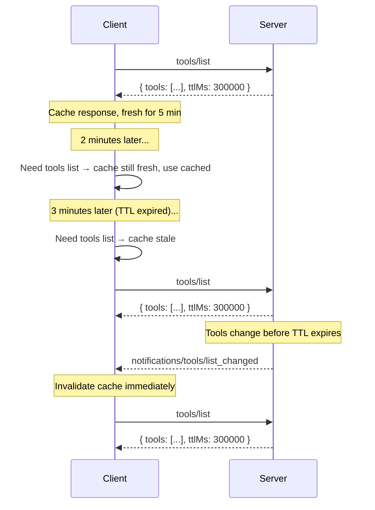

<div id="enable-section-numbers" />

模型上下文协议（MCP）支持对某些结果进行缓存。这允许客户端缓存响应并减少不必要的重新获取。缓存与[变更通知](#与通知的交互)是互补的——两种机制可以共存。

## 可缓存的结果

服务器必须（MUST）在由以下操作返回的、带 `resultType: "complete"` 的结果上包含缓存提示：

- `server/discover`
- `tools/list`
- `prompts/list`
- `resources/list`
- `resources/templates/list`
- `resources/read`

带 `resultType: "input_required"` 的中间结果（参见[多轮往返请求](/specification/2026-07-28/basic/patterns/mrtr)）不可缓存，且不携带缓存提示。

## 缓存键

一个缓存的响应由请求方法连同影响结果的请求参数（例如 `resources/read` 的 `uri`，或分页列表请求的 `cursor`）标识。客户端**不得（MUST NOT）**为一个其方法或参数与产生它的请求不同的请求提供缓存的响应。

通过[多轮往返请求](/specification/2026-07-28/basic/patterns/mrtr)机制重试请求所产生的结果——即携带 `inputResponses` 或 `requestState` 的请求——**不得（MUST NOT）**被缓存，因为它们依赖于不属于缓存键一部分的输入。

## 可缓存模型

MCP 中的可缓存结果使用两个字段向客户端提供缓存提示：

- **存活时间（TTL）字段** `ttlMs`，是一个以毫秒为单位的整数值，指定客户端可以（MAY）将结果视为新鲜多长时间。
- **缓存范围字段** `cacheScope`，指示缓存响应的预期范围，为 `"public"` 或 `"private"`。

### 存活时间（TTL）字段

`ttlMs` 字段是来自服务器的一个提示，指示客户端可以（MAY）将结果视为新鲜多少毫秒。语义类似于 HTTP `Cache-Control: max-age`。

- 如果 `ttlMs` 为 `0`，响应**应当（SHOULD）**被视为立即陈旧。客户端可以（MAY）在每次需要结果时重新获取。
- 如果 `ttlMs` 为正，客户端**应当（SHOULD）**在收到响应后将结果视为在那么多毫秒内新鲜。
- 如果 `ttlMs` 缺失，客户端**应当（SHOULD）**假定默认值为 `0`（立即陈旧）并依赖它们自己的缓存启发式规则或通知。这应仅在较旧的服务器版本中发生。
- 如果 `ttlMs` 为负，客户端**应当（SHOULD）**忽略它并将其视为 `0`。

服务器**必须（MUST）**提供一个 `>= 0` 的 `ttlMs` 值。

<Note>
  TTL 是一个**新鲜度提示**，而非保证。服务器可以（MAY）在 TTL 过期之前更改底层数据。TTL 告诉客户端它可以合理地避免重新获取多长时间，而不是数据被保证保持不变多长时间。
</Note>

#### 新鲜度计算

客户端记录收到响应的本地时间（`t_received`）。在以下条件下，响应被视为**新鲜**：

```
now < t_received + ttlMs
```

一旦 TTL 过期，响应就是**陈旧的**，客户端**应当（SHOULD）**在下次访问时重新获取。

客户端**不应（SHOULD NOT）**将 TTL 视为一个触发自动后台重新获取的轮询间隔。TTL 是一个新鲜度提示：客户端在需要数据时检查新鲜度，并仅在陈旧时重新获取。确实选择轮询的实现**必须（MUST）**应用抖动（jitter）和退避（backoff）。

如果客户端有理由相信数据已更改（例如，在一次工具调用上收到一个指示方法未找到或参数无效的意外错误），它**可以（MAY）**在 TTL 过期之前重新获取。

如果在重新获取期间发生错误（例如网络问题、服务器停机），客户端**可以（MAY）**提供陈旧的响应。

### 缓存范围字段

`cacheScope` 字段控制谁可以缓存一个响应，类似于 HTTP `Cache-Control: public` 与 `Cache-Control: private`。

| 值       | 含义                                                                                                                                                                                                                                                                           |
| ----------- | --------------------------------------------------------------------------------------------------------------------------------------------------------------------------------------------------------------------------------------------------------------------------------- |
| `"public"`  | 响应不包含用户特定的数据。任何客户端、共享网关或缓存代理**可以（MAY）**存储并将缓存的响应提供给任何用户。                                                                                                                           |
| `"private"` | 响应包含不打算在调用方之间共享的私有数据。缓存的响应**可以（MAY）**为同一授权上下文重用。缓存**不得（MUST NOT）**跨授权上下文共享（例如，一个不同的访问令牌需要一个不同的缓存）。 |

#### 选择缓存范围

- 当工具、提示和资源模板的列表对所有用户都相同时，**`"public"`** 适用于它们。
- **`"private"`** 适用于依赖于已认证用户的 `resources/read` 结果，或每个用户不同的过滤列表结果。

## 与通知的交互

TTL 和服务器推送通知是互补的：

- 服务器**可以（MAY）**提供 `ttlMs` 而不在其能力中公布 `listChanged: true`。在这种情况下，客户端完全依赖基于 TTL 的新鲜度。
- 服务器**可以（MAY）**公布 `listChanged: true` **并**提供 `ttlMs`。在这种情况下，客户端可以使用 TTL 来避免在通知之间不必要的重新获取，而通知充当一个立即失效的信号。

当在缓存的响应仍然新鲜时收到一个相关的通知时，该通知使缓存的响应**失效**，它应被视为立即陈旧。



## 与分页的交互

当一个列表结果被[分页](/specification/2026-07-28/server/utilities/pagination)时，每一页是一个独立可缓存的响应——与 HTTP `Cache-Control` 处理分页资源的方式一致。

- 每个页面响应携带它自己的 `ttlMs` 值。每一页的新鲜度计时器从收到该页的时间开始。
- 服务器**可以（MAY）**在不同的页面上返回不同的 `ttlMs` 值（例如，为一个稳定列表的靠前页面设置更长的 TTL，为最后一页设置更短的 TTL）。
- 当一个缓存的页面过期时，客户端**应当（SHOULD）**使用其游标重新获取该页面。
- 没有跨页面的一致性保证。如果底层数据在页面获取之间更改，客户端可能观察到重复或间隙。
- 需要完整列表的一致快照的客户端**应当（SHOULD）**从头（不带游标）重新获取。
- 如果一个游标变得无效（例如，服务器为一个先前有效的游标返回一个错误），客户端**应当（SHOULD）**丢弃所有缓存的页面并从头重新获取。

服务器**必须（MUST）**为给定列表请求的所有响应页面应用相同的 `cacheScope`。例如，如果一个 `tools/list` 响应的第一页有 `cacheScope: "private"`，则该请求的所有后续页面也**必须（MUST）**是 `"private"`。

## 安全考量

`cacheScope` 为 `"public"` 表示响应不包含用户特定的数据，可以被安全地共享。服务器必须（MUST）意识到，即使结果来自一个已认证的端点，带 `"public"` `cacheScope` 的响应也可能在调用方之间共享。例如，一个带 `"public"` `cacheScope` 的已认证 `tools/list` 调用的结果可能被客户端缓存，并可能在初始请求的授权上下文之外共享（即，不同的访问令牌可以利用同一个缓存）。

服务器实现者：

- 应确保 `cacheScope` 正确地反映原语的预期可见性。
- 必须（MUST）应用适当的按原语访问控制，并不得（MUST NOT）仅依赖 `cacheScope` 来防止对原语的未授权访问。
